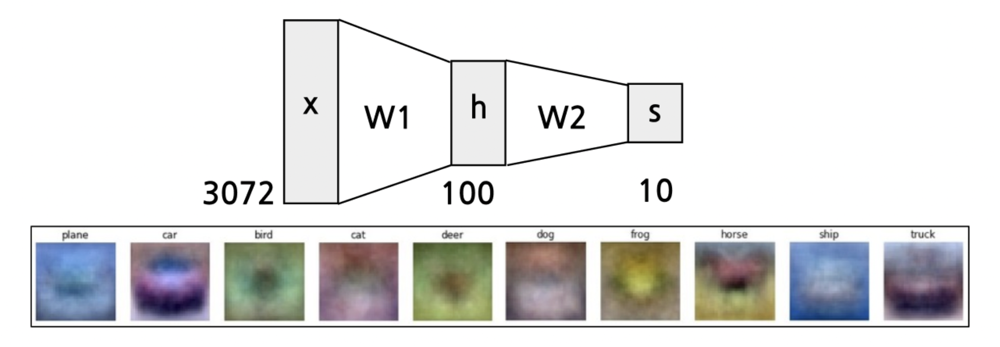
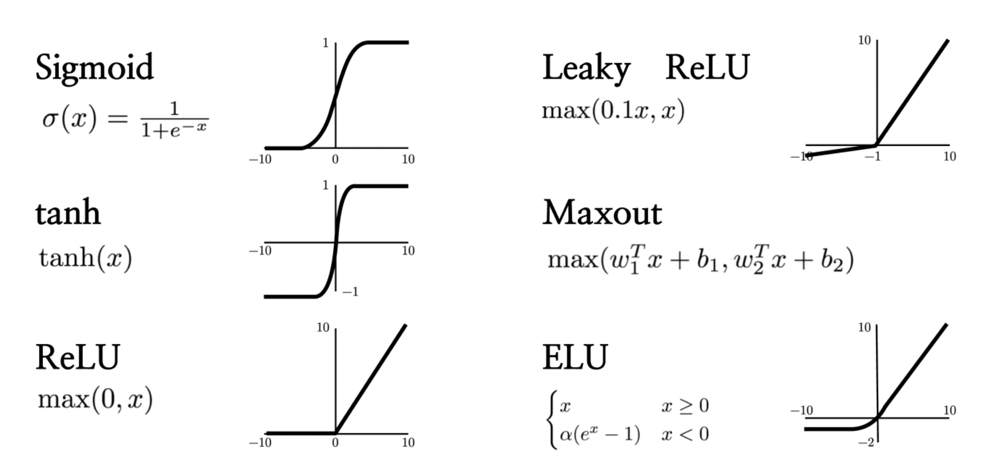
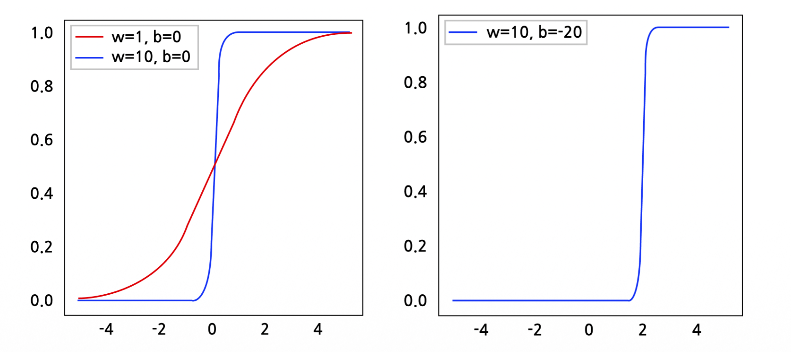
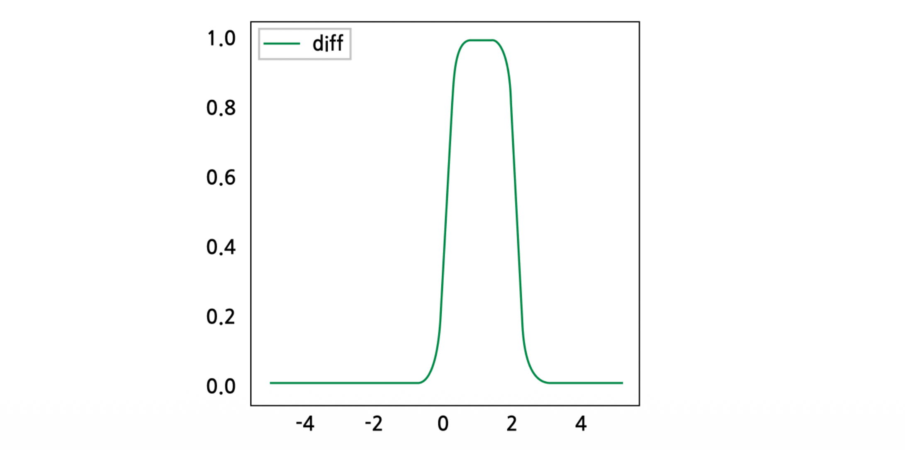
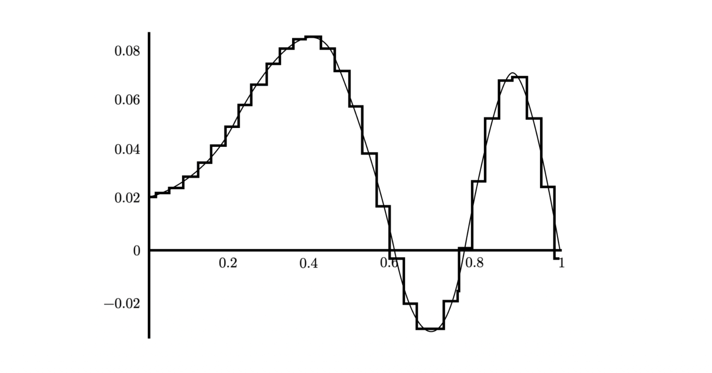

# 1. Introduction: 선형 모델에서 신경망으로

기계학습 모델을 설계할 때, 우리는 입력 데이터 $x$를 원하는 출력값(예: 클래스 점수)으로 변환하는 함수 $f(x)$를 찾고자 합니다. 가장 단순한 형태는 가중치 행렬 $W$를 곱하는 **선형 점수 함수(Linear score function)**입니다.

$$f = Wx$$

예를 들어, 32x32 크기의 RGB 이미지를 다룬다고 가정해 봅시다. 이 이미지를 1차원 벡터로 펼치면 $32 \times 32 \times 3 = 3072$차원의 입력 벡터 $x$가 됩니다. 만약 10개의 클래스(비행기, 자동차, 새, 고양이 등)를 분류해야 한다면, 가중치 행렬 $W$를 통해 3072차원의 입력을 10차원의 출력 점수로 선형 변환하게 됩니다. 

하지만 현실의 복잡한 데이터는 단순한 선형 변환만으로 분류하기 어렵습니다. 이를 극복하기 위해 등장한 것이 바로 **다층 퍼셉트론(Multi-layer Perceptron, MLP)**, 즉 **신경망(Neural Networks)**입니다.

# 2. 2층 신경망 (2-layer Neural Network)과 계층적 특징 추출

단일 선형 변환의 한계를 극복하기 위해, 우리는 중간에 은닉층(Hidden layer)을 도입하고 비선형성을 추가할 수 있습니다. 

$$f = W_2 \max(0, W_1 x)$$

이 수식은 전통적인 **2층 신경망**의 구조를 나타냅니다. 
1. 먼저 입력 $x$ (크기: 3072)에 가중치 행렬 $W_1$을 곱하여 중간 단계의 표현인 은닉 벡터 $h$ (예: 크기 100)를 생성합니다.
2. 여기에 $\max(0, \cdot)$이라는 비선형 함수(ReLU)를 적용합니다.
3. 마지막으로 또 다른 가중치 행렬 $W_2$를 곱하여 최종 출력 $s$ (크기: 10)를 얻습니다.

선형 분류기가 클래스당 단 하나의 '템플릿(Template)'만을 학습했다면, 2층 신경망은 $W_1$을 통해 여러 개의 **중간 템플릿(Intermediate templates)**을 학습하고, $W_2$를 통해 이 중간 템플릿들을 **선형 결합(Linear combination)**하여 더욱 풍부하고 복잡한 패턴을 인식할 수 있게 됩니다.

이러한 논리는 더 깊은 네트워크로 쉽게 확장될 수 있습니다. 예를 들어 **3층 신경망(3-layer Neural Network)**은 다음과 같이 표현됩니다.

$$f = W_3 \max(0, W_2 \max(0, W_1 x))$$

이처럼 신경망은 층을 깊게 쌓아 올릴수록(Can go many layers deep) 데이터의 계층적 특징을 더 정교하게 추출할 수 있습니다.

# 3. 비선형성 (Non-linearities) : 활성화 함수

앞선 수식에서 $\max(0, \cdot)$와 같은 함수를 **활성화 함수(Activation Function)** 또는 **비선형성(Non-linearities)**이라고 부릅니다. 

> **핵심 질문: 만약 신경망에 비선형성이 없다면 어떻게 될까요?**
> 비선형 함수 없이 선형 연산만 연속으로 적용한다면, $f = W_2(W_1 x) = (W_2 W_1)x = W'x$가 되어 결국 단일 선형 변환과 수학적으로 완전히 동일해집니다. 즉, 아무리 층을 깊게 쌓아도 복잡한 패턴을 학습할 수 있는 능력이 증가하지 않습니다. 따라서 신경망의 강력한 표현력은 바로 이 비선형성에서 비롯됩니다.

다양한 종류의 비선형 활성화 함수가 연구되었으며, 각각의 수학적 정의는 다음과 같습니다.

1. **Sigmoid (시그모이드)**
   $$\sigma(x) = \frac{1}{1+e^{-x}}$$
   * 입력을 0과 1 사이의 값으로 압착(squash)합니다. 확률적 해석이 가능하지만, 양극단에서 기울기가 소실(Gradient Vanishing)되는 단점이 있습니다.

2. **tanh (하이퍼볼릭 탄젠트)**
   $$\tanh(x)$$
   * 입력을 -1과 1 사이의 값으로 압착합니다. Sigmoid와 유사하지만 중심이 0에 맞춰져(Zero-centered) 있어 학습 초기 단계에서 최적화가 더 유리한 특징이 있습니다.

3. **ReLU (Rectified Linear Unit)**
   $$\max(0, x)$$
   * 딥러닝에서 가장 널리 쓰이는 활성화 함수입니다. 양수에서는 기울기가 1로 유지되어 기울기 소실 문제를 완화하며 계산이 매우 빠릅니다.

4. **Leaky ReLU**
   $$\max(0.1x, x)$$
   * 입력이 음수일 때 완전히 0이 되어 노드가 죽는 현상(Dead ReLU 문제)을 방지하기 위해, 음수 영역에서도 아주 작은 기울기(예: 0.1)를 갖도록 변형한 형태입니다.

5. **Maxout**
   $$\max(w_1^T x + b_1, w_2^T x + b_2)$$
   * 두 선형 변환 중 최댓값을 취하는 형태로, ReLU와 Leaky ReLU를 일반화한 강력한 함수지만 파라미터 수가 두 배로 늘어나는 단점이 있습니다.

6. **ELU (Exponential Linear Unit)**
   $$f(x) = \begin{cases} x & x \ge 0 \\ \alpha(e^x - 1) & x < 0 \end{cases}$$
   * 음수 영역에서 부드러운 곡선(Exponential)을 가져 노이즈에 견고하며, 출력의 평균을 0에 가깝게 만들어 학습을 안정화합니다.

# 4. 보편적 근사 정리 (Universal Approximation Theorem)

신경망이 얼마나 강력한지 수학적으로 증명하는 핵심 정리가 바로 **보편적 근사 정리(Universal Approximation Theorem)**입니다. (G. Cybenko의 "Approximation by Superpositions of a Sigmoidal Function" 증명 참조)

## 4.1. 정리(Theorem)의 수학적 정의

Let $\Omega \subset \mathbb{R}^n$ be compact. Let $\sigma$ be an element-wise sigmoid function.
Then, $\forall \epsilon > 0$ and for any continuous function $f: \mathbb{R}^n \rightarrow \mathbb{R}$, there exist $m \in \mathbb{N}$, $W_1 \in \mathbb{R}^{m \times n}$, $b_1 \in \mathbb{R}^m$, $W_2 \in \mathbb{R}^{1 \times m}$, and a 2-layer neural network function $g(x) = W_2 \sigma(W_1 x + b_1)$ s.t.

$$|f(x) - g(x)| < \epsilon \quad \forall x \in \Omega.$$

**[해석]**
이 정리는 **"단 하나의 은닉층을 가진 2층 신경망(비선형 활성화 함수 포함)만으로도, 은닉 노드의 수($m$)를 충분히 크게 한다면, 임의의 연속 함수 $f(x)$를 우리가 원하는 만큼의 오차($\epsilon$) 이내로 근사(Approximate)할 수 있다"**는 것을 의미합니다.

# 5. UAT에 대한 직관적 이해 (Intuition)

수학적 정리를 직관적으로 이해하기 위해, 1차원 입력 $x$에 대해 시그모이드 함수를 적용하는 $\sigma(wx+b)$의 형태를 단계별로 살펴보겠습니다.

## 단계 1: 가중치(w)와 편향(b)의 역할

* **가중치 $w$의 역할 (기울기 제어):** $w$ 값을 크게 키울수록(예: $w=1 \rightarrow w=10$) 시그모이드 함수의 경사가 매우 가파르게 변합니다. 극단적으로 $w$가 매우 크면 시그모이드 함수는 마치 특정 지점에서 값이 0에서 1로 튀어 오르는 **계단 함수(Step function)**처럼 작동하게 됩니다.
* **편향 $b$의 역할 (이동 제어):** $b$ 값을 변경하면(예: $b=0 \rightarrow b=-20$) 시그모이드 곡선의 중심이 좌우로 이동(Shift)합니다. 위 그림에서는 중심이 0에서 2로 이동한 것을 볼 수 있습니다.

## 단계 2: Bump 함수 (범프 함수) 만들기

이제 중심 위치가 다른 두 개의 가파른 시그모이드 함수를 빼보겠습니다. 
예를 들어, 중심이 $x=0$인 시그모이드 함수에서 중심이 $x=2$인 시그모이드 함수($b=-20$)를 뺍니다.

그 결과, 특정 구간에서만 튀어나와 있는 **Bump 함수**를 얻을 수 있습니다. 은닉층의 두 노드가 만들어내는 결과를 선형 결합($W_2$를 통한 뺄셈 등)하면 이러한 Bump를 자유자재로 만들어낼 수 있습니다. 이 Bump 함수 역시 $w$와 $b$를 조정함으로써 그 높이(Scale), 너비, 위치(Shift)를 마음대로 조작할 수 있습니다.

## 단계 3: 연속 함수의 근사 (Superposition)

이러한 **Bump 함수들의 집합은 연속 함수 공간에 대한 기저(Basis)를 형성**합니다. 
즉, 적절한 너비와 높이를 가진 수많은 Bump 함수들을 블록처럼 나란히 이어 붙이면(선형 결합하면), 아무리 복잡하게 굴곡진 연속 함수라도 아주 작은 오차율 안에서 계단 형태로 완벽하게 흉내 낼 수 있습니다. 

이것이 바로 은닉층의 뉴런(노드) 개수가 충분히 많을 때, 2층 신경망이 어떠한 복잡한 함수 $f(x)$라도 모델링할 수 있다는 UAT의 핵심 직관입니다.