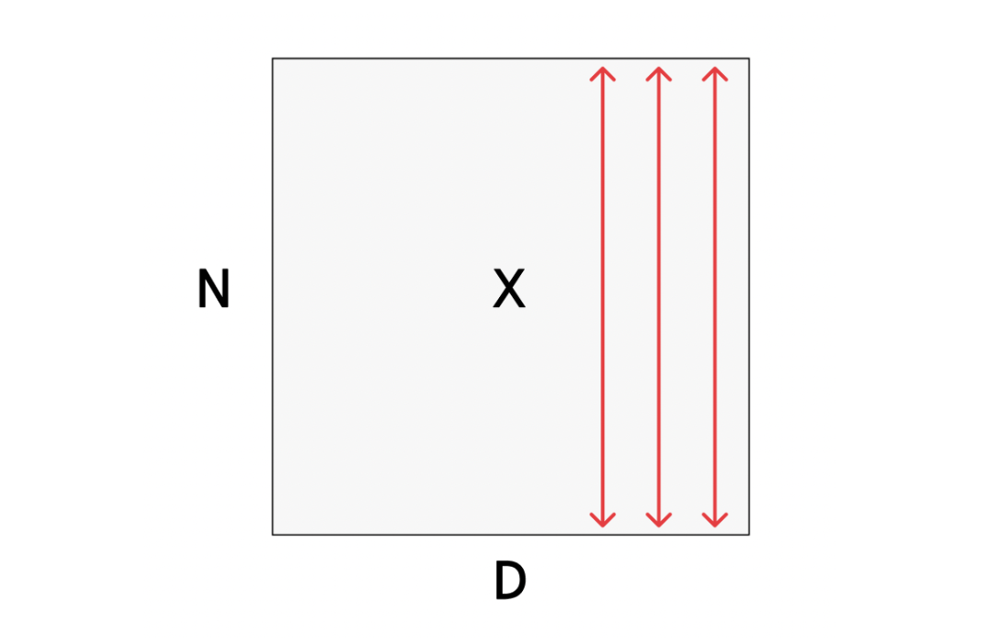
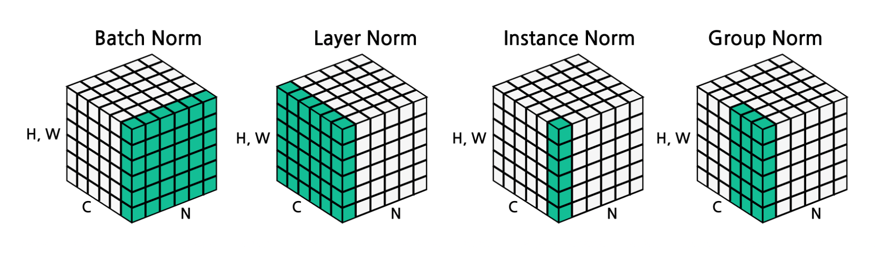

# 1. Introduction: 정규화(Normalization)의 필요성

깊은 신경망을 학습시킬 때, 이전 계층의 가중치가 업데이트됨에 따라 다음 계층으로 전달되는 입력 데이터의 분포가 지속적으로 변화하는 현상이 발생합니다. 이를 **내부 공변량 변화(Internal Covariate Shift)**라고 부르며, 오랫동안 학습을 불안정하게 만드는 주요 원인으로 여겨져 왔습니다. 최근의 현대적 관점에서는 정규화가 학습을 돕는 주된 이유를 손실 함수의 **최적화 지형(Optimization landscape)을 더 부드럽게(smoother) 만들어주기 때문**으로 해석합니다.

이러한 문제를 해결하기 위한 핵심 아이디어가 바로 **배치 정규화(Batch Normalization)**입니다. 계층의 출력값을 정규화하여 평균을 0으로, 분산을 1로 맞추는 것이 그 목적입니다. 

# 2. Batch Normalization (배치 정규화)의 수학적 공식

정규화는 미분 가능한 함수이므로 신경망 내의 연산자로 삽입하여 역전파(Backpropagation)를 수행할 수 있습니다. 입력 데이터 $x \in \mathbb{R}^{N \times D}$ ($N$은 배치 크기, $D$는 데이터의 차원)가 주어졌을 때의 정규화 과정은 다음과 같습니다.

1. **미니 배치 평균(Per-channel mean) 계산**:
   $$\mu_j = \frac{1}{N} \sum_{i=1}^N x_{i,j}$$
   * 채널(차원) $j$마다 $N$개의 배치 데이터의 평균 $\mu \in \mathbb{R}^D$를 구합니다.
   
2. **미니 배치 분산(Per-channel variance) 계산**:
   $$\sigma_j^2 = \frac{1}{N} \sum_{i=1}^N (x_{i,j} - \mu_j)^2$$
   * 채널별 분산 $\sigma^2 \in \mathbb{R}^D$을 구합니다.

3. **정규화(Normalization)**:
   $$\hat{x}_{i,j} = \frac{x_{i,j} - \mu_j}{\sqrt{\sigma_j^2 + \epsilon}}$$
   * 평균을 빼고 표준편차로 나누어 정규화된 $\hat{x} \in \mathbb{R}^{N \times D}$를 얻습니다 (0으로 나누는 것을 방지하기 위해 아주 작은 값 $\epsilon$을 더합니다).

## 2.1. 표현력의 한계와 Learnable Parameters

단순히 평균을 0, 분산을 1로 강제하는 것은 신경망의 표현력을 지나치게 제한(restrictive)할 수 있다는 문제가 있습니다. 만약 특정 층에서 비선형 활성화 함수(예: Sigmoid)를 통과하기 전에 데이터가 0을 중심으로만 모여있다면, 선형적인 구간에만 데이터가 갇히게 됩니다.

이를 해결하기 위해 모델이 스스로 정규화의 형태를 복구하거나 조절할 수 있도록 **학습 가능한 스케일(Scale) 변수 $\gamma$와 이동(Shift) 변수 $\beta$**를 도입합니다.

$$y_{i,j} = \gamma_j \hat{x}_{i,j} + \beta_j$$

* 여기서 최종 출력 $y \in \mathbb{R}^{N \times D}$가 됩니다.
* 만약 모델이 학습 과정에서 원래의 데이터 분포가 더 유용하다고 판단하면, $\gamma = \sigma$, $\beta = \mu$로 학습하여 기댓값 측면에서 본래의 항등 함수(Identity function)를 완벽히 복원해 낼 수도 있습니다.

# 3. Train 단계와 Test 단계의 차이

배치 정규화의 가장 큰 특징이자 잠재적인 버그의 원인은 **학습(Training)과 테스트(Testing) 시의 동작 방식이 다르다**는 점입니다.

* **Training Time**: 평균 $\mu$와 분산 $\sigma^2$의 추정치가 입력된 미니 배치(Mini-batch)에 철저히 의존합니다. 학습하는 동안, 모델은 전체 데이터셋의 평균적인 분포를 파악하기 위해 미니 배치의 평균과 표준편차에 대한 **이동 평균(Running averages)**을 지속적으로 계산하여 저장해 둡니다.
* **Test Time**: 테스트 시점에서는 미니 배치의 통계량을 계산할 수 없거나 무의미하므로(예: 1장의 이미지만 추론할 때), 학습 단계에서 미리 구해둔 이동 평균 $\tilde{\mu}_j$와 $\tilde{\sigma}_j^2$를 고정된 값으로 사용합니다. 

  $$\text{Input: } \hat{x}_{i,j} = \frac{x_{i,j} - \tilde{\mu}_j}{\sqrt{\tilde{\sigma}_j^2 + \epsilon}}$$
  $$\text{Output: } y_{i,j} = \gamma_j \hat{x}_{i,j} + \beta_j$$
  * Test 과정에서는 연산이 단순히 상수와의 선형 변환으로 취급되므로, 추가적인 오버헤드(Overhead) 없이 완전 연결 계층(FC)이나 합성곱(Conv) 계층의 가중치에 병합(fused)할 수 있습니다.

# 4. FC 계층과 Conv 계층에서의 배치 정규화

데이터의 차원에 따라 배치 정규화가 적용되는 축(Axis)이 다릅니다.

1. **Fully-Connected Networks**:
   * 입력 $x$가 $N \times D$일 때, $\mu, \sigma, \gamma, \beta$는 각각 크기가 $1 \times D$입니다. 즉, 각 특성(Feature) 차원마다 정규화를 수행합니다.
2. **Convolutional Networks (Spatial BatchNorm, BatchNorm2D)**:
   * 입력 $x$가 $N \times C \times H \times W$ (배치 $\times$ 채널 $\times$ 높이 $\times$ 너비) 형태를 가집니다.
   * 이 경우 공간적인 정보(H, W)를 유지하면서 채널(C)별로 정규화해야 합니다. 따라서 평균과 분산은 $N, H, W$ 전체에 대해 계산되며, $\mu, \sigma, \gamma, \beta$의 차원은 $1 \times C \times 1 \times 1$이 됩니다.

**[삽입 위치]**
배치 정규화 계층은 일반적으로 Fully-Connected 계층이나 Convolutional 계층 **바로 뒤**, 그리고 비선형 활성화 함수(tanh, ReLU 등) **바로 앞**에 삽입됩니다 (`FC -> BN -> tanh`).

# 5. 다양한 정규화 기법들 (LN, IN, GN)

배치 정규화는 강력하지만 미니 배치 크기에 의존한다는 단점이 있습니다. 데이터 텐서 $N \times C \times H \times W$를 어떤 축을 기준으로 묶어서 평균과 분산을 구하느냐에 따라 다양한 정규화 기법이 존재합니다.

1. **Batch Normalization (배치 정규화)**:
   * **기준**: $N, H, W$를 묶어서 채널 $C$마다 평균/분산을 구합니다 ($\mu, \sigma \in \mathbb{R}^C$).
   * CNN 계열에서 가장 좋은 성능을 발휘합니다.
2. **Layer Normalization (계층 정규화)**:
   * **기준**: $C, H, W$를 묶어서 배치 샘플 $N$마다 독립적으로 평균/분산을 구합니다 ($\mu, \sigma \in \mathbb{R}^N$).
   * **장점**: 학습 시 배치 크기(Batch size)에 전혀 영향을 받지 않습니다.
   * **사용처**: RNN이나 Transformer와 같은 시퀀스(Sequence) 모델에서 주로 사용됩니다.
3. **Instance Normalization (인스턴스 정규화)**:
   * **기준**: $H, W$만을 묶어서, 각 샘플 $N$과 채널 $C$마다 따로따로 평균/분산을 구합니다 ($\mu, \sigma \in \mathbb{R}^{N \times C}$).
   * **장점**: Batch Norm보다 훨씬 세밀한(Finer) 정규화가 가능하며 배치 크기에 독립적입니다.
   * **사용처**: Style Transfer(스타일 변환)나 생성 모델(Generative models)에 널리 쓰입니다.
4. **Group Normalization (그룹 정규화)**:
   * **기준**: 채널 $C$를 여러 개의 그룹으로 나누어 정규화를 수행합니다. 인스턴스 정규화를 일반화한 형태입니다.

# 6. Summary: CNN 컴포넌트 총정리 및 BN의 장단점

지금까지 학습한 합성곱 신경망(Convolutional Network)의 전체 파이프라인 컴포넌트는 다음과 같이 요약됩니다.

* **Convolution Layers**: 입력 이미지에서 특징 추출 (공간 정보 유지) 
* **Pooling Layers**: 공간적 차원(H, W)을 다운샘플링하여 연산량 감소 및 불변성 확보 
* **Normalization**: $\hat{x}_{i,j} = \frac{x_{i,j} - \mu_j}{\sqrt{\sigma_j^2 + \epsilon}}$ 공식을 통해 값의 분포를 안정화 
* **Activation Function**: 비선형성(ReLU 등) 부여 
* **Fully-Connected Layers**: 추출된 특징을 기반으로 최종 클래스 스코어 도출 

배치 정규화(BN)가 제공하는 이점과 한계는 명확합니다.

* **Pros (장점)**:
  * 깊은 신경망의 학습을 훨씬 쉽게(easier to train) 만들어 줍니다.
  * 더 높은 학습률(Learning rate)을 사용할 수 있어 수렴 속도가 빨라집니다.
  * 가중치 초기화(Initialization) 상태에 덜 민감해져 강건해(robust)집니다.
  * 학습 중 규제(Regularization) 효과를 일부 제공합니다.
* **Cons (단점)**:
  * 왜 잘 작동하는지 아직 이론적으로 완벽히 이해되지 않았습니다.
  * 학습(Train)과 추론(Test) 시의 동작 원리가 달라 잦은 버그의 원인이 됩니다.