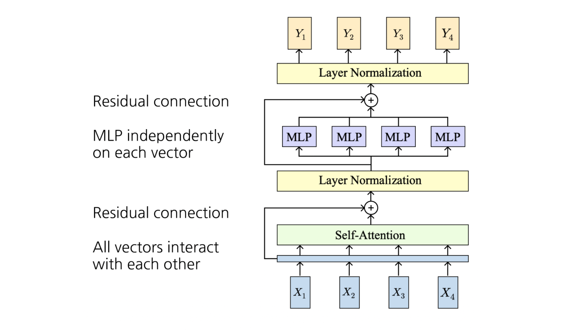

# 1. Introduction: 시퀀스 처리 패러다임의 전환

기존의 순차 데이터 처리는 RNN(Recurrent Neural Network)과 1D CNN(Convolutional Neural Network)이 주도해 왔습니다. 그러나 이들은 긴 시퀀스를 처리하거나 병렬 연산을 수행하는 데 있어 각기 다른 근본적인 한계를 지니고 있었습니다. Vaswani et al. (2017)의 "Attention is All You Need" 논문에서 제안된 **Transformer**는, 오직 Attention 메커니즘만을 사용하여 이러한 한계를 극복하고 현재 대규모 언어 모델(LLM)의 핵심 근간이 되었습니다. 

이번 포스트에서는 시퀀스 처리 방식의 비교를 시작으로, Transformer의 기본 구조, 최근 LLM에서 사용되는 다양한 변형(Tweaks) 아키텍처, 그리고 텍스트 생성(Decoding) 전략과 RLHF(인간 피드백 기반 강화학습)에 이르기까지 폭넓게 살펴보겠습니다.

---

# 2. Three Ways of Processing Sequences

시퀀스 데이터를 다루는 세 가지 주요 아키텍처의 특성을 연산량과 병렬화 관점에서 비교해 보겠습니다. 길이가 $N$인 시퀀스를 처리할 때의 특징은 다음과 같습니다.

1.  **1D Convolution**: 1차원 격자(Grid) 위에서 작동합니다.
    * **장점**: 출력값을 병렬로 계산할 수 있으며, 연산량과 메모리 요구량이 $O(N)$으로 시퀀스 길이에 선형적으로 비례합니다.
    * **단점**: 국소적인(Local) 수용 영역(Receptive field)을 가지므로, 시퀀스 전체의 문맥을 파악하려면 합성곱 층(Conv layers)을 아주 깊게 쌓아야 합니다.
2.  **Recurrent Neural Network (RNN)**: 1차원적으로 정렬된 순서(Order)에 따라 작동합니다.
    * **장점**: 이론적으로 긴 시퀀스를 처리하는 데 적합하며, 연산량과 메모리 역시 $O(N)$입니다.
    * **단점**: 이전 시점의 은닉 상태(Hidden state)가 계산되어야만 현재 시점을 계산할 수 있으므로 **병렬 처리가 불가능(Not parallelizable)**합니다.
3.  **Self-Attention (Transformer 기반)**: 벡터들의 집합(Sets of vectors) 위에서 작동합니다.
    * **장점**: 모든 출력 벡터를 동시에 계산할 수 있어 **고도로 병렬화(Highly parallel)**되어 있습니다. 또한 모든 입력 벡터가 서로 직접 상호작용하므로 긴 시퀀스의 문맥을 단번에 포착합니다.
    * **단점**: 모든 토큰이 서로 내적을 수행하므로 연산량과 메모리 요구량이 **$O(N^2)$**로, 시퀀스 길이가 길어질수록 비용이 기하급수적으로 증가합니다.

---

# 3. The Transformer Architecture

전통적인 Transformer 블록은 입력을 받아 동일한 차원의 출력을 반환하는 구조를 가집니다. 각 벡터 간의 상호작용은 오직 Self-Attention을 통해서만 이루어지며, 이후의 연산은 각 벡터마다 독립적으로 수행되므로 확장성(Scalability)이 매우 뛰어납니다.

### 3.1 구성 요소
* **Self-Attention**: 시퀀스 내의 모든 단어가 서로의 연관성을 계산하여 문맥을 파악합니다.
* **MLP (Feed Forward Network)**: 각 토큰 벡터마다 **독립적으로(independently)** 적용되는 비선형 변환 층입니다.
* **Residual Connection & Layer Normalization**: 그래디언트 소실을 방지하고 학습을 안정화합니다. 

주어진 은닉 벡터 $h_1, \dots, h_N \in \mathbb{R}^D$에 대한 Layer Normalization 수식은 다음과 같습니다. (학습 가능한 파라미터 $\gamma, \beta \in \mathbb{R}^D$ 사용)
$$\mu_i = \frac{\sum_{j=1}^D h_{i,j}}{D}, \quad \sigma_i = \left( \frac{\sum_{j=1}^D (h_{i,j} - \mu_i)^2}{D} \right)^{\frac{1}{2}}$$
$$z_i = \frac{h_i - \mu_i}{\sigma_i} \in \mathbb{R}^D$$
$$y_i = \gamma \odot z_i + \beta \in \mathbb{R}^D$$

### 3.2 Transfer Learning 패러다임
Transformer 모델은 인터넷상의 방대한 텍스트 데이터를 이용하여 거대한 언어 모델(LM)로 **사전 학습(Pretraining)**된 후, 특정 NLP 태스크에 맞게 **미세 조정(Fine-tuning)**되는 전이 학습 패러다임을 정착시켰습니다.

---

# 4. Tweaking Transformers: 최신 LLM을 위한 구조적 변형

초기 Transformer 구조는 매우 안정적이었으나, 모델의 파라미터가 수백억~수천억 개로 커지면서 학습 안정성과 효율성을 극대화하기 위해 다양한 변형 기법들이 도입되었습니다.

## 4.1 Pre-Norm vs Post-Norm
원래의 Transformer(Post-Norm)는 Residual 덧셈을 수행한 **이후에** 정규화를 수행했습니다. 반면 최근 LLM들은 Residual 분기(Branch) **내부에서** 정규화를 먼저 수행하는 **Pre-Norm** 구조를 선택합니다.

* **Post-Norm**: $y = LN(x + F(x))$
* **Pre-Norm**: $y = x + F(LN(x))$

**도입 동기**: Pre-Norm은 Residual Connection을 통한 항등 매핑(Identity path)을 더 깨끗하게 보존하므로, 신경망이 깊어져도 최적화가 훨씬 안정적으로 이루어집니다.

## 4.2 RMSNorm (Root Mean Square Normalization)
Layer Normalization에서 평균을 빼는 연산(Mean-subtraction)을 제거하고, 오직 제곱평균제곱근(RMS)으로만 스케일링을 수행하는 기법입니다.

$$RMS(x) = \sqrt{\frac{1}{D}\sum_{i=1}^D x_i^2 + \epsilon}$$
$$y_i = \frac{x_i}{RMS(x)}\gamma_i$$

**도입 동기**: 기존 LayerNorm보다 연산이 단순하면서도 경험적으로 학습 안정성과 효율성이 비슷하거나 더 우수하여, LLaMA 등 현대의 다수 LLM에서 표준으로 채택하고 있습니다.

## 4.3 SwiGLU 활성화 함수
기존 Transformer의 MLP(또는 FFN) 층을 대체하는 변형 구조입니다. 입력 $X \in \mathbb{R}^{N \times D}$에 대해 다음과 같은 게이트 메커니즘을 사용합니다.

$$Y = (SiLU(XW_1) \odot XW_2)W_3$$
(이때, 활성화 함수 $SiLU(x) = x \cdot \sigma(x)$ 이며, $\odot$는 원소별 곱셈을 의미합니다.)

**도입 동기**: 곱셈 기반의 게이팅(Multiplicative gate)을 도입하여 네트워크의 표현력(Expressivity)을 강화합니다. 파라미터 수를 기존 MLP와 비슷하게 맞추기 위해 은닉층 차원 $H$는 일반적으로 $\frac{8D}{3}$로 설정합니다.

## 4.4 Mixture of Experts (MoE)
하나의 거대한 밀집(Dense) MLP를 사용하는 대신, 여러 개의 작은 **전문가(Expert) MLP** 모델을 병렬로 배치하는 구조입니다.

$$y = \sum_{e \in Top-A} \alpha_e Expert_e(x)$$

라우터(Router) 네트워크가 각 토큰 $x$에 대해 점수 $r(x) \in \mathbb{R}^E$를 계산하고, 가장 점수가 높은 소수($Top-A$)의 전문가 모델만을 선택하여 연산을 수행합니다. (일반적으로 $A \ll E$)

**도입 동기**: 실제 연산량(Compute)은 $A$에 비례하게 유지하면서도, 전체 모델의 파라미터 크기(Capacity)는 $E$에 비례하게 대폭 늘릴 수 있는 파라미터 효율성을 달성합니다. 단, 라우팅의 복잡성과 로드 밸런싱(Load balancing) 문제가 동반됩니다.

---

# 5. GPT-3와 Autoregressive Language Modeling

트랜스포머 아키텍처를 스케일업한 대표적인 모델이 GPT-3 (175B Parameters)입니다. 이 모델은 파인튜닝 없이 Zero-shot, Few-shot 만으로도 뛰어난 성능을 보입니다.

GPT-3와 같은 **자기회귀(Autoregressive) 모델**은 이전까지의 토큰들이 주어졌을 때 다음 토큰을 예측하는 조건부 확률 $p(t | t_1, \dots, t_{i-1})$을 학습합니다. 
학습 과정에서는 모델이 예측한 확률 분포 $p_2, \dots, p_n$과 실제 정답(Ground-truth) 토큰 $t_2, \dots, t_n$ 간의 **교차 엔트로피 손실(Cross-Entropy Loss)**을 계산하여 가중치를 업데이트합니다.

---

# 6. Text Generation (Decoding) Strategies

학습된 자기회귀 모델이 실제로 텍스트를 생성(Inference)할 때, 다음 토큰을 선택하는 다양한 디코딩 전략이 존재합니다.

1.  **Greedy Search**: 매 스텝마다 가장 확률이 높은 토큰을 선택합니다. ($t_{ind} = \text{argmax}_{t} p(t | t_1, \dots, t_{ind-1})$)
    * *단점*: 당장 확률이 높은 것만 쫓아가다 보니, 문장 전체로 보았을 때는 최적이 아닌(Suboptimal) 텍스트가 생성될 위험이 큽니다.
2.  **Beam Search**: 매 스텝마다 모든 가능한 토큰을 확장한 뒤, 전체 시퀀스의 누적 로그 확률(Log-probability)이 가장 높은 상위 $B$개의 시퀀스(Beam width)만을 유지합니다.
    * *수식*: $(s, l) \rightarrow (s+t, l + \log p(t|s))$
3.  **Top-K Sampling**: 다음 토큰의 확률 분포에서 가장 확률이 높은 상위 $K$개의 토큰 집합($\mathbb{T}_{top-K}$)을 찾고, 그 안에서 확률에 비례하여 무작위로 샘플링합니다.
4.  **Nucleus Sampling (Top-p)**: 미리 정해둔 임계값(Threshold) $\eta$를 기준으로, 누적 확률의 합이 $\eta$를 넘는 최소한의 상위 토큰 집합($\mathbb{T}_{top-N}$)을 찾습니다. 
    * *조건*: $\sum p(t_{ind} \in \mathbb{T}_{top-N} | t_1, \dots) > \eta$
    * *특징*: 예측의 확실성에 따라 후보 토큰의 개수 $N$이 유동적으로 변하여 자연스러운 텍스트 생성을 돕습니다.

---

# 7. RLHF: Reinforcement Learning from Human Feedback

언어 모델이 단순히 다음 단어만 잘 맞추는 것을 넘어, '인간이 선호하는' 유익하고 안전한 답변을 생성하도록 교정하는 핵심 기법이 **RLHF**입니다.

1.  **Pretrain a Language Model (LM)**: 대규모 말뭉치로 기본 언어 모델을 사전 학습합니다.
2.  **Train a Reward Model**: 모델이 생성한 여러 응답에 대해 사람이 순위를 매기고(Human Scoring), 이를 바탕으로 주어진 텍스트가 인간의 선호도에 부합하는지 점수 $r_\theta(y|x)$를 예측하는 보상 모델(Preference Model)을 학습합니다.
3.  **RL Finetuning (e.g., PPO)**: 기본 언어 모델의 텍스트 생성 결과를 보상 모델이 평가하고, 이 보상값을 최대화하는 방향으로 PPO 알고리즘을 사용해 언어 모델(RL Policy)을 강화학습시킵니다.
    * 이때 모델이 기존 언어 체계를 망각하거나 보상 모델을 속이는 형태로 과적합되는 것을 막기 위해, 원래의 기본 모델 분포($\pi^{base}$)와 너무 멀어지지 않도록 하는 **KL 발산 페널티 (KL prediction shift penalty)**를 목적 함수에 추가합니다.
    * 수식적 업데이트 방향: $\theta \leftarrow \theta + \nabla_\theta J(\theta)$ (여기서 $J$는 보상 모델의 보상값에서 $\lambda D_{KL}(\pi_\theta^{RL}(y|x) || \pi^{base}(y|x))$를 차감한 형태를 취합니다.)