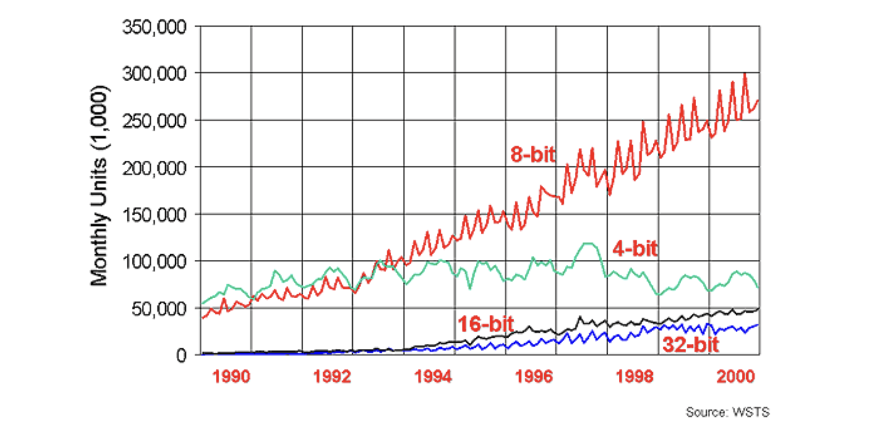
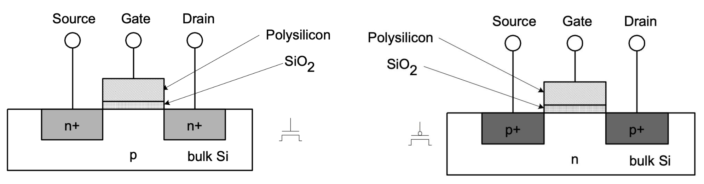
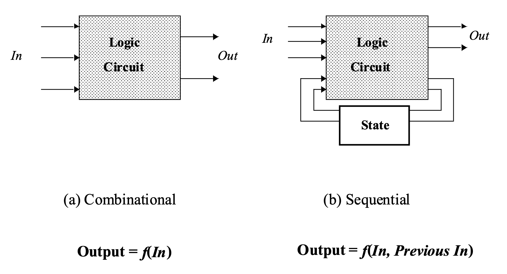
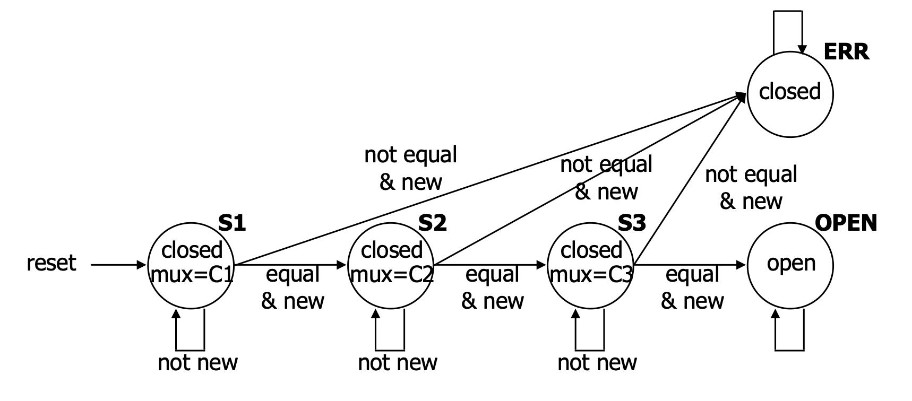
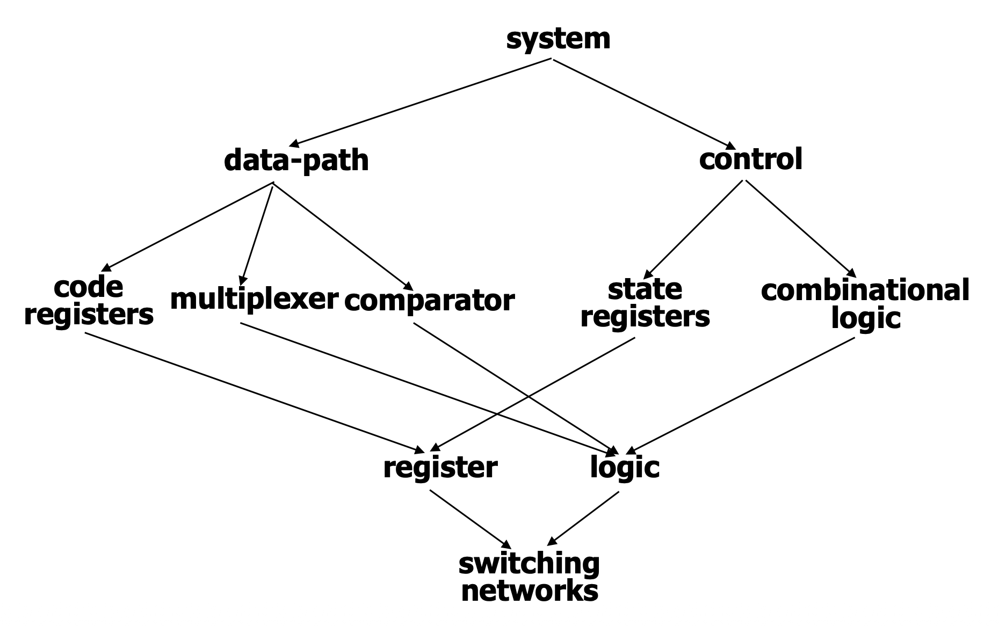

# 1. Introduction: 왜 논리 회로 설계를 배우는가?

논리 회로 설계(Logic Design)는 스마트폰부터 슈퍼컴퓨터에 이르기까지 모든 현대 컴퓨팅 기기를 구현하는 하드웨어적 기반입니다. 소프트웨어 엔지니어나 데이터 과학자에게도 하드웨어의 동작 원리를 이해하는 것은 매우 중요합니다. 컴퓨터가 어떻게 작동하는지에 대한 근본적인 모델을 제공하기 때문입니다.

* 특히 논리 회로 설계는 다음과 같은 핵심적인 동기(Motivation)를 제공합니다:
  * **병렬 컴퓨팅의 이해:** 하드웨어에 내재된 병렬성(parallelism)은 우리가 병렬 연산을 처음으로 직관적으로 접할 수 있는 훌륭한 기회입니다.
  * **소프트웨어 설계와의 대비:** 알고리즘의 순차적 실행에 집중하는 소프트웨어와 달리, 하드웨어는 컴퓨팅 자원과 저장 공간, 그리고 동작의 타이밍을 동시에 규정해야 하므로 연산(computation) 자체에 대한 폭넓은 시각을 길러줍니다.

범용 PC용 CPU는 전체 글로벌 프로세서 시장의 2% 미만에 불과하며, 네트워킹 장비(라우터, 모뎀), 임베디드 제품(자동차, 가전제품), 과학 장비 등 컴퓨팅의 세계는 우리가 생각하는 것보다 훨씬 거대합니다.

---

# 2. Core Concepts: 논리 회로의 핵심 개념

## 2.1. 디지털 추상화 (Digital Abstraction)와 스위치
실제 전자 부품은 연속적인 아날로그 전압 값으로 동작하지만, 우리는 이를 '0' 또는 '1'이라는 이산적인 값으로 해석합니다. 이러한 디지털 추상화를 사용하는 이유는 소수의 이산적 값을 다루는 것이 논리적으로 훨씬 간편하며, 작은 전압의 오차(양자화 오류)가 시스템 전체로 전파되지 않고 '0'이나 '1'로 확실히 재설정되기 때문입니다.

논리 회로의 가장 기본적인 구성 요소는 **스위치(Switch)**입니다. 이 스위치들은 반도체 트랜지스터로 구현되며, 이를 상호 연결하여 복잡한 연산을 수행하는 회로를 구성합니다.

## 2.2. CMOS 트랜지스터 네트워크
현대의 디지털 시스템은 주로 **CMOS (Complementary Metal-Oxide Semiconductor)** 기술로 설계됩니다. CMOS는 nMOS와 pMOS라는 상호 보완적인(Complementary) 두 종류의 트랜지스터를 쌍으로 사용합니다. 트랜지스터는 게이트(Gate)에 인가되는 전압에 따라 소스(Source)와 드레인(Drain) 사이의 전도 경로를 열고 닫는 전압 제어 스위치 역할을 합니다.

* **nMOS (n-channel MOS):** 게이트(G)에 **높은 전압(High)**이 인가될 때 스위치가 닫혀(Closed) 전류가 흐릅니다. 전압이 낮으면 열립니다(Open).
* **pMOS (p-channel MOS):** 게이트(G)에 **낮은 전압(Low)**이 인가될 때 스위치가 닫혀 전류가 흐릅니다. 전압이 높으면 열립니다.

이러한 트랜지스터들을 조합하여 논리합(OR), 논리곱(AND), 부정(NOT) 등의 기본 논리 게이트(Logic Gate)를 구성할 수 있습니다. 예를 들어, 3입력 NAND 게이트의 경우 모든 입력이 1일 때만 출력이 0으로(pull low) 떨어지고, 입력 중 하나라도 0이면 출력이 1로(pull high) 올라가는 구조를 가집니다.

## 2.3. 조합 논리(Combinational) vs. 순차 논리(Sequential)
디지털 회로는 입력 전압에 반응하는 방식에 따라 크게 두 가지로 나뉩니다.

1. **조합 논리 회로 (Combinational Logic):** 메모리가 없는(memory-less) 회로입니다. 현재의 출력 값은 오직 **현재의 입력 값**에 의해서만 결정됩니다. 즉, 클럭 엣지를 기다려 입력을 관찰하더라도 입력이 변하지 않으면 출력도 변하지 않습니다.
2. **순차 논리 회로 (Sequential Logic):** 상태(State)를 가지는 회로입니다. 현재의 출력 값은 현재의 입력뿐만 아니라 **과거의 입력 값(상태)**에도 영향을 받습니다. 클럭 엣지에 따라 내부 상태가 변할 수 있으므로, 동일한 입력이 주어지더라도 클럭 엣지 전후로 출력이 달라질 수 있습니다.

---

# 3. Mathematical Formulation: 조합 논리 설계의 수학적 모델링

조합 논리 설계는 문제 명세 $\rightarrow$ 진리표(Truth Table) $\rightarrow$ 논리식 도출 및 간소화 $\rightarrow$ 논리 게이트 구현의 단계를 거칩니다.

손목시계의 LCD 디스플레이를 제어하기 위해 해당 월(Month)과 윤년 여부(Leap year flag)를 입력받아 그 달의 일수(28, 29, 30, 31일)를 출력하는 캘린더 서브시스템을 예로 들어 보겠습니다.

### 3.1. 인코딩 및 진리표 작성
* **입력:** 월을 나타내는 4비트 이진수($m8, m4, m2, m1$)와 윤년 여부 1비트($leap$).
* **출력:** 각각 28일, 29일, 30일, 31일 여부를 나타내는 4개의 출력선($d28, d29, d30, d31$).

진리표를 작성해보면, 예를 들어 2월(입력 `0010`)이면서 평년(leap=`0`)일 때는 $d28=1$이 되고, 윤년(leap=`1`)일 때는 $d29=1$이 됩니다.

### 3.2. 논리식(Boolean Equations) 유도 및 간소화
진리표의 결과가 '1'이 되는 조건들을 논리곱(AND, $\bullet$)과 논리합(OR, $+$), 부정(NOT, $'$, $\bar{x}$) 기호를 사용하여 대수학적으로 표현할 수 있습니다.

* **28일 출력 ($d28$):** 2월(`0010`)이고 윤년이 아닐(`0`) 때만 참이 되므로 다음과 같이 표현됩니다.
  $$d28 = m8' \bullet m4' \bullet m2 \bullet m1' \bullet leap'$$ 

* **30일 출력 ($d30$):** 4월(`0100`), 6월(`0110`), 9월(`1001`), 11월(`1011`)에 해당합니다. 초기 논리식은 다소 복잡하지만, 불 대수의 정리를 이용해 다음과 같이 간소화(Logic Minimization)할 수 있습니다.
  $$d30 = (m8' \bullet m4 \bullet m2' \bullet m1') + (m8' \bullet m4 \bullet m2 \bullet m1') + (m8 \bullet m4' \bullet m2' \bullet m1) + (m8 \bullet m4' \bullet m2 \bullet m1)$$ 
  $$d30 = (m8' \bullet m4 \bullet m1') + (m8 \bullet m4' \bullet m1)$$ 

이러한 논리식들은 논리 합성 도구(Logic Compiler)를 거쳐 최종적으로 트랜지스터 스위치들의 물리적 배열로 매핑됩니다.

---

# 4. Detailed Derivations: 순차 논리와 FSM (유한 상태 기계)

과거의 이력이 필요한 시스템, 예를 들어 3자리의 비밀번호를 순서대로 입력해야 열리는 '도어락(Door Combination Lock)' 시스템은 순차 논리로 설계해야 합니다. 입력 도중 오류가 발생하면 시스템을 초기화(reset)해야 하며, 열린 후에도 초기화가 필요합니다.

### 4.1. 유한 상태 기계 (Finite-State Machine, FSM) 설계
* 시스템의 동적 동작을 모델링하기 위해 5개의 상태를 가지는 FSM을 구성합니다.
  * **상태 (States):** `S1` (첫 번째 입력 대기), `S2` (두 번째 대기), `S3` (세 번째 대기), `OPEN` (문 열림), `ERR` (에러 상태).
  * **전이 (Transitions):** 클럭 신호에 동기화되어, 입력 값이 새롭게 들어왔을 때(`new`) 비교 결과(`equal` 또는 `not equal`)에 따라 다음 상태로 넘어갑니다.

### 4.2. 상태 인코딩 (State Encoding)
FSM을 하드웨어로 구현하기 위해서는 각 추상적인 상태를 이진수로 인코딩해야 합니다. 5개의 상태를 표현하기 위해 최소 3비트(`000` ~ `100`)가 필요하지만, 설계의 편의성(디코딩 로직 최소화)을 위해 **4비트**를 선택하여 다음과 같이 할당합니다.

* `S1` = `0001`
* `S2` = `0010`
* `S3` = `0100`
* `OPEN` = `1000`
* `ERR` = `0000` 

**이러한 인코딩 방식의 이점(Good choice of encoding):**
출력 신호들을 상태 비트 자체에서 바로 뽑아 쓸 수 있도록 최적화되었습니다. 예를 들어 문이 열렸는지 닫혔는지를 나타내는 `open/closed` 출력선은 다음 상태(Next State)를 나타내는 4비트 중 가장 앞의 1비트와 완벽히 동일하며, 데이터 패스를 제어하는 MUX 제어 신호는 뒤의 3비트와 일치합니다.

---

# 5. Interpretation and Intuition: 데이터 경로와 제어, 그리고 계층 구조

현대의 디지털 시스템 설계는 복잡성을 관리하기 위해 구조적 분할과 추상화 계층을 적극적으로 활용합니다.

1. **데이터 경로(Data-path)와 제어 로직(Control)의 분리:**
   순차 회로는 일반적으로 실제 데이터를 비교하고 조작하는 부분(비교기, 멀티플렉서)인 **데이터 경로**와, 전체적인 순서와 상태 흐름을 지휘하는 **제어기(FSM Controller)**로 나누어 설계합니다. 제어기 내부에는 클럭에 따라 입력을 기억하는 특수한 소자인 **레지스터(Register)**가 상태를 보관하며, 조합 논리 블록이 다음 상태와 출력을 계산합니다.

2. **계층적 설계 (Design Hierarchy):**
   가장 밑바닥의 물리적 트랜지스터 소자(Device)들이 모여 논리 게이트(Gate)를 이루고, 게이트들이 모여 가산기나 레지스터 같은 회로/모듈(Module)을 만듭니다. 최종적으로 이 모듈들이 모여 거대한 CPU나 시스템(System)을 이룹니다. 이러한 계층적 추상화를 통해 엔지니어들은 트랜지스터의 물리적 전압 특성에 얽매이지 않고, 고수준의 하드웨어 기술 언어(HDL)를 이용해 시스템의 아키텍처를 설계할 수 있게 됩니다.

---

# 6. Summary

논리 설계(Logic Design)는 단순한 소프트웨어 프로그래밍과는 다른 철학을 가집니다. 개발자는 알고리즘의 명세뿐만 아니라, 그것이 소비할 연산 및 저장 자원(Hardware blocks)까지 명시적으로 지정해야 합니다.
우리는 연속적인 아날로그 물리량을 이진수로 다루는 디지털 추상화부터 시작하여 , 조합 논리와 순차 논리의 본질적인 차이를 짚고 , 진리표와 FSM을 거쳐 디지털 회로를 수학적이고 구조적으로 설계하는 흐름을 확인했습니다. 현대의 CAD 툴과 하드웨어 컴파일러의 발달로 이러한 복잡한 대규모 설계 작업이 가능해졌습니다.