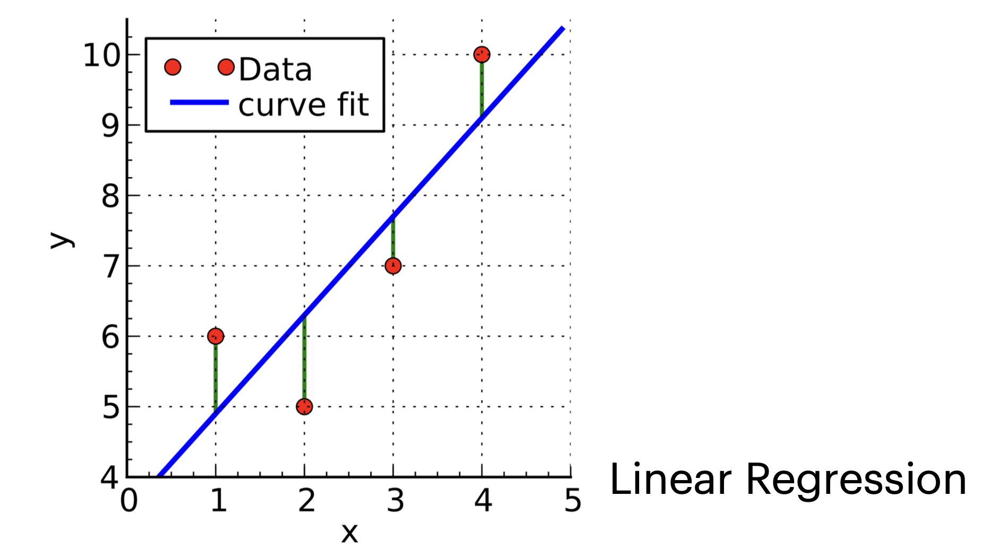

# 1. Introduction: What is Machine Learning?

* 전통적인 프로그래밍이 규칙(Rule)을 사람이 직접 작성하여 데이터를 처리했다면, **머신러닝(Machine Learning)**은 데이터로부터 의사결정(Decision)이나 예측(Prediction)을 수행하는 모델을 학습하는 과정입니다.

* 가장 직관적인 예시로 사진 분류를 들 수 있습니다. 우리가 찍은 사진이 "풍경(Landscape)"인지 "음식(Food)"인지 구분하는 문제를 생각해봅시다.

* 이처럼 머신러닝의 주된 초점은 **데이터(Data)에 기반하여 유용한 결정이나 예측을 내리는 것**입니다. 얼굴 인식(Face detection)이나 음성 인식(Speech recognition) 등이 대표적인 예입니다.

---

# 2. Foundations: Assumptions and Goals

* 과거의 데이터를 가지고 미래를 예측한다는 것은 논리적으로 비약이 있을 수 있습니다. 이를 수학적, 통계적으로 정당화하기 위해 머신러닝에서는 중요한 가정과 목표를 설정합니다.

## 2.1. The IID Assumption
* 우리가 수집한 학습 데이터(Training Data)가 미래의 데이터(Query)를 대변할 수 있으려면, 다음과 같은 강력한 가정이 필요합니다.

> **I.I.D. (Independent and Identically Distributed)**
>
> 1. 모든 학습 데이터는 서로 **독립적(Independent)**이다.
> 2. 학습 데이터와 테스트 데이터(Query)는 **동일한 확률 분포(Identically Distributed)**에서 추출된다.

* 이 가정이 성립해야만 과거의 데이터로 학습한 모델이 미래의 상황에서도 작동할 것이라고 기대할 수 있습니다.

## 2.2. Two Main Problems
* 머신러닝이 해결해야 할 근본적인 문제는 크게 두 가지로 요약됩니다.
  * 1.  **Estimation (추정)**:
      * 데이터에는 필연적으로 잡음(Noise)이 섞여 있습니다. (예: 같은 치료를 받아도 환자마다 결과가 다를 수 있음)
      * 이러한 잡음이 섞인 데이터를 집계하여 **정확한 예측값**을 찾아내는 과정입니다.
  * 2.  **Generalization (일반화)**:
      * 학습 과정에서 보지 못한(Unseen) 새로운 상황이나 실험에 대해 결과를 예측하는 능력입니다.
      * 단순히 주어진 데이터를 외우는 것이 아니라, 데이터 너머의 통찰(Insight)을 확장하는 것이 목표입니다.

---

# 3. Problem Characteristics & Solutions

* 머신러닝 문제를 구조적으로 바라보기 위해 문제(Problem)와 해결책(Solution)의 특성을 나누어 생각할 수 있습니다.

* **Problem Characteristics**:
    * **Problem Class**: 학습 데이터의 성격과 테스트 시 주어지는 질문(Query)의 유형. (예: 지도 학습 vs 비지도 학습)
    * **Assumptions**: 데이터 소스나 솔루션의 형태에 대한 사전 지식.
    * **Evaluation Criteria**: 시스템의 성능을 어떻게 측정할 것인가?
* **Solution Characteristics**:
    * **Model Type**: 데이터의 어떤 측면을 모델링할 것인가?
    * **Model Class**: 어떤 파라미터화된 모델 군(Parametric class)을 사용할 것인가? (예: 선형 모델, 신경망 등)
    * **Algorithm**: 모델을 데이터에 적합(Fitting)시키고 예측을 수행하는 계산 과정.

---

# 4. Problem Class: Supervised Learning (SL)

* **지도 학습(Supervised Learning)**은 학습 시스템에 **입력(Input)**과 그에 상응하는 **정답(Output, Label)**이 함께 주어지는 경우입니다.
* 출력 값의 형태에 따라 크게 두 가지로 나뉩니다.

## 4.1. Classification (분류)
* 출력값 $y$가 **이산적인(Discrete)** 작은 집합에서 선택되는 경우입니다.

* **Training Data**: $\mathcal{Z}_n : \{(x^{(1)}, y^{(1)}), ..., (x^{(n)}, y^{(n)})\}$
    * $x^{(i)} \in \mathbb{R}^d$: 분류할 객체 (특징 벡터)
    * $y^{(i)}$: 타겟 값 (Target value, Class label)
* **Types**:
    * **Binary Classification**: $y$가 두 가지 값 중 하나 (예: 스팸/햄, 양성/음성).
    * **Multi-class Classification**: $y$가 여러 개의 클래스 중 하나.

## 4.2. Regression (회귀)
* 출력값 $y$가 **연속적인(Continuous)** 실수 값이거나 아주 큰 유한 집합인 경우입니다.

* **Difference**: 입력 $x^{(i)}$의 정의는 분류와 같지만, 출력 $y^{(i)} \in \mathbb{R}^k$라는 점이 다릅니다.
* **Example**: 주택 가격 예측, 주가 예측 등.

---

# 5. Problem Class: Unsupervised Learning (USL)

* **비지도 학습(Unsupervised Learning)**은 정답(Output) 없이 입력 데이터만 주어지는 경우입니다. 데이터 내재된 **패턴(Pattern)**이나 **구조(Structure)**를 찾는 것이 목표입니다.

## 5.1. Density Estimation (밀도 추정)
* 주어진 샘플 $x^{(1)}, ..., x^{(n)}$이 어떤 확률 분포 $Pr(X)$에서 추출되었다고 할 때, 새로운 데이터 $x^{(n+1)}$이 등장할 확률 $Pr(x^{(n+1)})$을 예측하는 문제입니다.
* 지도 학습의 전처리 단계나 서브루틴으로 자주 사용됩니다.

## 5.2. Clustering (군집화)
* 데이터들을 유사한(Similar) 그룹으로 묶는 과정입니다.
* **Goal**: 군집 내(Intra-cluster) 거리는 최소화하고, 군집 간(Inter-cluster) 거리는 최대화하는 파티션을 찾습니다.
* **Soft Clustering**: 하나의 샘플이 여러 군집에 확률적으로 속할 수 있음을 허용합니다. (예: A 군집에 0.9, B 군집에 0.1)

## 5.3. Dimensionality Reduction (차원 축소)
* 고차원 데이터 $x \in \mathbb{R}^D$를 정보를 최대한 보존하면서 저차원 $d < D$ 공간으로 변환하는 문제입니다.
* **Usage**: 데이터 시각화(Visualization) 또는 지도 학습을 위한 전처리(Preprocessing)로 활용됩니다.

---

# 6. Problem Class: Reinforcement Learning (RL)

* **강화 학습(Reinforcement Learning)**은 지도 학습이나 비지도 학습과는 완전히 다른 패러다임입니다. 정답이 미리 주어지지 않으며, **에이전트(Agent)**가 **환경(Environment)**과 상호작용하며 학습합니다.

* **Goal**: 입력(State, $x$)에서 출력(Action, $y$)으로 가는 정책(Policy)을 학습하되, 장기적인 **보상(Reward)의 총합**을 최대화하는 것이 목표입니다.
* **Process**:
    * 1.  에이전트가 현재 상태 $x^{(0)}$를 관측하고 행동 $y^{(0)}$를 선택.
    * 2.  환경으로부터 보상 $r^{(0)}$을 받고, 새로운 상태 $x^{(1)}$로 전이.
    * 3.  이 과정을 반복.
* **Challenge**: 에이전트의 행동이 미래의 보상뿐만 아니라 미래에 관측할 데이터(State)에도 영향을 미칩니다.

---

# 7. Other Problem Classes

## 7.1. Sequence Learning
* 입력 시퀀스로부터 출력 시퀀스($y_1, ..., y_m$)를 예측하는 문제입니다.
* 일반적으로 **상태 머신(State Machine)**으로 모델링합니다.
    * $f$: 입력에 따라 다음 **은닉 상태(Hidden State)**를 계산.
    * $g$: 현재 은닉 상태로부터 출력을 계산.
* 지도 학습의 일종으로 볼 수 있지만, 내부의 은닉 상태를 알 수 없으므로(Unknown hidden state sequence) 내부 함수들을 학습해야 한다는 점이 독특합니다.

## 7.2. Advanced Settings
* **Semi-Supervised Learning (준지도 학습)**: 소수의 레이블된 데이터와 다수의 레이블 없는 데이터를 함께 사용합니다.
* **Active Learning (능동 학습)**: 레이블링 비용이 비쌀 때(예: 의료 영상 판독), 알고리즘이 학습에 가장 도움이 되는 데이터를 선별하여 레이블링을 요청합니다.
* **Transfer Learning (전이 학습/Meta-Learning)**: 서로 다르지만 관련된 여러 태스크의 분포를 활용하여, 새로운 태스크를 적은 데이터로 빠르게 학습하는 방법입니다.

---

# 8. Assumptions

* 머신러닝은 데이터를 통해 미지의 세계를 예측하는 과정이므로, 수학적 정당성을 확보하기 위해 데이터 소스나 솔루션에 대한 **가정(Assumption)**이 필수적입니다.

## 8.1. Common Assumptions

* **I.I.D. (Independent and Identically Distributed)**: 데이터가 서로 독립적이며 동일한 확률 분포를 따른다는 가장 기본적인 가정입니다.
* **Markov Chain**: 데이터가 마르코프 체인에 의해 생성된다고 가정할 수도 있습니다 (시계열 데이터 등).
* **Adversarial Process**: 데이터를 생성하는 프로세스가 적대적일 수도 있습니다 (예: 스팸 필터링, 보안).
* **Hypothesis Space**: 데이터를 생성하는 "True Model"이 우리가 설정한 특정 가설 집합(Hypothesis Set) 안에 완벽하게 포함된다고 가정하기도 합니다.

## 8.2. Why Assumptions Matter?
* 가정을 설정하는 것의 효과는 가능한 가설(Hypothesis)의 공간을 줄여주는 것입니다. 표현할 수 있는 공간이 줄어든다는 것은, 역설적으로 **학습에 필요한 데이터의 양을 줄여준다**는 강력한 이점을 제공합니다.

---

# 9. Evaluation Criteria

* 모델이 내놓은 예측이나 결정이 "좋은지" 판단하기 위해서는 명확한 **평가 기준(Evaluation Criteria)**이 필요합니다. 이는 개별 예측에 대한 평가와 시스템 전체의 거동에 대한 평가로 나뉩니다.

## 9.1. Loss Functions (Loss Function)
* 개별 예측의 품질은 **손실 함수(Loss Function)** $L(g, a)$로 정의됩니다. 이는 정답이 $a$일 때, 모델이 $g$라고 추측(Guess)함으로써 발생하는 페널티(Penalty)의 양입니다.

### **Classification Loss**
* **0-1 Loss**: 유한한 도메인(분류 등)에서 사용됩니다.
    $$
    L(g, a) = \begin{cases} 0 & \text{if } g = a \\ 1 & \text{otherwise} \end{cases}
    $$
   
* **Asymmetric Loss (비대칭 손실)**:
    * 어떤 오류가 다른 오류보다 훨씬 치명적일 때 사용합니다. 예를 들어, 알레르기 유발 음식을 탐지할 때, 알레르기가 없는데 있다고 하는 것보다, **있는데 없다고 하는 것(False Negative)이 훨씬 위험**합니다.
    $$
    L(g, a) = \begin{cases} 1 & \text{if } g=1 \text{ and } a=0 \text{ (False Positive)} \\ 10 & \text{if } g=0 \text{ and } a=1 \text{ (False Negative)} \\ 0 & \text{otherwise} \end{cases}
    $$
   

### **Regression Loss**
* **Squared Loss**: 예측값과 실제값 차이의 제곱입니다.
    $$L(g, a) = (g - a)^2$$
* **Linear Loss (Absolute Loss)**: 차이의 절댓값입니다.
    $$L(g, a) = |g - a|$$

## 9.2. System-level Evaluation
* 단일 예측이 아니라, 전체 예측에 대한 평가 기준도 필요합니다.
  * **Minimizing Expected Loss (Risk)**: 모든 예측에 대한 기대 손실을 최소화하는 것으로, 가장 보편적인 기준입니다.
  * **Minimizing Maximum Loss**: 최악의 경우(Worst-case)를 방어합니다.
  * 그 외에도 Regret(후회) 최소화, 점근적(Asymptotic) 동작 분석, PAC(Probably Approximately Correct) 러닝 등이 있습니다.

---

# 10. Solution Characteristics

* 문제 해결을 위한 솔루션은 크게 **모델 유형(Model Type)**, **모델 클래스(Model Class)**, 그리고 **알고리즘(Algorithm)**으로 구체화됩니다.

## 10.1. Model Type & Fitting
* **No Model**: 최근접 이웃(Nearest Neighbor) 방법처럼 별도의 학습 과정 없이 과거 데이터의 평균을 답으로 내는 경우입니다.
* **Prediction Rule**: 학습 데이터에 모델을 **적합(Fit)**시키고, 이를 이용해 예측하는 방식입니다.
    * 모델은 파라미터 벡터 $\theta$를 가지는 함수 $y = h(x; \theta)$로 표현됩니다.
    * 새로운 입력 $x^{(n+1)}$에 대해 $h(x^{(n+1)}; \theta)$로 예측을 수행합니다.

* **The Fitting Process (Optimization)**:
  * 모델 학습은 최적화 문제로 귀결됩니다.
  * **Ideal**: 데이터의 실제 분포 $Pr(X, Y)$를 안다면 **Expected Loss (Test Error)**를 최소화합니다.
  * **Reality**: 실제 분포를 모르므로, **Training Error (Empirical Risk)**를 최소화하는 $\theta$를 찾습니다.
      $$\epsilon_{n}(\theta) = \frac{1}{n}\sum_{i=1}^{n}L(h(x^{(i)};\theta), y^{(i)})$$
     
      * 주의: 단순히 학습 에러만 줄이다 보면 **과적합(Overfitting)**이 발생할 수 있습니다.

## 10.2. Model Class vs. Fitting
* **Model Class ($\mathcal{M}$)**: 파라미터 $\theta$에 의해 결정될 수 있는 가능한 모든 모델의 집합입니다.
    * 예: 선형 회귀 모델 클래스 $h(x; \theta, \theta_0) = \theta^\top x + \theta_0$.
    * **Parametric Models**: 고정된 유한한 개수의 파라미터를 가짐.
* **Model Selection**: 어떤 모델 클래스 $\mathcal{M}$을 사용할지(예: 선형 vs 신경망)를 결정하는 문제입니다.
* **Model Fitting**: 선택된 클래스 내에서 최적의 파라미터 $\theta$를 찾아 특정 모델을 확정하는 과정입니다.

## 10.3. Algorithm
* 좋은 모델을 찾기 위해 실행해야 하는 **계산 과정(Computational Instructions)**입니다.
* 예: 최소 제곱법(Least-squares minimization)을 통해 $\epsilon_n(\theta)$를 최소화하는 파라미터를 계산.
* 일부 알고리즘(예: 퍼셉트론)은 명시적으로 특정 기준을 최적화하는 것처럼 보이지 않을 수도 있습니다.