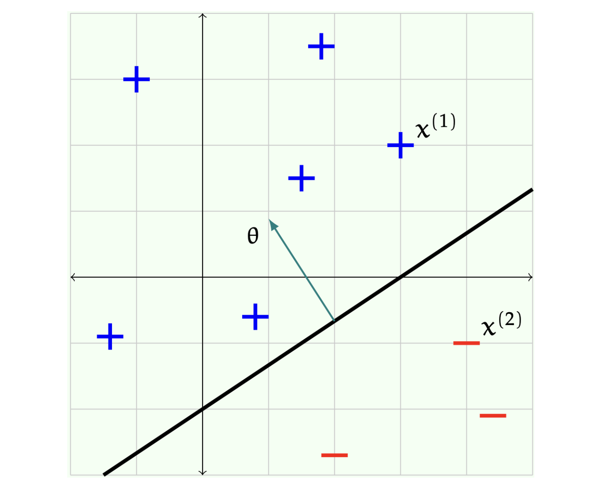

# 1. Introduction: Classification

* 기계 학습(Machine Learning)에서 가장 기본적이면서도 중요한 문제는 **분류(Classification)**입니다. 그중에서도 두 개의 클래스로 데이터를 구분하는 **이진 분류(Binary Classification)**는 다양한 알고리즘의 기초가 됩니다.

* 이번 포스트에서는 분류 문제의 수학적 정의부터 시작하여, 가장 직관적인 모델인 **선형 분류기(Linear Classifier)**의 작동 원리와 기하학적 의미를 살펴보고, 학습 알고리즘을 평가하는 방법론인 **Cross-Validation**까지 다룹니다.

## 1.1 The Classification Problem

* 이진 분류기는 데이터 공간 $\mathbb{R}^d$에 존재하는 입력 벡터 $x$를 $\{-1, +1\}$의 레이블로 매핑하는 함수입니다.
$$
h: \mathbb{R}^d \rightarrow \{-1, +1\}
$$
  * 여기서 $h$는 **가설(Hypothesis)** 또는 분류기(Classifier)를 의미합니다.

* 실제 문제에서는 원본 데이터(Raw Data)를 그대로 사용하기보다, 특징 추출(Feature Extraction) 과정을 거친 특징 벡터(Feature Vector)를 사용하는 경우가 많습니다. 이를 함수 $\varphi$로 표현하면 다음과 같습니다.

$$
x = \varphi(\text{raw input}) \in \mathbb{R}^d
$$

* 우리의 목표는 입력 $x$가 주어졌을 때, 적절한 레이블 $y$를 출력하는 함수 $h$를 찾는 것입니다.

## 1.2 Supervised Learning Setup

* 지도 학습(Supervised Learning) 환경에서는 입력과 정답이 쌍으로 이루어진 **학습 데이터셋(Training Dataset)** $\mathcal{D}_n$이 주어집니다.
$$
\mathcal{D}_n = \{(x^{(1)}, y^{(1)}), ..., (x^{(n)}, y^{(n)})\}
$$
  * $x^{(i)}$: $d \times 1$ 차원의 열 벡터(Column Vector)
  * $y^{(i)}$: $\{-1, +1\}$ 중 하나의 값을 가지는 레이블

* 이 데이터의 의미는 명확합니다. 우리가 학습한 가설 $h$에 입력 $x^{(i)}$를 넣었을 때, 실제 레이블인 $y^{(i)}$가 출력되기를 기대하는 것입니다.

# 2. Generalization & Error Metrics

* 분류기가 학습 데이터에 대해서만 잘 작동하는 것은 큰 의미가 없습니다. 우리가 진정으로 원하는 것은 **새로운 데이터(New Data)**에 대해 잘 작동하는 능력, 즉 **일반화(Generalization)** 능력입니다.

* 이를 위해 우리는 학습 데이터와 테스트 데이터가 **동일한 확률 분포에서 독립적으로 추출(i.i.d.)** 되었다고 가정합니다.

## 2.1 Training Error vs. Test Error

* 모델의 성능을 정량화하기 위해 **0-1 Loss** 기반의 에러를 정의합니다.

* **Training Error (학습 오차, $\mathcal{E}_n$)**:
  * 학습 데이터셋 내에서 분류기가 틀린 비율입니다.
    $$
    \mathcal{E}_n(h) = \frac{1}{n} \sum_{i=1}^{n} \mathbb{I}(h(x^{(i)}) \neq y^{(i)})
    $$
  * 여기서 $\mathbb{I}(\cdot)$는 조건이 참이면 1, 거짓이면 0을 반환하는 지시 함수(Indicator Function)입니다.

* **Test Error (테스트 오차, $\mathcal{E}$)**:
  * 학습에 사용되지 않은 새로운 데이터 $n"$개에 대한 오차입니다. 일반화 성능을 측정하는 지표가 됩니다.
    $$
    \mathcal{E}(h) = \frac{1}{n"} \sum_{i=n+1}^{n+n"} \mathbb{I}(h(x^{(i)}) \neq y^{(i)})
    $$

## 2.2 Hypothesis Class ($\mathcal{H}$)

* 학습 알고리즘은 가능한 모든 분류기의 집합인 **가설 공간(Hypothesis Class, $\mathcal{H}$)** 중에서 최적의 $h$를 찾아내는 과정입니다.

$$
\mathcal{D}_n \xrightarrow{\text{Learning Algorithm}(\mathcal{H})} h \in \mathcal{H}
$$

* $\mathcal{H}$의 선택은 테스트 에러에 큰 영향을 미칩니다. $\mathcal{H}$가 너무 복잡하면 과적합(Overfitting)의 위험이 있고, 너무 단순하면 데이터의 패턴을 충분히 학습하지 못할 수 있습니다. 따라서 일반화 성능을 높이기 위해 $\mathcal{H}$의 표현력(Expressiveness)을 적절히 제한하는 것이 중요합니다.

# 3. Linear Classifiers

* 선형 분류기는 데이터 공간을 **초평면(Hyperplane)**으로 나누어 클래스를 구분하는 모델입니다.

## 3.1 Definition

* 선형 분류기는 파라미터 벡터 $\theta \in \mathbb{R}^d$와 스칼라 오프셋(offset) $\theta_0 \in \mathbb{R}$에 의해 정의됩니다. 즉, 가설 공간 $\mathcal{H}$는 $\mathbb{R}^{d+1}$ 공간의 벡터들로 구성됩니다.

* 분류 함수는 다음과 같이 정의됩니다.
$$
h(x; \theta, \theta_0) = \text{sign}(\theta^\top x + \theta_0) = 
\begin{cases} 
+1 & \text{if } \theta^\top x + \theta_0 > 0 \\
-1 & \text{otherwise}
\end{cases}
$$
  * $\theta^\top x$: 두 벡터의 내적(Dot Product)으로, 결과는 스칼라입니다.
  * $\text{sign}(\cdot)$: 입력이 양수이면 +1, 그렇지 않으면(0 포함) -1을 반환합니다.

## 3.2 Geometric Interpretation

* 기하학적으로 $\theta$와 $\theta_0$는 $d$차원 공간 $\mathbb{R}^d$를 두 개의 반공간(Half-space)으로 나누는 **초평면(Hyperplane)**을 결정합니다.

* **Decision Boundary (결정 경계)**: $\theta^\top x + \theta_0 = 0$ 인 지점들의 집합입니다.
* **Normal Vector ($\theta$)**: 초평면에 수직인 법선 벡터입니다. $\theta$가 가리키는 방향에 있는 반공간은 **Positive (+)**로, 반대편은 **Negative (-)**로 분류됩니다.
* **Offset ($\theta_0$)**: 초평면이 원점에서 얼마나 떨어져 있는지를 결정합니다.

## 3.3 Example Calculation

* 구체적인 예시를 통해 계산 과정을 살펴보겠습니다.
  * 파라미터: $\theta = \begin{bmatrix} -1 \\ 1.5 \end{bmatrix}, \quad \theta_0 = 3$
  * 데이터 포인트 1: $x^{(1)} = \begin{bmatrix} 3 \\ 2 \end{bmatrix}$
  * 데이터 포인트 2: $x^{(2)} = \begin{bmatrix} 4 \\ -1 \end{bmatrix}$

* **Case 1: $x^{(1)}$ 분류**

$$
\begin{aligned}
h(x^{(1)}) &= \text{sign}\left( \begin{bmatrix} -1 & 1.5 \end{bmatrix} \begin{bmatrix} 3 \\ 2 \end{bmatrix} + 3 \right) \\
&= \text{sign}((-1 \times 3) + (1.5 \times 2) + 3) \\
&= \text{sign}(-3 + 3 + 3) \\
&= \text{sign}(3) = +1
\end{aligned}
$$

* **Case 2: $x^{(2)}$ 분류**

$$
\begin{aligned}
h(x^{(2)}) &= \text{sign}\left( \begin{bmatrix} -1 & 1.5 \end{bmatrix} \begin{bmatrix} 4 \\ -1 \end{bmatrix} + 3 \right) \\
&= \text{sign}((-1 \times 4) + (1.5 \times -1) + 3) \\
&= \text{sign}(-4 - 1.5 + 3) \\
&= \text{sign}(-2.5) = -1
\end{aligned}
$$

* 위 계산을 통해 $x^{(1)}$은 양성 클래스, $x^{(2)}$는 음성 클래스로 분류됨을 확인할 수 있습니다.

> **Think Deeper:**
>
> 1.  **법선 벡터 찾기**: 결정 경계에 수직인 벡터는 무엇인가? $\rightarrow$ 바로 $\theta$ 입니다.
> 2.  **분류 반전시키기**: 결정 경계(직선)의 위치는 그대로 두고, 모든 (+) 포인트를 (-)로, (-) 포인트를 (+)로 분류하려면 어떻게 해야 할까요?
>     * $\theta$와 $\theta_0$의 부호를 모두 반대로 바꾸면 됩니다 ($-\theta, -\theta_0$).
>     * 부등호의 방향이 반대가 되어 $\text{sign}$ 함수의 결과가 역전되기 때문입니다.

# 4. Learning Algorithms

* 그렇다면 최적의 $\theta$와 $\theta_0$는 어떻게 찾을 수 있을까요? 가장 단순한 형태의 알고리즘부터 살펴보겠습니다.

## 4.1 Algorithm 1: Random Linear Classifier

* 매우 단순한 접근법은 무작위로 여러 개의 가설을 생성한 뒤, 학습 데이터에서의 에러(Training Error)가 가장 낮은 것을 선택하는 것입니다.

* **Algorithm: `Random-Linear-Classifier`($\mathcal{D}_n, k, d$)**
  * 1.  Loop `j` from 1 to `k`:
      * $\mathbb{R}^d$와 $\mathbb{R}$에서 무작위로 파라미터 $(\theta^{(j)}, \theta_0^{(j)})$를 샘플링합니다.
  * 2.  각 $j$에 대해 학습 에러 $\mathcal{E}_n(\theta^{(j)}, \theta_0^{(j)})$를 계산합니다.
  * 3.  학습 에러를 최소화하는 인덱스 $j^*$를 찾습니다:
      $$j^* = \arg \min_{j \in \{1, ..., k\}} \mathcal{E}_n(\theta^{(j)}, \theta_0^{(j)})$$
  * 4.  최적의 파라미터 $(\theta^{(j^*)}, \theta_0^{(j^*)})$를 반환합니다.

> **Study Question:** $k$가 증가하면 학습 에러 $\mathcal{E}_n$은 어떻게 될까요?
> 일반적으로 $k$가 커질수록 더 많은 가설을 탐색하므로, 운 좋게 좋은 분류기를 찾을 확률이 높아져 학습 에러는 감소하는 경향이 있습니다. 하지만 이것이 테스트 에러(일반화 성능)의 감소를 보장하지는 않습니다.

# 5. Evaluating Learning Algorithms

* 학습된 가설 $h$의 성능을 평가할 때는 여러 변동성(Variability) 요인을 고려해야 합니다.
  * 1.  어떤 학습 데이터 $\mathcal{D}_n$이 선택되었는가?
  * 2.  어떤 테스트 데이터가 선택되었는가?
  * 3.  알고리즘 내부의 무작위성(예: Random Initialization)

* 따라서 단 한 번의 학습과 테스트로 알고리즘을 평가하는 것은 위험합니다.

## 5.1 Algorithm 2: Cross-Validation (교차 검증)

* 데이터가 제한적인 상황에서 데이터를 재사용하면서도 신뢰성 있게 알고리즘을 평가하는 방법으로 **K-Fold Cross-Validation**이 있습니다. (여기서 $k$는 앞선 알고리즘의 반복 횟수와는 다른 의미입니다.)

* **Algorithm: `Cross-Validate`($\mathcal{D}, k$)**
  * 1.  전체 데이터 $\mathcal{D}$를 대략 같은 크기를 가진 $k$개의 조각(Chunk) $\mathcal{D}_1, \mathcal{D}_2, ..., \mathcal{D}_k$로 나눕니다.
  * 2.  Loop `i` from 1 to `k`:
      * $\mathcal{D}_i$를 제외한 나머지 데이터 $\mathcal{D} \setminus \mathcal{D}_i$로 가설 $h_i$를 학습합니다.
      * 제외해둔 $\mathcal{D}_i$를 테스트 셋으로 사용하여 에러 $\mathcal{E}_i(h_i)$를 계산합니다.
  * 3.  계산된 $k$개의 에러의 평균을 반환합니다.
      $$\text{CV Error} = \frac{1}{k} \sum_{i=1}^{k} \mathcal{E}_i(h_i)$$

> **핵심 통찰 (Key Insight):**
> Cross-Validation은 특정한 하나의 가설 $h$를 평가하는 것이 아닙니다. 이 과정은 **가설을 만들어내는 "학습 알고리즘" 자체의 성능**을 평가하는 것입니다. 최종적으로 우리가 사용할 모델은 전체 데이터를 사용하여 다시 학습시킨 결과물이 됩니다.