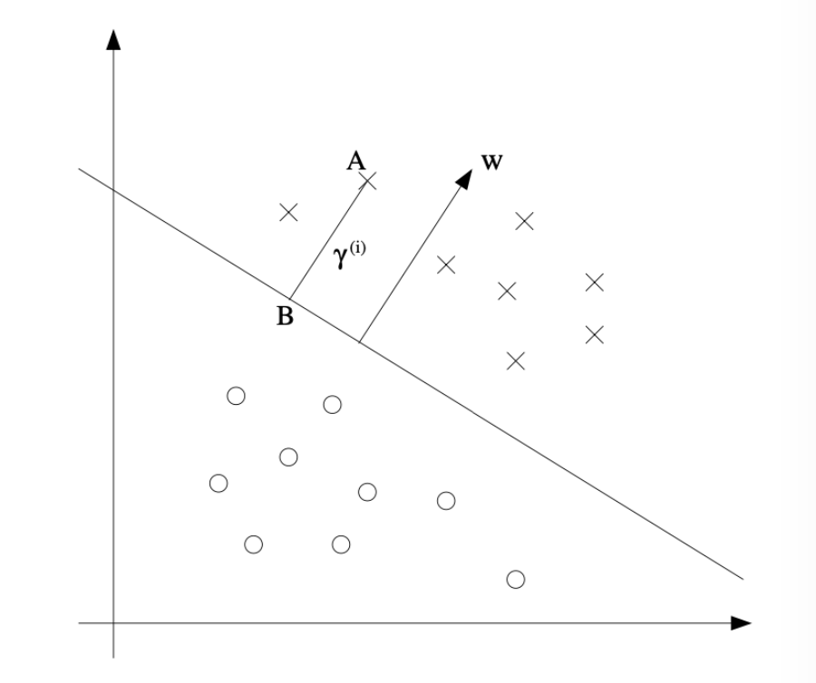

# 1. Introduction: 서포트 벡터 머신(SVM)의 개요

* 서포트 벡터 머신(Support Vector Machines, 이하 SVM)은 기계학습 분야에서 현존하는 최고의 "Off-the-shelf(사전 훈련 없이 즉시 사용할 수 있는)" 지도 학습 알고리즘 중 하나로 평가받습니다. 복잡한 데이터 분포에서도 강력한 일반화 성능을 보여주며, 다양한 산업 및 연구 분야에서 널리 활용되고 있습니다.

* SVM의 동작 원리를 온전히 이해하기 위해서는 다음과 같은 핵심 주제들을 순차적으로 파악해야 합니다:
  * **마진(Margins)**: 데이터를 분리할 때 단순히 나누는 것을 넘어, 가능한 한 큰 "여백(gap)"을 두고 분리하려는 직관.
  * **최적 마진 분류기(The optimal margin classifier)와 라그랑주 쌍대성(Lagrange duality)**: 마진을 최대화하는 최적화 문제를 수학적으로 정의하고 푸는 과정.
  * **커널 기법(Kernels)**: 무한 차원과 같은 매우 높은 고차원 특성 공간(feature space)에서 SVM을 효율적으로 적용할 수 있게 해주는 수학적 트릭.
  * **SMO 알고리즘**: SVM의 최적화 문제를 실제로 빠르게 연산하고 구현할 수 있게 해주는 알고리즘.

* 이번 포스트에서는 SVM의 가장 기초가 되는 **마진의 직관적 의미**와 이를 수학적으로 공식화한 **최적 마진 분류기**의 도출 과정에 집중하여 정리해 보겠습니다.

---

# 2. Margins: 마진에 대한 직관

* SVM의 철학을 이해하기 위해, 우리가 이미 잘 알고 있는 **로지스틱 회귀(Logistic Regression)** 모델부터 시작해 보겠습니다. 
* 로지스틱 회귀에서 데이터 $x$가 주어졌을 때 클래스 $y=1$일 확률 $p(y=1|x;\theta)$는 시그모이드 함수 $g(\cdot)$를 사용하여 다음과 같이 모델링됩니다:

$$h_\theta(x) = g(\theta^\top x)$$

* 이때 모델은 $h_\theta(x) \ge 0.5$일 때 (즉, $\theta^\top x \ge 0$일 때) 클래스 "1"로 예측합니다.

## 2.1. 분류의 "자신감(Confidence)"

* 긍정적 훈련 예제(Positive training example, $y=1$)를 가정해 봅시다. 
* $\theta^\top x$의 값이 커질수록 $h_\theta(x)$의 값(확률) 역시 커지며, 이는 모델이 해당 데이터의 레이블을 1로 예측하는 데 있어 **"자신감(degree of confidence)"**이 높다는 것을 의미합니다. 즉, $\theta^\top x \gg 0$일 때 우리는 모델이 $y=1$이라는 예측에 대해 매우 확신하고 있다고 생각할 수 있습니다. 
* 반대로 부정적 예제($y=0$)에 대해서는 $\theta^\top x \ll 0$일 때 $y=0$이라는 예측에 강한 확신을 가집니다.

* 결과적으로, 훈련 데이터에 대한 **"좋은 적합(Good fit)"**이란 단순히 예측을 맞추는 것을 넘어 다음과 같은 조건을 만족하는 상태입니다:
  * $y^{(i)}=1$일 때마다 $\theta^\top x^{(i)} \gg 0$ 
  * $y^{(i)}=0$일 때마다 $\theta^\top x^{(i)} \ll 0$ 

* 우리는 이러한 "분류의 자신감"을 수학적으로 엄밀하게 다루기 위해 **함수적 마진(Functional margins)**이라는 개념을 도입하게 됩니다.

* 위 그림에서 보듯, 점 A는 결정 경계에서 멀리 떨어져 있어 모델이 예측을 매우 확신할 수 있는 반면, 점 C는 경계와 매우 가까워 모델의 예측이 상대적으로 불안정합니다. 우리의 목표는 모든 훈련 예제에 대해 정확하면서도 **"확신에 찬(confident)"** 예측을 할 수 있는, 즉 모든 데이터를 결정 경계로부터 최대한 멀리 떨어뜨리는(마진을 최대화하는) 결정 경계를 찾는 것입니다.

---

# 3. Notation: 새로운 표기법의 도입

* 본격적으로 마진을 수학적으로 정의하기 전에, SVM에서 널리 사용되는 표기법(Notation)으로 전환하겠습니다.
  * 1.  **클래스 레이블의 변경**: 기존의 $\{0, 1\}$ 대신 $y \in \{-1, 1\}$을 사용합니다. 이는 수식 전개를 훨씬 깔끔하게 만들어줍니다.
  * 2.  **파라미터의 분리**: 파라미터 벡터 $\theta$를 가중치 벡터 $w$와 편향(절편) $b$로 분리합니다.
      * $b$는 기존의 $\theta_0$ (Intercept term) 역할을 명시적으로 분리하여 담당합니다.
      * $w$는 기존의 $[\theta_1 ... \theta_d]^\top$ 역할을 담당합니다.
  * 3.  **예측 함수의 정의**: 로지스틱 회귀처럼 $p(y=1)$의 확률값을 추정하는 중간 단계를 거치지 않고, 퍼셉트론(Perceptron) 알고리즘과 같이 직접적으로 1 또는 -1을 예측합니다. 모델의 가설 함수는 다음과 같이 정의됩니다:

$$h_{w,b}(x) = g(w^\top x + b)$$
$$g(z) = \begin{cases} 1 & \text{if } z \ge 0, \\ -1 & \text{otherwise} \end{cases}$$

---

# 4. Functional and Geometric Margins

* 데이터 포인트가 결정 경계로부터 얼마나 안전하게(확신을 가지고) 분류되었는지를 측정하는 두 가지 지표를 정의합니다.

## 4.1. 함수적 마진 (Functional Margin)

* 주어진 훈련 예제 $(x^{(i)}, y^{(i)})$에 대한 파라미터 $(w, b)$의 **함수적 마진(Functional margin)** $\hat{\gamma}^{(i)}$는 다음과 같이 정의됩니다:

$$\hat{\gamma}^{(i)} = y^{(i)}(w^\top x^{(i)} + b)$$

* 함수적 마진이 크다는 것은 우리의 예측이 올바르고 그 확신도 크다는 것을 의미합니다. 
  * 만약 실제 레이블이 $y^{(i)}=1$이라면, 예측이 정확하고 확신이 크기 위해서는 $w^\top x^{(i)} + b$가 매우 큰 양수여야 합니다.
  * 만약 실제 레이블이 $y^{(i)}=-1$이라면, $w^\top x^{(i)} + b$가 매우 큰 음수여야 두 값을 곱했을 때 큰 양수가 도출됩니다.
* 따라서, $y^{(i)}(w^\top x^{(i)} + b) > 0$ 이라는 조건은 모델이 해당 데이터를 정확하게 분류했음을 나타냅니다.

* **전체 데이터셋에 대한 함수적 마진** $\hat{\gamma}$는 개별 데이터들의 마진 중 가장 작은 값(최악의 경우)으로 정의합니다:
$$\hat{\gamma} = \min_{i=1,...,n} \hat{\gamma}^{(i)}$$

### 함수적 마진의 한계: 정규화의 필요성
* 함수적 마진만으로는 최적화에 문제가 발생할 수 있습니다. 만약 파라미터 $(w, b)$를 2배씩 스케일링하여 $(2w, 2b)$로 바꾼다고 가정해 봅시다.
* 가설 함수 $h_{w,b}(x) = g(w^\top x + b)$는 단순히 부호(sign)만 확인하므로 결정 경계의 기하학적 위치나 모델의 실제 예측 결과는 전혀 변하지 않습니다.
* 하지만 계산된 함수적 마진 값은 $y^{(i)}(2w^\top x^{(i)} + 2b) = 2\hat{\gamma}^{(i)}$가 되어 원래보다 2배 커지게 됩니다. 
즉, 파라미터의 스케일만 키워도(실제 분류 성능은 그대로인데) 함수적 마진을 무한대로 키울 수 있는 문제가 발생합니다. 이를 해결하기 위해 파라미터에 대한 **정규화(Normalization)**가 필요해지며, 통상적으로 $||w||_2 = 1$이 되도록 $\left(\frac{w}{||w||_2}, \frac{b}{||w||_2}\right)$ 형태로 크기를 강제하는 방식을 고려할 수 있습니다.

## 4.2. 기하학적 마진 (Geometric Margin)

* 이러한 스케일 의존성 문제를 해결하고, 실제 공간상에서 데이터 포인트가 결정 경계($w^\top x + b = 0$)로부터 떨어진 **유클리디안 거리(Euclidean distance)**를 측정하는 것이 바로 **기하학적 마진**입니다.

* 위 그림을 참고하여, 클래스가 양성($y^{(i)}=1$)인 데이터 포인트 A(좌표 $x^{(i)}$)가 결정 경계로부터 떨어진 거리를 $\gamma^{(i)}$라고 합시다. 
* 벡터 $w$는 결정 경계 $w^\top x + b = 0$에 수직인 법선 벡터입니다. 법선 벡터의 방향을 나타내는 단위 벡터는 $\frac{w}{||w||}$가 됩니다.
* 따라서 점 A에서 결정 경계를 향해 수선의 발을 내린 점 B의 좌표는 원래 위치 $x^{(i)}$에서 $\gamma^{(i)}$ 길이만큼 단위 벡터 $\frac{w}{||w||}$의 반대 방향으로 이동한 것이므로 다음과 같습니다:
$$\text{Point B} = x^{(i)} - \gamma^{(i)} \cdot \frac{w}{||w||}$$

* 점 B는 정확히 결정 경계 위에 존재하므로, 결정 경계 방정식에 대입하면 등식이 성립해야 합니다:
$$w^\top \left( x^{(i)} - \gamma^{(i)} \frac{w}{||w||} \right) + b = 0 \quad \text{[Eq.1]}$$

* 이제 [Eq.1]을 $\gamma^{(i)}$에 대해 정리해 보겠습니다. 전개 과정을 살펴보면 다음과 같습니다.
$$w^\top x^{(i)} - \gamma^{(i)} \frac{w^\top w}{||w||} + b = 0$$

* 여기서 $w^\top w = ||w||^2$ 이므로 식은 다음과 같이 간소화됩니다.
$$w^\top x^{(i)} - \gamma^{(i)} ||w|| + b = 0$$
$$\gamma^{(i)} ||w|| = w^\top x^{(i)} + b$$
$$\gamma^{(i)} = \frac{w^\top x^{(i)} + b}{||w||} = \left(\frac{w}{||w||}\right)^\top x^{(i)} + \frac{b}{||w||}$$

* 위 도출은 $y^{(i)}=1$일 때를 가정한 것입니다. 만약 $y^{(i)}=-1$인 경우 거리는 양수여야 하므로 앞에 음수 기호가 붙어야 합니다. 이를 $y^{(i)}$를 곱해줌으로써 모든 훈련 예제 $(x^{(i)}, y^{(i)})$에 대해 일반화된 **기하학적 마진** 공식을 얻게 됩니다:

$$\gamma^{(i)} = y^{(i)} \left( \left(\frac{w}{||w||}\right)^\top x^{(i)} + \frac{b}{||w||} \right)$$

* **기하학적 마진의 중요한 특징**
  * **Scale Invariance (스케일 불변성)**: 파라미터 $w$와 $b$를 어떤 상수배로 리스케일링하더라도, 분모의 $||w||$ 역시 동일하게 스케일링되므로 기하학적 마진 값 자체는 변하지 않습니다.
  * **함수적 마진과의 관계**: 만약 $||w|| = 1$로 정규화된다면, 식의 분모가 1이 되므로 기하학적 마진과 함수적 마진은 정확히 일치하게 됩니다.

---

# 5. The Optimal Margin Classifier: 최적 마진 분류기 공식화

* 우리의 최종 목표는 훈련 데이터와 결정 경계 사이의 기하학적 마진 중 최솟값(가장 가까운 거리)을 **최대화(maximize)**하는 결정 경계를 찾는 것입니다. 이를 "최적 마진 분류기"라고 부릅니다. 

* 초기 최적화 문제는 다음과 같이 공식화할 수 있습니다:
$$\max_{\gamma, w, b} \gamma$$
$$\text{s.t.} \quad y^{(i)}(w^\top x^{(i)} + b) \ge \gamma, \quad i=1,...,n$$
$$||w|| = 1$$
  * 조건 $||w||=1$은 기하학적 마진과 함수적 마진을 동일하게 만들어주기 위함입니다.

* 하지만 제약조건 $||w|| = 1$은 원이나 구의 표면을 나타내며, 이는 수학적으로 **비볼록(non-convex)** 제약이므로 최적화 해를 구하기가 매우 까다롭습니다. 

## 5.1. 최적화 문제의 변환 (Convex Transformation)

* 이를 해결하기 위해 문제를 변형합니다. 기하학적 마진 $\gamma$를 함수적 마진 $\hat{\gamma}$와 노름 $||w||$의 관계인 $\frac{\hat{\gamma}}{||w||}$로 치환합니다. 그러면 최적화 문제는 다음과 같이 바뀝니다:
$$\max_{\hat{\gamma}, w, b} \frac{\hat{\gamma}}{||w||}$$
$$\text{s.t.} \quad y^{(i)}(w^\top x^{(i)} + b) \ge \hat{\gamma}, \quad i=1,...,n$$

* 이제 성가신 $||w||=1$ 제약조건이 사라졌습니다. 

* 여기에 앞서 다룬 기하학적 마진의 **스케일 불변성(Scale Invariance)**을 기가 막히게 활용합니다. $w$와 $b$를 스케일링하더라도 목적함수나 제약조건의 본질은 변하지 않으므로, 우리는 편의상 함수적 마진의 최솟값이 정확히 1이 되도록($\hat{\gamma} = 1$) 파라미터의 스케일을 조정할 수 있습니다. 

* $\hat{\gamma} = 1$을 대입하면 목적함수는 $\frac{1}{||w||}$을 최대화하는 문제가 됩니다. $\frac{1}{||w||}$을 최대화하는 것은 $||w||^2$을 최소화하는 것과 수학적으로 완전히 동일합니다. 미분 계산의 편의를 위해 앞에 $\frac{1}{2}$을 붙여주면, 최종적인 SVM의 최적화 문제는 다음과 같은 깔끔한 형태로 완성됩니다:

$$\min_{w,b} \frac{1}{2} ||w||^2$$
$$\text{s.t.} \quad y^{(i)}(w^\top x^{(i)} + b) \ge 1, \quad i=1,...,n$$

* 이 형태가 바로 SVM 최적 마진 분류기의 표준형(Primal form)입니다. 이 식은 볼록 목적 함수(Convex objective function)와 선형 제약 조건(Linear constraints)을 가지는 전형적인 **이차 계획법(Quadratic Programming, QP)** 문제로 변환되었으며, 널리 사용되는 상용 QP Solver를 통해 글로벌 최적해(Global optimum)를 매우 효율적이고 안정적으로 찾아낼 수 있습니다.