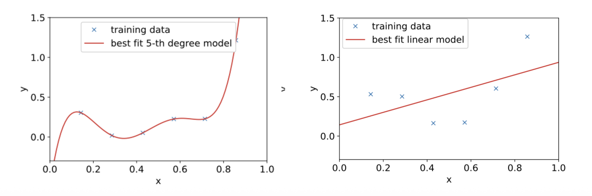

# 1. 들어가며: 왜 머신러닝에서 일반화(Generalization)가 중요한가?

* 머신러닝 모델을 학습시킬 때 우리의 진짜 목적은 무엇일까요? 주어진 학습 데이터를 완벽하게 외우는 것이 아니라, **한 번도 본 적 없는 새로운 데이터(Unseen data)에 대해 정확한 예측을 내리는 것**입니다. 이번 포스트에서는 모델이 새로운 데이터에 얼마나 잘 적응하는지를 나타내는 "일반화"의 개념과, 이를 방해하는 요인들을 수학적으로 철저히 분해해 보겠습니다.

# 2. 훈련 오차(Training Error)와 테스트 오차(Test Error)

* 머신러닝에서 성능을 평가하기 위해 우리는 두 가지 오차를 정의합니다.
  * **훈련 오차 (Training Error)**: 모델이 학습에 사용된 데이터 $\{x^{(i)},y^{(i)}\}_{i=1}^{n}$에 대해 범하는 오차입니다. 일반적으로 평균 제곱 오차(MSE)와 같은 손실 함수(Loss function)를 사용하여 다음과 같이 계산합니다.
    $$J(\theta)=\frac{1}{n}\sum_{i=1}^{n}(y^{(i)}-h_{\theta}(x^{(i)}))^{2}$$ 
  * **테스트 오차 (Test Error)**: 학습 과정에서 보지 못한 새로운 테스트 예제들에 대한 오차입니다. 테스트 데이터 분포를 $\mathcal{D}$라고 할 때, 테스트 오차의 기댓값은 다음과 같이 정의됩니다.
    $$L(\theta)=\mathbb{E}_{(x,y)\sim\mathcal{D}}[(y-h_{\theta}(x))^{2}]$$ 

* 우리의 궁극적인 목표는 이 **테스트 오차를 최소화하는 것**입니다. 훈련 오차와 테스트 오차의 차이를 흔히 **일반화 격차(Generalization Gap)**라고 부릅니다.

# 3. 과적합(Overfitting)과 과소적합(Underfitting)

* 모델의 복잡도에 따라 두 가지 극단적인 문제가 발생할 수 있습니다.

* **과소적합 (Underfitting)**: 모델이 학습 데이터를 제대로 학습하지 못해 훈련 오차조차 높은 상태입니다. 위 그림의 단순 선형 모델처럼, 모델 자체의 표현력이 부족하여 발생합니다.
* **과적합 (Overfitting)**: 모델이 학습 데이터에는 매우 잘 작동하지만(훈련 오차가 낮음), 테스트 데이터에는 제대로 작동하지 않는 상태입니다. 5차 다항식 모델처럼 데이터의 노이즈까지 외워버려 일반화 성능이 떨어집니다.

# 4. 편향(Bias)과 분산(Variance)의 직관적 이해

* 과적합과 과소적합의 근본적인 원인을 이해하기 위해, 데이터를 생성하는 진짜 함수(Ground Truth)를 $h^*(x)$라고 가정해 봅시다. 
* 관측된 데이터 $y^{(i)}$는 이 진짜 함수에 관측 노이즈 $\xi^{(i)}$가 더해진 형태입니다.
$$y^{(i)}=h^{*}(x^{(i)})+\xi^{(i)}$$ 
* 여기서 노이즈 $\xi^{(i)}\sim \mathcal{N}(0,\sigma^{2})$를 따릅니다. 

* 이 $h^*(x)$를 복원하기 위해 "단순한 선형 모델"과 "복잡한 5차 다항식 모델"을 사용해 본다고 가정합시다.

## 4.1. 편향 (Bias)
* **편향(Bias)**은 (무한히) 방대한 양의 학습 데이터로 모델을 학습시켰을 때조차, 예측값이 실제 정답(Ground Truth)과 얼마나 떨어져 있는지를 의미합니다. 
* **선형 모델의 경우**: 아무리 데이터를 많이 주거나 노이즈를 제거하더라도 데이터의 비선형성(2차 함수 형태)을 표현할 수 없으므로, 태생적으로 **큰 편향**을 가집니다.
* **5차 다항식 모델의 경우**: 데이터가 충분히 많아지면 불필요한 고차항의 계수($\theta_5=\theta_4=\theta_3=0$)를 0으로 만들어 실제 함수에 근접할 수 있으므로 **편향이 작습니다**.

## 4.2. 분산 (Variance)
* **분산(Variance)**은 유한하고 작은 크기의 학습 데이터셋이 주어질 때마다, 학습된 모델들이 서로 얼마나 다르게 나타나는지(변동성)를 의미합니다.
* 복잡한 **5차 다항식 모델**은 주어지는 몇 개의 샘플 데이터에 극도로 민감하게 반응하여 예측 곡선이 크게 요동칩니다. 즉, **큰 분산**을 가집니다. 

* 따라서 모델의 복잡도가 증가할수록 편향은 감소하지만 분산은 증가하는 **편향-분산 트레이드오프(Bias-Variance Tradeoff)**가 발생합니다. 최적의 일반화 성능(가장 낮은 테스트 오차)을 얻기 위해서는 이 둘 사이의 균형을 맞추는 최적의 모델(예: 2차 다항식 모델)을 찾아야 합니다.

---

# 5. 편향-분산 분해 (Bias-Variance Decomposition) 수학적 유도

* 이 트레이드오프를 수학적으로 완벽히 증명해 보겠습니다. 특정 데이터셋 $S$로 학습된 모델을 $\hat{h}_S(x)$라 하고, 테스트 예제 $(x, y)$에 대한 기대 테스트 오차(Mean Squared Error)를 구해보겠습니다.
$$MSE(x)=\mathbb{E}_{S,\xi}[(y-\hat{h}_{S}(x))^{2}]$$ 

### 1단계: 노이즈 분리
* 테스트 정답 $y = h^*(x) + \xi$를 대입합니다.
$$MSE(x)=\mathbb{E}[(\xi+(h^{*}(x)-\hat{h}_{S}(x)))^{2}]$$ 
* 식을 전개하면 $$\mathbb{E}[\xi^2] + 2\mathbb{E}[\xi(h^*(x)-\hat{h}_S(x))] + \mathbb{E}[(h^*(x)-\hat{h}_S(x))^2]$$가 됩니다. 
* 이때 관측 노이즈 $\xi$는 모델 학습 과정과 독립이며 기댓값 $\mathbb{E}[\xi]=0$이므로 가운데 교차항은 0이 됩니다.
* 따라서, 식은 다음과 같이 정리됩니다.
$$=\sigma^{2}+\mathbb{E}[(h^{*}(x)-\hat{h}_{S}(x))^{2}]$$ 

### 2단계: 평균 모델 도입
* 이제 무한히 많은 데이터셋을 추출해 모델을 학습시켰을 때의 **평균 모델** $h_{avg}(x)=\mathbb{E}_{S}[\hat{h}_{S}(x)]$를 정의합니다.
* 남은 오차 항에 $h_{avg}(x)$를 더하고 빼줍니다.
$$\mathbb{E}[(h^{*}(x) - h_{avg}(x) + h_{avg}(x) -\hat{h}_{S}(x))^{2}]$$
* 이를 전개하면 다음과 같습니다.
$$= \mathbb{E}[(h^*(x) - h_{avg}(x))^2] + 2\mathbb{E}[(h^*(x) - h_{avg}(x))(h_{avg}(x) - \hat{h}_S(x))] + \mathbb{E}[(h_{avg}(x) - \hat{h}_S(x))^2]$$

### 3단계: 편향과 분산의 분리
* 여기서 핵심은 $h^*(x)$와 $h_{avg}(x)$는 데이터셋 $S$에 대해 상수로 취급된다는 점입니다. 즉, 교차항에서 $\mathbb{E}_S[h_{avg}(x) - \hat{h}_S(x)] = h_{avg}(x) - \mathbb{E}_S[\hat{h}_S(x)] = 0$이 되어 교차항이 날아갑니다.

* 최종적으로 우리는 테스트 오차를 다음 세 가지 항의 합으로 완벽히 분해할 수 있습니다.
$$MSE(x) = \sigma^{2}+(h^{*}(x)-h_{avg}(x))^{2}+Var(\hat{h}_{S}(x))$$ 

* 1. **$\sigma^{2}$**: 피할 수 없는 데이터 자체의 본질적인 노이즈 (Unavoidable variance) 
* 2. **$(h^{*}(x)-h_{avg}(x))^{2}$**: **편향의 제곱 (Bias$^2$)** 
* 3. **$Var(\hat{h}_{S}(x))$**: **분산 (Variance)** 

# 6. 현대 딥러닝의 역설: 이중 하강(Double Descent) 현상

* 전통적인 통계학(Classical regime)에서는 모델의 매개변수 수(복잡도)가 증가할수록 편향은 줄지만 분산이 급증하여 어느 순간부터 테스트 오차가 상승하는 U자형 트레이드오프 곡선을 진리라 여겼습니다.

* 하지만 딥러닝과 같은 **현대 머신러닝(Modern regime)**에서는 매우 흥미로운 현상이 관찰됩니다. 
* 바로 **이중 하강(Double Descent)** 현상입니다.
* 1. **보간 임계점 (Interpolation Threshold)**: 모델의 매개변수 수($d$)와 학습 데이터 샘플 수($n$)가 비슷해지는 지점($n \approx d$)에서 테스트 오차가 치솟아 정점을 찍습니다. 
* 2. **과다 매개변수화 (Over-parameterization)**: 이 지점을 지나 파라미터 수가 데이터 수보다 훨씬 많아지면, 놀랍게도 모델이 과적합되는 것이 아니라 오히려 테스트 오차가 다시 하락하며 더 나은 일반화 성능을 보여줍니다. 
* 3. 이와 유사하게 데이터 샘플 수에 따른 **Sample-wise Double Descent** 현상도 관찰되며, 이는 정규화(Regularization) 기법을 적절히 튜닝하여 완화할 수 있습니다.

* **흥미로운 점:** 모델 복잡도의 기준을 단순한 "파라미터의 수"가 아니라 "모델 가중치의 크기(Norm)"로 변경하여 테스트 오차와의 관계를 그려보면, 이중 하강 곡선이 사라지고 매끄러운 곡선을 띠게 됩니다. 이는 무작정 파라미터를 늘리는 것이 능사가 아니라, 모델이 학습하는 가중치 공간의 구조적 특성이 일반화에 중요한 역할을 함을 암시합니다.