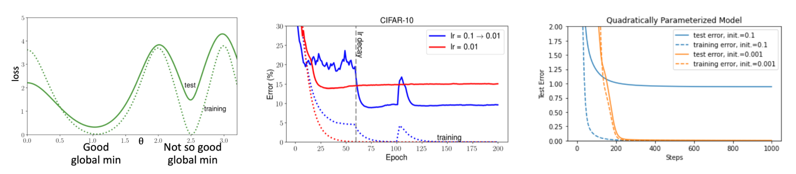

# 1. 들어가며: 왜 일반화(Generalization)인가?

* 기계학습 모델을 학습할 때 우리가 진정으로 던져야 할 질문은 다음과 같습니다. 

> "학습 데이터(Training set)에서 성능이 좋다고 해서, 실제 테스트 데이터(Test error)에서도 성능이 좋을 것이라고 보장할 수 있는가?" 

* 본 포스트에서는 딥러닝을 포함한 기계학습 알고리즘이 성공적으로 동작하기 위한 조건과 편향-분산 트레이드오프(Bias-Variance Tradeoff)를 수학적으로 정형화하는 방법을 살펴봅니다. 

---

# 2. 표본 복잡도 한계 (Sample Complexity Bounds)

* 모델의 성능을 평가하기 위해, 가장 단순한 이진 분류 문제($y \in \{0, 1\}$)를 가정해 보겠습니다. 

## 2.1. 경험적 위험과 일반화 오차
* 분류기(Classifier) $h$의 성능을 측정하는 두 가지 주요 지표는 다음과 같습니다.
  * **경험적 위험(Empirical Risk / Training Error):** 학습 데이터 중 분류기가 오분류한 비율을 의미합니다.
    $$\hat{\epsilon}(h) = \frac{1}{n}\sum 1\{h(x^{(i)}) \ne y^{(i)}\}$$
  * **일반화 오차(Generalization Error):** 실제 데이터 분포 $\mathcal{D}$에서 오분류할 확률입니다.
    $$\epsilon(h) = P_{(x,y)\sim \mathcal{D}}(h(x) \ne y)$$ 

* 우리는 학습 데이터와 테스트 데이터가 동일한 분포를 따른다고 가정합니다. 학습 알고리즘은 보통 고려 가능한 모든 분류기의 집합인 **가설군(Hypothesis class) $\mathcal{H}$** 내에서, 경험적 위험을 최소화하는 최적의 분류기 $\hat{h}$를 찾습니다.
$$\hat{h} = \arg\min_{h \in \mathcal{H}} \hat{\epsilon}(h)$$ 

## 2.2. 오차 한계 유도 과정
* 유한한 개수의 가설군 $\mathcal{H} = \{h_1, \dots, h_k\}$가 주어졌을 때 ($|\mathcal{H}| = k$), $\hat{\epsilon}(h)$가 $\epsilon(h)$에 얼마나 가까운지 다음 두 가지 확률론적 보조정리를 활용하여 증명할 수 있습니다.
  * 1. **Union Bound:** 
  $$P(A_1 \cup \dots \cup A_k) \le P(A_1) + \dots + P(A_k)$$ 
  * 2. **Chernoff Bound:** $Z_1, \dots, Z_n \sim_{i.i.d.} \text{Bernoulli}(\phi)$이고 $\hat{\phi} = \frac{1}{n}\sum Z_i$일 때, 임의의 $\gamma > 0$에 대해 
  $$P(|\phi - \hat{\phi}| > \gamma) \le 2e^{-2\gamma^2 n}$$

* 어떤 특정 가설 $h_i$에 대해 오차 차이가 $\gamma$보다 클 사건을 $A_i$라고 정의해 봅시다.
  $$A_i := |\epsilon(h_i) - \hat{\epsilon}(h_i)| > \gamma$$
* Chernoff Bound에 의해 $$P(A_i) \le 2e^{-2\gamma^2 n}$$가 성립합니다.

* 이제 $\mathcal{H}$ 안에 오차 차이가 $\gamma$를 초과하는 가설이 **적어도 하나 존재할 확률**을 Union Bound로 구합니다.
$$P(\exists h \in \mathcal{H}, |\epsilon(h) - \hat{\epsilon}(h)| > \gamma) = P(A_1 \cup \dots \cup A_k)$$ 
$$\le \sum P(A_i) \le 2k e^{-2\gamma^2 n}$$ 

* 이 식의 양변을 1에서 빼어 부정을 취하면, **모든 가설의 오차가 $\gamma$ 이내일 확률**의 하한을 얻습니다.
$$P(\forall h \in \mathcal{H}, |\epsilon(h) - \hat{\epsilon}(h)| \le \gamma) \ge 1 - 2k e^{-2\gamma^2 n}$$ 

## 2.3. 편향-분산 트레이드오프의 증명
* 우변의 확률을 $1-\delta$로 치환하여 정리하면 다음과 같은 중요한 정리가 도출됩니다. 
* 확률 $1-\delta$ 이상으로 다음이 성립합니다.
$$\epsilon(\hat{h}) \le \min_{h \in \mathcal{H}} \epsilon(h) + 2\sqrt{\frac{1}{2n}\log\frac{2k}{\delta}}$$ 

* 위 식을 오차 범위 $\gamma$에 대해 샘플 수 $n$으로 정리하면, 필요한 **최소 데이터 수(Sample Complexity)**를 알 수 있습니다.
$$n \ge \frac{1}{2\gamma^2}\log\frac{2k}{\delta} = O\left(\frac{1}{\gamma^2}\log\frac{k}{\delta}\right)$$ 

* **해석:** 가설군의 크기 $k$를 늘리면 모델이 복잡해져 $\min_{h} \epsilon(h)$ (편향, Bias)은 작아지지만, 우측의 페널티 항인 $2\sqrt{\dots}$ (분산, Variance)은 커집니다. 이것이 바로 수학적으로 증명된 편향-분산 트레이드오프입니다.

---

# 3. 모델 파라미터 수와 VC 차원 (VC Dimension)

* 단순히 수학적 수식의 파라미터 개수로 모델의 복잡도를 정의하는 것은 위험합니다. 
* 예를 들어 선형 분류기 $h_\theta(x) = 1\{\theta_0 + \theta_1 x_1 + \dots + \theta_d x_d \ge 0\}$는 $d+1$개의 파라미터를 갖습니다. 그러나 $\theta_i$를 $(u_i^2 - v_i^2)$로 치환한 모델은 $2d+2$개의 파라미터를 갖지만, 수학적으로 완전히 동일한 분류기입니다. 

* 이러한 모순을 해결하기 위해 모델의 진정한 복잡도 척도인 **Vapnik-Chervonenkis (VC) 차원**을 도입합니다.

## 3.1. 산산조각 내기(Shattering)와 VC 차원
* 가설군 $\mathcal{H}$가 데이터 집합 $S = \{x^{(1)}, \dots, x^{(D)}\}$를 **Shatter**한다는 것은, $S$에 임의의 레이블 $\{y^{(1)}, \dots, y^{(D)}\}$이 주어지더라도 이를 완벽하게 맞추는 가설 $h \in \mathcal{H}$가 항상 존재한다는 뜻입니다.
* **VC 차원($VC(\mathcal{H})$)**은 $\mathcal{H}$가 Shatter할 수 있는 **가장 큰 데이터 집합의 크기**로 정의됩니다.

* 위 그림처럼 2차원 선형 분류기는 3개의 점에 대한 8가지 레이블링을 모두 구분할 수 있습니다. 하지만 4개의 점은 Shatter할 수 없으므로, 2차원 선형 분류기의 VC 차원은 3입니다 ($VC(\mathcal{H}) = 3$).

## 3.2. VC 차원을 이용한 일반화 정리
* VC 차원 $D$를 사용하면 기존의 오차 한계 정리를 무한 가설군에 대해서도 확장할 수 있습니다. 확률 $1-\delta$ 이상으로 다음이 성립합니다.
$$|\epsilon(h) - \hat{\epsilon}(h)| \le O\left(\sqrt{\frac{D}{n}\log\frac{n}{D} + \frac{1}{n}\log\frac{1}{\delta}}\right)$$
$$\epsilon(\hat{h}) \le \epsilon(h^*) + O\left(\sqrt{\frac{D}{n}\log\frac{n}{D} + \frac{1}{n}\log\frac{1}{\delta}}\right)$$ 

* 즉, 오차 차이를 $\gamma$ 이하로 만들기 위해 필요한 샘플 수 $n$은 VC 차원 $D$에 **선형적(Linear)**으로 비례합니다 ($n = O_{\gamma, \delta}(D)$). 대부분의 가설군에서 VC 차원은 모델 파라미터 수에 비례하므로, 최적 오차에 근접하기 위한 필요 훈련 데이터 수는 파라미터 수에 대략 선형적으로 증가함을 알 수 있습니다.

---

# 4. 정규화 (Regularization)

* 모델의 복잡도를 제한하여 과적합(Overfitting)을 방지하기 위해 비용 함수에 정규화 항(Regularizer)을 추가합니다.
$$J_\lambda(\theta) = J(\theta) + \lambda R(\theta)$$ 

* 여기서 $R(\theta)$는 음수가 아닌 정규화 함수이며, $J_\lambda$는 정규화된 손실(Regularized loss), $\lambda \ge 0$는 정규화 파라미터입니다. 데이터 적합도와 모델 복잡도 사이의 균형은 $\lambda$에 의해 결정됩니다. $\lambda=0$이면 원본 손실과 동일해지고, $\lambda$가 매우 크면 원본 손실이 무시됩니다.

* **L2 정규화 (Weight Decay):** 딥러닝에서 가장 널리 쓰이며, 커널 트릭과 호환됩니다.
  $$R(\theta) = \frac{1}{2}||\theta||_2^2$$
* **L1 정규화 (LASSO) / L0:** 본래 파라미터 내 비영(Non-zero) 요소의 수를 세는 $$R(\theta) = ||\theta||_0$$를 목표로 하지만 미분이 불가능하여, L1 노름인 $$R(\theta) = ||\theta||_1$$로 완화(Relaxation)하여 사용합니다. 파라미터 공간 구조를 제한하여 모델을 단순하게 만듭니다.

## 4.1. 가중치 감쇠 (Weight Decay)로서의 L2 정규화
* 경사하강법(Gradient Descent)에 L2 정규화를 적용해 보면 왜 이를 가중치 감쇠라고 부르는지 직관적으로 알 수 있습니다.
$$\theta \leftarrow \theta - \eta \nabla J_\lambda(\theta)$$ 
$$= \theta - \eta\lambda\theta - \eta \nabla J(\theta)$$ 
$$= (1 - \eta\lambda)\theta - \eta \nabla J(\theta)$$ 

* 즉, 경사(Gradient)를 따라 이동하기 전에 기존 가중치 $\theta$를 $(1 - \eta\lambda)$ 비율만큼 수축(Shrink/Decay)시키는 효과가 발생합니다.

## 4.2. 암묵적 정규화 효과 (Implicit Regularization)
* 최근 딥러닝 연구에서 주목받는 개념 중 하나는 **암묵적 정규화(Implicit Regularization)**입니다. 이는 손실 함수($J_\lambda$)에 명시적인 정규화 항($R(\theta)$)을 추가하지 않더라도, 우리가 선택한 최적화 알고리즘(Optimizer)의 특성이나 학습 설정이 파라미터에 특정 구조를 부여하여 결과적으로 모델의 일반화 성능을 높이는 현상을 말합니다.

* 전통적 머신러닝 vs. 딥러닝의 차이:
    * 전통적 설정: 손실 함수가 볼록(Convex)하여 고유한 전역 최솟값(Unique global minimum)을 갖는 경우가 많습니다. 이 경우 어떤 최적화기를 쓰든 결국 같은 지점에 도달하므로 최적화 알고리즘의 개입 여지가 적습니다.
    * 딥러닝 설정: 손실 함수 지형이 복잡하며, 훈련 손실을 0으로 만드는 전역 최솟값이 무수히 많이 존재할 수 있습니다. 이때 어떤 최적화 경로를 택하느냐에 따라 도달하는 지점이 달라지며, 훈련 손실은 동일하더라도 일반화 성능(테스트 오차)에서는 극적인 차이가 발생합니다.

* 경험적 분석 및 휴리스틱: 이러한 암묵적 정규화 효과를 극대화하여 더 나은 최소점(평평한 최소점, Flat Minima)으로 유도하기 위한 구체적인 방법론들은 다음과 같습니다:
  * 1. 높은 초기 학습률 및 스케줄링: 초기 학습률을 크게 설정하면 손실 지형에서 뾰족한 골짜기를 뛰어넘어 더 넓고 평평한 지역으로 이동할 확률이 높아집니다. 이후 학습률 감쇠(Learning rate decay)를 통해 해당 지역의 최저점으로 수렴시킵니다.
  * 2. 작은 가중치 초기화 (Smaller Initialization): 초기 파라미터 값을 작게 설정하는 것이 모델이 복잡한 패턴에 과적합되는 것을 막고, 더 나은 일반화 성능을 가진 지점으로 수렴하는 데 도움을 줍니다.
  * 3. 작은 배치 사이즈 (Smaller Batch Size): 미니 배치 크기를 작게 하면 경사하강법에 적절한 노이즈가 추가되어, 모델이 날카로운 최솟값(Sharp Minima)에 빠지지 않고 탈출하여 평평한 최소점으로 가도록 돕는 정규화 효과를 줍니다.
  * 4. 모멘텀(Momentum)의 활용: 관성을 이용한 최적화 방식은 지역 최솟값(Local Minima)이나 노이즈가 많은 지형을 효과적으로 통과하게 함으로써 더 견고한 최적점을 찾게 합니다.

* 위 도식은 명시적인 정규화 항(Regularizer)이 없더라도 최적화 과정 자체가 모델의 일반화 성능에 어떻게 영향을 미치는지(암묵적 정규화)를 세 가지 관점에서 시각적으로 보여줍니다. 
  * **좌측 그래프 (손실 함수 지형):** x축은 파라미터 $\theta$, y축은 손실(loss)을 의미합니다. 훈련 손실(점선) 관점에서는 $\theta \approx 1.0$과 $\theta \approx 2.5$ 두 곳 모두 0에 수렴하는 전역 최솟값(Global minima)을 가집니다. 하지만 지형이 완만한 "Good global min"은 테스트 손실(실선) 역시 낮아 일반화가 잘 된 반면, 뾰족한 지형인 "Not so good global min"은 테스트 손실이 크게 치솟아 과적합(Overfitting) 상태임을 명확히 보여줍니다.
  * **중앙 그래프 (학습률 스케줄링의 영향, CIFAR-10):** 빨간색 선은 고정된 낮은 학습률($lr=0.01$), 파란색 선은 높은 초기 학습률 후 감쇠하는 스케줄($lr=0.1 \rightarrow 0.01$)을 나타냅니다. 두 설정 모두 훈련 오차(점선)는 0에 수렴하지만, 높은 초기 학습률을 사용한 모델이 더 평평한 최솟값을 찾아가 결과적으로 테스트 오차(실선)가 훨씬 낮아지는 뛰어난 일반화 성능을 보입니다.
  * **우측 그래프 (초기화 크기의 영향):** 가중치 초기화 스케일이 큰 경우($init=0.1$, 파란색 선)와 작은 경우($init=0.001$, 주황색 선)를 비교합니다. 점선(훈련 오차)은 둘 다 0에 수렴하지만, 작은 초기값을 사용했을 때 실선(테스트 오차)이 안정적으로 0에 가깝게 떨어지며 일반화에 성공함을 확인할 수 있습니다.

---

# 5. 교차 검증을 통한 모델 선택 (Cross Validation)

* 하이퍼파라미터(예: 다항 회귀의 차수 $k$, SVM의 $C$)를 결정하기 위해 단순히 훈련 오차가 가장 작은 모델을 선택하는 접근 방식(Naive approach)은 필연적으로 분산이 높은 과적합 모델을 선택하게 되는 문제를 낳습니다. 

* 이를 해결하기 위해 데이터의 일부를 떼어내어 검증하는 방법론이 등장합니다.

## 5.1. Hold-out 교차 검증
* 전체 데이터 $S$를 무작위로 $S_{train}$ (일반적으로 70%)과 $S_{CV}$ (약 30%, 검증 데이터셋)로 나눕니다. 
* 각 모델 $M_i$를 $S_{train}$으로만 학습시켜 가설 $h_i$를 얻고, $S_{CV}$에서의 오차 $\hat{\epsilon}_{S_{CV}}(h)$가 가장 작은 모델을 최종 선택합니다. 이 방법은 실제 테스트 오차에 대해 더 나은 추정치를 제공하지만 , 데이터를 30%나 낭비하게 되어 데이터가 부족한 환경에서는 치명적일 수 있습니다. 최적의 모델 선택 후엔 전체 데이터 $S$로 재학습하는 것이 일반적입니다.

## 5.2. k-Fold 교차 검증
* Hold-out 방식의 데이터 낭비 한계를 극복하기 위해 데이터를 무작위로 $m/k$ 크기의 겹치지 않는 $k$개의 부분집합 $S_1, \dots, S_k$로 분할합니다. 
  * 각 모델 $M_i$에 대해 $S \setminus S_j$를 훈련 셋으로 학습($h_{ij}$)하고, $S_j$로 평가($\hat{\epsilon}_{S_j}(h_{ij})$)하는 과정을 $k$번 반복합니다.
  * $k$번의 검증 오차 평균이 가장 낮은 모델을 선택한 뒤, 전체 데이터 $S$로 재학습합니다.
  * 일반적으로 $k=10$을 사용하며, 데이터가 극도로 적을 때는 $k=m$으로 설정하는 단일 관측치 교차 검증(Leave-one-out CV)을 활용합니다.

---

# 6. 통계적 관점: 빈도주의 vs 베이즈주의

* 파라미터 추정에 대한 근본적인 철학적 차이가 기계학습 모델의 정규화와 깊게 연관됩니다.

## 6.1. 빈도주의(Frequentist) 관점과 MLE
* 빈도주의에서 파라미터 $\theta$는 알 수는 없지만 **상수(Constant)** 값으로 취급됩니다. 데이터는 확률적이지만 파라미터 자체는 무작위성이 없습니다. 최대 가능도 추정(MLE, Maximum Likelihood Estimation)이 대표적입니다.
$$\theta_{MLE} = \arg\max_\theta \prod_{i=1}^n p(y^{(i)}|x^{(i)};\theta)$$

## 6.2. 베이즈주의(Bayesian) 관점과 MAP
* 베이즈주의에서 $\theta$는 값을 알 수 없는 **확률 변수(Random Variable)**입니다. 따라서 파라미터에 대한 사전 믿음인 사전 분포(Prior distribution) $p(\theta)$를 가정합니다. 관측 데이터 $S$를 반영한 사후 분포(Posterior)는 베이즈 정리를 통해 구합니다.
$$p(\theta|S) = \frac{p(S|\theta)p(\theta)}{p(S)} = \frac{\left(\prod_{i=1}^n p(y^{(i)}|x^{(i)}, \theta)\right)p(\theta)}{\int_\theta \left(\prod_{i=1}^n p(y^{(i)}|x^{(i)}, \theta)\right)p(\theta)d\theta}$$ 

* 새로운 입력 $x$가 주어졌을 때 완벽한 예측(Fully Bayesian prediction)을 하려면 사후 분포를 가중치로 사용하여 적분해야 합니다.
$$p(y|x,S) = \int_\theta p(y|x,\theta)p(\theta|S)d\theta$$ 

* 그러나 고차원 파라미터 공간에서의 적분은 연산 비용이 매우 높습니다. 이에 대한 현실적 근사법이 바로 **최대 사후 확률 추정(MAP, Maximum A Posteriori)**입니다. 적분을 포기하는 대신 사후 분포 확률이 가장 높은 단일 파라미터 점을 찾는 것입니다.
$$\theta_{MAP} = \arg\max_\theta \left( \prod_{i=1}^n p(y^{(i)}|x^{(i)}, \theta) \right) p(\theta)$$ 

### MAP와 정규화의 관계
* 만약 사전 분포를 중심이 0인 정규분포($\theta \sim \mathcal{N}(0, \tau^2 I)$)로 가정하면, 최적화 식에 로그를 취했을 때 정확히 **L2 정규화(Weight Decay) 항**이 유도됩니다. 
* 따라서 $\theta_{MAP}$ 추정치는 순수 데이터만 보는 $\theta_{MLE}$보다 더 작은 노름(Norm)을 갖게 되며, 과적합에 덜 취약해집니다. (텍스트 분류와 같이 $d \gg n$ 인 고차원 문제에서 베이지안 로지스틱 회귀가 강건한 이유입니다) .

---

# 7. 최신 동향 논문 리뷰

* 마지막으로 정규화와 모델 학습에 관련된 최신 연구 동향(2025.03.28 발표 논문)을 간략히 소개합니다.
  * **논문:** "Overtrained Language Models Are Harder to Fine-Tune" (https://arxiv.org/abs/2503.19206) 
  * **핵심 내용:** 최근 거대 언어 모델(LLM)들은 성능 향상을 위해 사전 학습(Pre-training) 토큰 수를 극단적으로 늘리는 추세입니다. 그러나 이 연구에 따르면, 너무 긴 사전 학습(Extended pre-training)은 모델을 지나치게 굳어지게 만들어, 오히려 후속 미세 조정(Post-train / Instruction tuning) 단계를 어렵게 하고 최종 성능 저하를 야기한다고 보고합니다. 
  * **의의:** 과도한 학습이 모델의 유연성을 떨어뜨려 새로운 형태의 "과적합(Overfitting to the pre-training objective)"을 초래할 수 있음을 실증한 중요한 결과입니다.