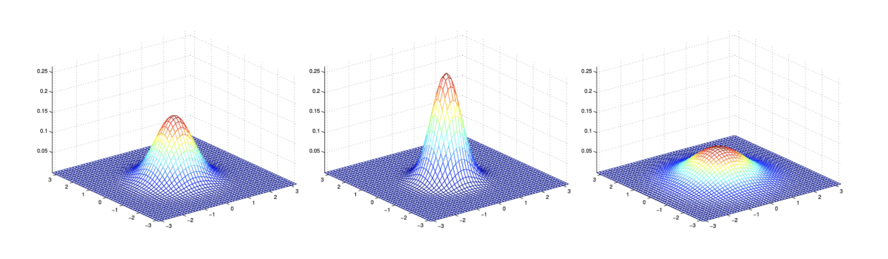
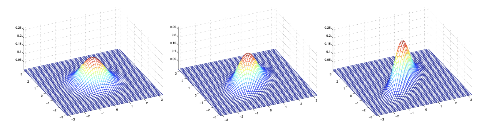
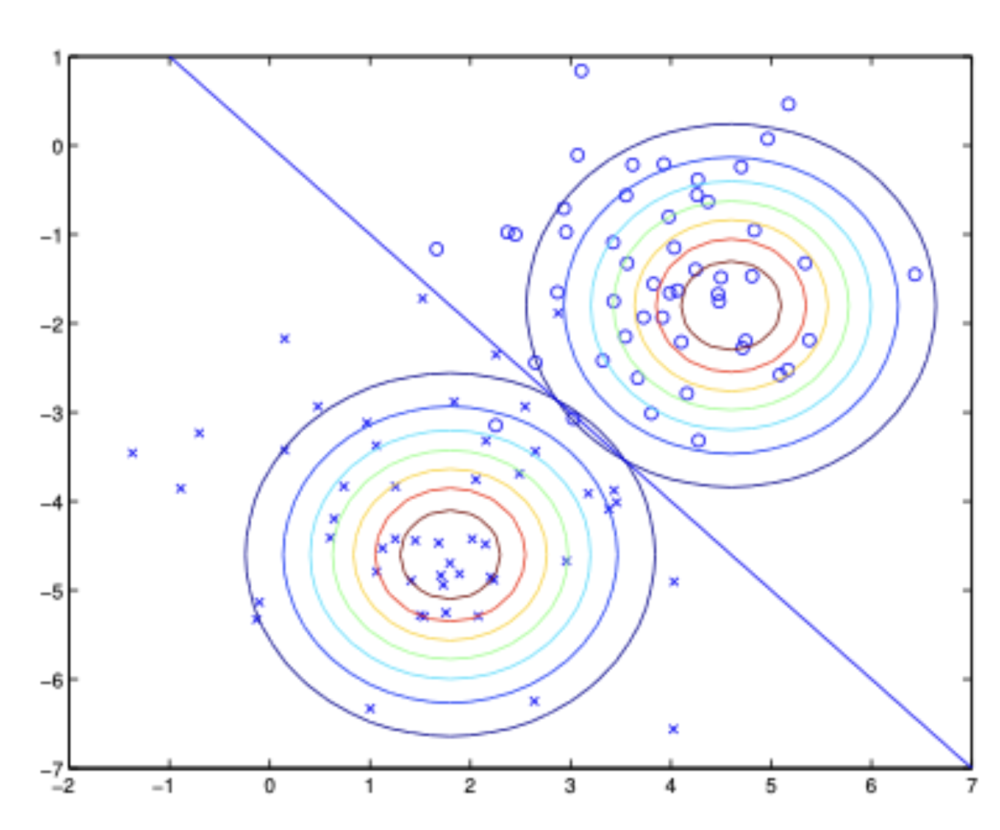

# 1. 들어가며: 판별 모델과 생성 모델의 차이

* 지금까지 기계학습 분류(Classification) 문제에서 주로 다룬 알고리즘들(예: 로지스틱 회귀, 퍼셉트론)은 입력 공간 $\mathcal{X}$에서 레이블 $\{0, 1\}$로 가는 매핑을 직접 학습하거나, 입력 $x$가 주어졌을 때 $y$의 조건부 확률인 $p(y|x; \theta)$를 직접 모델링하는 방식을 취했습니다. 예를 들어, 로지스틱 회귀는 $p(y|x; \theta)$를 시그모이드 함수 $g$를 이용하여 $h_\theta(x) = g(\theta^\top x)$의 형태로 나타냅니다. 이러한 방식의 알고리즘을 **판별 학습 알고리즘(Discriminative Learning Algorithms)**이라고 부릅니다. 

* 판별 알고리즘의 직관적인 예로, 코끼리($y=1$)와 개($y=0$)를 분류하는 문제를 생각해 봅시다. 로지스틱 회귀나 퍼셉트론은 주어진 훈련 데이터를 바탕으로 코끼리와 개를 가장 잘 나누는 **직선(결정 경계, Decision Boundary)**을 찾는 데 집중합니다. 그리고 새로운 동물이 나타나면 이 결정 경계의 어느 쪽에 속하는지만을 확인하여 예측을 수행합니다.

* 하지만 이와는 근본적으로 다른 접근 방식이 존재합니다. 바로 **생성 학습 알고리즘(Generative Learning Algorithms)**입니다.
* 생성 모델은 클래스 간의 경계를 찾는 대신, 각 클래스가 실제로 어떻게 생겼는지(분포)를 직접 모델링합니다.
  * 1. 코끼리의 사진들을 보고 코끼리의 특징들이 어떤 분포를 가지는지 모델링합니다.
  * 2. 개의 사진들을 보고 개의 특징들이 어떤 분포를 가지는지 별도의 모델을 만듭니다.
  * 3. 새로운 동물이 주어지면, 이 동물이 "코끼리 모델"에 더 부합하는지, 아니면 "개 모델"에 더 부합하는지 확률적으로 매칭하여 분류합니다.

* 수식으로 표현하자면, 판별 모델이 $p(y|x)$를 직접 구한다면, 생성 모델은 입력 데이터의 분포인 **$p(x|y)$**와 클래스의 사전 확률인 **$p(y)$**를 각각 모델링하는 방식입니다.

---

# 2. 생성 모델의 예측 원리와 베이즈 정리

* 생성 학습 알고리즘은 클래스별 데이터 분포 $p(x|y)$와 각 클래스가 등장할 사전 확률(Class priors) $p(y)$를 학습합니다. 모델링이 완료되면, 우리가 궁극적으로 알고 싶은 "데이터 $x$가 주어졌을 때 클래스가 $y$일 확률"인 사후 확률(Posterior distribution) $p(y|x)$는 **베이즈 정리(Bayes" Rule)**를 통해 도출할 수 있습니다.

$$p(y|x) = \frac{p(x|y)p(y)}{p(x)}$$

* 여기서 분모에 해당하는 $p(x)$는 전확률의 법칙(Law of Total Probability)에 의해 우리가 이미 학습한 값들로 표현할 수 있습니다. 이진 분류의 경우 다음과 같습니다.

$$p(x) = p(x|y=1)p(y=1) + p(x|y=0)p(y=0)$$

* 실제 기계학습 모델에서 예측을 수행할 때는 $p(y|x)$의 정확한 확률값보다는 **어떤 클래스의 확률이 가장 높은지(argmax)**가 중요합니다. 따라서 예측 단계에서는 $y$에 독립적인 분모 $p(x)$를 계산할 필요가 없습니다.

$$\arg\max_y p(y|x) = \arg\max_y \frac{p(x|y)p(y)}{p(x)} = \arg\max_y p(x|y)p(y)$$

* 즉, 각 클래스의 사전 확률 $p(y)$와 해당 클래스에서 현재 입력 $x$가 관측될 우도 $p(x|y)$의 곱이 가장 큰 클래스를 선택하면 됩니다.

---

# 3. 사전 지식: 다변량 정규 분포 (Multivariate Normal Distribution)

* 생성 학습 알고리즘 중 가장 대표적인 모델을 다루기 전에, 연속형 변수를 모델링하는 데 핵심이 되는 **다변량 정규 분포**에 대해 짚고 넘어갈 필요가 있습니다.

* $d$차원의 다변량 정규 분포는 평균 벡터 $\mu \in \mathbb{R}^d$와 공분산 행렬 $\Sigma \in \mathbb{R}^{d \times d}$에 의해 매개변수화됩니다. 이때 공분산 행렬 $\Sigma$는 대칭 행렬(symmetric)이며 양의 준정부호(positive semi-definite, $\Sigma \ge 0$)여야 합니다. 이 분포는 $\mathcal{N}(\mu, \Sigma)$로 표기하며, 그 확률 밀도 함수(PDF)는 다음과 같이 정의됩니다.
$$p(x; \mu, \Sigma) = \frac{1}{(2\pi)^{d/2}|\Sigma|^{1/2}} \exp\left(-\frac{1}{2}(x - \mu)^\top \Sigma^{-1} (x - \mu)\right)$$
  * $|\Sigma|$는 공분산 행렬 $\Sigma$의 행렬식을 의미합니다.

## 3.1 평균과 공분산의 정의
* 확률 변수 $X \sim \mathcal{N}(\mu, \Sigma)$에 대하여, 기댓값(평균)은 자연스럽게 $\mu$가 됩니다.

$$E[X] = \int_x x \, p(x; \mu, \Sigma) \, dx = \mu$$

* 벡터 값을 가지는 확률 변수 $Z$의 공분산(Covariance)은 실수형 확률 변수의 분산 개념을 다차원으로 확장한 것으로, 다음과 같이 정의됩니다.

$$\text{Cov}(Z) = E[(Z - E[Z])(Z - E[Z])^\top]$$

* 이를 전개하면 더 유용한 계산식을 얻을 수 있습니다.

$$
\begin{align*}
\text{Cov}(Z) &= E[ZZ^\top - Z(E[Z])^\top - E[Z]Z^\top + E[Z](E[Z])^\top] \\
&= E[ZZ^\top] - E[Z](E[Z])^\top - E[Z](E[Z])^\top + E[Z](E[Z])^\top \\
&= E[ZZ^\top] - (E[Z])(E[Z])^\top
\end{align*}
$$

* 따라서 $X \sim \mathcal{N}(\mu, \Sigma)$라면, $\text{Cov}(X) = \Sigma$가 성립합니다.

## 3.2 공분산 행렬 변화에 따른 시각적 직관

* 다변량 정규 분포는 $\Sigma$의 형태에 따라 데이터가 퍼져있는 형태(분포의 등고선)가 다양하게 변합니다.

* 위 그림에서 보듯 공분산의 대각 성분이 커지면 분포가 넓게 퍼지고(spread-out), 작아지면 압축됩니다(compressed).

* 공분산 행렬의 비대각 성분(off-diagonal elements)은 두 변수 간의 상관관계를 의미합니다. 이 값이 양수로 커지면 우상향 45도 방향으로 분포가 길어지며, 반대로 음수(-0.5, -0.8 등)가 되면 좌상향 방향으로 분포가 압축됩니다. 공분산 행렬은 등고선(contour)의 형태(주축의 방향과 타원의 찌그러짐 정도)를 결정하고, 평균 벡터 $\mu$는 단순히 분포의 중심 위치를 이동시킵니다.

---

# 4. 가우시안 판별 분석 (Gaussian Discriminant Analysis, GDA)

* 이제 연속형(continuous-valued) 입력 특성 $x$를 가지는 분류 문제에 적용할 수 있는 대표적인 생성 학습 알고리즘인 **가우시안 판별 분석(GDA)** 모델을 정의해 보겠습니다. 

* GDA는 클래스 $y$에 대한 사전 확률이 베르누이 분포를 따르고, 특정 클래스가 주어졌을 때의 조건부 데이터 분포 $p(x|y)$가 다변량 정규 분포를 따른다고 매우 구체적인 **강한 가정**을 합니다. 특히, 일반적인 GDA에서는 **모든 클래스가 동일한 공분산 행렬 $\Sigma$를 공유**한다고 가정합니다.

$$
\begin{align*}
y &\sim \text{Bernoulli}(\phi) \\
x | y=0 &\sim \mathcal{N}(\mu_0, \Sigma) \\
x | y=1 &\sim \mathcal{N}(\mu_1, \Sigma)
\end{align*}
$$

* GDA 모델의 파라미터는 $\phi, \mu_0, \mu_1, \Sigma$ 입니다. 각 확률 분포를 명시적으로 쓰면 다음과 같습니다.

$$p(y) = \phi^y (1-\phi)^{1-y}$$
$$p(x|y=0) = \frac{1}{(2\pi)^{d/2}|\Sigma|^{1/2}} \exp\left(-\frac{1}{2}(x - \mu_0)^\top \Sigma^{-1} (x - \mu_0)\right)$$
$$p(x|y=1) = \frac{1}{(2\pi)^{d/2}|\Sigma|^{1/2}} \exp\left(-\frac{1}{2}(x - \mu_1)^\top \Sigma^{-1} (x - \mu_1)\right)$$

## 4.1 파라미터 추정 (Maximum Likelihood Estimation)

* 훈련 데이터셋 $\{(x^{(1)}, y^{(1)}), \dots, (x^{(n)}, y^{(n)})\}$이 주어졌을 때, GDA 모델의 파라미터 $\phi, \mu_0, \mu_1, \Sigma$를 찾기 위해 **로그 결합 우도(Log-joint likelihood)** 함수 $\ell$을 최대화합니다. 판별 모델과 달리 생성 모델은 입력 $x$와 레이블 $y$의 결합 분포를 모델링하므로, 우도 함수에 $p(x, y)$를 사용합니다.

### 1) 로그 우도 함수 정의
* 먼저 최대화하고자 하는 목적 함수를 정의합니다.
$$
\begin{align*}
\ell(\phi, \mu_0, \mu_1, \Sigma) &= \log \prod_{i=1}^n p(x^{(i)}, y^{(i)}; \phi, \mu_0, \mu_1, \Sigma) \\
&= \sum_{i=1}^n \log \left( p(x^{(i)} | y^{(i)}; \mu_0, \mu_1, \Sigma) p(y^{(i)}; \phi) \right) 
\end{align*}
$$

* 여기에 베르누이 분포와 다변량 정규 분포의 정의를 대입하면 구체적인 식이 완성됩니다.
$$
\begin{align*}
\ell = \sum_{i=1}^n \Big[ &y^{(i)}\log\phi + (1-y^{(i)})\log(1-\phi) \\
&- \frac{d}{2}\log(2\pi) - \frac{1}{2}\log|\Sigma| - \frac{1}{2}(x^{(i)}-\mu_{y^{(i)}})^\top \Sigma^{-1} (x^{(i)}-\mu_{y^{(i)}}) \Big]
\end{align*}
$$

### 2) 파라미터별 유도 과정

#### (1) 클래스 사전 확률 $\phi$의 유도
* $\phi$와 관련된 항만 남기고 편미분하여 0이 되는 지점을 찾습니다. 이는 동전 던지기의 확률을 구하는 것과 수학적으로 동일합니다.
$$\frac{\partial \ell}{\partial \phi} = \sum_{i=1}^n \left( \frac{y^{(i)}}{\phi} - \frac{1-y^{(i)}}{1-\phi} \right) = 0$$
* 위 식을 정리하면 $\phi$는 전체 데이터 중 클래스 1이 나타난 비율이 됩니다.
$$\phi = \frac{1}{n} \sum_{i=1}^n y^{(i)} = \frac{1}{n} \sum_{i=1}^n 1\{y^{(i)}=1\} $$

#### (2) 클래스별 평균 $\mu_0, \mu_1$의 유도
* $\mu_0$를 추정할 때는 $y^{(i)}=0$인 데이터 포인트들만 식에 남습니다. 벡터 미분 공식($\nabla_z (z-a)^\top A (z-a) = 2A(z-a)$)을 사용합니다.
$$\nabla_{\mu_0} \ell = \sum_{i: y^{(i)}=0} \Sigma^{-1}(x^{(i)}-\mu_0) = 0$$
* 양변에 $\Sigma$를 곱하고 정리하면, $\mu_0$는 클래스 0에 속한 데이터들의 산술 평균임을 알 수 있습니다.
$$\mu_0 = \frac{\sum_{i: y^{(i)}=0} x^{(i)}}{\sum_{i=1}^n 1\{y^{(i)}=0\}} $$
* 동일한 원리로 $\mu_1 = \frac{\sum_{i: y^{(i)}=1} x^{(i)}}{\sum_{i=1}^n 1\{y^{(i)}=1\}}$이 도출됩니다.

#### (3) 공유 공분산 행렬 $\Sigma$의 유도
* 공분산 행렬은 모든 클래스가 공유하므로 전체 오차의 제곱합을 이용합니다. 행렬 미분($\frac{\partial \log |A|}{\partial A} = A^{-1}$, $\frac{\partial (a^\top A^{-1} a)}{\partial A} = -A^{-1} aa^\top A^{-1}$)을 적용하여 정리하면 다음과 같습니다.
$$\frac{\partial \ell}{\partial \Sigma} = \sum_{i=1}^n \left( -\frac{1}{2}\Sigma^{-1} + \frac{1}{2}\Sigma^{-1} (x^{(i)}-\mu_{y^{(i)}})(x^{(i)}-\mu_{y^{(i)}})^\top \Sigma^{-1} \right) = 0$$
* 이를 $\Sigma$에 대해 풀면 중심화된 전체 데이터의 표본 공분산 식이 도출됩니다.
$$\Sigma = \frac{1}{n} \sum_{i=1}^n (x^{(i)} - \mu_{y^{(i)}})(x^{(i)} - \mu_{y^{(i)}})^\top $$

## 4.2 GDA의 시각적 이해와 결정 경계

* GDA 알고리즘이 동작하는 방식을 기하학적으로 살펴보면, 동일한 공분산 $\Sigma$를 가정했기 때문에 결정 경계의 특성이 명확해집니다.

* 1. 두 클래스 데이터 각각에 하나의 가우시안 분포가 적합(fit)됩니다.
* 2. $\Sigma$를 공유하기 때문에 두 타원 등고선의 형태와 방향(Orientation)은 완전히 같습니다. 단지 중심 위치($\mu$)만 다릅니다.
* 3. 두 클래스에 속할 사후 확률이 동일해지는 지점, 즉 $p(y=1|x) = 0.5$ (혹은 $p(y=0|x) = 0.5$)인 점들의 집합은 공간상에서 **직선 형태의 결정 경계(Linear Decision Boundary)**를 이룹니다.

### 결정 경계(Decision Boundary)

* 결정 경계는 두 클래스에 속할 확률이 정확히 같아지는 지점, 즉 $p(y=1|x) = p(y=0|x)$인 지점들의 집합입니다. 이 관계를 로그 오즈(Log-odds) 형태로 정리하면 왜 식이 직선(선형)이 되는지 명확해집니다.

#### 단계 1: 로그 확률비 계산
* 베이즈 정리에 의해 $p(y|x)$는 $p(x|y)p(y)$에 비례합니다. 따라서 두 확률이 같은 지점은 다음과 같습니다.
$$\log \frac{p(x|y=1)p(y=1)}{p(x|y=0)p(y=0)} = 0$$

#### 단계 2: 가우시안 밀도 함수 대입
* 가우시안 분포의 식 $p(x|y) = \frac{1}{(2\pi)^{d/2}|\Sigma|^{1/2}} \exp(-\frac{1}{2}(x-\mu)^\top \Sigma^{-1}(x-\mu))$를 대입합니다. 로그를 취하면 지수 파트의 이차 형식이 밖으로 나옵니다.
$$\log \frac{p(x|y=1)}{p(x|y=0)} = -\frac{1}{2}(x-\mu_1)^\top \Sigma^{-1}(x-\mu_1) + \frac{1}{2}(x-\mu_0)^\top \Sigma^{-1}(x-\mu_0)$$

#### 단계 3: 이차항의 소거
* 위 식의 이차항 $(x^\top \Sigma^{-1} x)$ 부분을 전개해 보면 다음과 같습니다.
  * 1.  첫 번째 항: $-\frac{1}{2}(x^\top \Sigma^{-1} x - 2\mu_1^\top \Sigma^{-1} x + \mu_1^\top \Sigma^{-1} \mu_1)$
  * 2.  두 번째 항: $+\frac{1}{2}(x^\top \Sigma^{-1} x - 2\mu_0^\top \Sigma^{-1} x + \mu_0^\top \Sigma^{-1} \mu_0)$

* 여기서 **두 클래스가 동일한 $\Sigma$를 공유하기 때문에** $x^\top \Sigma^{-1} x$ 항이 서로 상쇄되어 사라집니다. 남은 식은 $x$에 대한 1차식(선형식) 형태가 됩니다.
$$\text{Boundary: } \theta^\top x + \theta_0 = 0$$
* 이것이 GDA의 결정 경계가 항상 **직선(또는 초평면)**이 되는 수학적 이유입니다.

---

# 5. GDA와 로지스틱 회귀(Logistic Regression)의 비교

* GDA와 이전에 배운 로지스틱 회귀는 흥미로운 수학적 연결 고리를 가지고 있습니다. 
* GDA에서 도출된 식을 이용해 사후 확률 $p(y=1|x)$를 $x$에 대한 함수로 다시 정리해 보면 아래와 같은 형태를 얻을 수 있습니다.

$$p(y=1|x; \phi, \Sigma, \mu_0, \mu_1) = \frac{1}{1 + \exp(-\theta^\top x)}$$

* 여기서 가중치 벡터 $\theta$는 $\phi, \Sigma, \mu_0, \mu_1$에 관한 적절한 함수로 표현됩니다. (실제로 베이즈 정리 식에 가우시안 분포 식을 대입하여 분모와 분자를 $p(x|y=0)p(y=0)$으로 나누면 자연스럽게 로지스틱 시그모이드 형태가 유도되며, 두 가우시안의 2차 항 $x^\top \Sigma^{-1} x$이 공유 공분산 덕분에 서로 상쇄되어 $x$에 대한 선형식 $\theta^\top x$만 남게 됩니다.)

* 이 형태는 놀랍게도 **로지스틱 회귀가 $p(y=1|x)$를 모델링하기 위해 사용하는 바로 그 수식 형태**입니다. 즉, $p(x|y)$가 (동일한 $\Sigma$를 갖는) 다변량 가우시안 분포를 따른다면, $p(y|x)$는 필연적으로 로지스틱 함수를 따르게 됩니다.

## 5.1 가정의 강도와 차이점

* 수학적 형태가 동일함에도 두 알고리즘을 구분해야 하는 이유는 무엇일까요? 핵심은 **가정(Assumption)의 차이**에 있습니다.
  * **명제:** $p(x|y)$가 가우시안 $\Rightarrow$ $p(y|x)$는 로지스틱 함수. (참)
  * **역명제:** $p(y|x)$가 로지스틱 함수 $\Rightarrow$ $p(x|y)$가 가우시안. (**거짓**)

* 이 비대칭성은 GDA가 로지스틱 회귀보다 데이터에 대해 **훨씬 더 강한 모델링 가정**을 하고 있음을 의미합니다.

### 1) 데이터가 실제로 가우시안 분포를 따를 때
* GDA의 가정이 정확하거나 근사적으로 맞다면, GDA는 데이터를 훨씬 더 효율적으로 사용합니다. 점근적으로 효율적(asymptotically efficient)이라는 특성을 가지는데, 이는 훈련 데이터 $n$이 무한히 커질 때 GDA보다 $p(y|x)$를 더 정확히 추정할 수 있는 알고리즘이 없음을 뜻합니다. 심지어 훈련 데이터의 크기가 작을 때도 가우시안 가정이 유지된다면 보통 GDA가 로지스틱 회귀보다 성능이 우수합니다.

### 2) 데이터가 비-가우시안 분포를 따를 때 (Robustness)
* 가정이 틀렸을 때 문제가 발생합니다. 사실 $p(y|x)$가 로지스틱 함수 형태를 띠게 만드는 분포는 가우시안 이외에도 많습니다. 예를 들어, $x|y=0 \sim \text{Poisson}(\lambda_0)$이고 $x|y=1 \sim \text{Poisson}(\lambda_1)$과 같이 이산형 포아송 분포를 따르더라도 $p(y|x)$는 완벽하게 로지스틱 함수가 됩니다.

* 이러한 포아송 데이터에 대해 약한 가정을 하는 로지스틱 회귀를 적용하면 무리 없이 좋은 성능을 냅니다. 하지만 비정규 데이터에 억지로 가우시안 분포를 피팅하려 하는 GDA를 사용하면 예측 성능이 매우 불확실해집니다.

## 5.2 요약 결론
* **GDA (가우시안 판별 분석):**
  * 데이터가 가우시안이라는 강력한 가정을 합니다.
  * 이 가정이 맞다면 데이터 효율성이 매우 뛰어납니다 (작은 데이터셋에서도 잘 동작).
* **로지스틱 회귀 (Logistic Regression):**
  * 약한 가정을 바탕으로 동작합니다.
  * 데이터 분포의 가정 오류에 대해 훨씬 더 **강건(Robust)**합니다.
  * 실제 응용 환경에서는 데이터가 완벽한 가우시안을 따르는 경우가 드물기 때문에 **실무에서는 로지스틱 회귀가 GDA보다 훨씬 더 널리 사용**됩니다.