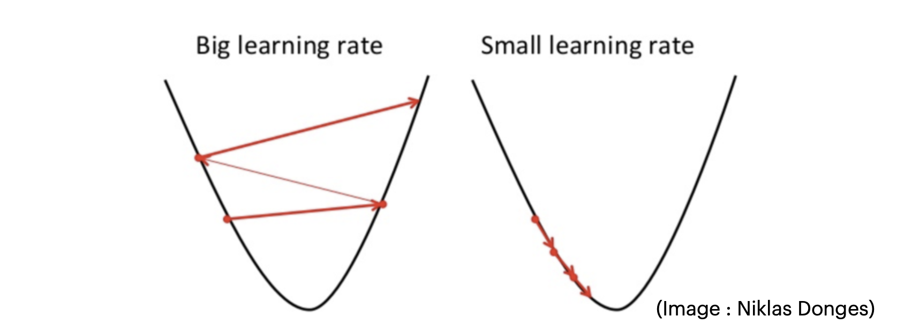
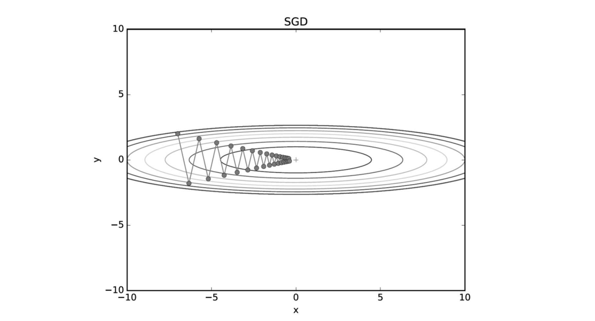
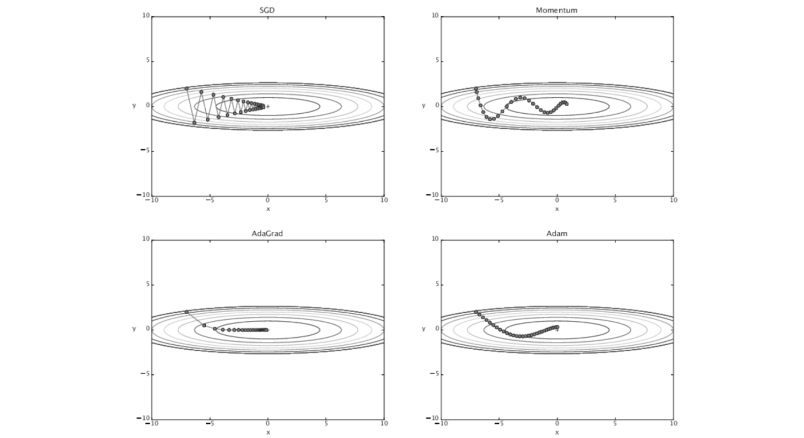

# 1. 서론: 매개변수 최적화의 목표 (Introduction to Optimization)

* 머신러닝 모델을 학습시키는 핵심적인 과정은 손실 함수(Loss Function 또는 Cost Function)를 최소화하는 최적의 매개변수(Parameter)를 찾는 것입니다. 모형의 매개변수를 $\Theta$, 목적 함수를 $J(\Theta)$라고 할 때, 우리의 궁극적인 목표는 다음과 같이 $J(\Theta)$를 최소화하는 $\Theta^*$를 찾는 것입니다.

$$\Theta^{*} = \arg \min_{\Theta} J(\Theta)$$

* 우리는 $J(\Theta)$를 매개변수 공간 위에 펼쳐진 다차원 형태의 '표면(surface)'으로 생각할 수 있습니다. 목표는 이 표면에서 가장 낮은 지점을 찾는 것입니다. 이를 위해 현재 위치에서 함수 그래프의 언덕이 '가장 가파르게 내려가는(most steeply)' 방향을 계산하고, 그 방향을 향해 작은 발걸음을 내디뎌야 합니다.

---

# 2. 1차원 및 다차원 경사 하강법 (Gradient Descent)

## 2.1. 1차원 모델에서의 경사 하강법 (One Dimension Case)
* 매개변수 공간이 1차원 실수 범위($\Theta \in \mathbb{R}$)라고 가정해 보겠습니다. 최적화를 위해서는 다음의 세 가지를 먼저 설정해야 합니다:
  * 1. 매개변수의 초깃값 (initial value) 
  * 2. 학습률 또는 스텝 크기 (step-size, $\eta$) 
  * 3. 종료 기준을 위한 정확도 파라미터 (accuracy parameter, $\epsilon$) 

> **Algorithm: 1D-Gradient-Descent** 
> 
> 1. $\Theta^{(0)} = \Theta_{init}$ 
> 
> 2. $t = 0$ 
> 
> 3. `while` $|f(\Theta^{(t)}) - f(\Theta^{(t-1)})| > \epsilon$ `do` 
> 
> 4. $\quad t = t + 1$ 
> 
> 5. $\quad \Theta^{(t)} = \Theta^{(t-1)} - \eta f^{\prime}(\Theta^{(t-1)})$ 
> 
> 6. `return` $\Theta^{(t)}$ 

* 경사 하강법 알고리즘은 함수 값의 변화량이 충분히 작아질 때까지 반복(iteration)합니다. 이 외에도 특정 반복 횟수($t=T$)에 도달했을 때 , 매개변수의 변화량 $|\Theta^{(t)} - \Theta^{(t-1)}|$이 $\epsilon$보다 작을 때 , 혹은 1차 도함수의 크기 $|f^{\prime}(\Theta^{(t)})|$ 자체가 $\epsilon$보다 작을 때를 종료 기준으로 사용할 수 있습니다.

## 2.2. 학습률(Learning Rate)의 중요성과 수렴 정리
* 경사 하강법의 성공은 적절한 스텝 크기 $\eta$를 설정하는 데 크게 의존합니다. 학습률 선택이 잘못될 경우 수렴 속도가 매우 느려지거나, 최솟값 주변에서 진동(oscillation)하거나, 발산(divergence)할 수 있습니다. 

> **수렴 정리 (Gradient Descent Convergence Theorem):**
> 
> 목적 함수 $J$가 **볼록 함수(Convex)**라면, 원하는 어떠한 정확도 $\epsilon$에 대해서도 경사 하강법이 $\epsilon$ 내의 최적값으로 수렴하도록 보장하는 특정 스텝 크기 $\eta$가 반드시 존재합니다.

* 단, $J$가 볼록 함수가 아닌 비볼록(Non-Convex)인 경우에는, 알고리즘의 수렴 결과가 초기 매개변수 $\Theta_{init}$의 위치에 따라 달라지며 전역 최솟값이 아닌 국소 최솟값(local minimum)에 빠질 위험이 존재합니다.

## 2.3. 다차원으로의 확장 (Multiple Dimensions)
* 다차원 모델($\Theta \in \mathbb{R}^{m}$, $J: \mathbb{R}^{m} \rightarrow \mathbb{R}$)로의 확장은 직관적입니다. 스칼라 미분 $f^{\prime}(\Theta)$가 매개변수 벡터 $\Theta$에 대한 그래디언트(Gradient) 벡터 $\nabla_{\Theta}J$로 대체됩니다.

$$\nabla_{\Theta}J = \begin{bmatrix} \partial J/\partial\Theta_{1} \\ \vdots \\ \partial J/\partial\Theta_{m} \end{bmatrix}$$ 

* 업데이트 수식 역시 다음과 같이 벡터 형태로 변경됩니다.
$$\Theta^{(t)} = \Theta^{(t-1)} - \eta\nabla_{\Theta}J(\Theta^{(t-1)})$$ 

---

# 3. 모델 적용: 로지스틱 회귀 (Application to Logistic Regression)

* 선형 로지스틱 분류기(Linear Logistic Classifier)의 학습 과정을 통해 다차원 경사 하강법이 어떻게 구체적으로 적용되는지 살펴봅니다. 매개변수는 벡터 $\theta$와 스칼라 절편 $\theta_{0}$로 구성됩니다. 

## 3.1. 목적 함수와 기울기 유도
* 목적 함수 $J_{lr}(\theta, \theta_0)$는 음의 로그 우도(Negative Log Likelihood, nll)의 평균과 L2 정규화 항(Regularization)의 합으로 정의됩니다.
$$J_{lr}(\theta, \theta_0) = \frac{1}{n}\sum_{i=1}^{n}\mathbb{Z}_{nll}(g^{(i)}, y^{(i)}) + \frac{\lambda}{2}||\theta||^{2}$$ 

* 여기서 $g^{(i)}$는 선형 결합에 시그모이드 함수 $\sigma(\cdot)$를 통과시킨 예측 확률입니다: $g^{(i)} = \sigma(\theta^{\top}x^{(i)} + \theta_0)$.

* 편미분 연쇄 법칙(Chain Rule)을 이용하여 매개변수에 대한 기울기를 구하면 다음과 같습니다:
$$\nabla_{\theta}J_{lr}(\theta, \theta_0) = \frac{1}{n}\sum_{i=1}^{n}(g^{(i)} - y^{(i)})x^{(i)} + \lambda\theta$$ 
$$\frac{\partial J_{lr}(\theta, \theta_0)}{\partial\theta_0} = \frac{1}{n}\sum_{i=1}^{n}(g^{(i)} - y^{(i)})$$ 

## 3.2. LR-Gradient-Descent 알고리즘
* 이를 통합하여 로지스틱 회귀에 특화된 경사 하강법 알고리즘(Algorithm 15)을 구성할 수 있습니다. 업데이트 룰은 아래와 같이 유도된 그래디언트를 원래의 매개변수에서 빼주는 방식입니다.

$$\theta^{(t)} = \theta^{(t-1)} - \eta \left( \frac{1}{n}\sum_{i=1}^{n} (\sigma({\theta^{(t-1)}}^{\top}x^{(i)} + \theta_{0}^{(t-1)}) - y^{(i)})x^{(i)} + \lambda\theta^{(t-1)} \right)$$ 
$$\theta_{0}^{(t)} = \theta_{0}^{(t-1)} - \eta \left( \frac{1}{n}\sum_{i=1}^{n} (\sigma({\theta^{(t-1)}}^{\top}x^{(i)} + \theta_{0}^{(t-1)}) - y^{(i)}) \right)$$ 

---

# 4. 확률적 경사 하강법 (Stochastic Gradient Descent, SGD)

## 4.1. 왜 SGD를 사용하는가?
* 일반적인(Normal) 경사 하강법(배치 경사 하강법)은 항상 전체 데이터셋에 대한 그래디언트를 계산하므로 , 시작점이 동일하면 늘 동일한 궤적을 그리게 됩니다. 반면, SGD는 약간의 '노이즈(noise)'를 추가하여 임의의 단일 데이터 포인트를 샘플링해 그래디언트를 구합니다. 

* **SGD의 장점:**
  * 1. 목적 함수가 비볼록(non-convex)이고 얕은 국소 최적점(shallow local optima)이 많을 때, 부분 샘플의 노이즈가 모델을 통통 튀게 하여(bounce around) 국소 최적점에서 벗어나게 해줍니다.
  * 2. 일반 GD는 훈련 데이터 전체를 평가해야 하지만, SGD는 한 번에 일부만 보므로 실행 시간과 메모리를 획기적으로 절약할 수 있습니다.
  * 3. 일반 GD가 훈련셋에 과적합(overfit)하는 현상을 완화하여 더 낮은 테스트 오류를 달성할 수도 있습니다.

## 4.2. 수학적 모델 및 정리 (SGD Theorem)
* 목적 함수가 개별 데이터 손실의 합 $f(\Theta) = \sum_{i=1}^{n}f_{i}(\Theta)$의 형태라고 가정합니다.

> **Algorithm: Stochastic-Gradient-Descent** 
> 
> 반복 단계 $t$에서 인덱스 $i \in \{1, 2, \dots, n\}$를 무작위로 선택하고, 학습률을 시간에 따라 적응적으로 줄이는 $\eta(t)$를 사용하여 업데이트합니다.
> 
> $$\Theta^{(t)} = \Theta^{(t-1)} - \eta(t)\nabla_{\Theta}f_{i}(\Theta^{(t-1)})$$ 

> **고급 수렴 정리 (Advanced Convergence Theorem):**
> 
> SGD가 국소 최적점으로 수렴하기 위해서는 반복 횟수 $t$가 증가함에 따라 스텝 크기 $\eta(t)$가 감소해야 합니다. $J$가 볼록 함수일 때, $\eta(t)$ 시퀀스가 다음 두 조건을 만족한다면 SGD는 최적점에 확률 1.0으로 완벽히 수렴합니다:
> 
> 1. $\sum_{t=1}^{\infty}\eta(t) = \infty$  (무한히 이동할 수 있는 잠재력) 
> 
> 2. $\sum_{t=1}^{\infty}\eta(t)^{2} < \infty$  (이동 거리의 분산은 수렴해야 함) 

## 4.3. 미니배치 (Minibatch) SGD
* 단일 샘플 갱신은 노이즈에 매우 민감합니다. 이를 보완하기 위해 소수의 샘플 집합 $B$를 사용하는 **Minibatch SGD**가 주로 쓰입니다.
$$L = \frac{1}{2}\sum_{n\in B}(y^{n} - \hat{y}^{n})^{2}$$ 
$$w_{i}(t+1) = w_{i}(t) - \eta\frac{\partial L^{B}}{\partial w_{i}}$$ 
* 이는 연산 속도를 확보하면서도 노이즈에 대한 강건성(Robust to noise)을 제공합니다.

---

# 5. 최적화 기법의 발전: 진동 극복과 적응적 학습률

* 가파른 협곡 모양의 함수 환경에서는 전통적인 SGD가 지그재그 모양으로 진동(oscillation)하며 비효율적으로 탐색하는 문제가 발생합니다.

* 이를 해결하기 위해 모멘텀(Momentum), AdaGrad, Adam 같은 고급 옵티마이저가 고안되었습니다.

## 5.1. Momentum (관성)
* 이전 스텝에서 이동하던 방향성(관성)을 유지하여 진동을 상쇄하고 수렴 속도를 높이는 기법입니다.
$$v_{i}(t) = \alpha v_{i}(t-1) - \eta\frac{\partial L}{\partial w_{i}}(t)$$ 
$$w(t+1) = w(t) + v(t)$$ 

## 5.2. AdaGrad
* AdaGrad (Adaptive Gradient)는 각 매개변수마다 다르게 적응적으로 학습률을 결정하는 최적화 기법입니다. 과거에 많이 변화한 변수의 학습률은 줄이고, 적게 변화한 변수는 학습률을 높입니다.
$$h \leftarrow h + \frac{\partial L}{\partial W} \odot \frac{\partial L}{\partial W}$$ 
$$W \leftarrow W - \frac{\eta}{\sqrt{h+\epsilon}} \frac{\partial L}{\partial W}$$ 

## 5.3. Adam Optimizer (Adaptive Moment Estimation)
* Adam은 Momentum의 관성 아이디어와 AdaGrad의 적응적 학습률 아이디어를 결합한 강력한 방법론입니다. 

> **Algorithm: Adam** 
> 
> 1. 그래디언트 $g_t$ 계산: $g_t \leftarrow \nabla_\theta f_t(\theta_{t-1})$ 
> 
> 2. 편향된 1차 모멘트(Momentum 역할) 추정: $m_t \leftarrow \beta_1 \cdot m_{t-1} + (1-\beta_1) \cdot g_t$ 
> 
> 3. 편향된 2차 모멘트(AdaGrad 역할) 추정: $v_t \leftarrow \beta_2 \cdot v_{t-1} + (1-\beta_2) \cdot g_t^2$ 
> 
> 4. 편향 수정 (초기 단계에서 0으로 편향되는 것을 보정):
> 
>    $$\hat{m}_t \leftarrow m_t / (1 - \beta_1^t)$$ 
> 
>    $$\hat{v}_t \leftarrow v_t / (1 - \beta_2^t)$$ 
> 
> 5. 매개변수 업데이트: $\theta_t \leftarrow \theta_{t-1} - \alpha \cdot \hat{m}_t / (\sqrt{\hat{v}_t} + \epsilon)$ 

 

---

# 6. 추가적인 학습 스케줄러 (Learning Rate Schedulers)

* 학습률($\eta$) 자체를 에포크가 진행됨에 따라 동적으로 조절하면 성능이 크게 향상될 수 있습니다. 널리 사용되는 PyTorch Schedulers의 패턴은 다음과 같습니다:
  * **StepLR & MultiStepLR**: 특정 에포크 도달 시마다 학습률을 급격히 계단식으로 떨어뜨림. (ResNet 훈련 곡선에서 특정 에포크마다 에러율이 뚝 떨어지는 계단 현상은 이 기법 덕분임 ).
  * **ExponentialLR & MultiplicativeLR**: 매 반복 지수적으로 부드럽게 감소시킴.
  * **CosineAnnealingLR & CosineAnnealingWarmRestarts**: 코사인 함수 형태를 띠며 최솟값까지 갔다가 주기적으로 웜 리스타트(Warm restart)를 주어 국소 최적점에서 벗어나는 에너지를 부여함.