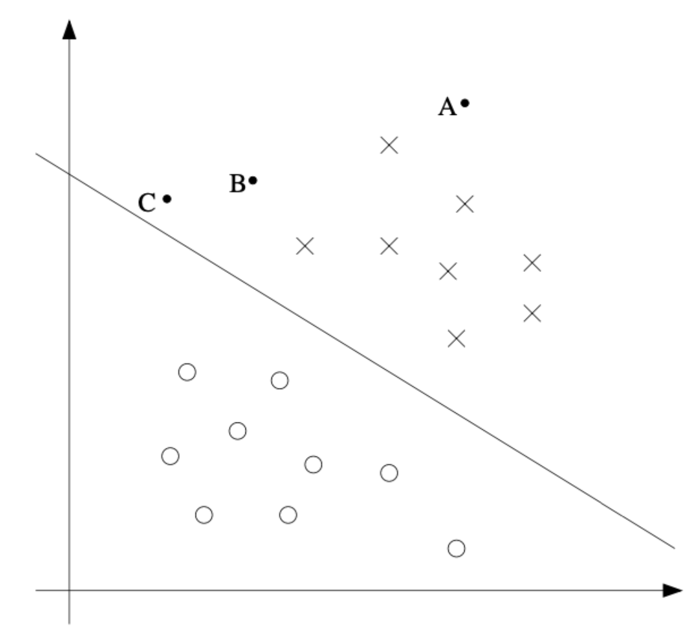
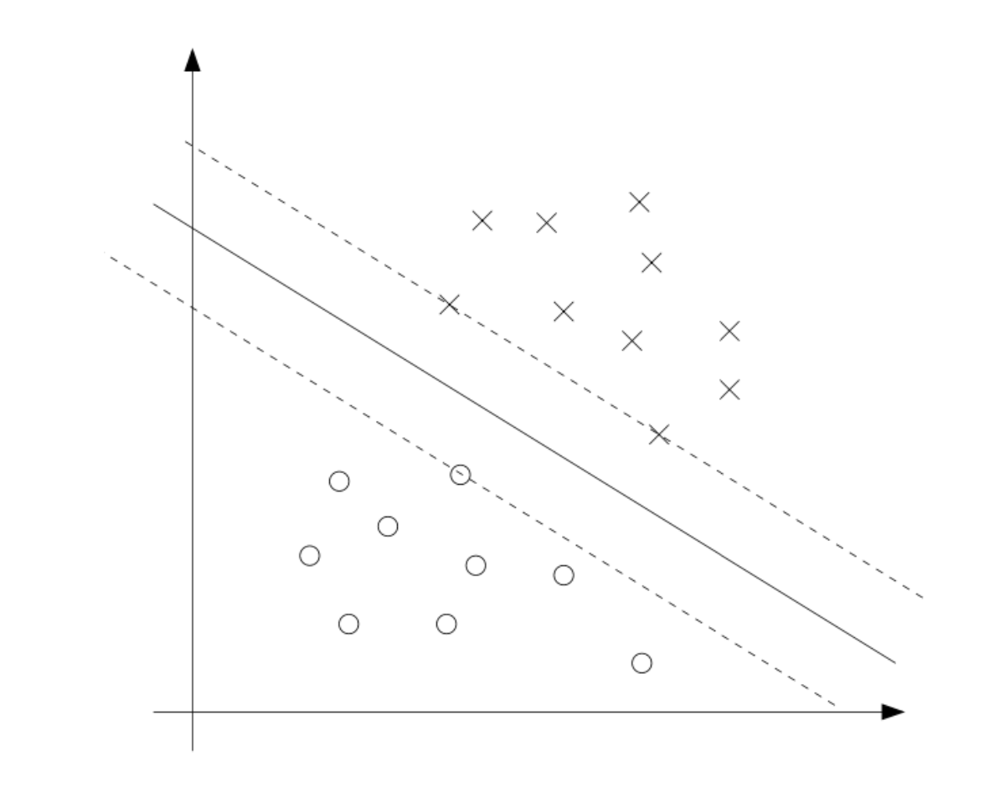
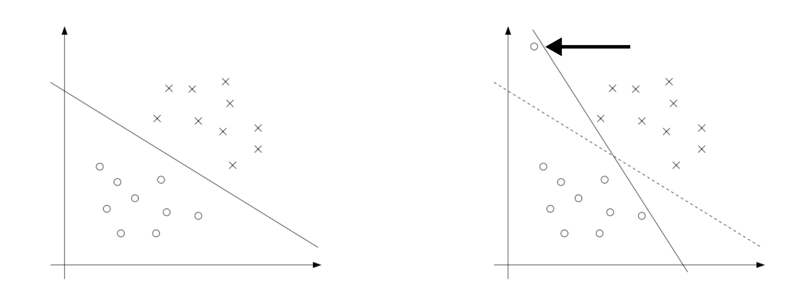
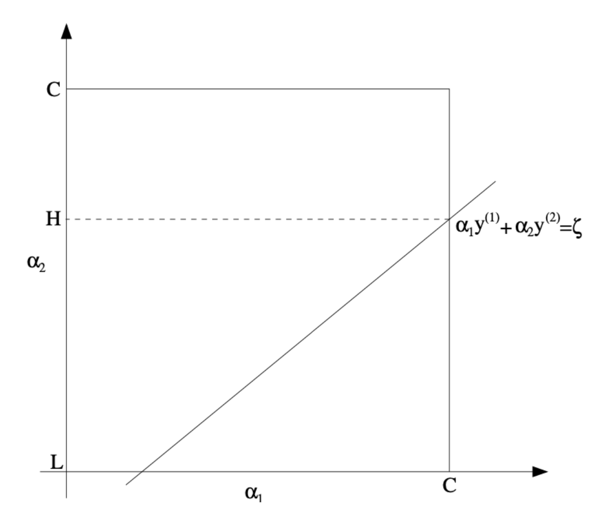

# 1. 서론 (Introduction)

* 머신러닝에서 분류 모델을 설계할 때, 우리는 단순히 데이터를 나누는 선을 찾는 것을 넘어 **가장 안정적이고 일반화 성능이 뛰어난 결정 경계(Decision Boundary)**를 찾고자 합니다. Support Vector Machine(SVM)의 핵심 아이디어인 **마진(Margin)**은 예측에 대한 모델의 '확신(confidence)'을 나타냅니다. 이번 포스트에서는 SVM의 수학적 최적화 과정을 깊이 있게 파헤쳐, 라그랑주 쌍대성(Lagrange Duality)을 통한 문제 변환부터 실제 해를 구하는 SMO 알고리즘까지의 흐름을 정리해 보겠습니다.

# 2. 최적 마진 분류기 (The Optimal Margin Classifier)

* 우리의 목표는 훈련 데이터에 대해 모든 예측을 정확하고 확신 있게 내릴 수 있는 최적의 마진을 찾는 것입니다. 이를 위해 기하학적 마진 $\gamma$를 최대화하는 최적화 문제는 다음과 같이 정의됩니다.

$$max_{\gamma,w,b}\frac{\gamma}{||w||}$$

* 단, 제약 조건은 $y^{(i)}(w^{\top}x^{(i)}+b)\ge\gamma$ (모든 $i=1,...,n$에 대하여) 입니다. (초기 공식에서는 $||w||=1$이라는 비볼록(non-convex) 제약 조건이 있었으나, 이를 스케일링을 통해 제거하고 최적화하기 쉬운 형태로 변형합니다 ).

* $\frac{\gamma}{||w||} = \frac{1}{||w||}$ 관계를 이용하여, 위 최대화 문제는 다음과 같은 2차 계획법(Quadratic Programming) 최소화 문제로 변환할 수 있습니다.

$$min_{w,b}\frac{1}{2}||w||^{2}$$
$$\textit{s.t.} \quad y^{(i)}(w^{\top}x^{(i)}+b)\ge1, \quad i=1,...,n$$ 

* 이 문제의 해가 바로 우리가 찾는 **최적 마진 분류기(Optimal Margin Classifier)**가 됩니다.

# 3. 최적화 배경지식: 라그랑주 승수와 쌍대성 (Optimization Backgrounds)

SVM의 복잡한 제약 조건을 다루기 위해, 우리는 **라그랑주 승수법(Lagrange Multipliers)**과 이를 확장한 **일반화된 라그랑주안(Generalized Lagrangian)** 개념을 먼저 짚고 넘어가야 합니다.

## 3.1. 원초적 문제 (Primal Problem)

* 가장 먼저, 부등식 없이 등식 제약 조건만 있는 단순한 형태의 문제를 생각해 봅시다.

$$\min_{w}f(w) \quad \text{s.t.} \quad h_{i}(w)=0, \quad i=1,\dots,l$$

* 이때 라그랑주안은 다음과 같이 정의되며, 우리는 각 변수와 승수에 대한 편미분 값을 0으로 설정하여 해를 찾습니다.

$$\mathcal{L}(w,\beta)=f(w)+\sum_{i=1}^{l}\beta_{i}h_{i}(w)$$

$$\frac{\partial\mathcal{L}}{\partial w_{i}}=0, \quad \frac{\partial\mathcal{L}}{\partial\beta_{i}}=0$$

* 이제 이를 부등식 제약 조건까지 포함된 **원초적 최적화 문제(Primal optimization problem)**로 일반화해 보겠습니다.

$$\begin{aligned} \min_{w} \quad & f(w) \\ \text{s.t.} \quad & g_{i}(w) \le 0, \quad i=1,\dots,k, \\ & h_{i}(w) = 0, \quad i=1,\dots,l. \end{aligned}$$

* 이에 대한 일반화된 라그랑주안은 새로운 라그랑주 승수(Lagrange multipliers) $\alpha_i$와 $\beta_i$를 도입하여 다음과 같이 정의됩니다.

$$\mathcal{L}(w,\alpha,\beta)=f(w)+\sum_{i=1}^{k}\alpha_{i}g_{i}(w)+\sum_{i=1}^{l}\beta_{i}h_{i}(w)$$

* 여기서 주어진 $w$에 대해 제약 조건을 얼마나 잘 만족하는지 평가하기 위해, 다음과 같은 함수 $\theta_{\mathcal{P}}(w)$를 정의합니다 ('P'는 Primal을 의미합니다).

$$\theta_{\mathcal{P}}(w) = \max_{\alpha,\beta:\alpha_{i}\ge0} \mathcal{L}(w,\alpha,\beta)$$

* 만약 어떤 $w$가 제약 조건을 하나라도 위반한다면(즉, $g_i(w) > 0$ 이거나 $h_i(w) \neq 0$ 인 경우), 내부의 최대화 연산 과정에서 $\alpha_i$나 $\beta_i$를 무한히 키울 수 있으므로 $\theta_{\mathcal{P}}(w)$의 값은 무한대가 됩니다. 

* 반대로 제약 조건을 모두 만족한다면, 최대값을 만들기 위해 $\alpha_i g_i(w)$ 항은 0이 되어야 하므로 이 함수는 단순히 원래의 목적 함수 $f(w)$와 같아집니다. 이를 조건부 수식으로 명확히 나타내면 다음과 같습니다.

$$\theta_{\mathcal{P}}(w) = \begin{cases} f(w), & \text{if } w \text{ satisfies primal constraints} \\ \infty, & \text{otherwise} \end{cases}$$

* 결과적으로, 이 $\theta_{\mathcal{P}}(w)$는 제약 조건을 위반하는 $w$에 대해서는 양의 무한대라는 페널티를 부여합니다. 따라서 우리가 풀고자 하는 원래의 최소화 문제는 다음과 같이 이 $\theta_{\mathcal{P}}(w)$를 최소화하는 문제와 완벽하게 동일해집니다. 

* 원초적 문제의 최적값(value of the primal problem) $p^*$는 최종적으로 다음과 같이 $\min \max$ 형태의 최적화 문제로 도출됩니다.

$$p^{*} = \min_{w}\theta_{\mathcal{P}}(w) = \min_{w}\max_{\alpha,\beta:\alpha_{i}\ge0}\mathcal{L}(w,\alpha,\beta)$$

## 3.2. 쌍대 문제 (Dual Problem)와 KKT 조건

* 원초적 문제(Primal Problem)에서 정의한 $\min \max$ 형태의 식에서, 연산자의 순서를 바꾸면 우리는 **쌍대 문제(Dual Problem)**를 얻게 됩니다.

* 먼저 주어진 $\alpha$와 $\beta$에 대해 라그랑주안을 최소화하는 새로운 함수 $\theta_{\mathcal{D}}(\alpha,\beta)$를 정의해 봅시다 ('$\mathcal{D}$'는 Dual을 의미합니다).

$$\theta_{\mathcal{D}}(\alpha,\beta) = \min_{w}\mathcal{L}(w,\alpha,\beta)$$

* 이제 쌍대 최적화 문제(Dual optimization problem)는 이 $\theta_{\mathcal{D}}(\alpha,\beta)$를 최대화하는 문제로 다음과 같이 정의됩니다.

$$\max_{\alpha,\beta:\alpha_{i}\ge0} \theta_{\mathcal{D}}(\alpha,\beta) = \max_{\alpha,\beta:\alpha_{i}\ge0} \min_{w} \mathcal{L}(w,\alpha,\beta)$$

* 원초적 문제의 최적값을 $p^*$라고 할 때, 쌍대 문제의 최적값 $d^*$는 다음과 같이 정의되며, 어떠한 함수에 대해서도 "max min"은 "min max"보다 작거나 같다는 성질에 의해 다음 부등식이 항상 성립합니다.

$$d^{*} = \max_{\alpha,\beta:\alpha_{i}\ge0} \min_{w} \mathcal{L}(w,\alpha,\beta) \le \min_{w} \max_{\alpha,\beta:\alpha_{i}\ge0} \mathcal{L}(w,\alpha,\beta) = p^{*}$$

### 라그랑주 쌍대성(Lagrange Duality)과 $d^* = p^*$ 성립 조건

* 일반적으로는 $d^* \le p^*$ 이지만, 특정 조건 하에서는 두 값이 완전히 일치하는 **강한 쌍대성(Strong Duality)**, 즉 $d^* = p^*$가 성립합니다. 강의 자료에 따르면 다음 조건들이 만족될 때 성립합니다 :
  * 1. 목적 함수 $f$와 부등식 제약 조건 함수 $g_i$가 **볼록 함수(Convex)**일 때.
  * 2. 등식 제약 조건 함수 $h_i$가 **아핀 함수(Affine)**일 때 (즉, $h_i(w) = a_i^\top w + b_i$ 형태).
  * 3. 부등식 제약 조건 $g_i$가 **엄격히 실현 가능(Strictly feasible)**할 때 (모든 $i$에 대해 $g_i(w) < 0$을 만족하는 $w$가 적어도 하나 존재).

* 이 조건들이 충족되면 원초적 문제의 해 $w^*$와 쌍대 문제의 해 $\alpha^*, \beta^*$가 존재하며, $p^{*} = d^{*} = \mathcal{L}(w^{*},\alpha^{*},\beta^{*})$ 가 성립합니다.

### KKT (Karush-Kuhn-Tucker) 조건

* 위의 가정들이 성립할 때, 최적해 $w^*, \alpha^*, \beta^*$는 반드시 다음의 **KKT 조건(Karush-Kuhn-Tucker conditions)**을 모두 만족해야 합니다.

$$\begin{aligned} \frac{\partial}{\partial w_{i}}\mathcal{L}(w^{*},\alpha^{*},\beta^{*}) &= 0, \quad i=1,\dots,d \\ \frac{\partial}{\partial\beta_{i}}\mathcal{L}(w^{*},\alpha^{*},\beta^{*}) &= 0, \quad i=1,\dots,l \\ \alpha_{i}^{*}g_{i}(w^{*}) &= 0, \quad i=1,\dots,k \quad \text{(KKT dual complementarity condition)} \\ g_{i}(w^{*}) &\le 0, \quad i=1,\dots,k \\ \alpha_{i}^{*} &\ge 0, \quad i=1,\dots,k \end{aligned}$$

### 쌍대 상보성 조건 (Dual Complementarity Condition)과 서포트 벡터

* KKT 조건 중에서 SVM의 핵심 원리를 설명하는 가장 중요한 수식은 바로 세 번째 줄에 있는 **쌍대 상보성 조건(Dual Complementarity Condition)**입니다.

$$\alpha_{i}^{*}g_{i}(w^{*}) = 0, \quad i=1,\dots,k$$

* 두 수의 곱이 0이라는 것은, $\alpha_i^*$와 $g_i(w^*)$ 둘 중 적어도 하나는 반드시 0이어야 함을 의미합니다.
* 즉, 만약 라그랑주 승수 $\alpha_i^* > 0$ 이라면, 그에 대응하는 제약 조건식은 반드시 $g_i(w^*) = 0$이 되어야 합니다. 

* SVM의 맥락에서 $g_i(w) \le 0$ 제약 조건이 등식($=0$)으로 활성화(active)된다는 것은, 해당 데이터 포인트가 결정 경계의 마진(Margin) 위에 정확히 걸쳐 있음을 의미합니다. 
* 결과적으로 이는 **대다수의 데이터는 $\alpha_i=0$을 가지고 오직 소수의 데이터 포인트만이 $\alpha_i>0$을 가져서 결정 경계를 형성하는 '서포트 벡터(Support Vectors)'가 된다는 사실**을 수학적으로 증명해 줍니다.

# 4. SVM 쌍대 문제의 도출 (Optimal Margin Classifiers: The Dual Form)

* 우리는 앞서 최적 마진 분류기(Optimal Margin Classifier)를 찾기 위한 원초적(Primal) 최적화 문제를 다음과 같이 정의했습니다.

$$\begin{aligned} \min_{w,b} \quad & \frac{1}{2}||w||^{2} \\ \text{s.t.} \quad & y^{(i)}(w^{\top}x^{(i)}+b) \ge 1, \quad i=1,\dots,n. \end{aligned}$$

* 이 최적화 문제의 부등식 제약 조건을 표준 형태인 $g_i(w) \le 0$ 꼴로 정리하면 다음과 같습니다.

$$g_{i}(w) = -y^{(i)}(w^{\top}x^{(i)}+b)+1 \le 0$$

### 4.1. 라그랑주안의 구성 및 편미분

* 이제 이 제약 조건을 라그랑주 승수 $\alpha_i \ge 0$를 이용하여 목적 함수에 결합하면, 다음과 같은 라그랑주안(Lagrangian) 식을 얻을 수 있습니다.

$$\mathcal{L}(w,b,\alpha) = \frac{1}{2}||w||^{2} - \sum_{i=1}^{n}\alpha_{i}[y^{(i)}(w^{\top}x^{(i)}+b)-1]$$

* 쌍대 문제(Dual Problem)를 도출하기 위해, 우리는 이 라그랑주안을 먼저 변수 $w$와 $b$에 대해 최소화해야 합니다. 이를 위해 $\mathcal{L}$을 각각 $w$와 $b$에 대해 편미분하고, 그 기울기가 0이 되는 지점을 찾습니다.

$$\begin{aligned} \nabla_{w}\mathcal{L}(w,b,\alpha) &= w - \sum_{i=1}^{n}\alpha_{i}y^{(i)}x^{(i)} = 0 \quad \Rightarrow \quad w = \sum_{i=1}^{n}\alpha_{i}y^{(i)}x^{(i)} \quad \text{[EQ. w]} \\ \frac{\partial}{\partial b}\mathcal{L}(w,b,\alpha) &= -\sum_{i=1}^{n}\alpha_{i}y^{(i)} = 0 \quad \Rightarrow \quad \sum_{i=1}^{n}\alpha_{i}y^{(i)} = 0 \quad \text{[EQ. b]} \end{aligned}$$

### 4.2. 목적 함수의 변환과 상쇄

* 위에서 구한 $w$에 대한 식 **[EQ. w]**를 원래의 라그랑주안 $\mathcal{L}(w,b,\alpha)$에 다시 대입하여 전개해 보겠습니다.

$$\mathcal{L}(w,b,\alpha) = \sum_{i=1}^{n}\alpha_{i} - \frac{1}{2}\sum_{i=1}^{n}\sum_{j=1}^{n}y^{(i)}y^{(j)}\alpha_{i}\alpha_{j}(x^{(i)})^{\top}x^{(j)} - b\sum_{i=1}^{n}\alpha_{i}y^{(i)}$$

* 여기서 매우 흥미로운 수학적 소거가 발생합니다. 편미분을 통해 얻은 **[EQ. b]**의 조건($\sum_{i=1}^{n}\alpha_{i}y^{(i)}=0$)에 의해, 위 식의 마지막 항인 $b\sum_{i=1}^{n}\alpha_{i}y^{(i)}$ 부분이 통째로 0이 되어 사라집니다. 그 결과, 모델 파라미터 $w$와 $b$가 완전히 소거되고 오직 라그랑주 승수 $\alpha$에만 의존하는 새로운 함수 $W(\alpha)$가 도출됩니다.

### 4.3. 최종 쌍대 최적화 문제 (Dual Optimization Problem)

* $\alpha_i \ge 0$이라는 기본 조건과 위에서 얻은 등식 제약 조건을 모두 결합하면, 최종적으로 다음과 같은 SVM의 **쌍대 최적화 문제**를 얻게 됩니다.

$$\begin{aligned} \max_{\alpha} \quad & W(\alpha) = \sum_{i=1}^{n}\alpha_{i} - \frac{1}{2}\sum_{i=1}^{n}\sum_{j=1}^{n}y^{(i)}y^{(j)}\alpha_{i}\alpha_{j}\langle x^{(i)},x^{(j)}\rangle \\ \text{s.t.} \quad & \alpha_{i} \ge 0, \quad i=1,\dots,n, \\ & \sum_{i=1}^{n}\alpha_{i}y^{(i)} = 0. \end{aligned}$$

### 4.4. 절편 $b^*$ 도출 및 내적을 이용한 예측

* 최적화 알고리즘을 통해 쌍대 문제의 최적해 $\alpha^*$를 구하고 나면, 앞서 구한 [EQ. w]를 통해 최적의 가중치 $w^*$를 계산할 수 있습니다. 이어서 절편(편향) $b^*$는 마진 경계($g_i(w)=0$)에 놓인 서포트 벡터들의 기하학적 특성을 이용하여 도출합니다.

#### **$b^*$ 도출 원리:**
* KKT의 쌍대 상보성 조건에 따라, $\alpha_i^* > 0$인 서포트 벡터들은 정확히 마진 경계선 위에 위치하므로 $y^{(i)}(w^{*\top}x^{(i)} + b^*) = 1$ 을 만족하게 됩니다. 이론적으로는 단 하나의 서포트 벡터만 이 식에 대입해도 $b^*$를 구할 수 있습니다. 

* 하지만 실제 컴퓨팅 환경에서는 수치적 안정성(Numerical stability)을 높이기 위해, 양성 클래스($y=1$)와 음성 클래스($y=-1$) 양쪽 마진 경계의 정중앙(평균)을 취하는 방식을 사용합니다.
  * **양성 클래스의 마진 경계:** 결정 경계에 가장 가까운 양성 데이터들의 집합은 $\min_{i:y^{(i)}=1} w^{*\top}x^{(i)}$ 로 표현됩니다.
  * **음성 클래스의 마진 경계:** 결정 경계에 가장 가까운 음성 데이터들의 집합은 $\max_{i:y^{(i)}=-1} w^{*\top}x^{(i)}$ 로 표현됩니다.

* 우리가 찾는 최적의 초평면(결정 경계)은 이 두 경계의 정확히 한가운데를 지나야 하므로, 두 값을 더해 반으로 나누고 부호를 반전시켜 다음과 같은 최종 공식을 얻습니다.

$$b^{*}=-\frac{\max_{i:y^{(i)}=-1}w^{*\top}x^{(i)}+\min_{i:y^{(i)}=1}w^{*\top}x^{(i)}}{2}$$

* 모든 파라미터가 결정된 후, 새로운 데이터 포인트 $x$가 입력되었을 때 모델의 예측값($w^\top x + b$)을 계산하는 과정은 다음과 같이 전개됩니다.

$$w^{\top}x+b = \left(\sum_{i=1}^{n}\alpha_{i}y^{(i)}x^{(i)}\right)^{\top}x+b = \sum_{i=1}^{n}\alpha_{i}y^{(i)}\langle x^{(i)},x\rangle+b$$

* 이 마지막 수식이 의미하는 바는 엄청납니다. 새로운 데이터를 예측할 때 $w$를 직접 계산할 필요 없이, **오직 데이터 포인트들 간의 내적(Inner Product, $\langle x^{(i)}, x \rangle$) 연산만으로 모든 계산이 가능**하다는 것을 보여주기 때문입니다. 이러한 특성 덕분에 SVM은 매우 고차원적인 데이터 공간에서도 효율적으로 학습할 수 있으며, 이 내적 연산을 커널 함수로 대체하는 **커널 트릭(Kernel Trick)**을 적용하여 복잡한 비선형 분류기로 쉽게 확장될 수 있습니다.

# 5. 정규화와 비선형 분리: 소프트 마진 (Regularization and Soft Margin)

* 현실의 데이터는 이상치(Outliers)나 노이즈로 인해 완벽하게 선형 분리가 불가능한 경우가 많습니다. 

* 이를 해결하기 위해 각 데이터 포인트가 마진을 일부 침범하거나 오분류되는 것을 허용하는 **슬랙 변수(Slack Variable)** $\xi_i \ge 0$를 도입합니다.

$$\begin{aligned} 
\min_{w,b,\xi} \quad & \frac{1}{2}||w||^{2} + C\sum_{i=1}^{n}\xi_{i} \\ 
\text{s.t.} \quad & y^{(i)}(w^{\top}x^{(i)}+b) \ge 1-\xi_{i}, \quad i=1,\dots,n, \\ 
& \xi_{i} \ge 0, \quad i=1,\dots,n. 
\end{aligned}$$

* 여기서 파라미터 $C$는 마진을 넓게 유지하는 것과 오차를 줄이는 것 사이의 가중치를 조절하는 역할을 합니다. 이 식의 쌍대 형태를 구하면 하드 마진과 동일한 목적 함수 $W(\alpha)$를 가지지만, 제약 조건에 $C$ 상한선이 추가됩니다.

$$\begin{aligned} \text{s.t.} \quad & 0 \le \alpha_{i} \le C, \quad i=1,\dots,n, \\ & \sum_{i=1}^{n}\alpha_{i}y^{(i)} = 0. \end{aligned}$$

* 변경된 KKT 조건은 $\alpha_i$의 값에 따라 데이터가 마진 바깥에 있는지($\alpha_i=0$), 마진 경계에 있는지($0<\alpha_i<C$), 혹은 마진 안쪽이나 오분류되었는지($\alpha_i=C$)를 명확하게 구분해 줍니다.

# 6. SMO 알고리즘 (Sequential Minimal Optimization)

* 소프트 마진의 쌍대 문제를 풀기 위해 우리는 **SMO 알고리즘**을 사용합니다. 이는 기계학습 최적화에서 자주 쓰이는 **좌표 상승법(Coordinate Ascent Algorithm)**에 기반을 두고 있습니다. 

## 6.1. 좌표 상승법 (Coordinate Ascent Algorithm)

* 제약 조건이 없는 다음과 같은 일반적인 최대화 문제를 가정해 봅시다.

$$\max_{\alpha} W(\alpha_{1},\alpha_{2},\dots,\alpha_{n})$$

* 좌표 상승법은 가장 안쪽 루프에서 단 하나의 변수 $\alpha_i$만을 선택하여 최적화하고 나머지 변수들은 고정값으로 취급하는 과정을 수렴할 때까지 반복하는 알고리즘입니다.

**[Algorithm: Coordinate Ascent]**
Loop until convergence {
    For i = 1, ..., n, {
        \alpha_i := \arg\max_{\hat{\alpha}_i} W(\alpha_1, ..., \alpha_{i-1}, \hat{\alpha}_i, \alpha_{i+1}, ..., \alpha_n)
    }
}

## 6.2. SVM에서의 문제점과 SMO의 해결책

* 하지만 SVM 쌍대 문제에는 $\sum_{i=1}^{n}\alpha_{i}y^{(i)}=0$ 이라는 제약 조건이 존재합니다 . 만약 좌표 상승법처럼 단 하나의 $\alpha_1$만 변경하려고 하면, 이 등식 제약 조건을 즉각적으로 위반하게 됩니다 .

* 따라서 SMO 알고리즘은 **반드시 두 개의 $\alpha$ 변수(예: $\alpha_1, \alpha_2$)를 동시에 선택하여 최적화**하는 방식을 취합니다 . 나머지 변수 $\alpha_3,\dots, \alpha_n$을 상수로 고정하면 다음의 선형 관계를 얻을 수 있습니다.

$$\alpha_{1}y^{(1)}+\alpha_{2}y^{(2)} = -\sum_{i=3}^{n}\alpha_{i}y^{(i)}$$

* 우변은 이미 고정된 상수이므로, 이를 $\zeta$ (zeta)로 치환하면 다음과 같이 단순해집니다 .

$$\alpha_{1}y^{(1)}+\alpha_{2}y^{(2)} = \zeta$$

* 위 식을 이용해 $\alpha_1$을 $\alpha_2$에 대한 식으로 치환할 수 있습니다 .

$$\alpha_{1}=(\zeta-\alpha_{2}y^{(2)})y^{(1)}$$

* 이 치환된 $\alpha_1$을 원래의 목적 함수 $W(\alpha)$에 대입하면, 다변수 함수였던 최적화 문제가 오직 $\alpha_2$에 대한 1차원 2차 함수(quadratic function) 최소/최대화 문제로 극적으로 단순화됩니다 .

$$W(\alpha_{1},\alpha_{2},\dots,\alpha_{n}) = W((\zeta-\alpha_{2}y^{(2)})y^{(1)},\alpha_{2},\dots,\alpha_{n})$$

### 6.3. Box 제약 조건과 클리핑 (Clipping)

* 단순화된 2차 함수를 미분하여 $\alpha_2$에 대한 무제약 최적값 $\alpha_2^{new, unclipped}$을 구하는 것은 매우 쉽습니다. 하지만 소프트 마진 SVM에서는 각 $\alpha_i$가 $0 \le \alpha_i \le C$ 라는 Box 제약 조건을 만족해야 합니다 .

* 위 그림처럼 두 변수의 선형 조건 $\alpha_{1}y^{(1)}+\alpha_{2}y^{(2)}=\zeta$가 $[0, C] \times [0, C]$ 상자 내부를 지나는 구간을 구하면, $\alpha_2$가 가질 수 있는 허용 범위의 하한(Lower bound) $L$과 상한(Upper bound) $H$를 계산할 수 있습니다 .

* 최종적으로, 무제약 상태의 최적값 $\alpha_2^{new, unclipped}$을 이 $[L, H]$ 구간 안으로 잘라내는 **클리핑(Clipping)** 과정을 거쳐 실제 업데이트할 $\alpha_2^{new}$를 확정합니다 .

$$\alpha_{2}^{new} = \begin{cases} H & \text{if } \alpha_{2}^{new, unclipped} > H \\ \alpha_{2}^{new, unclipped} & \text{if } L \le \alpha_{2}^{new, unclipped} \le H \\ L & \text{if } \alpha_{2}^{new, unclipped} < L \end{cases}$$

* 이러한 가벼운 2변수 최적화 과정을 전체 데이터에 대해 반복하며, 모든 데이터 포인트가 KKT 쌍대 상보성 조건을 만족하게 되면 수렴한 것으로 판단하고 알고리즘을 종료합니다.

