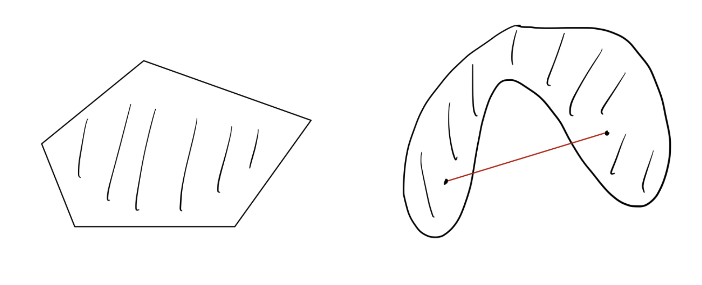
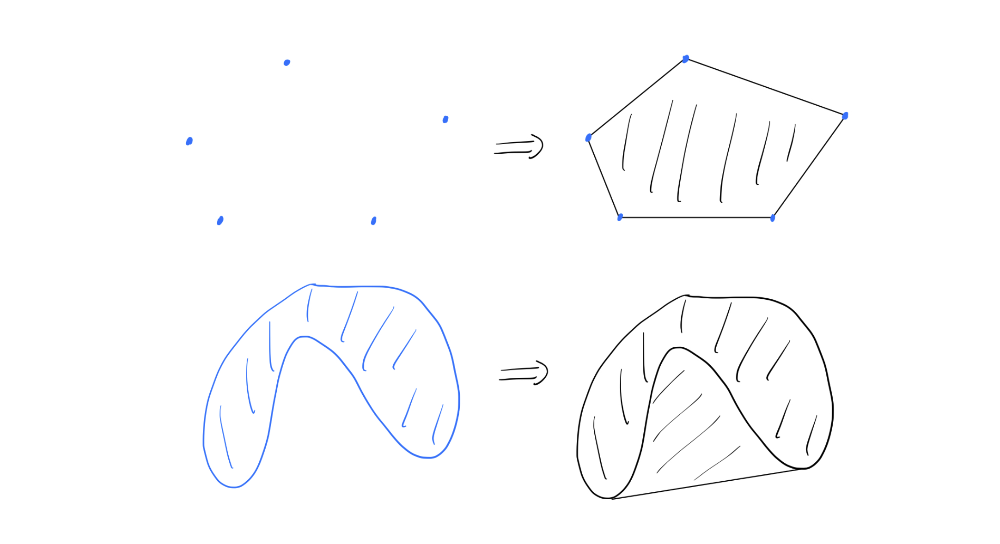
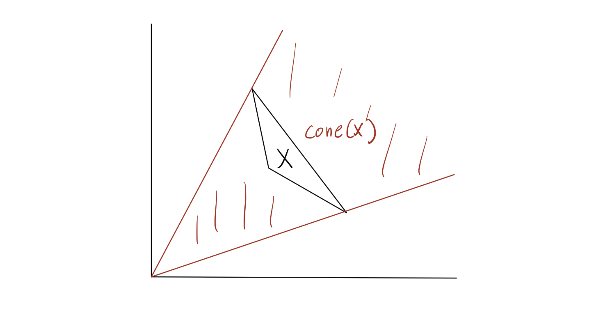
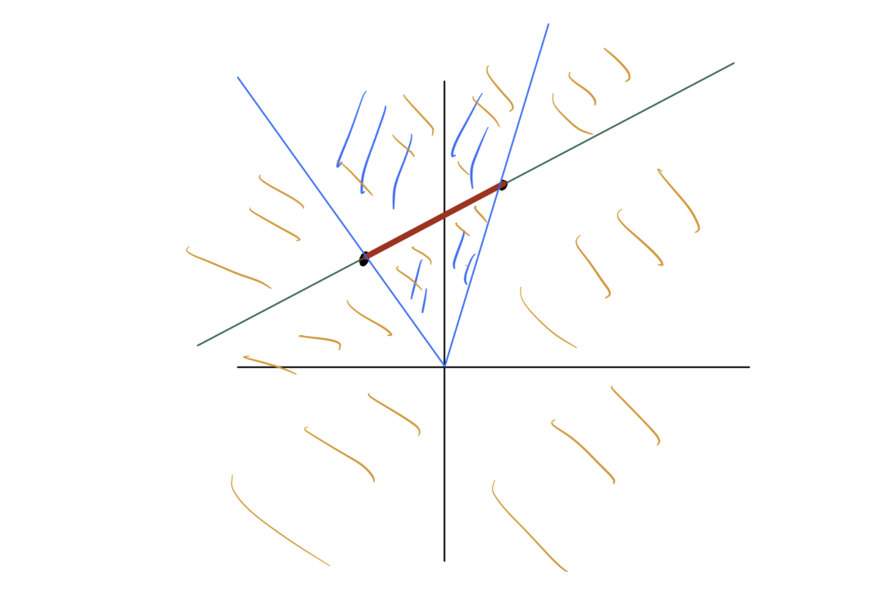

# Introduction

본 포스트는 **Mathematical and Numerical Optimization** 강의의 첫 번째 시간으로, 최적화 이론의 기초가 되는 **Convex Analysis(볼록 해석학)**, 그중에서도 **Convex Set(볼록 집합)**에 대해 다룹니다.

최적화 문제에서 'Convexity(볼록성)'는 매우 중요한 성질입니다. 목적 함수와 제약 조건 영역이 볼록하다면, 국소 최적해(Local Optimum)가 곧 전역 최적해(Global Optimum)임이 보장되기 때문입니다. 이번 강의에서는 이러한 논의를 전개하기 위한 기초 블록인 Convex Set, Cone, Affine Subspace의 개념과 관계를 정의하고 다양한 예시를 살펴봅니다.

---

# 1. Convex Sets

## 1.1 Definition

직관적으로 **Convex Set(볼록 집합)**은 집합 내의 두 점을 이었을 때, 그 연결선이 집합 밖으로 나가지 않는 형태를 의미합니다. 수학적 정의는 다음과 같습니다.

> **Definition 1.1 (Convex Set)**
>
> 집합 $X \subseteq \mathbb{R}^d$가 **Convex**하다는 것은, 임의의 $u, v \in X$와 임의의 $\lambda \in [0, 1]$에 대하여 다음이 성립함을 의미합니다.
> $$\lambda u + (1-\lambda)v \in X$$

여기서 $\lambda u + (1-\lambda)v$는 두 점 $u$와 $v$를 잇는 **선분(Line segment)** 위의 점을 나타냅니다. 즉, 집합 내의 임의의 두 점을 잇는 선분 전체가 해당 집합에 포함되어야 합니다.

## 1.2 Convex Combination & Convex Hull

단순히 두 점을 잇는 것을 넘어, 여러 점을 섞는 개념으로 확장해보겠습니다.

> **Definition 1.2 (Convex Combination)**
>
> $v^1, \dots, v^k \in \mathbb{R}^d$가 주어졌을 때, 다음 조건을 만족하는 선형 결합을 **Convex Combination**이라고 합니다.
> $$\sum_{i=1}^k \lambda_i v^i \quad \text{where} \quad \sum_{i=1}^k \lambda_i = 1, \quad \lambda_i \ge 0 \quad (\forall i=1,\dots,k)$$

두 점 $u, v$의 Convex Combination은 앞서 본 선분 $\{\lambda u + (1-\lambda)v : 0 \le \lambda \le 1\}$과 같습니다.

이제 어떤 집합 $X$를 포함하는 가장 작은 Convex Set을 정의할 수 있습니다. 이를 **Convex Hull**이라고 합니다.

> **Definition 1.3 (Convex Hull)**
>
> 집합 $X$의 Convex Hull, $\text{conv}(X)$는 $X$에 속한 점들의 가능한 모든 Convex Combination의 집합입니다.
>
> $$\text{conv}(X) = \left\{ \sum_{i=1}^n \lambda_i v^i : n \in \mathbb{N}, v^1, \dots, v^n \in X, \sum_{i=1}^n \lambda_i = 1, \lambda_i \ge 0 \right\}$$

중요한 성질은 원래 집합 $X$가 어떤 모양이든 상관없이, **$\text{conv}(X)$는 항상 Convex Set**이라는 점입니다. 기하학적으로는 집합 $X$를 포함하는 고무줄을 팽팽하게 당겼을 때 만들어지는 영역과 유사합니다.

---

# 2. Cones and Affine Subspaces

Convex Set과 유사하지만 제약 조건이 조금 다른 두 가지 중요한 기하학적 구조인 **Cone(원뿔)**과 **Affine Subspace(아핀 부분공간)**를 살펴봅니다.

## 2.1 Cones & Conic Hull

**Cone**은 원점을 기준으로 뻗어나가는 성질을 가집니다.

> **Definition 1.4 (Cone)**
>
> 집합 $C \subseteq \mathbb{R}^d$가 **Cone**이라는 것은, 임의의 $v \in C$와 $\alpha > 0$에 대하여 $\alpha v \in C$가 성립함을 의미합니다.

만약 Cone인 집합 $C$가 Convex 성질까지 만족한다면, 이를 **Convex Cone**이라고 부릅니다. (주의: 모든 Cone이 Convex인 것은 아닙니다. 예를 들어, 두 개의 직선이 원점에서 교차하는 형태는 Cone이지만 Convex는 아닙니다.)

Convex Combination과 유사하게 **Conic Combination**을 정의할 수 있습니다.

> **Definition 1.5 (Conic Combination)**
>
> $v^1, \dots, v^k \in \mathbb{R}^d$의 **Conic Combination**은 계수들의 합이 1일 필요 없이, **비음수(Non-negative)** 조건만 만족하는 선형 결합입니다.
> $$\sum_{i=1}^k \alpha_i v^i \quad \text{where} \quad \alpha_i \ge 0$$

> **Definition 1.6 (Conic Hull)**
>
> 집합 $X$의 Conic Hull, $\text{cone}(X)$는 $X$의 원소들로 만들 수 있는 모든 Conic Combination의 집합입니다.
> $$\text{cone}(X) = \left\{ \sum_{i=1}^n \lambda_i v^i : n \in \mathbb{N}, v^1, \dots, v^n \in X, \lambda_i \ge 0 \right\}$$

$\text{conv}(X)$와 마찬가지로, **$\text{cone}(X)$는 항상 Convex Cone**이 됩니다.

## 2.2 Affine Subspaces & Affine Hull

Affine space는 Linear subspace(선형 부분공간)를 평행 이동한 공간입니다.

> **Definition 1.7 (Affine Combination)**
>
> $v^1, \dots, v^k \in \mathbb{R}^d$의 **Affine Combination**은 계수들의 합이 1이어야 하지만, 계수의 부호에는 제약이 없는(음수 가능) 선형 결합입니다.
> $$\sum_{i=1}^k \theta_i v^i \quad \text{where} \quad \sum_{i=1}^k \theta_i = 1$$

Convex Combination과의 차이점은 $\theta_i$가 음수가 될 수 있다는 점입니다. 이는 두 점을 잇는 '선분'을 넘어, 두 점을 지나는 무한한 '직선' 전체를 표현할 수 있게 합니다.

> **Definition 1.8 (Affine Hull)**
>
> 집합 $X$의 Affine Hull은 $X$의 원소들로 만들 수 있는 모든 Affine Combination의 집합이며, **Affine Subspace spanned by $X$**라고도 합니다.

### Linear Subspace와의 관계
강의 노트에서는 Linear Hull(Linear Subspace spanned by $X$)과 Affine Hull을 비교합니다.

* **Linear Hull:** 모든 선형 결합 (계수 제약 없음). 원점을 반드시 포함.
* **Affine Hull:** 계수 합이 1인 선형 결합. 원점을 포함하지 않을 수 있음.

> **Theorem 1.9**
>
> Affine Subspace는 Linear Subspace의 평행 이동(Translation)입니다.
> 즉, Affine Subspace $V \subseteq \mathbb{R}^d$에 대해 적절한 행렬 $A$와 벡터 $b$가 존재하여 다음과 같이 표현할 수 있습니다.
> $$V = \{ x \in \mathbb{R}^d : Ax = b \}$$

## 2.3 Geometric Comparison (Summary)

2차원 평면상의 두 점 $S = \{u, v\}$가 있을 때, 각 개념이 생성하는 공간의 차이를 비교하면 다음과 같습니다.

1.  **Convex Hull:** 두 점을 잇는 **선분** (빨간색)
2.  **Affine Hull:** 두 점을 지나는 **직선** (초록색)
3.  **Conic Hull:** 원점과 두 점이 만드는 **부채꼴(각) 영역** (파란색)
4.  **Linear Hull:** 원점과 두 점을 포함하는 **전체 2차원 평면** (주황색)

---

# 3. Examples of Convex Sets

강의에서는 Convex Set의 다양한 구체적 예시들을 소개합니다. 이들은 최적화 문제의 제약 조건(Constraints)으로 자주 등장하므로 익숙해질 필요가 있습니다.

## 3.1 Basic Sets
1.  **Empty set & Singletons:** 공집합과 점 하나로 이루어진 집합($\{v\}$)은 Convex입니다.
2.  **Norm ball:** 중심 $c$와 반지름 $r$에 대해, 거리가 $r$ 이하인 점들의 집합.
    $$\{ x \in \mathbb{R}^d : \| x - c \| \le r \}$$
3.  **Ellipsoid (타원체):** $P$가 Positive Definite 행렬일 때,
    $$\{ x \in \mathbb{R}^d : (x - c)^\top P (x - c) \le 1 \}$$
    이는 Norm ball을 선형 변환하여 찌그러뜨린 형태로 볼 수 있습니다.

## 3.2 Hyperplanes & Half-spaces
선형 제약 조건의 기본 단위들입니다.
4.  **Hyperplane (초평면):**
    $$\{ x \in \mathbb{R}^d : a^\top x = b \} \quad (a \in \mathbb{R}^d, b \in \mathbb{R})$$
    이는 Affine set이자 동시에 Convex set입니다.
5.  **Half-space (반공간):** Hyperplane을 기준으로 나뉜 공간의 한쪽 면입니다.
    $$\{ x \in \mathbb{R}^d : a^\top x \le b \}$$

## 3.3 Polyhedra
6.  **Polyhedron (다면체):** 유한한 개수의 Half-space들의 교집합(Intersection)입니다.
    $$\{ x \in \mathbb{R}^d : Ax \le b \}$$
    여기서 $Ax \le b$는 $a_k^\top x \le b_k$ ($k=1,\dots,m$)의 연립 부등식을 의미합니다.
7.  **Polytope:** **Bounded Polyhedron**을 Polytope이라 부릅니다.
    * 동치 정의: 유한한 벡터 집합의 Convex Hull과 같습니다.

## 3.4 Special Cones & Sets
8.  **Simplex (심플렉스):**
    $$\{ x \in \mathbb{R}^d : \mathbf{1}^\top x = 1, x \ge 0 \}$$
    이는 단위 벡터들 $e^1, \dots, e^d$의 Convex Hull과 같습니다. (확률 분포를 나타낼 때 주로 사용됩니다.)
9.  **Nonnegative Orthant:** $\mathbb{R}^d_+ = \{ x \in \mathbb{R}^d : x \ge 0 \}$
10. **Positive Orthant:** $\mathbb{R}^d_{++} = \{ x \in \mathbb{R}^d : x > 0 \}$

## 3.5 Examples of Convex Cones
Convex Cone 역시 Convex Set의 일종입니다.

1.  **Norm Cone:** (특히 Euclidean Norm일 때 **Second-order cone**이라 불림)
    $$\{ (x, t) \in \mathbb{R}^d \times \mathbb{R} : \|x\| \le t \}$$
    아이스크림 콘 모양을 생각하면 됩니다.
2.  **Positive Semidefinite (PSD) Cone:**
    고정된 차원의 모든 Positive Semidefinite 행렬들의 집합입니다.