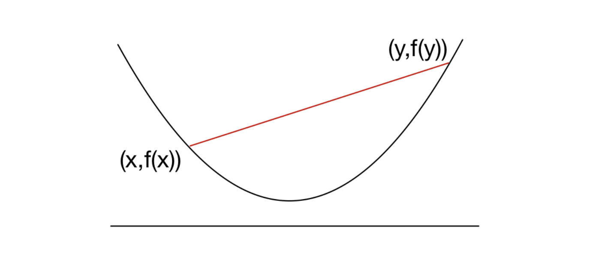
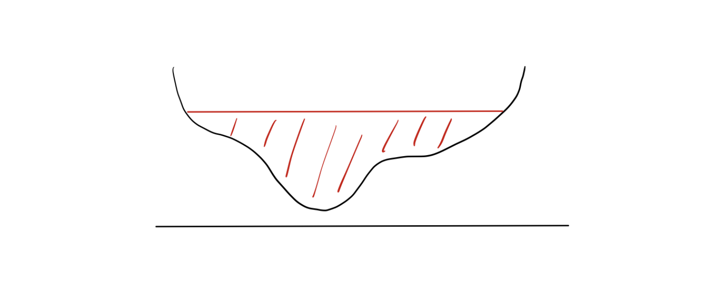

# Introduction

지난 포스트에서는 **Convex Set(볼록 집합)**에 대해 다루었습니다. 이번 포스트에서는 최적화 이론의 핵심인 **Convex Function(볼록 함수)**에 대해 알아봅니다.

최적화 문제 $\min f(x)$에서 함수 $f$가 볼록 함수라면, 우리는 국소 최적해(Local Minima)가 전역 최적해(Global Minima)임을 보장받을 수 있습니다. 이 글에서는 볼록 함수의 수학적 정의와, 이를 더 엄격하게 제한하는 Strict/Strong Convexity, 그리고 다양한 예시들을 정리합니다.

---

# 1. Definition of Convex Functions

## 1.1 Basic Definition

함수 $f: \mathbb{R}^d \to \mathbb{R}$가 **Convex(볼록)**하다는 것은 정의역(Domain)이 볼록 집합이고, 기하학적으로는 함수의 그래프가 두 점을 잇는 선분보다 아래에 위치함을 의미합니다.

> **Definition 1.10 (Convex Function)**
>
> 함수 $f: \mathbb{R}^d \to \mathbb{R}$의 정의역 $\text{dom}(f)$가 Convex Set이고, 임의의 $x, y \in \text{dom}(f)$와 $0 \le \lambda \le 1$에 대하여 다음 부등식이 성립할 때, $f$를 **Convex Function**이라 합니다.
>
> $$f(\lambda x + (1-\lambda)y) \le \lambda f(x) + (1-\lambda)f(y)$$

이 부등식(Jensen's Inequality의 가장 기초적인 형태)은 "두 지점 $x, y$ 사이의 내분점에서 함숫값(좌변)"이 "두 함숫값 $f(x), f(y)$를 연결한 선분의 높이(우변)"보다 작거나 같아야 함을 의미합니다.

## 1.2 Variations of Convexity

Convexity의 개념을 조금 더 세분화하거나 반대 개념을 정의할 수 있습니다.

> **Definition 1.11 (Concave Function)**
>
> 함수 $f$에 대하여 **$-f$가 Convex**라면, $f$를 **Concave(오목)**하다고 합니다.
> (부등호 방향이 반대가 됩니다.)

> **Definition 1.12 (Strict & Strong Convexity)**
>
> 1.  **Strictly Convex:** 등호($=$)가 성립하지 않는 경우입니다. 서로 다른 $x, y$와 $0 < \lambda < 1$에 대해:
>     $$f(\lambda x + (1-\lambda)y) < \lambda f(x) + (1-\lambda)f(y)$$
>     그래프가 평평한 구간(flat region) 없이 둥글어야 합니다.
>
> 2.  **Strongly Convex:** 함수가 2차 함수($x^2$)보다 더 가파르게 굽어있는 경우입니다. 어떤 $\alpha > 0$와 norm $\|\cdot\|$에 대해 다음 함수가 Convex이면 $f$는 Strongly Convex입니다.
>     $$f(x) - \alpha \|x\|^2 \quad \text{is convex}$$

**포함 관계 (Hierarchy):**
$$\text{Strongly Convex} \implies \text{Strictly Convex} \implies \text{Convex}$$
이 관계는 최적화 알고리즘의 수렴 속도(Convergence Rate)를 분석할 때 매우 중요하게 사용됩니다.

---

# 2. Examples of Convex Functions

강의 노트에서는 자주 사용되는 볼록 함수들을 변수의 차원에 따라 분류하여 소개합니다.

## 2.1 Univariate Functions (on $\mathbb{R}$)

1.  **Exponential:** $e^{ax}$ (모든 $a \in \mathbb{R}$에 대해 Convex)
2.  **Power Function $x^a$:**
    * $a \ge 1$ 또는 $a \le 0$: $\mathbb{R}_{++}$에서 Convex.
    * $0 \le a \le 1$: $\mathbb{R}_{+}$에서 **Concave**.
3.  **Logarithm:** $\log x$는 $\mathbb{R}_{++}$에서 **Concave**. (따라서 $-\log x$는 Convex)
4.  **Negative Entropy:** $x \log x$ (또는 맥락에 따라 $-\log x$)는 $\mathbb{R}_{++}$에서 Convex.

## 2.2 Multivariate Functions (on $\mathbb{R}^d$)

1.  **Linear Function:** $a^\top x + b$.
    * Convex이면서 동시에 Concave인 유일한 함수 형태입니다. (등호가 항상 성립)
2.  **Quadratic Function:**
    $$f(x) = \frac{1}{2}x^\top A x + b^\top x + c$$
    * 행렬 $A$가 **Positive Semidefinite ($A \succeq 0$)**일 때 Convex입니다.
3.  **Least Squares Loss:** $\| b - Ax \|_2^2$.
    * 이는 $A^\top A$가 항상 Positive Semidefinite이므로 항상 Convex입니다.
4.  **Norm:** 임의의 Norm $\|\cdot\|$은 Convex입니다.
    * 이유: 삼각 부등식(Subadditivity)과 양의 동차성(Homogeneity)에 의해 정의상 성립합니다.
5.  **Max Eigenvalue:** 대칭 행렬 $X$에 대해, 최대 고유값 $\lambda_{\max}(X)$는 $X$에 대한 Convex 함수입니다.

## 2.3 Constructing Convex Functions from Sets

집합의 성질을 이용해 정의된 특별한 함수들도 있습니다.

1.  **Indicator Function:**
    Convex Set $C$에 대하여,
    $$I_C(x) = \begin{cases} 0, & x \in C \\ \infty, & x \notin C \end{cases}$$
    이 함수는 $C$가 Convex일 때 Convex Function입니다. (제약 조건을 목적 함수에 포함시킬 때 유용)

2.  **Support Function:**
    Convex Set $C$에 대하여,
    $$I_C^*(x) = \sup_{y \in C} \{ y^\top x \}$$
    이는 $x$에 대한 선형 함수들의 상한(Pointwise supremum)이므로 항상 Convex입니다.

3.  **Conjugate Function (Fenchel Conjugate):**
    임의의 함수 $f$에 대하여,
    $$f^*(x) = \sup_{y \in \mathbb{R}^d} \{ y^\top x - f(y) \}$$
    **중요:** 원래 함수 $f$의 Convex 여부와 상관없이, **Conjugate function $f^*$는 항상 Convex**입니다.

---

# 3. Properties: Epigraph & Level Sets

함수의 볼록성을 집합의 볼록성과 연결 짓는 두 가지 중요한 개념이 있습니다.

## 3.1 Epigraph (에피그래프)

함수 $f$의 그래프 **위쪽 영역**을 Epigraph라고 합니다.

> **Definition 1.13 (Epigraph)**
> $$\text{epi}(f) = \{ (x, t) \in \text{dom}(f) \times \mathbb{R} : f(x) \le t \}$$

**Theorem (Exercise 1.14):**
함수 $f$가 Convex Function일 필요충분조건은 **$\text{epi}(f)$가 Convex Set**인 것입니다.
$$f \text{ is convex} \iff \text{epi}(f) \text{ is a convex set}$$

*Example 1.15:*
Norm function $f(x) = \|x\|$의 Epigraph는 $\{(x,t) : \|x\| \le t\}$입니다. 이는 지난 시간에 배운 **Norm Cone**이며, Norm Cone은 Convex Cone이므로 Norm function은 Convex function입니다.

## 3.2 Level Sets (등고선 집합)

함숫값이 특정 값 $\alpha$ 이하인 영역입니다.

> **Definition (Level Set)**
> $$S_\alpha = \{ x \in \text{dom}(f) : f(x) \le \alpha \}$$

> **Remark 1.16**
> * 만약 $f$가 Convex Function이면, 모든 $\alpha$에 대해 **Level Set은 항상 Convex Set**입니다.
> * **주의:** 역은 성립하지 않습니다. Level Set이 모두 Convex라고 해서 그 함수가 반드시 Convex Function인 것은 아닙니다. (이런 함수를 *Quasi-convex*라고 합니다.)

아래 그림은 Level Set은 볼록하지만, 함수 자체는 볼록하지 않은(Non-convex) 반례를 보여줍니다.

