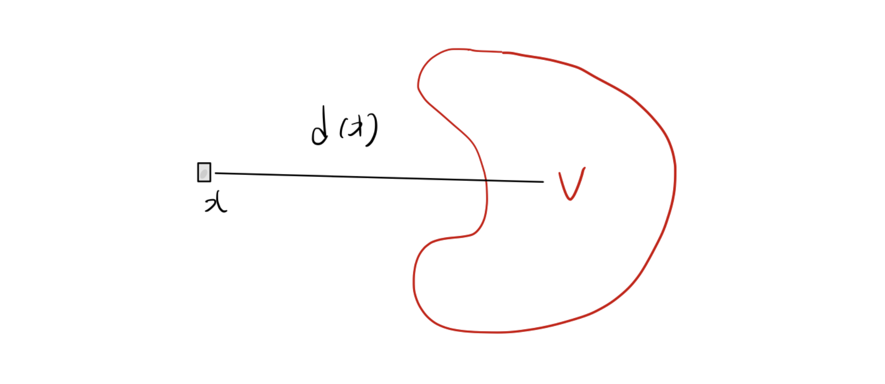

# 1. Motivation: 군집의 중심 찾기 (Center of a Cluster)

* 의사결정 문제에서 어떤 최적화 문제들이 선형 계획법으로 모델링될 수 있을까요?  일반적인 최적화 문제는 다음과 같은 형태를 가집니다.

$$
\begin{aligned}
\min_{x} \quad & f(x) \\
\text{s.t.} \quad & g_i(x) \le 0, \quad i \in [m] \\
& x \in \mathbb{R}^d
\end{aligned}
$$

* 만약 목적 함수 $f$와 제약 함수 $g_1, \dots, g_m$이 모두 선형(Linear)이라면 이 문제는 당연히 LP입니다. 하지만 함수가 비선형이더라도, 우리는 종종 이 문제를 LP로 "재표현"할 수 있습니다.

* 예를들어, 데이터 포인트 군집 $V = \{v^1, \dots, v^n\} \subseteq \mathbb{R}^d$ 가 있다고 해봅시다. 우리의 목표는 이 $n$개의 벡터들로부터의 거리 $d(x)$를 최소화하는 **군집의 중심(Center)** $x$를 찾는 것입니다. 

* 중심점을 정하는 기준은 점 $x$와 집합 $V$ 사이의 거리 $d(x)$를 최소화하는 것입니다. 즉, 최적화 문제는 다음과 같습니다.
$$\min_{x} d(x)$$

* 거리 함수 $d(x)$를 어떻게 정의하느냐에 따라 다음 네 가지 최적화 문제를 생각할 수 있습니다:
  * 1. **$\ell_1$-거리의 합:** $d(x) = \sum_{i \in [n]} \|x - v^i\|_1$ 
  * 2. **$\ell_\infty$-거리의 합:** $d(x) = \sum_{i \in [n]} \|x - v^i\|_\infty$ 
  * 3. **$\ell_1$-거리의 최댓값:** $d(x) = \max_{i \in [n]} \|x - v^i\|_1$ 
  * 4. **$\ell_\infty$-거리의 최댓값:** $d(x) = \max_{i \in [n]} \|x - v^i\|_\infty$ 

* 벡터의 Norm이나 Max 연산은 명백히 **비선형(Non-linear)** 함수입니다. 그럼에도 불구하고, 이 문제들은 모두 선형 계획법으로 변환할 수 있습니다. 이를 가능하게 하는 핵심 개념이 바로 **선형 표현 가능성(Linear Representability)**입니다.

---

# 2. 선형 표현 가능 함수 (Linearly Representable Functions)

## 2.1. 에피그래프(Epigraph)와 선형 표현의 정의

* 함수 $f: \mathbb{R}^d \rightarrow \mathbb{R}$의 **에피그래프(Epigraph)**는 함수의 그래프 위쪽에 놓인 점들의 집합으로 정의됩니다.

$$
epi(f) = \{(x, t) \in \mathbb{R}^d \times \mathbb{R} : f(x) \le t\} \subseteq \mathbb{R}^{d+1}
$$ 

* 어떤 함수 $f$가 **선형 표현 가능(Linearly representable)**하다는 것은, 그 에피그래프가 유한 개의 선형 부등식 시스템으로 표현될 수 있음을 의미합니다.
$$
epi(f) = \left\{ (x, t) \in \mathbb{R}^d \times \mathbb{R} : \exists y \in \mathbb{R}^p \text{ s.t. } Ax + Dy + ht \le r \right\}
$$ 
  * 여기서 $A \in \mathbb{R}^{l \times d}$, $D \in \mathbb{R}^{l \times p}$, 그리고 $h, r \in \mathbb{R}^l$ 입니다. 
* 이 선형 부등식 시스템을 만들기 위해 새롭게 도입된 변수 $y$를 **보조 변수(Auxiliary variables)**라고 부릅니다.
* 보조 변수 $y$를 포함한 고차원 공간에서 $Ax + Dy + ht \le r$ 를 만족하는 점들을 모은 뒤 , $(x, t)$ 부분만 추출해낸 것이 $epi(f)$가 됩니다.

## 2.2. [Theorem 3.3] LP 재표현 정리와 증명

> **정리 (Theorem 3.3):** 
> 
> 목적 함수 $f$와 제약 함수 $g_i$들이 모두 선형 표현 가능하다면, 원래의 비선형 최적화 문제는 선형 계획법으로 재표현될 수 있다.

### **변환 과정:**
* 원래 문제를 에피그래프를 사용하여 다음과 같이 바꿀 수 있습니다.

$$
\begin{aligned}
\min_{x, t} \quad & t \\
\text{s.t.} \quad & f(x) \le t \quad \iff \quad (x, t) \in epi(f) \\
& g_i(x) \le 0 \quad \iff \quad (x, 0) \in epi(g_i)
\end{aligned}
$$

* 이제 각 함수의 선형 표현(보조 변수 $y, z^1, \dots, z^m$ 도입)을 대입하면 최종적으로 다음과 같은 거대한 LP 형태가 됩니다.

$$
\begin{aligned}
\min_{x, t, y, z^1 \dots z^m} \quad & t \\
\text{s.t.} \quad & Ax + Dy + ht \le r \quad \text{(목적 함수 에피그래프 조건)} \\
& A^i x + D^i z^i \le r^i, \quad i \in [m] \quad \text{(각 제약 조건 에피그래프 조건)}
\end{aligned}
$$

### **증명 (Proof):**
* 원래의 목표는 $f(x)$를 최소화하는 것입니다. 보조 변수 $t \in \mathbb{R}$를 도입하면, 이 문제는 $f(x) \le t$ 라는 제약 조건 하에서 $t$를 최소화하는 문제와 완벽히 동치입니다.
$$\min_{x, t} \{ t : f(x) \le t, g_i(x) \le 0, \forall i \in [m] \}$$ 

* 이를 에피그래프의 정의를 이용해 다시 쓰면 다음과 같습니다.
$$\min_{x, t} \{ t : (x, t) \in epi(f), (x, 0) \in epi(g_i), \forall i \in [m] \}$$ 

* $f$가 선형 표현 가능하므로, 어떤 $y \in \mathbb{R}^p$에 대해 $Ax + Dy + ht \le r$ 을 만족합니다.
* 마찬가지로, 각 $g_i$도 선형 표현 가능하므로 보조 변수 $z^i \in \mathbb{R}^{q_i}$에 대해 다음을 만족합니다.
$$epi(g_i) = \{(x, t) : \exists z^i \in \mathbb{R}^{q_i} \text{ s.t. } A^i x + D^i z^i + h^i t \le r^i \}$$ 

* 여기서 $(x, 0) \in epi(g_i)$ 이므로 $t=0$이 대입되어 $h^i t$ 항은 사라집니다. 이 모든 조건을 합치면 거대한 선형 계획법이 탄생합니다.

$$
\begin{aligned}
\min_{x, t, y, z^1 \dots z^m} \quad & t \\
\text{s.t.} \quad & Ax + Dy + ht \le r \\
& A^i x + D^i z^i \le r^i, \quad i \in [m]
\end{aligned}
$$ 

## 2.3. Example: 비선형 함수의 선형 표현

* $f(x_1, x_2, x_3) = \max\{x_1, 2x_2 + x_3, 2x_3 - x_1\}$ 이라는 비선형 함수를 봅시다.
* 이 함수의 에피그래프는 $\max\{\dots\} \le t$ 인 집합입니다.
* 최댓값이 $t$보다 작거나 같다는 것은, 괄호 안의 **모든** 요소가 $t$보다 작거나 같다는 것과 동치입니다.

$$x_1 \le t, \quad 2x_2 + x_3 \le t, \quad 2x_3 - x_1 \le t$$ 

* 따라서 $epi(f)$는 위 세 개의 선형 부등식으로 표현되므로, 이 함수는 선형 표현 가능합니다.

---

# 3. 보조 변수와 사영 (Projection)

* 선형 표현식에 등장하는 보조 변수 $y$는 기하학적으로 **사영(Projection)**이라는 깊은 의미를 갖습니다. 
* 공간 $\mathbb{R}^d \times \mathbb{R}^p$ 에 있는 집합 $C$의 $x$ 공간($\mathbb{R}^d$)으로의 사영은 다음과 같이 정의됩니다.

$$proj_x(C) = \{ x \in \mathbb{R}^d : \exists y \in \mathbb{R}^p \text{ s.t. } (x, y) \in C \}$$ 

* 이를 "$y$ 변수들을 투영하여 없앤다(Projecting out)"고 합니다.

* 다시 에피그래프로 돌아가 보겠습니다. 변수 $(x, y, t)$가 이루는 다면체 $P = \{(x, y, t) : Ax + Dy + ht \le r\}$ 가 있습니다. $epi(f)$는 단순히 이 다면체 $P$에서 $y$ 변수들을 무시하고 $(x, t)$ 공간으로 사영시킨 결과입니다. 즉, 에피그래프가 다면체의 사영이라면 그 함수는 선형 표현이 가능합니다.

* 그렇다면 다면체의 사영은 항상 다면체일까요?
  * 네, 그렇습니다. 이를 대수적으로 증명하는 알고리즘이 바로 **Fourier-Motzkin 소거법**입니다.

## 3.1. [Theorem 3.5] Fourier-Motzkin Elimination

> **정리 (Theorem 3.5):** 다면체의 사영은 여전히 다면체이다.

* 보조 변수를 기하학적으로 사영시키는 과정을 대수적으로 수행하는 방법이 바로 **Fourier-Motzkin 소거법**입니다. 연립 선형 부등식에서 특정 변수(예: $y_1$)를 없애는 과정으로, 다면체의 사영 역시 다면체임을 대수적으로 증명하는 핵심 원리입니다.

* 목표 변수 $y_1$을 소거하기 위해, 부등식 시스템 $Ax + Dy + ht \le r$ 의 $i$번째 행을 다음과 같이 $y_1$을 기준으로 정리해 봅니다.
  * 여기서 $y_{-1}$은 $y_1$을 제외한 나머지 $y$ 변수들을 의미합니다.

$$D_{i1} y_1 \le r_i - A_i x - D_{i,-1} y_{-1} - h_i t$$

* 이제 양변을 $y_1$의 계수인 $D_{i1}$으로 나누어야 하는데, **나누는 값의 부호에 따라 부등호의 방향이 달라지므로** 전체 부등식을 세 그룹으로 나눕니다:
  * **$I_+$ 그룹 ($D_{i1} > 0$):** 양수로 나누므로 부등호 방향이 유지되며, $y_1$에 대한 **상한(Upper bound, 천장)**을 제공합니다.
    $$y_1 \le \frac{r_i - A_i x - D_{i,-1} y_{-1} - h_i t}{D_{i1}} \quad \text{for } i \in I_+$$
  * **$I_-$ 그룹 ($D_{j1} < 0$):** 음수로 나누므로 부등호 방향이 반대로 뒤집히며, $y_1$에 대한 **하한(Lower bound, 바닥)**을 제공합니다. (인덱스를 $j$로 표기)
    $$y_1 \ge \frac{r_j - A_j x - D_{j,-1} y_{-1} - h_j t}{D_{j1}} \quad \text{for } j \in I_-$$
  * **$I_0$ 그룹 ($D_{i1} = 0$):** $y_1$이 아예 포함되지 않은 식들입니다.

* 이제 $y_1$이 존재하기 위한 조건은 명확합니다. 모든 하한(바닥)보다는 크거나 같아야 하고, 모든 상한(천장)보다는 작거나 같아야 합니다. $j \in I_-$인 식과 $i \in I_+$인 식을 짝지어(Pairing) 가운데에 $y_1$을 두면 다음을 얻습니다:

$$
\frac{r_j - A_j x - D_{j,-1} y_{-1} - h_j t}{D_{j1}} \le y_1 \le \frac{r_i - A_i x - D_{i,-1} y_{-1} - h_i t}{D_{i1}}
$$

* 여기서 가운데의 $y_1$을 매개로 양 끝단을 직접 연결하면, **$y_1$이 완전히 소거된 새로운 부등식**을 얻게 됩니다.

$$
\frac{r_j - A_j x - D_{j,-1} y_{-1} - h_j t}{D_{j1}} \le \frac{r_i - A_i x - D_{i,-1} y_{-1} - h_i t}{D_{i1}}
$$

* 이 짝짓기 과정을 $I_+$와 $I_-$ 그룹의 모든 가능한 조합에 대해 수행하고, 원래부터 $y_1$이 없었던 $I_0$ 그룹의 식들과 합치면 $y_1$이 투영되어 완벽히 제거된 새로운 연립 부등식 세트가 완성됩니다. 

* 이 과정을 모든 보조 변수 $y$에 대해 반복하면 최종적으로 $x, t$에 대한 유한 개의 부등식(즉, 에피그래프)만 남게 되며, 이를 통해 **다면체의 사영이 여전히 다면체임**을 증명할 수 있습니다.

---

# 4. 자주 쓰이는 선형 표현 가능 함수와 보존 연산

* **절댓값 (Absolute value):** $f(x) = |x|$. 
  $|x| \le t \iff -t \le x \le t$. 
  $epi(f) = \{(x, t) : -t \le x \le t\}$ 
* **볼록 조각적 선형 함수 (Convex piecewise linear):** $f(x) = \max_{i \in [n]} \{ c_i^\top x + d_i \}$. 
  $epi(f) = \{(x, t) : c_i^\top x + d_i \le t, \forall i \in [n]\}$ 
* **$\ell_\infty$-norm:** $f(x) = \|x\|_\infty = \max_{j \in [d]} |x_j|$.
  $|x_j| \le t \iff -t \le x_j \le t \quad \forall j \in [d]$. 
* **$\ell_1$-norm:** $f(x) = \|x\|_1 = \sum_{j \in [d]} |x_j|$.
  이 경우 보조 변수 $s_1, \dots, s_d \in \mathbb{R}$ 이 필요합니다. 각 절댓값의 상한을 $s_j$로 둡니다.
  $-s_j \le x_j \le s_j \quad \forall j \in [d]$, 그리고 $\sum_{j \in [d]} s_j \le t$.

## 4.1. [Theorem 3.6] 선형 표현 가능성을 보존하는 연산

* 선형 표현 가능한 함수들을 블록처럼 조립하여 더 복잡한 함수를 만들어도, 그 성질이 그대로 보존되는 마법 같은 연산들이 있습니다.

> **정리 (Theorem 3.6):** $f_1(x), \dots, f_n(x)$ 가 선형 표현 가능하다면 다음이 성립한다.
> 
> 1. 비음수 가중치 합 $\sum_{i \in [n]} \alpha_i f_i(x)$ ($\alpha_i \ge 0$) 은 선형 표현 가능하다.
> 
> 2. 점별 최댓값(Point-wise max) $\max_{i \in [n]} f_i(x)$ 은 선형 표현 가능하다.

### **증명 (Proof):**
* 1. **가중치 합:** 
  * 합을 선형화하기 위해 보조 변수 $s \in \mathbb{R}^n$을 도입합니다.
  * $\sum \alpha_i f_i(x) \le t$ 는 "어떤 $s_i$들이 존재하여 $\sum \alpha_i s_i \le t$ 이고, 각 $f_i(x) \le s_i$ 이다" 로 바꿀 수 있습니다. 
  * $f_i(x) \le s_i$ 는 곧 $(x, s_i) \in epi(f_i)$ 를 의미하며, $epi(f_i)$가 선형 부등식 시스템이므로 이를 결합한 전체 에피그래프 역시 선형 시스템이 됩니다.
* 2. **최댓값:** 
  * $\max f_i(x) \le t$ 는 모든 $i$에 대해 $f_i(x) \le t$ 와 완벽히 동치입니다. 
  * 즉, $(x, t) \in epi(f_i)$ 가 모든 $i$에 대해 성립하므로, 개별 에피그래프들의 교집합(선형 부등식들의 단순 나열)이 되어 선형 표현 가능합니다.