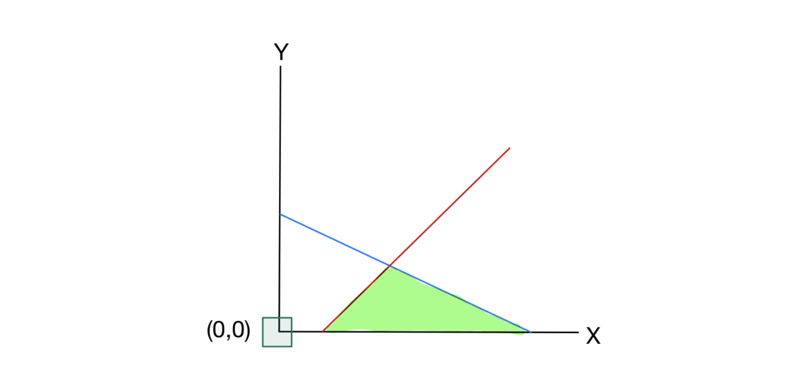

# 1. Introduction: 초기 사전(Initial Dictionary)의 실현 가능성

* 이번 포스트에서는 선형계획법(Linear Programming, LP)을 풀기 위한 **2단계 심플렉스 알고리즘(Two-Phase Simplex Algorithm)**에 대해 다룹니다. 이전 강의에서는 심플렉스 알고리즘의 기본적인 동작 원리를 배웠습니다. 하지만, 항상 알고리즘을 즉시 시작할 수 있는 것은 아닙니다. 문제가 주어졌을 때 기본적으로 설정하는 '초기 사전(Initial Dictionary)'이 실현 불가능(infeasible)할 수 있기 때문입니다. 

## 1.1 실현 가능한 초기 사전의 예
* 이전 강의에서 다루었던 다음 선형계획문제를 복습해 보겠습니다.

$$
\begin{aligned}
\max \quad & z = 5x + 4y \\
\text{s.t.} \quad & 2x + 3y \le 150 \\
& 2x + y \le 70 \\
& x, y \ge 0
\end{aligned}
$$ 

* 이 문제를 여유 변수(slack variables) $s_1, s_2$를 도입하여 표준형(Standard form)으로 변환하면 다음과 같은 초기 사전을 얻습니다.

$$
\begin{aligned}
z &= 0 + 5x + 4y \\
s_1 &= 150 - 2x - 3y \\
s_2 &= 70 - 2x - y
\end{aligned}
$$ 

* 여기서 비기저 변수(non-basic variables)인 $x, y$를 $0$으로 설정하면, 초기 기저해(Initial solution)는 $(x, y, s_1, s_2) = (0, 0, 150, 70)$이 됩니다. 이 해는 모든 변수가 $0$ 이상이어야 한다는 비음 제약조건($x, y, s_1, s_2 \ge 0$)을 만족하므로 **실현 가능한(feasible)** 사전입니다. 이는 우변의 상수항(150, 70)이 모두 양수였기 때문에 가능했습니다.

## 1.2 실현 불가능한 초기 사전의 발생 (Motivation)
* 그렇다면 우변의 값이 음수인 제약조건이 포함된 경우는 어떨까요? 

$$
\begin{aligned}
\max \quad & z = x + 2y \\
\text{s.t.} \quad & 2x + 3y \le 150 \\
& -x + y \le -25 \\
& x, y \ge 0
\end{aligned}
$$ 

* 마찬가지로 여유 변수 $s_1, s_2$를 도입하여 등식으로 변환해 봅니다.

$$
\begin{aligned}
z &= 0 + x + 2y \\
s_1 &= 150 - 2x - 3y \\
s_2 &= -25 + x - y
\end{aligned}
$$ 

* 이 상태에서 초기 기저해를 구하기 위해 $x=0, y=0$을 대입하면, $s_1 = 150$이지만 **$s_2 = -25$**가 됩니다. 이는 $s_2 \ge 0$이라는 비음 제약조건을 명백히 위반합니다. 우리는 이러한 상태를 **실현 불가능한 사전(infeasible dictionary)**이라 부르며, 이 상태에서는 기존의 심플렉스 알고리즘을 바로 시작할 수 없습니다.

* 이 문제를 해결하기 위해 도입된 기법이 바로 **2단계 심플렉스 알고리즘(Two-Phase Simplex Algorithm)**입니다.
  * **Phase I**: 실현 가능한 사전을 찾거나, 해당 LP가 근본적으로 실현 불가능함을 증명합니다.
  * **Phase II**: Phase I에서 찾은 실현 가능한 사전을 바탕으로 최적해를 찾습니다.

---

# 2. Phase I: Finding a Feasible Dictionary

* 원래 문제의 실현 가능성을 평가하고 초기 사전을 구하기 위해, 우리는 새로운 보조 변수(auxiliary variable) $t$를 도입하여 완전히 새로운 보조 선형계획문제(Auxiliary LP)를 구성합니다. 

## 2.1 보조 선형계획문제 구성
* 각 제약식에 $-t$를 추가하고, $t$를 최소화하는 문제로 만듭니다.

$$
\begin{aligned}
\min \quad & t \\
\text{s.t.} \quad & 2x + 3y - t \le 150 \\
& -x + y - t \le -25 \\
& x, y, t \ge 0
\end{aligned}
$$ 

* 이 보조 문제의 본질은 원 문제의 제약조건을 만족시키기 위해 얼마나 제약을 '위반($t$)'해야 하는지를 측정하는 것입니다.

> **Theorem 4.1.** 원래의 선형계획문제가 실현 가능하다는 것은, 위 보조 선형계획문제가 실현 가능하며 그 최적값이 0이라는 것과 필요충분조건이다.

> **Proof.**
> 
> 1. 보조 문제는 $t$를 충분히 큰 값으로 설정하면 제약조건($\le 150$, $\le -25$)을 항상 만족시킬 수 있으므로 무조건 실현 가능합니다.
> 
> 2. 보조 문제의 최적값이 $0$이라는 것은 최적해에서 $t=0$임을 의미합니다. $t=0$을 제약조건에 대입하면 원래 문제의 제약조건과 정확히 일치하므로, 이 해 $(x, y)$는 원 문제의 실현 가능한 해가 됩니다. 

## 2.2 Phase I 심플렉스 연산
* 이제 보조 문제를 표준형으로 바꾸고 사전을 구성해봅시다. 목적 함수는 $t$를 최소화하는 것이지만, 심플렉스 꼴로 맞추기 위해 극대화 문제인 $z_{aux} = -t$로 생각할 수 있습니다.

$$
\begin{aligned}
z &= -t \\
s_1 &= 150 - 2x - 3y + t \\
s_2 &= -25 + x - y + t
\end{aligned}
$$ 

* 이 사전 역시 여전히 $x=y=t=0$일 때 $s_2 = -25$로 실현 불가능합니다. 하지만 $t$라는 변수가 존재하므로, **의도적으로 $t$를 기저 변수로 만들고, 가장 음수 값이 큰 기본 변수($s_2$)를 비기저 변수로 내보내는 특수한 피벗(Pivot)**을 수행합니다.

### **[Step 1] $t$를 좌변으로 이동시키기 위한 행 연산**
* 두 식을 빼서 $t$를 소거해봅시다.
$$s_1 - s_2 = (150 - (-25)) - 2x - x - 3y - (-y) + t - t$$
$$s_1 - s_2 = 175 - 3x - 2y$$ 
* 따라서 $s_1 = 175 - 3x - 2y + s_2$가 됩니다.

* 이제 $s_2$ 식을 $t$에 대해 정리하여 $t$를 좌변으로, $s_2$를 우변으로 보냅니다.
$$t = 25 - x + y + s_2$$ 

* 이를 목적함수 $z = -t$에 대입하면:
$$z = -(25 - x + y + s_2) = -25 + x - y - s_2$$ 

* 새롭게 얻은 사전은 다음과 같습니다.
$$
\begin{aligned}
z &= -25 + x - y - s_2 \\
s_1 &= 175 - 3x - 2y + s_2 \\
t &= 25 - x + y + s_2
\end{aligned}
$$ 

* 이제 비기저 변수 $x=y=s_2=0$을 대입하면 $s_1=175, t=25$로 모든 변수가 양수가 되어 **실현 가능한 사전**이 되었습니다. 이제 정상적인 심플렉스 알고리즘을 수행할 수 있습니다.

### **[Step 2] 정상적인 심플렉스 피벗 수행**
* 목적 함수 $z = -25 + x - y - s_2$에서 $x$의 계수가 양수($+1$)이므로, $x$를 기저 변수로 진입시킵니다. $x$를 얼마나 증가시킬 수 있는지 확인합니다.
  * $s_1$ 식에서: $x \le 175 / 3$
  * $t$ 식에서: $x \le 25 / 1$

* 최소 허용치인 $\min\{\frac{175}{3}, 25\} = 25$를 선택합니다. 따라서 $t$가 비기저 변수로 내려갑니다 (즉 $t=0$).
* $t$ 식을 $x$에 대해 정리하면:
$$x = 25 - t + y + s_2$$ 

* 이를 $s_1$과 $z$식에 대입(행 연산 적용)합니다.
$$
\begin{aligned}
s_1 &= 175 - 3(25 - t + y + s_2) - 2y + s_2 \\
&= 175 - 75 + 3t - 3y - 3s_2 - 2y + s_2 \\
&= 100 + 3t - 5y - 2s_2
\end{aligned}
$$ 

$$
\begin{aligned}
z &= -25 + (25 - t + y + s_2) - y - s_2 \\
&= -t
\end{aligned}
$$ 

* 최종 Phase I 사전은 다음과 같습니다.
$$
\begin{aligned}
z &= -t \\
s_1 &= 100 + 3t - 5y - 2s_2 \\
x &= 25 - t + y + s_2
\end{aligned}
$$ 

* 목적 함수에 양수 계수가 없으므로 현재 사전은 **최적**입니다. 보조 문제의 최적값이 $z = -t = 0$이므로 원 문제는 실현 가능함이 증명되었습니다. 이제 보조 변수 $t$를 제거하고 얻은 $s_1, x$의 식을 Phase II의 초기 사전으로 사용합니다.

---

# 3. Phase II: Running the Simplex Method

* Phase I에서 $t$를 제거하여 얻은 실현 가능한 제약식 사전은 다음과 같습니다.
$$
\begin{aligned}
s_1 &= 100 - 5y - 2s_2 \\
x &= 25 + y + s_2
\end{aligned}
$$ 

## 3.1 목적 함수 복원
* Phase II에서는 보조 목적 함수가 아닌 원 문제의 목적 함수 $z = x + 2y$를 사용해야 합니다. 이 목적 함수를 비기저 변수($y, s_2$)만으로 표현하기 위해, 방금 구한 $x$ 식을 대입합니다.

$$
\begin{aligned}
z &= (25 + y + s_2) + 2y \\
&= 25 + s_2 + 3y
\end{aligned}
$$ 

* 이제 Phase II를 시작하기 위한 완전한 **첫 번째 실현 가능한 사전(first feasible dictionary)**이 완성되었습니다.

$$
\begin{aligned}
z &= 25 + s_2 + 3y \\
s_1 &= 100 - 2s_2 - 5y \\
x &= 25 + s_2 + y
\end{aligned}
$$ 

* 이 사전에서의 초기 기저해는 $(x,y) = (25,0)$, $(s_1,s_2) = (100,0)$ 입니다.

## 3.2 Phase II 최적화 수행
* 현재 목적 함수 $z = 25 + s_2 + 3y$에서 변수 $y$의 계수가 양수($+3$)이므로 $y$를 기저 변수로 진입시킵니다.
* $y$는 $s_1$ 식에서 $100/5 = 20$까지 증가시킬 수 있습니다. 따라서 $s_1$이 비기저 변수가 됩니다.

* $s_1$ 식을 $y$에 대해 풀면:
$$5y = 100 - s_1 - 2s_2 \quad \implies \quad y = 20 - 0.2s_1 - 0.4s_2$$ 

* 이를 $x$식과 $z$식에 대입합니다.
$$
\begin{aligned}
x &= 25 + s_2 + (20 - 0.2s_1 - 0.4s_2) \\
&= 45 - 0.2s_1 + 0.6s_2
\end{aligned}
$$ 

$$
\begin{aligned}
z &= 25 + s_2 + 3(20 - 0.2s_1 - 0.4s_2) \\
&= 25 + s_2 + 60 - 0.6s_1 - 1.2s_2 \\
&= 85 - 0.6s_1 - 0.2s_2
\end{aligned}
$$ 

### **최종 사전:**
$$
\begin{aligned}
z &= 85 - 0.6s_1 - 0.2s_2 \\
y &= 20 - 0.2s_1 - 0.4s_2 \\
x &= 45 - 0.2s_1 + 0.6s_2
\end{aligned}
$$ 

* 목적 함수의 모든 변수 계수가 음수가 되었으므로, 이 사전은 **최적(Optimal)**입니다.
* 최적해는 비기저 변수를 $0$으로 두었을 때 얻어지는 **$(x,y) = (45, 20)$**, 최적값은 **$z = 85$**입니다.

---

# 4. Geometry (기하학적 해석)

* 이러한 대수학적인 단계들이 실제 좌표평면상에서 어떻게 이동하는지 시각적으로 이해해 봅시다.

## 4.1 초기 실현 불가능 영역

* 가장 처음 심플렉스를 시도했던 $(x,y)=(0,0)$은 제약조건 $-x+y \le -25$를 만족하지 못해 실현 가능 영역(녹색 부분) 바깥에 위치합니다. 따라서 여기서부터는 모서리(가장자리)를 타고 이동하는 심플렉스 탐색을 시작할 수 없습니다.

## 4.2 Phase I에서 Phase II로의 전환 및 최적해 탐색

* Phase I의 보조 문제를 푸는 과정은 사실 이 외부의 점 $(0,0)$에서 출발하여 어떻게든 실현 가능한 다면체(Polyhedron)의 꼭짓점 위로 올라타기 위한 과정이었습니다. 그 결과 도달한 점이 바로 좌측 그래프의 **$(25,0)$**입니다.
* 이후 Phase II에서는 다시 원래의 목적 함수를 이정표 삼아 모서리를 타고 이동하였고, 마침내 우측 그래프의 **$(45,20)$**에서 탐색을 멈추고 최적해를 확정지었습니다.