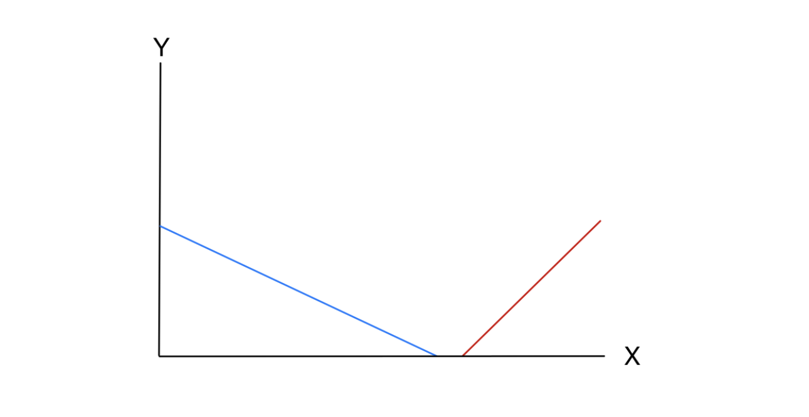
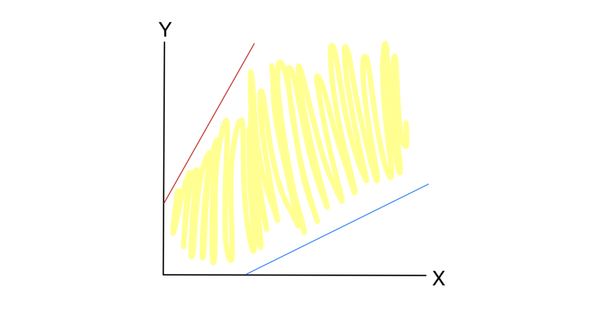

# 1. Introduction: 심플렉스 방법의 예외적 상황들

* 이전 포스트에서는 정상적으로 최적해를 찾을 수 있는 선형계획문제(Linear Programming, LP)에 대해, 초기 사전이 실현 불가능할 때 2단계 심플렉스 알고리즘(Two-Phase Simplex Algorithm)을 적용하는 방법을 다루었습니다. 

* 이번 연속 포스트에서는 심플렉스 알고리즘을 수행하는 과정에서 마주칠 수 있는 두 가지 치명적인(pathological) 케이스, 즉 **실현 불가능한 문제(Infeasible Case)**와 **무한한 문제(Unbounded Case)**를 알고리즘 내에서 어떻게 판별하는지 수학적 유도와 기하학적 직관을 통해 상세히 살펴봅니다.

---

# 2. Infeasible Case (실현 불가능한 선형계획문제)

* 어떤 선형계획문제는 주어진 모든 제약조건을 동시에 만족하는 해공간(Feasible Region) 자체가 아예 존재하지 않을 수 있습니다. 이러한 문제를 알고리즘이 어떻게 식별해내는지 다음 예시를 통해 알아봅시다.

## 2.1 문제 정의 및 Phase I 초기 설정

* 다음과 같은 선형계획문제를 고려해 보겠습니다.

$$
\begin{aligned}
\max \quad & z = x + 2y \\
\text{s.t.} \quad & 2x + 3y \le 150 \\
& -x + y \le -90 \\
& x, y \ge 0
\end{aligned}
$$ 

* 두 번째 제약조건의 우변이 음수($-90$)이므로, 일반적인 초기 여유 변수(slack variable) 설정으로는 즉시 실현 가능한 사전을 얻을 수 없습니다. 따라서 이전 강의에서 배운 대로 **Phase I (1단계)** 절차를 수행하기 위해 보조 변수 $t$를 도입하여 보조 문제를 구성합니다.

$$
\begin{aligned}
\min \quad & t \\
\text{s.t.} \quad & 2x + 3y - t \le 150 \\
& -x + y - t \le -90 \\
& x, y, t \ge 0
\end{aligned}
$$ 

* 이를 최대화 문제($z = -t$)로 바꾸고 여유 변수 $s_1, s_2$를 도입하여 초기 사전을 구성하면 다음과 같습니다.

$$
\begin{aligned}
z &= -t \\
s_1 &= 150 - 2x - 3y + t \\
s_2 &= -90 + x - y + t
\end{aligned}
$$ 

## 2.2 Phase I 피벗팅 연산 (Pivoting)

### **[Step 1] 보조 변수 $t$ 진입 (Making $t$ basic)**

* 현재 $x=y=t=0$을 대입하면 $s_2 = -90$이 되어 비음 제약을 위반합니다. 이를 해결하기 위해 의도적으로 $t$를 기저 변수(basic variable)로 진입시키고, 가장 음수 값이 큰 $s_2$를 비기저 변수(non-basic variable)로 내보냅니다.

* $s_2$ 식을 $t$에 대해 정리하면:
$$t = 90 - x + y + s_2$$ 

* 이를 $s_1$과 목적함수 $z$에 대입합니다.
$$
\begin{aligned}
s_1 &= 150 - 2x - 3y + (90 - x + y + s_2) \\
&= 240 - 3x - 2y + s_2
\end{aligned}
$$ 
$$
\begin{aligned}
z &= -(90 - x + y + s_2) \\
&= -90 + x - y - s_2
\end{aligned}
$$ 

* 이제 모든 상수항이 양수가 되어 실현 가능한 사전이 확보되었습니다.
$$
\begin{aligned}
z &= -90 + x - y - s_2 \\
s_1 &= 240 - 3x - 2y + s_2 \\
t &= 90 - x + y + s_2
\end{aligned}
$$ 

### **[Step 2] 심플렉스 연산 수행**

* 목적함수 $z = -90 + x - y - s_2$에서 $x$의 계수가 양수($+1$)이므로, $x$를 기저 변수로 진입시킵니다. $x$를 얼마나 늘릴 수 있는지 검사합니다.
  * $s_1$ 식 기준: $x \le \frac{240}{3} = 80$
  * $t$ 식 기준: $x \le \frac{90}{1} = 90$

* 최소 한계치인 $80$에 의해 $s_1$이 비기저 변수로 내려갑니다 ($s_1 = 0$). $s_1$ 식을 $x$에 대해 정리합니다.
$$3x = 240 - s_1 - 2y + s_2 \implies x = 80 - \frac{1}{3}s_1 - \frac{2}{3}y + \frac{1}{3}s_2$$ 

* 이를 나머지 식에 대입합니다.
$$
\begin{aligned}
t &= 90 - \left(80 - \frac{1}{3}s_1 - \frac{2}{3}y + \frac{1}{3}s_2\right) + y + s_2 \\
&= 10 + \frac{1}{3}s_1 + \frac{5}{3}y + \frac{2}{3}s_2
\end{aligned}
$$ 
$$
\begin{aligned}
z &= -90 + \left(80 - \frac{1}{3}s_1 - \frac{2}{3}y + \frac{1}{3}s_2\right) - y - s_2 \\
&= -10 - \frac{1}{3}s_1 - \frac{5}{3}y - \frac{2}{3}s_2
\end{aligned}
$$ 

* 결과적으로 다음 최적 사전을 얻습니다.
$$
\begin{aligned}
z &= -10 - \frac{1}{3}s_1 - \frac{5}{3}y - \frac{2}{3}s_2 \\
x &= 80 - \frac{1}{3}s_1 - \frac{2}{3}y + \frac{1}{3}s_2 \\
t &= 10 + \frac{1}{3}s_1 + \frac{5}{3}y + \frac{2}{3}s_2
\end{aligned}
$$ 

## 2.3 결과 해석 및 기하학적 의미

* 위 사전을 살펴보면, 목적함수 $z$의 모든 변수 계수가 $0$ 이하이므로(non-positive) 보조 문제의 **최적해에 도달**했습니다. 이때 최적값은 $z = -10$이고, 보조 변수 **$t$의 값은 $10$으로 양수(strictly positive)입니다**.

* $t$는 제약조건을 만족시키기 위해 '강제로 벌충한' 값이므로, 최적해에서 $t > 0$이라는 것은 아무리 최적화를 해도 원래의 제약조건을 위반하는 정도를 $0$으로 만들 수 없음을 의미합니다.
결론적으로 **이 선형계획문제는 실현 불가능(Infeasible)합니다!** 

 

---

# 3. Unbounded Case (무한한 선형계획문제)

* 실현 불가능한 문제와 정반대로, 해공간이 한쪽으로 활짝 열려 있어 목적함수 값을 무한히 증가시킬 수 있는 경우를 **Unbounded (무한, 혹은 유계되지 않은) LP**라고 부릅니다. 

## 3.1 문제 정의 및 초기 사전

* 다음 선형계획문제를 살펴봅시다.

$$
\begin{aligned}
\max \quad & z = x + y \\
\text{s.t.} \quad & -2x + y \le 100 \\
& x - 2y \le 100 \\
& x, y \ge 0
\end{aligned}
$$ 

* 우변이 모두 양수이므로 여유 변수 $s_1, s_2$를 도입하여 표준형의 초기 사전을 즉시 구성할 수 있습니다.

$$
\begin{aligned}
z &= 0 + x + y \\
s_1 &= 100 + 2x - y \\
s_2 &= 100 - x + 2y
\end{aligned}
$$ 

## 3.2 피벗팅 및 알고리즘 상의 식별 메커니즘

* 목적함수 $z = x + y$에서 변수 $x$의 계수가 양수($+1$)이므로, $x$를 기저 변수로 진입시킵니다.
  * $s_1 = 100 + 2x - y$ 식에서 $x$의 계수는 양수($+2$)이므로, $x$가 아무리 커져도 $s_1$이 음수가 되지 않습니다. 즉, 상한선이 없습니다.
  * $s_2 = 100 - x + 2y$ 식에서는 $x$가 증가하면 $s_2$가 감소하므로, $x \le 100$의 상한선이 존재합니다.

* 따라서 $s_2$가 비기저 변수로 내려갑니다. $s_2$ 식을 $x$에 대해 정리하면:
$$x = 100 + 2y - s_2$$ 

* 이를 $s_1$과 $z$식에 대입합니다.
$$
\begin{aligned}
s_1 &= 100 + 2(100 + 2y - s_2) - y \\
&= 300 + 3y - 2s_2
\end{aligned}
$$ 

$$
\begin{aligned}
z &= (100 + 2y - s_2) + y \\
&= 100 + 3y - s_2
\end{aligned}
$$ 

* 이제 다음 사전을 얻었습니다.
$$
\begin{aligned}
z &= 100 + 3y - s_2 \\
s_1 &= 300 + 3y - 2s_2 \\
x &= 100 + 2y - s_2
\end{aligned}
$$ 

### **[무한성 식별]**
* 새로운 목적함수 $z = 100 + 3y - s_2$를 보면 비기저 변수 $y$의 계수가 양수($+3$)이므로, 다음 피벗을 위해 **$y$를 진입시켜야 합니다**. 

* 그런데 $y$의 상한선을 찾기 위해 제약식을 살펴봅시다.
  * $s_1 = 300 + \mathbf{3}y - 2s_2$ : $y$의 계수가 양수($+3$)
  * $x = 100 + \mathbf{2}y - s_2$ : $y$의 계수가 양수($+2$)

* $y$의 값이 증가하면 할수록 기존 기저 변수인 $s_1$과 $x$의 값도 함께 **증가(increase)**합니다. 즉, $y$를 무한대로 증가시켜도 그 어떤 변수도 비음 제약조건($\ge 0$)을 위반하지 않습니다! 
* 동시에 목적함수 $z$도 무한히 커지게 됩니다. 이는 알고리즘이 선형계획문제의 **무한함(Unboundedness)을 판별하는 결정적인 수학적 증거**가 됩니다.

 