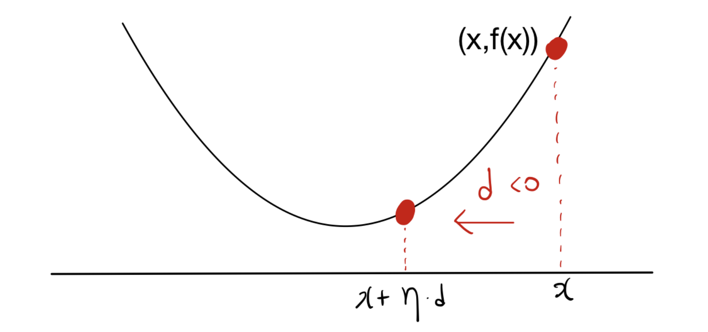
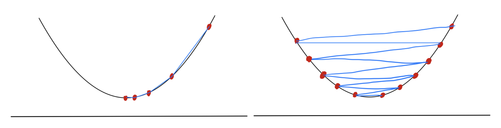

* 본 포스트는 최적화 이론의 가장 핵심적인 알고리즘인 **경사하강법(Gradient Descent)**의 기초 개념을 다룹니다. 하강 방향(Descent direction)의 엄밀한 수학적 정의부터, 적절한 이동 거리를 결정하는 선탐색(Line search) 기법, 그리고 테일러 근사(Taylor approximation)를 통한 경사하강법의 기하학적/수학적 해석까지 순차적으로 살펴봅니다.

---

# 1. 하강 방향 (Descent Directions)과 일반적 하강법

* 최적화 문제에서 목표는 주어진 목적 함수 $f:\mathbb{R}^{d}\rightarrow\mathbb{R}$ 의 값을 최소화하는 변수 $x$를 찾는 것입니다. 현재 위치 $x\in\mathbb{R}^{d}$에서 함수값을 줄이기 위해 이동해야 할 방향을 **하강 방향(Descent Direction)**이라고 정의합니다.
* 엄밀하게, 영벡터가 아닌 벡터 $d\in\mathbb{R}^{d}\backslash\{0\}$가 주어졌을 때, 임의의 작은 양수 $0<\eta\le\epsilon$에 대하여 다음을 만족하는 $\epsilon>0$이 존재한다면, $d$를 하강 방향이라고 합니다:

$$f(x+\eta d)<f(x)$$ 

 

* 위 그림에서 $d$는 방향을, $\eta$는 이동하는 보폭(Step size)을 의미합니다. 이를 기반으로 한 일반적인 하강 알고리즘(Generic descent method)의 구조는 다음과 같습니다:
  * 1. **초기화:** 초기점 $x_{1}\in dom(f)$를 설정합니다.
  * 2. **반복 (For $t=1,...,T$):**
     * 현재 위치에서 하강 방향 $d_{t}$를 찾습니다.
     * 적절한 스텝 사이즈 $\eta_{t}>0$를 결정하여 위치를 업데이트합니다: 
       $$x_{t+1}=x_{t}+\eta_{t}d_{t}$$ 

---

# 2. 스텝 사이즈 선택 (Choosing Step Sizes)

* 방향을 정했다면 '얼마나 이동할 것인가'($\eta_t$)를 결정해야 하며, 이는 알고리즘의 수렴 여부를 결정짓는 핵심 요소입니다.

 

## 2.1. 정확한 선탐색 (Exact Line Search)
* 주어진 방향 $d_{t}$를 따라 함수값을 최소화하는 최적의 스텝 사이즈를 해석적/수치적으로 찾는 방법입니다.
$$\eta_{t}=argmin_{\eta\ge0}f(x_{t}+\eta d_{t})$$ 

* 이 방식은 매 스텝마다 1차원 최적화 문제를 새로 풀어야 하므로 계산 비용이 매우 비싸다는 단점이 있습니다.

## 2.2. 하강 방향의 미분학적 특성
* 백트래킹 선탐색을 정의하기 전, 하강 방향을 그래디언트(Gradient)를 통해 특징지어 보겠습니다. 함수 $f$가 미분 가능하다면, $x$에서 $d$ 방향으로의 변화율(방향도함수)은 다음과 같습니다:

$$lim_{\eta\rightarrow0+}\frac{f(x+\eta d)-f(x)}{\eta}=d^{\top}\nabla f(x)$$ 

* 위 식은 방향 $d$로의 함수 변화율을 측정합니다. 따라서 **보조정리(Lemma 8.1)**에 의해, 영벡터가 아닌 $d$가 하강 방향이 되기 위한 충분조건은 다음과 같습니다:

$$\nabla f(x)^{\top}d<0$$ 

* 즉, 그래디언트 벡터와 예각을 이루는 반대 방향(내적이 음수)이면 모두 하강 방향이 될 수 있습니다. 대표적으로 $d = -\nabla f(x)$가 이에 해당합니다.

## 2.3. 백트래킹 선탐색 (Backtracking Line Search)
* 충분한 함수값 감소를 보장하면서도 계산량을 줄이기 위해 고안된 실용적인 휴리스틱 방법입니다.
  * 1. 하이퍼파라미터 $0<\alpha<1$와 $0<\beta<1$을 고정합니다.
  * 2. 초기 스텝 사이즈 $\eta>0$에서 시작합니다.
  * 3. 다음 조건(Armijo condition)을 만족할 때까지 $\eta\leftarrow\beta\eta$로 줄여나갑니다:
     $$f(x+\eta d_{t})<f(x)+\alpha\eta\nabla f(x)^{\top}d_{t}$$ 
  * 4. 조건을 만족하는 시점의 $\eta$를 최종 $\eta_{t}$로 채택합니다.

---

# 3. 경사하강법 (Gradient Descent Method)

## 3.1. 최급강하 방향 (Steepest Descent Direction)
* 미분 가능한 함수 $f$에 대해, 단위 길이($||d||_{2}=1$)를 가지는 방향 중 함수를 가장 가파르게 감소시키는 방향은 다음과 같이 정의됩니다:

$$arg~min\{\nabla f(x)^{\top}d:||d||_{2}=1\}=\{-\frac{1}{||\nabla f(x)||_{2}}\nabla f(x)\}$$ 

* 즉, 그래디언트의 정확히 반대 방향($-\nabla f(x)$)이 국소적으로 함수값이 가장 빠르게 감소하는 방향입니다. 이를 일반적 하강 알고리즘에 적용한 것이 **경사하강법(Algorithm 2)**입니다.
  * **초기화:** $x_{1}\in dom(f)$ 
  * **업데이트 규칙 (For $t=1,...,T$):** $$x_{t+1}=x_{t}-\eta_{t}\nabla f(x_{t})$$ 

## 3.2. 수렴성 분석 예제 (Linear Convergence)
* 2차 함수 $f(x)=2x^{2}+3x$ (최적해 $x^{*}=-3/4$)를 통해 고정 스텝 사이즈 $\eta_{t}=\eta$를 사용할 때의 수렴 과정을 분석해 봅니다.

* 업데이트 규칙을 전개하면 다음과 같습니다:
  * $x_{t+1}=x_{t}-\eta(4x_{t}+3)$ 
  * $=(1-4\eta)x_{t}-3\eta$ 

* 이를 점화식으로 재귀적으로 풀면:
  * $=(1-4\eta)((1-4\eta)x_{t-1}-3\eta)-3\eta$ 
  * $=(1-4\eta)^{t}x_{1}-3\eta\sum_{i=0}^{t-1}(1-4\eta)^{i}$ 

* 등비수열의 합 공식을 적용하여 정리하면 최종적으로 아래 수식을 얻습니다:
$$x_{t+1}=(1-4\eta)^{t}(x_{1}+\frac{3}{4})-\frac{3}{4}$$ 

* 만약 스텝 사이즈가 $|1-4\eta|<1$를 만족한다면, $t \to \infty$일 때 $x_{t}$는 정확히 최적해 $-3/4$로 수렴합니다. 이때 목적 함수의 오차는 $f(x_{T+1})-f(x^{*})=O((1-4\eta)^{T})$의 속도로 감소합니다.
* 즉, 오차가 지수적으로(Exponentially) 감소하며, 목표 오차 $\epsilon$에 도달하기 위해 필요한 반복 횟수는 $T=O(log(1/\epsilon))$가 됩니다. 최적화 이론에서는 이러한 수렴 속도를 **선형 수렴(Linear convergence)**이라고 부릅니다.

---

# 4. 테일러 근사를 통한 직관적 해석 (Taylor Approximation Interpretation)

* 경사하강법의 업데이트 규칙은 1차 테일러 근사(First-order Taylor approximation)를 통해서도 자연스럽게 유도됩니다. 미분 가능한 함수 $f$의 $x_{t}$ 근처에서의 1차 테일러 근사는 다음과 같습니다:

$$f(x)\approx f(x_{t})+\nabla f(x_{t})^{\top}(x-x_{t})$$ 

* 함수 $f$가 볼록(Convex)하다면 이 선형 근사는 원래 함수의 하한선(Lower bound)이 됩니다. 그러나 이 선형 함수 자체를 직접 최소화하려고 하면, 기울기를 따라 무한히 내려갈 수 있으므로 그 최솟값은 $-\infty$가 됩니다.

* 이를 방지하기 위해, 현재 위치 $x_{t}$에서 너무 멀리 벗어나지 못하도록 페널티를 부여하는 **근접항(Proximity term)** $\frac{1}{2\eta_{t}}||x-x_{t}||_{2}^{2}$를 추가하여 새로운 목적 함수를 만듭니다:

$$f(x)\approx f(x_{t})+\nabla f(x_{t})^{\top}(x-x_{t})+\frac{1}{2\eta_{t}}||x-x_{t}||_{2}^{2}$$ 

* 이제 원래의 $f(x)$ 대신 위 근사식을 최소화하는 다음 지점 $x_{t+1}$을 찾습니다. 위 식은 $x$에 대한 2차 함수이므로 미분하여 0이 되는 지점을 찾으면 최적해를 얻을 수 있습니다. 

$$\nabla f(x_{t})+\frac{1}{\eta_{t}}(x_{t+1}-x_{t})=0$$ 

* 이를 $x_{t+1}$에 대해 정리하면 놀랍게도 경사하강법의 업데이트 식과 완벽히 동일한 결과를 얻게 됩니다:

$$x_{t+1}=x_{t}-\eta_{t}\nabla f(x_{t})$$ 

* 결국 경사하강법은 **"현재 위치에서의 선형 근사(함수값 감소)"**와 **"이동 거리에 대한 페널티(안정성 확보)"** 사이의 트레이드오프(Trade-off)를 최적화하는 과정으로 해석할 수 있습니다. 스텝 사이즈 $\eta_{t}$가 클수록 근접항의 영향력이 작아져 한 번에 멀리 이동하게 됩니다.