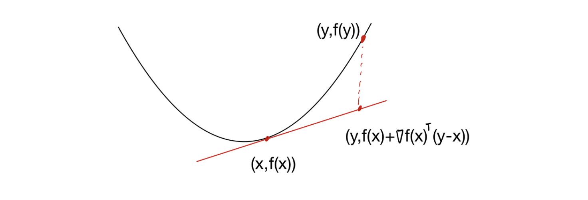

# Introduction

지난 포스트들에서는 Convex Set과 Convex Function의 정의를 다루었습니다. 하지만 정의($f(\lambda x + (1-\lambda)y) \le \dots$)만 사용하여 어떤 함수가 볼록인지 판별하는 것은 계산상 매우 번거롭습니다.

함수가 **미분 가능(Differentiable)**하다면, 우리는 Gradient(기울기)나 Hessian(곡률) 정보를 이용해 훨씬 쉽게 볼록성을 확인할 수 있습니다. 이번 포스트에서는 Convex Function의 **First-order(1차)** 및 **Second-order(2차) Characterization**을 정리하고 증명합니다.

---

# 1. First-order Characterization

미분 가능한 함수 $f$가 Convex가 되기 위한 첫 번째 조건은, **어느 점에서의 접선(Tangent line/hyperplane)을 그려도 함수가 그 접선보다 항상 위에 있어야 한다**는 것입니다.

> **Theorem 1.17 (First-order Condition)**
>
> 미분 가능한 함수 $f: \mathbb{R}^d \to \mathbb{R}$가 Convex일 필요충분조건은 $\text{dom}(f)$가 Convex이고, 모든 $x, y \in \text{dom}(f)$에 대해 다음이 성립하는 것이다.
>
> $$f(y) \ge f(x) + \nabla f(x)^\top (y-x)$$

이 식의 우변 $f(x) + \nabla f(x)^\top (y-x)$는 $x$에서의 **1차 테일러 근사(First-order Taylor approximation)**입니다. 즉, 볼록 함수는 자신의 1차 근사보다 항상 크거나 같습니다(Global underestimator).

## 1.1 Proof

이 증명은 $d=1$인 경우(일변수 함수)를 먼저 보이고, 이를 이용해 일반적인 $d$차원으로 확장하는 방식을 사용합니다.

### Part 1: $(\Rightarrow)$ Convex $\implies$ Inequality

**Step 1: 일변수 함수 ($d=1$)**
$f$가 Convex이므로 정의에 의해 임의의 $\lambda \in (0, 1]$에 대해 다음이 성립합니다.
$$f(x + \lambda(y-x)) = f((1-\lambda)x + \lambda y) \le (1-\lambda)f(x) + \lambda f(y)$$

$f(x)$를 이항하고 양변을 $\lambda$로 나눕니다.
$$f(y) - f(x) \ge \frac{f(x + \lambda(y-x)) - f(x)}{\lambda}$$

이제 $\lambda \to 0^+$ 극한을 취합니다. $f$는 미분 가능하므로 우변은 도함수의 정의가 됩니다.
$$f(y) - f(x) \ge \lim_{\lambda \to 0^+} \frac{f(x + \lambda(y-x)) - f(x)}{\lambda} = f'(x)(y-x)$$
정리하면, $f(y) \ge f(x) + f'(x)(y-x)$입니다.

**Step 2: 다변수 함수 (General case)**
두 점 $x, y$를 잇는 선분 위에서의 함수 $g(\lambda)$를 정의합니다 (Restriction to a line).
$$g(\lambda) := f(x + \lambda(y-x)), \quad \lambda \in [0, 1]$$

$f$가 Convex이면 $g$ 또한 Convex입니다. (선형 결합의 합성은 Convexity를 보존함)
또한, Chain rule에 의해 $g$는 미분 가능하며 도함수는 다음과 같습니다.
$$g'(\lambda) = \nabla f(x + \lambda(y-x))^\top (y-x)$$

$d=1$인 경우의 결과를 $g$에 적용합니다. ($g(1) \ge g(0) + g'(0)(1-0)$)
* $g(1) = f(y)$
* $g(0) = f(x)$
* $g'(0) = \nabla f(x)^\top (y-x)$

따라서, $f(y) \ge f(x) + \nabla f(x)^\top (y-x)$가 성립합니다.

### Part 2: $(\Leftarrow)$ Inequality $\implies$ Convex

$x, y \in \text{dom}(f)$와 $\lambda \in [0, 1]$에 대해 $z = \lambda x + (1-\lambda)y$라고 합시다.
주어진 부등식을 $z$를 기준으로 $x$와 $y$에 각각 적용합니다.

1.  $f(x) \ge f(z) + \nabla f(z)^\top (x-z)$
2.  $f(y) \ge f(z) + \nabla f(z)^\top (y-x)$

첫 번째 식에 $\lambda$, 두 번째 식에 $(1-\lambda)$를 곱하여 더합니다.
$$
\begin{aligned}
\lambda f(x) + (1-\lambda)f(y) &\ge f(z) + \nabla f(z)^\top \underbrace{[\lambda(x-z) + (1-\lambda)(y-z)]}_{= 0} \\
&= f(z) = f(\lambda x + (1-\lambda)y)
\end{aligned}
$$
$\nabla f(z)$ 뒤의 항이 0이 되는 이유는 $z$가 $x, y$의 내분점이기 때문입니다.
따라서 정의에 의해 $f$는 Convex입니다.

---

# 2. Monotonicity of Gradient

또 다른 1차 조건은 Gradient의 변화 방향에 관한 것입니다. 이를 **Monotonicity of Gradient(기울기의 단조성)**라고 합니다.

> **Theorem 1.18**
>
> 미분 가능한 함수 $f$가 Convex일 필요충분조건은 다음이 성립하는 것이다.
> $$(\nabla f(x) - \nabla f(y))^\top (x - y) \ge 0$$
> 모든 $x, y \in \text{dom}(f)$에 대하여.

이 식은 $x$에서 $y$로 이동할 때($x-y$), Gradient의 차이($\nabla f(x) - \nabla f(y)$)가 이동 방향과 같은 방향(내적이 양수)임을 의미합니다. 1차원에서는 도함수 $f'$이 **증가 함수(Non-decreasing)**라는 뜻과 같습니다.

## 2.1 Proof

**Part 1: $(\Rightarrow)$ Using Theorem 1.17**
Thm 1.17에 의해 다음 두 식이 성립합니다.
1.  $f(y) \ge f(x) + \nabla f(x)^\top (y-x)$
2.  $f(x) \ge f(y) + \nabla f(y)^\top (x-y)$

두 식을 더하면:
$$f(y) + f(x) \ge f(x) + f(y) + \nabla f(x)^\top (y-x) + \nabla f(y)^\top (x-y)$$
$$0 \ge (\nabla f(x) - \nabla f(y))^\top (y-x)$$
양변에 $-1$을 곱하고 벡터 방향을 바꾸면 $(\nabla f(x) - \nabla f(y))^\top (x-y) \ge 0$을 얻습니다.

**Part 2: $(\Leftarrow)$ Using Integral Mean Value Theorem**
이 방향의 증명은 미적분학의 기본 정리를 사용합니다.

$$\begin{aligned}
f(y) - f(x) &= \int_0^1 \frac{d}{d\lambda} f(x + \lambda(y-x)) \, d\lambda \\
&= \int_0^1 \nabla f(x + \lambda(y-x))^\top (y-x) \, d\lambda
\end{aligned}$$

가정 $(\nabla f(u) - \nabla f(v))^\top (u-v) \ge 0$을 이용하기 위해, 적분 내부를 변형해봅시다. $u = x+\lambda(y-x), v=x$로 두면 $u-v = \lambda(y-x)$이므로,
$$\langle \nabla f(x+\lambda(y-x)) - \nabla f(x), \lambda(y-x) \rangle \ge 0$$
$\lambda > 0$ 이므로 나누면,
$$\nabla f(x+\lambda(y-x))^\top (y-x) \ge \nabla f(x)^\top (y-x)$$
즉, 적분 안의 피적분 함수가 항상 $\nabla f(x)^\top (y-x)$보다 큽니다. 따라서,
$$f(y) - f(x) = \int_0^1 (\dots) d\lambda \ge \int_0^1 \nabla f(x)^\top (y-x) d\lambda = \nabla f(x)^\top (y-x)$$
이는 Theorem 1.17의 조건이므로, $f$는 Convex입니다.

---

# 3. Second-order Characterization

함수가 두 번 미분 가능하다면(Twice differentiable), **Hessian Matrix(이계도함수 행렬)**의 성질을 통해 볼록성을 판별할 수 있습니다. 가장 강력하고 자주 쓰이는 조건입니다.

> **Theorem 1.19 (Second-order Condition)**
>
> 두 번 미분 가능한 함수 $f: \mathbb{R}^d \to \mathbb{R}$가 Convex일 필요충분조건은 $\text{dom}(f)$가 Convex이고, 모든 $x \in \text{dom}(f)$에 대해 Hessian이 **Positive Semidefinite (PSD)**인 것이다.
>
> $$\nabla^2 f(x) \succeq 0$$

## 3.1 Proof

**Part 1: $(\Rightarrow)$ Convex $\implies$ PSD**

**Step 1: 일변수 함수 ($d=1$)**
Thm 1.17에 의해 $f(y) \ge f(x) + f'(x)(y-x)$입니다.
반대로 $x, y$를 바꾸면 $f(x) \ge f(y) + f'(y)(x-y)$입니다.
두 식을 더하고 정리하면,
$$(f'(y) - f'(x))(y-x) \ge 0 \implies \frac{f'(y) - f'(x)}{y-x} \ge 0$$
$y \to x$ 극한을 취하면 $f''(x) \ge 0$입니다.

**Step 2: 다변수 함수 (General case)**
임의의 방향 벡터 $v \in \mathbb{R}^d$에 대해 $g(\lambda) = f(x + \lambda v)$를 정의합니다.
$f$가 Convex이면 $g$도 Convex이고, 1변수 결과에 의해 $g''(0) \ge 0$이어야 합니다.
Chain rule을 두 번 적용하면:
$$g'(\lambda) = v^\top \nabla f(x + \lambda v)$$
$$g''(\lambda) = v^\top \nabla^2 f(x + \lambda v) v$$
$\lambda=0$일 때, $g''(0) = v^\top \nabla^2 f(x) v \ge 0$.
임의의 $v$에 대해 이차형식(Quadratic form)이 0보다 크거나 같으므로, $\nabla^2 f(x)$는 Positive Semidefinite입니다.

**Part 2: $(\Leftarrow)$ PSD $\implies$ Convex**

미적분학의 기본 정리를 Gradient에 적용합니다.
$$\nabla f(y) - \nabla f(x) = \int_0^1 \frac{d}{d\lambda} \nabla f(x + \lambda(y-x)) \, d\lambda$$
$$= \int_0^1 \nabla^2 f(x + \lambda(y-x)) (y-x) \, d\lambda$$

양변에 $(y-x)$를 내적합니다.
$$\langle \nabla f(y) - \nabla f(x), y-x \rangle = \int_0^1 \underbrace{(y-x)^\top \nabla^2 f(\dots) (y-x)}_{\ge 0 (\because \text{PSD})} \, d\lambda \ge 0$$

적분 값이 0 이상이므로 $(\nabla f(y) - \nabla f(x))^\top (y-x) \ge 0$이 성립합니다.
이는 Theorem 1.18(Monotonicity)의 조건이므로, $f$는 Convex입니다.

---

# 4. Summary

이번 포스트에서는 함수가 미분 가능할 때 볼록성을 판별하는 세 가지 주요 도구를 배웠습니다.

1.  **First-order (Tangent line):** $f(y) \ge f(x) + \nabla f(x)^\top (y-x)$
    * 함수가 접평면 위에 떠 있어야 함.
2.  **Monotonicity (Gradient):** $(\nabla f(x) - \nabla f(y))^\top (x-y) \ge 0$
    * 기울기가 증가하는 방향이어야 함.
3.  **Second-order (Hessian):** $\nabla^2 f(x) \succeq 0$
    * 모든 방향으로 곡률이 양수(아래로 볼록)여야 함.

실제 최적화 문제에서는 **Second-order Condition**($\nabla^2 f(x) \succeq 0$)이 가장 빈번하게 사용됩니다.