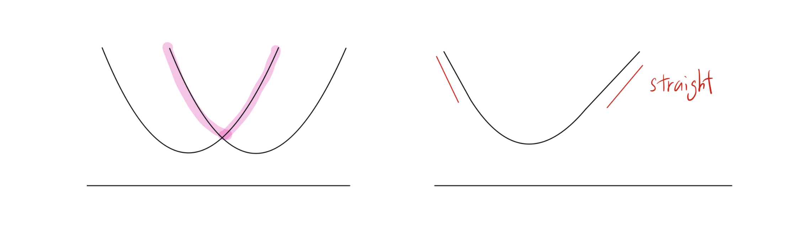

# Introduction

* 본 포스트는 수리 및 수치 최적화 강의의 10번째 주제인 **강볼록 함수(Strongly Convex Functions)**의 핵심적인 수학적 성질과 증명을 다룹니다. 일반적인 볼록 함수(Convex functions)는 최적화 과정에서 지역 최적해(Local minimum)가 곧 전역 최적해(Global minimum)가 된다는 훌륭한 성질을 제공하지만, 수렴 속도 측면에서는 아쉬움이 있을 수 있습니다. 

* 강볼록 함수는 함수가 단순히 볼록한 것을 넘어 '일정 수준 이상의 곡률(Curvature)'을 가지도록 강제함으로써, 경사하강법(Gradient Descent)이나 서브그래디언트 방법(Subgradient Method)을 적용할 때 훨씬 더 빠르고 안정적인 수렴을 보장합니다. 본 글에서는 강볼록 함수의 정의부터 시작하여, 이 함수가 왜 유용한지를 보여주는 이차 하한선(Quadratic lower bounds)과 최적성 간극(Optimality gap)에 대한 엄밀한 증명 과정을 단계별로 살펴보겠습니다.

---

# 1. 강볼록 함수와 이차 하한선 (Quadratic Lower Bounds)

## 1.1 강볼록 함수의 정의

* 함수 $f$가 어떤 $\alpha>0$에 대하여 $l_2$ 노름(norm) 상에서 **$\alpha$-강볼록(strongly convex)**이라는 것은, 다음의 함수가 여전히 볼록 함수(Convex function)임을 의미합니다:

$$f(x)-\frac{\alpha}{2}||x||_2^2$$

* 즉, 원래의 함수 $f(x)$에서 이차 함수 형태인 $\frac{\alpha}{2}||x||_2^2$를 빼내더라도 여전히 아래로 볼록한 형태가 유지될 만큼, 함수 $f$가 충분히 강한 곡률을 가지고 있다는 뜻입니다.

## 1.2 이차 하한선 (Quadratic Lower Bound) 성질

* 이러한 강볼록성의 정의가 왜 유용할까요? 이를 이해하기 위해 강볼록 함수가 가지는 강력한 기하학적 하한선(Lower bound) 성질을 유도해 보겠습니다.

> **보조정리 (Lemma 10.1):**
> 
> 만약 함수 $f$가 $l_2$ 노름에서 $\alpha$-강볼록이라면, 임의의 $x, y \in \mathbb{R}^d$에 대하여 다음이 성립합니다.
> 
> $$f(y)\ge f(x)+\nabla f(x)^\top(y-x)+\frac{\alpha}{2}||y-x||_2^2$$

### **[증명 과정]**
* 1. **가정 및 정의 적용:** 강볼록 함수의 정의에 의해, 함수 $g(x)=f(x)-\frac{\alpha}{2}||x||_2^2$는 볼록 함수입니다.
* 2. **볼록 함수의 1차 특성 (First-order characterization):** 미분 가능한 볼록 함수 $g$에 대하여, 임의의 두 점 $x, y$를 연결할 때 1차 테일러 전개(접평면)는 항상 함수의 아래에 위치합니다. 즉,
   $$g(y)\ge g(x)+\nabla g(x)^\top(y-x)$$
* 3. **치환 및 전개:** 위 부등식에 $g(x)$의 원래 형태를 대입합니다. $\nabla g(x) = \nabla f(x) - \alpha x$ 이므로,
   $$f(y)-\frac{\alpha}{2}||y||_2^2\ge f(x)-\frac{\alpha}{2}||x||_2^2+(\nabla f(x)-\alpha x)^\top(y-x)$$
* 4. **식 정리:** 양변을 $f(y)$에 대해 정리하기 위해 $-\frac{\alpha}{2}||y||_2^2$를 우변으로 넘깁니다.
   $$f(y)\ge f(x)+\nabla f(x)^\top(y-x)-\frac{\alpha}{2}||x||_2^2+\frac{\alpha}{2}||y||_2^2-\alpha x^\top(y-x)$$
* 5. **완전제곱식 완성:** 우변의 이차항들을 전개하여 묶어줍니다.
   $$-\frac{\alpha}{2}||x||_2^2+\frac{\alpha}{2}||y||_2^2-\alpha x^\top y+\alpha||x||_2^2 = \frac{\alpha}{2}(||y||_2^2 - 2x^\top y + ||x||_2^2) = \frac{\alpha}{2}||y-x||_2^2$$
* 6. **최종 결론:** 따라서 다음의 이차 하한선이 도출됩니다. $\blacksquare$
   $$f(y)\ge f(x)+\nabla f(x)^\top(y-x)+\frac{\alpha}{2}||y-x||_2^2$$

* 위 보조정리는 매우 중요한 직관을 제공합니다. 점 $x$가 최적해로부터 멀리 떨어져 있을수록(즉, $y-x$가 클수록) 함수는 이차식의 속도로 급격하게 증가합니다. 이는 **최적해에서 멀어질수록 현재 지점에서의 그래디언트(기울기) 크기 역시 반드시 커져야 함**을 의미하며, 결과적으로 경사하강법 알고리즘이 목표 지점을 향해 큰 보폭으로 빠르게 이동(수렴)할 수 있는 원동력이 됩니다.

## 1.3 평활도(Smoothness)와의 비교

* 강볼록성(Strong convexity)은 '최소한의 곡률'을 보장하는 반면, 최적화에서 자주 등장하는 또 다른 개념인 평활도(Smoothness)는 그래디언트의 변화율을 제한하여 '최대 곡률'을 제어합니다. 두 개념은 서로 독립적입니다.

---

# 2. 강볼록 함수의 최적성 간극 (Optimality Gap)

* 강볼록 함수의 이차 하한선 성질을 이용하면, 임의의 점 $x$에서의 그래디언트 크기와 최적해 사이의 함숫값 차이(Optimality gap)에 대한 상한과 하한을 매우 우아하게 증명할 수 있습니다.

> **정리 (Theorem 10.2):**
> 
> 함수 $f:\mathbb{R}^d\rightarrow\mathbb{R}$가 $l_2$ 노름에서 $\alpha$-강볼록이라면, 모든 $x\in\mathbb{R}^d$에 대하여 다음 부등식이 성립합니다.
> 
> $$\frac{\alpha}{2}||x-x^*||_2^2\le f(x)-f(x^*)\le \frac{1}{2\alpha}||\nabla f(x)||_2^2$$
>
> (단, $x^*$는 $\min_{x\in\mathbb{R}^d}f(x)$의 최적해입니다.)

### **[증명 과정]**
* **1. 하한(Lower bound)의 증명:**
  * 보조정리 10.1에서 도출한 식에 $x$와 $y$의 위치를 각각 $x^*$와 $x$로 대입합니다.
  $$f(x)\ge f(x^*)+\nabla f(x^*)^\top(x-x^*)+\frac{\alpha}{2}||x-x^*||_2^2$$
  * $x^*$는 전체 최적해이므로 이 지점에서의 기울기는 0입니다. 즉, $\nabla f(x^*)=0$ 입니다. 이를 대입하면 직관적인 하한을 얻습니다.
  $$f(x)-f(x^*)\ge \frac{\alpha}{2}||x-x^*||_2^2$$

* **2. 상한(Upper bound)의 증명:**
  * 이번에는 보조정리 10.1의 부등식에서 $y$에 최적해 $x^*$를 대입합니다.
  $$f(x^*)\ge f(x)+\nabla f(x)^\top(x^*-x)+\frac{\alpha}{2}||x^*-x||_2^2$$
  * 위 부등식의 우변은 임의의 $y\in\mathbb{R}^d$에 대해 성립하는 이차식의 최솟값보다 항상 크거나 같습니다. 즉,
  $$f(x^*)\ge \min_{y\in\mathbb{R}^d} \left\{ f(x)+\nabla f(x)^\top(y-x)+\frac{\alpha}{2}||y-x||_2^2 \right\}$$
  * 우변의 괄호 안의 식을 $y$에 대한 함수로 보고 최솟값을 찾기 위해 $y$에 대해 미분하여 0이 되는 지점을 찾습니다.
  $$\nabla_y \left( \nabla f(x)^\top(y-x)+\frac{\alpha}{2}||y-x||_2^2 \right) = \nabla f(x)+\alpha(y-x)=0$$
  * 이를 $y$에 대해 정리하면 $y = x-\frac{1}{\alpha}\nabla f(x)$ 가 됩니다. (이는 스텝 사이즈가 $1/\alpha$인 경사하강법 1회 업데이트와 동일한 형태입니다.)
  * 이 최적의 $y$ 값을 원래 식에 다시 대입합니다.
  $$f(x^*) \ge f(x) + \nabla f(x)^\top \left(-\frac{1}{\alpha}\nabla f(x)\right) + \frac{\alpha}{2}\left|\left|-\frac{1}{\alpha}\nabla f(x)\right|\right|_2^2$$
  $$= f(x) - \frac{1}{\alpha}||\nabla f(x)||_2^2 + \frac{1}{2\alpha}||\nabla f(x)||_2^2 = f(x) - \frac{1}{2\alpha}||\nabla f(x)||_2^2$$
  * 식을 정리하면 최종적인 상한을 얻습니다. $\blacksquare$
  $$f(x)-f(x^*)\le \frac{1}{2\alpha}||\nabla f(x)||_2^2$$

---

# 3. 강압성 (Coercivity)

* 마지막으로 살펴볼 성질은 강볼록 함수의 그래디언트 변화량과 관련이 있습니다. 강볼록 함수는 그래디언트의 변화가 두 점 사이의 거리에 비례하여 발생함을 보장하는데, 이를 강압성(Coercivity) 또는 강한 단조성(Strong monotonicity)이라고 합니다.

> **보조정리 (Lemma 10.3):**
> 
> $f:\mathbb{R}^d\rightarrow\mathbb{R}$가 $l_2$ 노름에서 $\alpha$-강볼록이라면, 임의의 $x, y \in\mathbb{R}^d$에 대하여 다음이 성립합니다.
> 
> $$(\nabla f(x)-\nabla f(y))^\top(x-y)\ge\alpha||x-y||_2^2$$

### **[증명 과정]**
* 1. **가정 적용:** $g(x)=f(x)-\frac{\alpha}{2}||x||_2^2$는 볼록 함수입니다.
* 2. **볼록 함수의 그래디언트 단조성 (Monotonicity):** 볼록 함수 $g$의 미분값은 단조 증가하는 성질을 가지므로, 임의의 $x, y$에 대해 다음이 성립합니다.
   $$(\nabla g(x)-\nabla g(y))^\top(x-y)\ge 0$$
* 3. **그래디언트 치환:** $g(x)$의 그래디언트를 원래 함수 $f$로 풀어냅니다. $\nabla g(x) = \nabla f(x) - \alpha x$ 이고 $\nabla g(y) = \nabla f(y) - \alpha y$ 입니다.
* 4. **식 전개:**
   $$( (\nabla f(x)-\alpha x) - (\nabla f(y)-\alpha y) )^\top(x-y) \ge 0$$
   $$(\nabla f(x)-\nabla f(y))^\top(x-y) - \alpha(x-y)^\top(x-y) \ge 0$$
* 5. **최종 결론:** 내적의 정의($(x-y)^\top(x-y) = ||x-y||_2^2$)를 이용하여 식을 넘겨주면 정리가 증명됩니다. $\blacksquare$
   $$(\nabla f(x)-\nabla f(y))^\top(x-y)\ge\alpha||x-y||_2^2$$