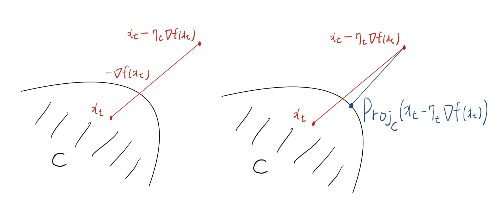

# Introduction

* 지난 포스트에서는 제약 조건이 없는 공간($\mathbb{R}^d$)에서 정의된 강볼록 함수의 여러 수학적 성질과 수렴 속도를 살펴보았습니다. 하지만 실제 현실의 많은 기계학습 및 최적화 문제는 특정한 **제약 집합(Feasible set, $C$)** 내에서 최적해를 찾아야 하는 제약 최적화(Constrained Optimization) 문제입니다.

* 이번 포스트에서는 기존 경사하강법이 제약 조건 하에서 가지는 한계를 짚어보고, 이를 우아하게 해결하는 **사영 경사하강법(Projected Gradient Descent)**의 알고리즘과 수학적 근거(사영 연산의 성질)를 엄밀하게 유도해 보겠습니다.

---

# 1. 제약 조건과 사영(Projection)의 도입

## 1.1 기존 경사하강법의 한계

* 제약 조건이 없는 최적화 문제에서는 다음과 같은 경사하강법 업데이트 규칙을 사용합니다:
$$x_{t+1}=x_{t}-\eta_{t}\nabla f(x_{t})$$
  * 만약 함수 $f$가 미분 불가능하다면, 그래디언트 대신 서브그래디언트 $g \in \partial f(x_t)$를 사용합니다.

* 그러나 최적해를 찾아야 하는 영역이 어떤 제약 집합 $C$로 제한되어 있다면 어떨까요? $x_t$가 제약 집합 안에 있더라도, 음의 그래디언트 방향($-\nabla f(x_t)$)으로 이동한 새로운 지점 $x_t - \eta_t \nabla f(x_t)$는 **집합 $C$의 바깥으로 벗어날(infeasible) 위험**이 매우 높습니다. 

## 1.2 사영(Projection) 연산자

* 이 문제를 해결하는 가장 직관적인 방법은, 일단 경사하강법 스텝을 밟은 후 그 결과가 제약 집합을 벗어났다면 다시 **제약 집합 $C$ 내의 가장 가까운 점으로 투영(Projection)**시키는 것입니다. 이를 위해 사영 연산자 $Proj_C(\cdot)$를 다음과 같이 정의합니다:

* 임의의 $z\in\mathbb{R}^d$에 대하여,
$$Proj_{C}(z)=\arg\min_{x\in C}\frac{1}{2}||x-z||_{2}^{2}$$
* 이는 $\arg\min_{x\in C}||x-z||_2$와 완벽히 동치이며, 유클리디안 $l_2$ 거리를 기준으로 점 $z$와 가장 가까운 집합 $C$ 안의 점을 찾아내는 최적화 문제를 푸는 것과 같습니다.

---

# 2. 사영 경사하강법 (Projected Gradient Descent)

* 사영 연산을 활용하여 제약 최적화 문제를 푸는 방법이 바로 **사영 경사하강법(Projected Gradient Descent)**입니다.

## 2.1 알고리즘 구조

* **Algorithm 1: Projected gradient descent method**
  * 1. 제약 집합 내의 점 $x_{1}\in C$ 로 초기화합니다.
  * 2. $t=1,...,T$ 동안 다음을 반복합니다:
     *  스텝 사이즈 $\eta_t>0$에 대하여, 다음 업데이트를 수행합니다.
       $$x_{t+1}=Proj_{C}\{x_{t}-\eta_{t}\nabla f(x_{t})\}$$
  * 3. 최종적으로 $x_{T+1}$ 을 반환합니다. (혹은 목적에 따라 이전 스텝들의 가중 평균을 반환하기도 합니다.)

## 2.2 이차 근사(Quadratic Approximation)를 통한 해석

* 이 업데이트 규칙은 단순히 기하학적으로 "가장 가까운 점을 찾는다"는 것을 넘어, 함수 $f$의 2차 테일러 근사 관점에서도 아름답게 해석됩니다.

* 사영의 정의 수식에 $z = x_{t}-\eta_{t}\nabla f(x_{t})$를 대입하여 전개해 봅시다.
$$x_{t+1}=\arg\min_{x\in C}\left\{\frac{1}{2}||x-(x_{t}-\eta_{t}\nabla f(x_{t}))||_{2}^{2}\right\}$$

* 위 식의 내부를 전개하고 $\eta_t$로 나누어 상수항을 무시하면 다음 식과 동치가 됩니다:
$$x_{t+1}=\arg\min_{x\in C}\left\{f(x_{t})+\nabla f(x_{t})^{\top}(x-x_{t})+\frac{1}{2\eta_{t}}||x-x_{t}||_{2}^{2}\right\}$$

* 즉, 사영 경사하강법의 새로운 점 $x_{t+1}$은 **제약 집합 $C$ 안에서, 현재 점 $x_t$에서의 목적 함수 $f$에 대한 이차 근사(Quadratic approximation)를 최소화하는 해**를 찾는 과정과 정확히 일치합니다.

---

# 3. 사영 연산의 수학적 성질 (보조정리 증명)

* 경사하강법의 수렴성을 증명하기 위해서는 사영 연산이 원래의 최적해 $x^*$와 멀어지지 않음을 수학적으로 보장해야 합니다. 이를 위해 두 가지 중요한 보조정리(Lemma)를 유도합니다.

* 이후 논의의 편의를 위해 임시 업데이트 지점을 $y_{t+1} = x_{t}-\eta_{t}\nabla f(x_{t})$로 표기하겠습니다. 그러면 업데이트 규칙은 $x_{t+1}=Proj_{C}(y_{t+1})$이 됩니다.

## 3.1 최적성 조건 (Optimality Condition of Projection)

> **보조정리 (Lemma 10.8):**
> 
> 임의의 $z\in\mathbb{R}^d$와 제약 집합 내의 점 $x\in C$에 대하여, 다음 내적 부등식이 성립합니다.
> 
> $$(Proj_{C}(z)-z)^{\top}(Proj_{C}(z)-x)\le0$$

### **[증명 과정]**
* 사영 연산 $Proj_C(z)$는 2차 함수 $h(x) = \frac{1}{2}||x-z||_2^2$ 를 $x \in C$ 에 대해 최소화하는 해입니다. 볼록 제약 최적화 문제의 1차 최적성 조건(First-order optimality condition)에 따르면, 최적해 $x^* = Proj_C(z)$ 에서는 집합 $C$ 내의 임의의 다른 점 $x$를 향한 방향으로의 방향 도함수가 항상 0 이상이어야 합니다. 
* 함수 $h(x)$의 그래디언트는 $\nabla h(x) = x-z$ 이므로, 최적해 $x^*$에서의 그래디언트는 $\nabla h(Proj_C(z)) = Proj_C(z) - z$ 입니다.
* 최적성 조건 $\nabla h(x^*)^\top (x - x^*) \ge 0$ 에 이를 대입하면, $$(Proj_C(z) - z)^\top (x - Proj_C(z)) \ge 0$$ 
* 양변에 -1을 곱해주면 부등호 방향이 바뀌면서 증명이 완료됩니다. $\blacksquare$
$$(Proj_C(z) - z)^\top (Proj_C(z) - x) \le 0$$

## 3.2 거리 감소 효과 (비확장성, Non-expansiveness)

> **보조정리 (Lemma 10.9):**
> 
> 모든 반복 스텝 $t$에 대하여, 투영 후의 점 $x_{t+1}$은 투영 전의 임시 점 $y_{t+1}$보다 제약 집합 내의 임의의 최적해 $x^*$에 더 가깝거나 같습니다.
> 
> $$||x_{t+1}-x^{*}||_{2}\le||y_{t+1}-x^{*}||_{2}$$
> 
> (단, $x^*$는 $\min_{x\in C}f(x)$의 최적해입니다.)

### **[증명 과정]**
* 1. 앞서 증명한 보조정리 10.8에서 $z = y_{t+1}$, $Proj_C(z) = x_{t+1}$, 그리고 $x = x^*$ 를 대입합니다.
   $$(x_{t+1}-y_{t+1})^{\top}(x_{t+1}-x^{*})\le0$$
* 2. 좌변의 첫 번째 괄호 안의 식을 $x_{t+1}-y_{t+1} = (x_{t+1}-x^{*}) + (x^{*}-y_{t+1})$ 로 분리하여 분배법칙을 적용합니다.
   $$(x_{t+1}-x^{*})^{\top}(x_{t+1}-x^{*}) + (x^{*}-y_{t+1})^{\top}(x_{t+1}-x^{*}) \le 0$$
   $$||x_{t+1}-x^{*}||_{2}^{2}\le(y_{t+1}-x^{*})^{\top}(x_{t+1}-x^{*})$$
* 3. 우변에 코시-슈바르츠 부등식(Cauchy-Schwarz inequality, $a^\top b \le ||a||_2||b||_2$)을 적용합니다.
   $$||x_{t+1}-x^{*}||_{2}^{2}\le||y_{t+1}-x^{*}||_{2}||x_{t+1}-x^{*}||_{2}$$
* 4. 양변을 $||x_{t+1}-x^{*}||_{2}$ 로 나누어주면 최종 결과가 도출됩니다. $\blacksquare$

---

# 4. 사영 방법론의 수렴성 분석 (Convergence Results)

* 보조정리 10.9를 적용하면 제약 조건이 없는 경우의 거리 계산을 제약 조건이 있는 경우의 부등식으로 대체할 수 있습니다. 
$$||x_{t+1}-x^{*}||_{2}^{2}\le||y_{t+1}-x^{*}||_{2}^{2} = ||x_{t}-\eta_{t}\nabla f(x_{t})-x^{*}||_{2}^{2}$$
$$\le||x_{t}-x^{*}||_{2}^{2}-2\eta_{t}(f(x_{t})-f(x^{*}))+\eta_{t}^{2}||\nabla f(x_{t})||_2^{2}$$
* 이 부등식 구조는 제약 없는 경사하강법 분석에서 보았던 식과 정확히 동일합니다. 단지 등호($=$)가 부등호($\le$)로 바뀌었을 뿐이며, 오차가 더 줄어드는 방향이므로 기존에 도출했던 수렴성 결과들을 사영 경사하강법에도 그대로 적용할 수 있습니다.

## 4.1 사영 서브그래디언트 방법 (Projected Subgradient Method)

* 미분 불가능한 함수를 위한 서브그래디언트 방법론에도 사영을 결합할 수 있습니다.

* **Algorithm 2: Projected subgradient method**
  * 1. $x_{1}\in C$ 초기화
  * 2. $t=1,...,T$ 동안 반복:
     *  서브그래디언트 $g_{t}\in\partial f(x_{t})$ 계산
     *  스텝 사이즈 $\eta_{t}>0$로 업데이트: $x_{t+1}=Proj_{C}\{x_{t}-\eta_{t}g_{t}\}$
  * 3. 반환: $(\sum_{t=1}^{T}\eta_{t})^{-1}\sum_{t=1}^{T}\eta_{t}x_{t}$

> **정리 (Theorem 10.10: 립시츠 연속인 경우):**
> 
> 볼록 함수 $f$가 모든 $x$의 서브그래디언트에 대해 $||g||_{2}\le L$ 을 만족한다고 합시다. 스텝 사이즈를 $\eta_{t}=||x_{1}-x^{*}||_{2}/L\sqrt{T}$ 로 잡고 사영 서브그래디언트 알고리즘을 실행하면 다음의 $O(1/\sqrt{T})$ 수렴 속도를 얻습니다:
> 
> $$f\left(\frac{1}{T}\sum_{t=1}^{T}x_{t}\right)-f(x^{*})\le\frac{L||x_{1}-x^{*}||_{2}}{\sqrt{T}}$$

## 4.2 평활한 함수에 대한 점근적 수렴 (Smooth Functions)

> **정리 (Theorem 10.11: 평활한 볼록 함수의 경우):**
> 
> 함수 $f$가 제약 공간에서 미분 가능하며 $\beta$-평활(smooth)한 볼록 함수라고 합시다. 일정한 스텝 사이즈 $\eta_{t}=1/\beta$ 를 사용하는 사영 경사하강법(Algorithm 1)은 다음의 $O(1/T)$ 수렴 속도를 보장합니다:
> 
> $$f(x_{T})-f(x^{*})\le\frac{3\beta||x_{1}-x^{*}||_{2}^{2}+f(x_{1})-f(x^{*})}{T}$$

* 결론적으로, 사영 연산이라는 안전장치를 추가했음에도 불구하고, 최적화 알고리즘은 비확장성이라는 강력한 수학적 무기 덕분에 기존과 동일한(혹은 더 나은) 최적화 성능을 안정적으로 보장해 냅니다.