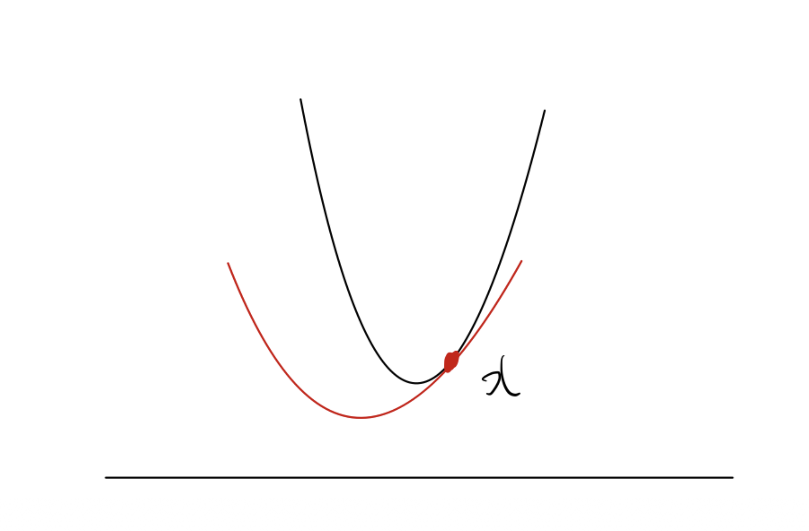
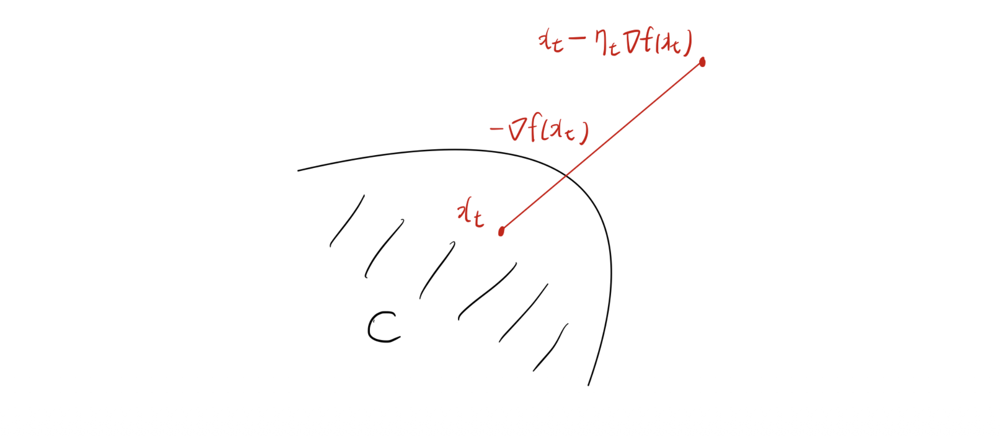
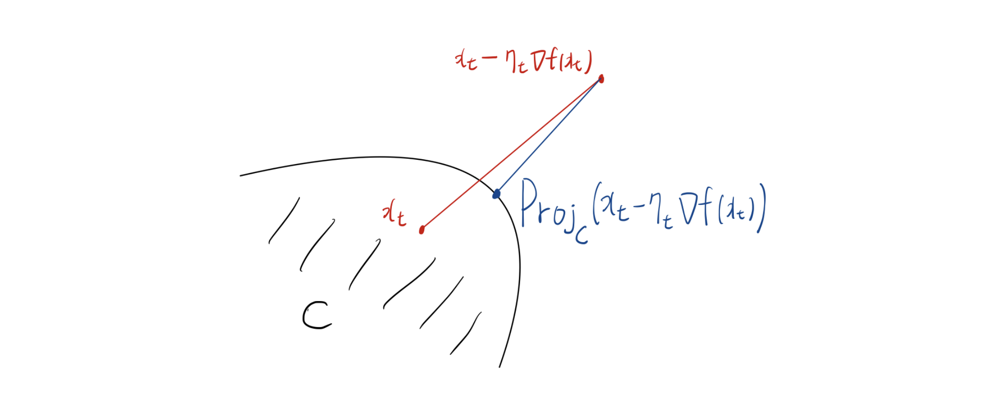

# Introduction

* 본 포스트는 수리 및 수치 최적화 강의의 10번째 주제인 **강볼록 함수(Strongly Convex Functions)**와 **제약 조건이 있는 최적화를 위한 사영 경사하강법(Projected Gradient Descent)**에 대해 다룹니다. 단순한 볼록(Convex) 함수보다 더 강력한 조건을 가진 강볼록 함수는 머신러닝과 최적화 알고리즘에서 매우 빠른 수렴 속도를 보장하는 핵심적인 개념입니다. 이번 글에서는 강볼록 함수의 수학적 정의부터 시작하여, 평활도(Smoothness)와의 관계, 그리고 제약 집합(Feasible set)이 존재할 때 사용하는 프로젝션(Projection) 기법까지 논리적인 흐름에 따라 살펴보겠습니다.

---

# 1. 강볼록 함수 (Strongly Convex Functions)

## 1.1 강볼록 함수의 정의

* 어떤 함수 $f$가 주어졌을 때, 이 함수가 일반적인 볼록 함수보다 더 '볼록하게' 굽어 있다면 이를 강볼록 함수라고 합니다. 수학적으로, 함수 $f$가 어떤 $\alpha>0$에 대하여 $l_2$ 노름(norm) 상에서 $\alpha$-강볼록(strongly convex)이라는 것은 다음 함수가 여전히 볼록 함수임을 의미합니다:

$$f(x)-\frac{\alpha}{2}||x||_2^2$$

* 즉, 원래 함수 $f(x)$에서 이차 함수인 $\frac{\alpha}{2}||x||_2^2$를 빼더라도 여전히 볼록성이 유지될 정도로 최소한의 곡률(curvature)을 가지고 있다는 것을 뜻합니다.

> **보조정리 (Lemma):**
> 만약 함수 $f$가 $l_2$ 노름에서 $\alpha$-강볼록이라면, 1차 테일러 전개를 이용한 하한선(lower bound)에 추가적인 이차항이 붙게 됩니다:
> $$f(y)\ge f(x)+\nabla f(x)^\top(y-x)+\frac{\alpha}{2}||y-x||_2^2$$

* 일반적인 볼록 함수가 접선(평면)을 하한선으로 가지는 반면, 강볼록 함수는 그 아래를 굳건히 받쳐주는 **이차 함수 하한선(Quadratic lower bound)**을 가집니다.

## 1.2 평활도(Smoothness)와의 비교

* 강볼록성(Strong Convexity)은 함수의 '최소 곡률'을 보장하는 반면, 평활도(Smoothness)는 그래디언트의 변화율을 제한하여 '최대 곡률'을 제한하는 개념입니다. 
* 따라서 강볼록 함수라고 해서 반드시 평활한 것은 아니며, 반대로 평활하다고 해서 반드시 강볼록한 것도 아닙니다.

---

# 2. 강볼록 함수의 주요 성질

## 2.1 최적성 간극 (Optimality Gap)

* 강볼록 함수에서는 현재 위치 $x$의 그래디언트 크기나 최적해와의 거리를 통해 함숫값의 오차(Optimality gap) 상한과 하한을 명확히 제한할 수 있습니다. 강의 슬라이드에 누락된 수식을 표준 최적화 이론을 바탕으로 복원하면 다음과 같습니다.

> **정리 (Theorem):**
> 만약 $f:\mathbb{R}^d\rightarrow\mathbb{R}$가 $l_2$ 노름에서 $\alpha$-강볼록이라면, 모든 $x\in\mathbb{R}^d$에 대하여 다음이 성립합니다:
> $$\frac{\alpha}{2}||x-x^*||_2^2 \le f(x)-f(x^*)\le \frac{1}{2\alpha}||\nabla f(x)||_2^2$$

* 여기서 $x^*$는 $\min_{x\in\mathbb{R}^d}f(x)$의 최적해입니다. 이 부등식의 우변은 그래디언트의 크기가 작아질수록 현재 함숫값 $f(x)$가 최적값 $f(x^*)$에 확실하게 수렴함을 보장하며, 좌변은 최적해와의 거리 자체가 함숫값 차이에 의해 제약됨을 보여줍니다.

## 2.2 강압성 (Coercivity)

* 강볼록 함수의 또 다른 중요한 성질은 그래디언트의 변화량이 두 점 사이의 거리에 비례하여 커진다는 강압성(Coercivity)입니다.

> **보조정리 (Lemma):**
> $f:\mathbb{R}^d\rightarrow\mathbb{R}$가 $\alpha$-강볼록 함수일 때, 임의의 $x, y \in\mathbb{R}^d$에 대하여 다음 부등식이 성립합니다:
> $$(\nabla f(x)-\nabla f(y))^\top(x-y)\ge\alpha||x-y||_2^2$$

---

# 3. 경사하강법의 수렴성 (Convergence Analysis)

* 이제 함수의 조건(립시츠 연속성, 평활도 등)에 따라 강볼록 함수에서 경사하강법(Gradient Descent)이 어떻게 수렴하는지 분석해 봅시다.

## 3.1 립시츠 연속이면서 강볼록한 경우

> **정리 (Theorem):**
> $f:\mathbb{R}^d\rightarrow\mathbb{R}$가 어떤 $L, \alpha > 0$에 대해 $L$-립시츠(Lipschitz) 연속이고 $\alpha$-강볼록이라고 가정합시다. 스텝 사이즈(학습률)를 시간에 따라 감소하는 형태인 $\eta_t=2/(\alpha(t+1))$로 설정하여 업데이트한 경사하강법의 반복 시퀀스 $\{x_t\}_{t=1}^{T+1}$에 대하여 다음이 성립합니다:
> $$f\left(\sum_{t=1}^T\frac{2t}{T(T+1)}x_t\right)-f(x^*)\le\frac{2L^2}{\alpha(T+1)}$$

* 여기서 $x^*$는 최적해입니다. 이 결과는 강볼록 조건이 주어졌을 때, 가중 평균된 해의 함숫값 오차가 $O(1/T)$의 속도로 수렴함을 보여줍니다.

## 3.2 평활도(Smoothness)와의 결합

* 평활한 강볼록 함수의 수렴성을 보기 전에, 평활도와 관련된 몇 가지 유용한 성질을 짚고 넘어가야 합니다.

> **보조정리 (Lemma):**
> $f$가 $\beta$-평활(smooth)하고 $\beta\ge\alpha$라면, 새로운 함수 $f(x)-\frac{\alpha}{2}||x||_2^2$는 $(\beta-\alpha)$-평활합니다.
> 더불어, 어떤 함수 $f$가 $\beta$-평활할 필요충분조건은 $g(x)=(\beta/2)||x||_2^2-f(x)$가 볼록 함수가 되는 것입니다.

> **공강압성 (Co-coercivity):**
> $f$가 볼록하고 $\beta$-평활하다면 다음 공강압성이 성립합니다:
> $$(\nabla f(x)-\nabla f(y))^\top(x-y)\ge\frac{1}{\beta}||\nabla f(x)-\nabla f(y)||_2^2$$

* 이 공강압성과 앞서 다룬 강볼록성의 강압성(Coercivity) 을 결합하면, 평활하면서 동시에 강볼록한 함수에 대해 훨씬 더 강력한 부등식을 도출할 수 있습니다. 원본 슬라이드에 생략된 수식을 채워 넣으면 다음과 같습니다.

> **보조정리 (Lemma):**
> $f:\mathbb{R}^d\rightarrow\mathbb{R}$가 $\beta$-평활하고 $\alpha$-강볼록할 때, 임의의 $x, y \in\mathbb{R}^d$에 대하여 다음이 성립합니다:
> $$(\nabla f(x)-\nabla f(y))^\top(x-y)\ge \frac{\alpha\beta}{\alpha+\beta}||x-y||_2^2 + \frac{1}{\alpha+\beta}||\nabla f(x)-\nabla f(y)||_2^2$$

## 3.3 평활하고 강볼록한 함수의 선형 수렴 (Linear Convergence)

* 위의 강력한 성질 덕분에 평활하고 강볼록한 함수에서는 수렴 속도가 비약적으로 빨라집니다.

> **정리 (Theorem):**
> $f$가 $\beta$-평활하고 $\alpha$-강볼록할 때, 스텝 사이즈를 $\eta_t=\frac{2}{\alpha+\beta}$로 일정하게 고정하여 경사하강법을 수행하면 다음과 같은 수렴 결과를 얻습니다:
> $$f(x_{T+1})-f(x^*)\le\frac{\beta}{2}\exp\left(-\frac{4T}{\kappa+1}\right)||x_1-x^*||_2^2$$

* 여기서 $x^*$는 최적해이며, $\kappa = \beta/\alpha$는 상태 공간의 조건수(Condition number)를 의미합니다. 이 결과는 반복 횟수 $T$에 따라 오차가 지수적(exponentially)으로 감소함을 뜻하며, 최적화 이론에서는 이를 **선형 수렴(Linear convergence)**이라고 부릅니다.

---

# 4. 제약 조건과 사영(Projection)의 도입

* 현실의 최적화 문제들은 모든 공간이 아닌 특정한 제약 집합(Feasible set, $C$) 안에서 최적해를 찾아야 하는 경우가 많습니다.

## 4.1 기존 경사하강법의 한계
* 제약 집합 $C$가 있을 때, 기존의 경사하강법 업데이트인 $x_{t+1}=x_t-\eta_t\nabla f(x_t)$를 그대로 수행하면 어떤 문제가 발생할까요? 새롭게 계산된 지점이 제약 집합 $C$ 바깥으로 벗어나버려 실행 불가능한(infeasible) 상태가 될 수 있습니다.

## 4.2 프로젝션 (Projection)
* 이를 해결하는 가장 직관적이고 자연스러운 방법은, 경사하강법으로 이동한 임시 지점 $x_t-\eta_t\nabla f(x_t)$를 다시 제약 집합 $C$ 안으로 투영(Projection)시키는 것입니다.

* 프로젝션 연산 $Proj_C(z)$는 유클리디안 거리를 기준으로 집합 $C$ 내에서 주어진 점 $z$와 가장 가까운 점을 찾는 최적화 문제로 정의됩니다:
$$Proj_C(z)=\arg\min_{x\in C}\frac{1}{2}||x-z||_2^2$$
* 이는 $\arg\min_{x\in C}||x-z||_2$와 동치입니다.

> **비확장성 (Non-expansiveness) 보조정리:**
> 볼록 집합에 대한 프로젝션의 핵심 성질은 점들 사이의 거리를 늘리지 않는다는 점입니다. 임의의 $z\in\mathbb{R}^d$와 제약 집합 내의 점 $x\in C$에 대해 다음이 성립합니다:
> $$||Proj_C(z)-x||\le||z-x||$$

* 이러한 프로젝션을 경사하강법 업데이트 직후에 적용하면 , $x_{t+1}$은 다음과 같이 정의됩니다:
$$x_{t+1}=Proj_C(x_t-\eta_t\nabla f(x_t))=\arg\min_{x\in C}\frac{1}{2}||x-x_t+\eta_t\nabla f(x_t)||_2^2$$

* 식을 전개하여 정리하면 다음과 동치임을 알 수 있습니다:
$$x_{t+1}=\arg\min_{x\in C}\left\{f(x_t)+\nabla f(x_t)^\top(x-x_t)+\frac{1}{2\eta_t}||x-x_t||_2^2\right\}$$

* 결론적으로 $x_{t+1}$은 점 $x_t$에서 구한 함수 $f$의 2차 근사(Quadratic approximation)를 제약 집합 $C$ 내에서 최소화하는 해를 찾는 과정과 완벽히 일치합니다. 또한 비확장성에 의해 최적해 $x^*$와의 거리가 투영 과정에서 더 멀어지지 않음이 보장됩니다:
$$||x_{t+1}-x^*||_2\le||x_t-\eta_t\nabla f(x_t)-x^*||_2$$

---

# 5. 제약이 있는 최적화를 위한 알고리즘과 수렴성

* 위의 프로젝션 개념을 실제 알고리즘으로 구현한 두 가지 방법을 소개합니다.

## 5.1 사영 경사하강법 (Projected Gradient Method)

* 함수가 미분 가능할 때 사용하는 기본적인 방법입니다.

### **Algorithm 1: Projected gradient method** 
* 1. 제약 집합 내의 점 $x_1 \in C$ 로 초기화합니다.
* 2. $t=1,...,T$ 동안 다음을 반복합니다:
  * 스텝 사이즈 $\eta_t>0$에 대해, $x_{t+1}=Proj_C\{x_t-\eta_t\nabla f(x_t)\}$ 
* 3. 업데이트된 점들의 스텝 사이즈 가중 평균을 반환합니다: $(\sum_{t=1}^T\eta_t)^{-1}\sum_{t=1}^T\eta_t x_t$ 

## 5.2 사영 서브그래디언트 방법 (Projected Subgradient Method)

* 목적 함수가 미분 불가능한 점을 포함할 경우에는 그래디언트 대신 서브그래디언트(Subgradient) $g_t\in\partial f(x_t)$를 사용하여 동일한 프레임워크를 적용할 수 있습니다.

### **Algorithm 2: Projected subgradient method** 
* 1. $x_1 \in C$ 초기화 
* 2. $t=1,...,T$ 에 대해:
   * 서브그래디언트 계산: $g_t\in\partial f(x_t)$ 
   * 프로젝션 업데이트: $x_{t+1}=Proj_C\{x_t-\eta_t g_t\}$ ($\eta_t>0$) 
* 3. 평균값 반환: $(\sum_{t=1}^T\eta_t)^{-1}\sum_{t=1}^T\eta_t x_t$ 

### 5.3 알고리즘의 수렴성 분석 (Convergence Results)

* 사영 서브그래디언트 방법에서는 프로젝션의 비확장성 덕분에 매 스텝마다 다음 거리에 대한 상한이 보장됩니다.
$$||x_{t+1}-x^*||_2\le||(x_t-\eta_t g_t)-x^*||_2$$ (단, $x^*$는 $min_{x\in C}f(x)$의 최적해) 

> **정리 (립시츠 연속인 함수의 경우):**
> $f:\mathbb{R}^d\rightarrow\mathbb{R}$가 볼록 함수이고, 모든 $x\in\mathbb{R}^d$의 임의의 서브그래디언트에 대해 $||g||_2\le L$을 만족한다고 합시다. 스텝 사이즈를 $\eta_t=||x_1-x^*||_2/L\sqrt{T}$로 잡고 사영 서브그래디언트 방법을 수행하면 다음과 같은 수렴성을 얻습니다:
> $$f\left(\frac{1}{T}\sum_{t=1}^T x_t\right)-f(x^*)\le\frac{L||x_1-x^*||_2}{\sqrt{T}}$$ 
> (단, $x^*$는 제약 조건 $C$ 내의 최적해) 

> **정리 (평활한 함수의 경우):**
> 반면 $f:\mathbb{R}^d\rightarrow\mathbb{R}$가 제약이 있는 $\beta$-평활 볼록 함수일 때, 고정된 스텝 사이즈 $\eta_t=1/\beta$를 사용한 사영 경사하강법은 더 빠른 수렴성을 가집니다:
> $$f(x_T)-f(x^*)\le\frac{3\beta||x_1-x^*||_2^2+f(x_1)-f(x^*)}{T}$$
> (단, $x^*$는 제약 조건 $C$ 내의 최적해) 

* 함수가 부드럽고 미분 가능하므로 가중 평균이 아닌 마지막 업데이트 지점 $x_T$의 값 자체가 $O(1/T)$ 속도로 수렴함을 보장할 수 있습니다.