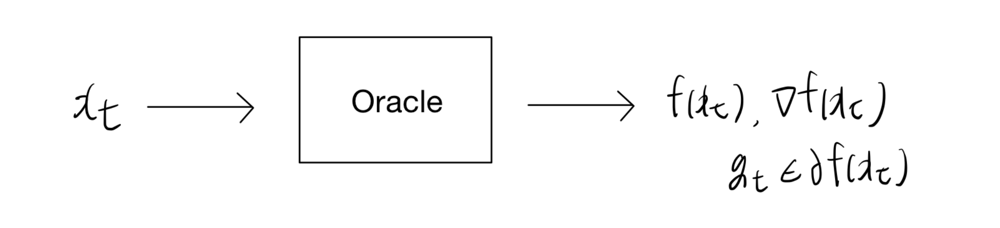
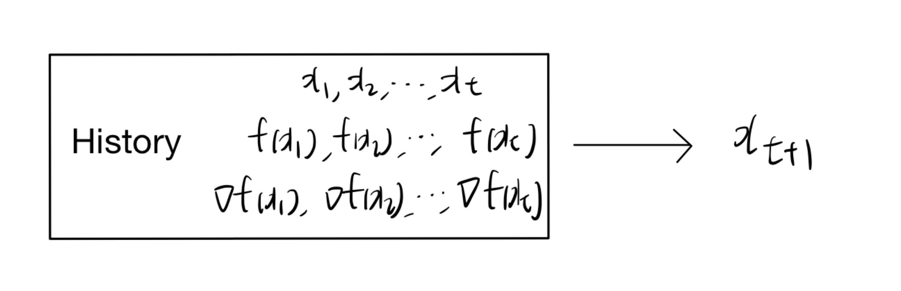

# 1. 서론: 최적화 알고리즘의 한계점 탐구

* 이번 포스트에서는 최적화 알고리즘, 특히 1차 미분 정보(Gradient)를 활용하는 방법론들이 과연 "얼마나 빠르게 수렴할 수 있는가?"에 대한 근본적인 질문을 다룹니다. 본 강의 노트는 크게 세 가지 주제를 목표로 합니다:
  * 1. 1차 오라클 방법론의 반복 복잡도 하한(Lower bounds on iteration complexity)
  * 2. 가속화 기법: 모멘텀을 활용한 경사하강법 (Accelerated method)
  * 3. 사영 없는 기법: Frank-Wolfe 알고리즘 (Projection-free method)

* 이 중 본 포스트에서는 알고리즘의 성능 한계를 규명하는 **1차 오라클 복잡도의 하한(Lower Bounds)**에 집중하여 상세히 알아봅니다.

---

# 2. 기존 경사하강법의 수렴 속도 리뷰

* 하한을 논하기 전에, 우리가 이미 알고 있는 기본적인 경사(Gradient) 및 서브경사(Subgradient) 방법론들의 수렴 속도를 되짚어 볼 필요가 있습니다.
  * **Lipschitz 연속 함수 (Subgradient Method):**
    일반적인 립시츠 연속(Lipschitz continuous) 함수에 대해 서브경사 방법론은 $O(1/\sqrt{T})$의 수렴 속도를 보장합니다. 즉, 오차를 $\epsilon$ 이하로 줄이기 위해서는 $O(1/\epsilon^2)$ 번의 반복(iteration)이 필요합니다.
  * **평활한 볼록 함수 (Gradient Descent):**
    함수가 평활(Smooth)한 특성을 가질 때, 표준 경사하강법은 $O(1/T)$의 수렴 속도를 달성하며, 오차 $\epsilon$ 도달을 위해 $O(1/\epsilon)$ 번의 반복을 요구합니다.
  * **평활하고 강볼록한 함수 (Gradient Descent):**
    함수가 평활하면서 동시에 강볼록(Strongly convex)하다면, 경사하강법은 어떤 상수 $0 < \gamma < 1$에 대해 $O(\gamma^T)$라는 선형 수렴(Linear convergence) 속도를 보입니다. 이때 오차 $\epsilon$을 달성하기 위한 반복 횟수는 기하급수적으로 줄어들어 $O(\log(1/\epsilon))$이 됩니다.

* 여기서 자연스러운 질문이 떠오릅니다. **"과연 이보다 더 빠르고 효율적인 알고리즘을 찾을 수 있을까?"** 이 질문에 답하기 위해 우리는 "오라클 복잡도(Oracle Complexity)"라는 개념을 도입합니다.

---

# 3. 1차 오라클 복잡도 (First-Order Oracle Complexity)

* 최적화 문제 $\min_{x \in C} f(x)$를 풀 때, 알고리즘은 목적 함수 $f$의 전체 형태를 미리 알지 못합니다. 대신 특정 점 $x$에서의 정보만을 국소적으로 확인할 수 있는데, 이 정보를 제공하는 블랙박스를 **1차 오라클(First-order oracle)**이라고 부릅니다.

* 1차 오라클은 입력값 $x$에 대해 다음 두 가지를 반환합니다:
  * 1. 함수 값: $f(x)$
  * 2. 1차 정보: 그래디언트 $\nabla f(x)$ 또는 서브그래디언트 $g_t \in \partial f(x)$

* **오라클 복잡도(Oracle complexity)**란, 주어진 오차 범위 내의 최적해를 찾기 위해 알고리즘이 이 블랙박스 오라클을 **총 몇 번 호출해야 하는가**를 세는 척도입니다.

* 오라클 기반 알고리즘은 위 그림과 같이 과거의 탐색 기록과 확보한 1차 정보를 바탕으로 새로운 해 $x_{t+1}$을 선택해 나갑니다.

---

# 4. 반복 복잡도의 이론적 하한 (Lower Bounds)

* 과연 1차 정보만을 사용할 때 수학적으로 돌파할 수 없는 절대적인 한계선은 어디일까요? Nemirovski와 Yudin(1983)은 이 오라클 복잡도의 하한(Lower bound)을 증명했습니다. 

* 이 정리를 전개하기 위해, 분석 대상이 되는 알고리즘은 초기점 $x_1 = 0$에서 시작하며, 다음 스텝 $x_{t+1}$은 **이전까지 얻은 모든 그래디언트들의 생성 공간(Span) 안에 존재**한다고 가정합니다:
$$x_{t+1} \in \text{span}\{g_1, \dots, g_t\}$$
  * 단, $g_s \in \partial f(x_s)$

* 목적 함수의 성질에 따라 세 가지 핵심 정리로 나뉘어 하한이 제시됩니다.

## 4.1. Lipschitz 연속 볼록 함수에 대한 하한

> **정리 11.1 (Convex & L-Lipschitz continuous)**
> 
> 어떤 상수 $L > 0$에 대해 $L$-Lipschitz 연속성을 만족하는 볼록 함수 $f:\mathbb{R}^d \rightarrow \mathbb{R}$가 존재하여, 오라클 기반 알고리즘으로 생성된 $t \le d$ 번의 반복 점 $x_1, \dots, x_t$들은 다음 부등식을 무조건 만족합니다.
> 
> $$\min_{1 \le s \le t} f(x_s) - \min_{x \in B_2(R)} f(x) \ge \frac{RL}{2(1+\sqrt{t})}$$
> 
> 여기서 $B_2(R) = \{x \in \mathbb{R}^d : \|x\|_2 \le R\}$이며 $R > 0$입니다.

* **해석:** 아무리 알고리즘을 잘 설계해도, 단순히 Lipschitz 연속 조건만 있는 함수에 대해서는 $O(1/\sqrt{t})$의 속도 장벽을 깰 수 없습니다. 기존 서브경사 방법론이 이 하한을 정확히 달성하므로, 해당 조건에서는 이미 최적의 방법론임을 의미합니다.

## 4.2. 평활한 볼록 함수에 대한 하한

> **정리 11.2 (Convex & Smooth)**
> 
> 어떤 상수 $\beta > 0$에 대해 $\ell_2$-노름 기준 $\beta$-평활(smooth)한 특성을 갖는 볼록 함수 $f:\mathbb{R}^d \rightarrow \mathbb{R}$가 존재하여, 오라클 기반 알고리즘으로 생성된 $x_1, \dots, x_t$ (단, $t \le (d-1)/2$)는 다음을 만족합니다.
> 
> $$\min_{1 \le s \le t} f(x_s) - \min_{x \in \mathbb{R}^d} f(x) \ge \frac{3\beta\|x_1 - x^*\|_2^2}{32(t+1)^2}$$

* **해석:** 평활한 볼록 함수의 경우, 이론적인 최상의 수렴 속도는 $O(1/t^2)$입니다. 그런데 우리가 앞서 확인했듯 일반적인 경사하강법은 $O(1/t)$의 속도를 냅니다. 이 정리로 인해 기존 경사하강법은 **최적이 아니며 개선의 여지가 있음**이 드러납니다. 이를 극복하여 하한을 달성하는 기법이 바로 "가속 경사하강법(Nesterov Momentum)"입니다.

## 4.3. 평활하고 강볼록한 함수에 대한 하한

> **정리 11.3 (Smooth & Strongly Convex)**
> 
> 어떤 상수 $\beta \ge \alpha > 0$에 대해 $\beta$-평활하고 $\alpha$-강볼록(strongly convex)한 함수 $f:\mathbb{R}^d \rightarrow \mathbb{R}$가 존재하여, $t \ge 1$에서 오라클 기반 알고리즘으로 생성된 $x_t$는 다음을 만족합니다.
> 
> $$f(x_t) - \min_{x \in \mathbb{R}^d} f(x) \ge \frac{\alpha}{2}\left(\frac{\sqrt{\kappa}-1}{\sqrt{\kappa}+1}\right)^{2(t-1)}\|x_1 - x^*\|_2^2$$
> 
> 여기서 조건수 $\kappa = \beta/\alpha$ 입니다.

* **해석:** 강볼록 함수에서는 선형 수렴이 가능하지만, 그 수렴 비율(Rate)의 밑(Base)이 적어도 $\left(\frac{\sqrt{\kappa}-1}{\sqrt{\kappa}+1}\right)^2$ 이상이어야 한다는 절대적 한계를 보여줍니다.