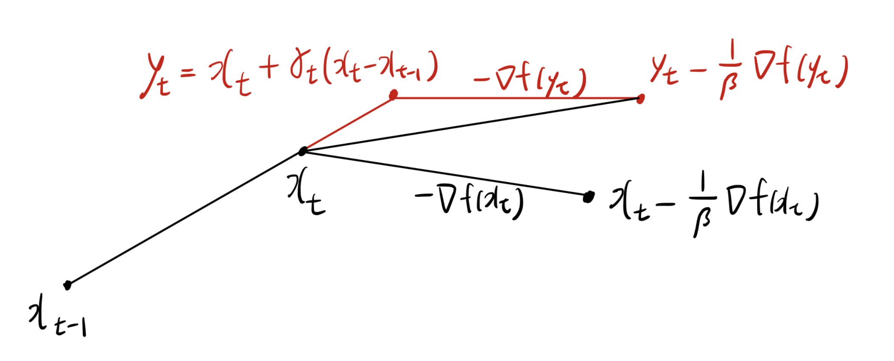

# 1. 서론: 수렴 속도의 간극(Gap)과 가속화의 필요성

* 이전 포스트에서 우리는 1차 오라클(First-order oracle)을 사용하는 최적화 알고리즘의 **수렴 속도 하한(Lower bound)**에 대해 살펴보았습니다. 특히, $\beta$-평활한(smooth) 볼록 함수의 경우 알고리즘이 도달할 수 있는 이론적 최적 수렴 속도는 $O(1/T^2)$임을 확인했습니다.

* 하지만 우리가 알고 있는 표준 경사하강법(Gradient Descent)의 수렴 속도는 $O(1/T)$에 불과합니다. 즉, 이론적 하한과 실제 알고리즘 성능 사이에 **명백한 간극(Gap)**이 존재합니다. 

* 그렇다면 이 하한에 도달하여 수렴 속도를 극대화할 수 있는 더 나은 알고리즘이 존재할까요? Nesterov (1983, 2004)는 이 질문에 대한 해답으로 **가속 경사하강법(Accelerated Gradient Descent)**을 제안했습니다. 이 방법은 모멘텀(Momentum)이라는 물리적 직관을 도입하여 하한인 $O(1/T^2)$ 속도를 완벽히 달성합니다.

---

# 2. 모멘텀(Momentum)의 직관과 업데이트 규칙

* Nesterov 가속화의 핵심은 이전 스텝의 이동 정보를 현재 스텝에 반영하는 **모멘텀(Momentum)**에 있습니다.

* 표준 경사하강법은 $\beta$-평활 함수에 대해 주어진 점 $x_t$에서 다음 업데이트를 수행합니다:
$$x_{t+1} = x_t - \frac{1}{\beta}\nabla f(x_t)$$

* 반면, 모멘텀 기법은 직전 스텝에서 이동했던 방향 벡터인 $x_t - x_{t-1}$을 재사용합니다. 즉, 새로운 점 $x_{t+1}$을 결정할 때 현재 점 $x_t$뿐만 아니라 과거의 점 $x_{t-1}$의 정보까지 함께 고려하는 것입니다.

* 알고리즘은 $x_t$에서 그래디언트를 바로 구하는 대신, 모멘텀 방향을 따라 앞으로 약간 더 이동한 **중간 지점 $y_t$**를 먼저 계산합니다. 가중치 파라미터 $\gamma_t > 0$에 대해 $y_t$는 다음과 같이 정의됩니다:
$$y_t = x_t + \gamma_t(x_t - x_{t-1})$$

* 그런 다음, 이 새로운 탐색 지점 $y_t$에서의 1차 미분 정보(그래디언트)를 계산하여 최종적인 경사하강법 업데이트를 수행합니다:
$$x_{t+1} = y_t - \frac{1}{\beta}\nabla f(y_t)$$

* 이를 종합한 Nesterov 가속 경사하강법 알고리즘은 다음과 같습니다.

### Algorithm 1: Nesterov"s accelerated gradient descent
* **초기화:** $x_1 \in \text{dom}(f)$
* **설정:** $x_0 = x_1$
* **반복 ($t = 1, \dots, T$):**
    * $\gamma_t > 0$ 에 대해 중간점 계산: 
        $$y_t = x_t + \gamma_t(x_t - x_{t-1})$$
    * 경사하강 업데이트: 
        $$x_{t+1} = y_t - \frac{1}{\beta}\nabla f(y_t)$$
* **반환:** $x_{T+1}$

---

# 3. 평활한 볼록 함수의 수렴성 증명 (Smooth Convex Functions)

* 가장 놀라운 점은 $\gamma_t$를 적절히 조절하는 것만으로 오라클 하한을 달성할 수 있다는 수학적 사실입니다.

> **정리 11.4**
> 
> $f:\mathbb{R}^d \rightarrow \mathbb{R}$가 $\ell_2$ 노름에서 $\beta$-평활한 볼록 함수라고 가정합시다. 매 반복 $t \ge 1$마다 모멘텀 파라미터를 다음과 같이 설정하면:
> 
> $$\gamma_t = \frac{t-2}{t+1}$$
> 
> 알고리즘의 출력은 최적해 $x^*$에 대해 다음 수렴 속도를 보장합니다:
> 
> $$f(x_T) - f(x^*) \le \frac{2\beta\|x_1 - x^*\|_2^2}{T^2}$$

### 상세 증명 과정 (Proof)

* 이 증명은 텔레스코핑 합(Telescoping sum)을 구성할 수 있는 영리한 대수적 조작과 볼록 함수의 성질을 결합하여 이루어집니다.

* **1. 보조 변수 설정**
  * $t \ge 0$에 대해 스텝 사이즈 스케일링 계수 $\lambda_t = \frac{2}{t+1}$를 정의합니다. 그러면 파라미터 $\gamma_t$는 다음 관계식을 만족합니다:
  $$\gamma_t = \frac{\lambda_t(1-\lambda_{t-1})}{\lambda_{t-1}}$$
  * 또한, 진행 상황을 추적하기 위한 가상의 보조 수열 $v_{t+1}$을 다음과 같이 정의합니다:
  $$v_{t+1} = x_t + \frac{1}{\lambda_t}(x_{t+1} - x_t) = \frac{1}{\lambda_t}x_{t+1} + \left(1 - \frac{1}{\lambda_t}\right)x_t$$
  * 이 정의를 정리하면 모멘텀 항을 재작성할 수 있습니다:
  $$\gamma_t(x_t - x_{t-1}) = \gamma_t\left(\frac{1}{\lambda_{t-1}} - 1\right)^{-1}(v_t - x_t) = \lambda_t(v_t - x_t)$$
  * 따라서 $y_t$는 $x_t$와 $v_t$의 볼록 결합(Convex combination)으로 표현됩니다:
  $$y_t = x_t + \gamma_t(x_t - x_{t-1}) = (1-\lambda_t)x_t + \lambda_t v_t$$

* **2. $\beta$-평활성과 볼록성 적용**
  * $f$가 $\beta$-평활하므로 $x_{t+1}$과 $y_t$에 대해 하강 보조정리(Descent Lemma)가 성립합니다. 임의의 $z \in \mathbb{R}^d$를 도입하여 수식을 확장합니다:
  $$f(x_{t+1}) \le f(y_t) + \nabla f(y_t)^\top(x_{t+1} - y_t) + \frac{\beta}{2}\|x_{t+1} - y_t\|_2^2$$
  * 볼록성의 1차 조건인 $f(y_t) + \nabla f(y_t)^\top(z - y_t) \le f(z)$를 이용하여 $f(y_t)$를 상한 처리합니다. 이때 알고리즘의 업데이트 식 $\nabla f(y_t) = -\beta(x_{t+1} - y_t)$를 대입하여 정리하면 다음을 얻습니다:
  $$f(x_{t+1}) \le f(z) + \beta(x_{t+1} - y_t)^\top(z - x_{t+1}) + \frac{\beta}{2}\|x_{t+1} - y_t\|_2^2$$

* **3. 최적해 $x^*$와 현재 해 $x_t$에 대한 부등식 결합**
  * 위 식에 $z = x^*$와 $z = x_t$를 각각 대입하여 두 개의 부등식을 만듭니다:
    * 1) $f(x_{t+1}) - f(x^*) \le \beta(x_{t+1} - y_t)^\top(x^* - x_{t+1}) + \frac{\beta}{2}\|x_{t+1} - y_t\|_2^2$
    * 2) $f(x_{t+1}) - f(x_t) \le \beta(x_{t+1} - y_t)^\top(x_t - x_{t+1}) + \frac{\beta}{2}\|x_{t+1} - y_t\|_2^2$
  * 이제 1)식에 $\lambda_t$를 곱하고, 2)식에 $(1-\lambda_t)$를 곱하여 더합니다.
  * 좌변은 다음과 같이 묶입니다:
  $$f(x_{t+1}) - f(x^*) - (1-\lambda_t)(f(x_t) - f(x^*))$$
  * 우변을 정리하기 위해 앞서 정의한 $y_t$와 $v_{t+1}$의 선형 결합 성질을 이용해 완전제곱식 형태로 묶어주면 다음과 같이 매우 깔끔하게 정리됩니다:
  $$\dots = \frac{\beta\lambda_t^2}{2}\|v_t - x^*\|_2^2 - \frac{\beta\lambda_t^2}{2}\|v_{t+1} - x^*\|_2^2$$

* **4. 텔레스코핑 합(Telescoping Sum) 완성**
  * 양변을 $\lambda_t^2$로 나누어 리야푸노프 함수(Lyapunov function) 형태의 부등식을 만듭니다:
  $$\frac{1}{\lambda_t^2}(f(x_{t+1}) - f(x^*)) + \frac{\beta}{2}\|v_{t+1} - x^*\|_2^2 \le \frac{1-\lambda_t}{\lambda_t^2}(f(x_t) - f(x^*)) + \frac{\beta}{2}\|v_t - x^*\|_2^2$$
  * $\lambda_t = \frac{2}{t+1}$의 정의에 의해 $\frac{1-\lambda_t}{\lambda_t^2} \le \frac{1}{\lambda_{t-1}^2}$가 성립합니다. 이를 계속해서 $t=1$까지 연쇄적으로 축소(Telescoping)시킵니다:
  $$\le \frac{1}{\lambda_{t-1}^2}(f(x_t) - f(x^*)) + \frac{\beta}{2}\|v_t - x^*\|_2^2$$
  $$\dots \le \frac{1-\lambda_1}{\lambda_1^2}(f(x_1) - f(x^*)) + \frac{\beta}{2}\|v_1 - x^*\|_2^2$$
  * 초기값 $\lambda_1 = 1$이므로 첫 번째 항은 $0$이 되어 사라지고, 초기 보조 벡터 $v_1 = x_1$이므로 최종적으로 우변은 $\frac{\beta}{2}\|x_1 - x^*\|_2^2$ 만 남습니다.

* 결과적으로 다음을 얻습니다:
$$f(x_{t+1}) - f(x^*) \le \frac{\beta\lambda_t^2}{2}\|x_1 - x^*\|_2^2$$
* $\lambda_T \approx 2/T$ 이므로, $f(x_T) - f(x^*) = O(1/T^2)$가 되어 오라클 하한과 완벽하게 일치합니다. $\blacksquare$

* 이 정리에 따르면 오차 $\epsilon$ 이내로 도달하기 위해 요구되는 반복 횟수는 표준 경사하강법의 $O(1/\epsilon)$에서 $O(1/\sqrt{\epsilon})$으로 대폭 감소합니다.

---

# 4. 강볼록 함수의 수렴성 (Strongly Convex Functions)

* 함수가 $\beta$-평활할 뿐만 아니라 $\alpha$-강볼록(Strongly convex)한 경우, 모멘텀 파라미터 $\gamma_t$를 상수로 고정하여 선형 수렴 속도를 더욱 끌어올릴 수 있습니다.

> **정리 11.5**
> 
> $f:\mathbb{R}^d \rightarrow \mathbb{R}$가 $\ell_2$ 노름에서 $\beta$-평활하며 $\alpha$-강볼록한 볼록 함수라고 합시다. 조건수를 $\kappa = \beta/\alpha$라 할 때, 파라미터를 다음과 같이 고정합니다:
> 
> $$\gamma_t = \frac{\sqrt{\kappa}-1}{\sqrt{\kappa}+1}$$
> 
> 이때 Nesterov 가속 알고리즘은 다음의 수렴 속도를 만족합니다:
> 
> $$f(x_T) - f(x^*) \le \frac{\alpha+\beta}{2}\left(\frac{\sqrt{\kappa}-1}{\sqrt{\kappa}+1}\right)^{(T-1)/2}\|x_1 - x^*\|_2^2$$

*  **해석:** 이전 포스트(하한 정리)에서 살펴본 강볼록 함수의 오라클 복잡도 하한 기준 베이스가 $\left(\frac{\sqrt{\kappa}-1}{\sqrt{\kappa}+1}\right)^2$ 이었습니다. 정리 11.5에 나타난 수렴 속도는 이 하한선을 정확히 따라가고 있음을 보여주며, Nesterov 가속화가 평활성뿐만 아니라 강볼록성 조건에서도 **이론적으로 완벽한 최적 알고리즘(Optimal algorithm)**임을 입증합니다.