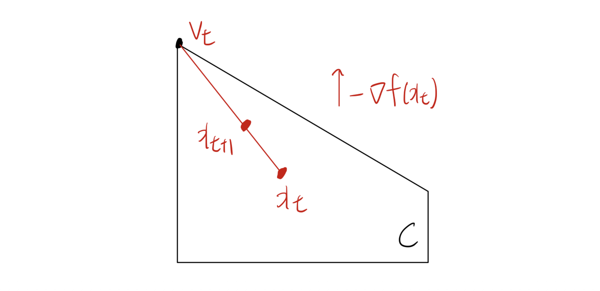

# 1. 서론: 사영 경사하강법(PGD)의 한계점

* 이전까지 우리는 평활한(smooth) 함수를 최소화할 때 사영 경사하강법(Projected Gradient Descent, PGD)이 $O(1/T)$의 수렴 속도를 달성함을 확인했습니다. 그러나 실무적인 관점에서 PGD는 다음과 같은 두 가지 주요한 한계점을 가집니다.
  * 1. **사영(Projection) 연산의 높은 비용:** 실행 가능 영역(feasible set) $C$ 위로 해를 사영하는 단계는 그 자체로 하나의 최적화 문제를 푸는 것과 같습니다. 집합 $C$가 다면체(polyhedron)와 같이 단순한 형태라 할지라도, 투영 연산은 계산 비용이 높은 이차계획법(Quadratic Program, QP)을 요구합니다.
  * 2. **$\ell_2$-노름 기반 평활성의 한계:** 기존의 경사하강법 분석은 $\ell_2$-노름 기준의 평활성에 강하게 의존합니다. 만약 함수가 $\ell_1$-노름에 대해서 아주 작은 파라미터 $\beta$로 평활하더라도, 이를 $\ell_2$-노름 기준으로 변환하면 차원 $d$에 비례하여 평활성 파라미터가 증폭됩니다.
     $$||\nabla f(x) - \nabla f(y)||_2 \le \sqrt{d}||\nabla f(x) - \nabla f(y)||_\infty \le \sqrt{d}\beta||x - y||_1 \le d\beta||x - y||_2$$ 
     * 결과적으로 알고리즘의 수렴 속도가 문제의 차원 $d$에 크게 영향을 받게 되어 "차원 독립적(dimension-free)"이라는 좋은 특성을 잃게 됩니다.

---

# 2. 동기: LASSO 정규화 문제 (Constrained Formulation)

* PGD의 사영 연산이 왜 문제가 되는지 LASSO 회귀 모델의 사례를 통해 구체적으로 살펴봅시다. 주어진 $n$개의 데이터 포인트 $(x_1, y_1), \dots, (x_n, y_n)$에 대해 회귀식을 구성할 때, 페널티 항을 더한 라그랑주(Lagrangian) 형태의 LASSO는 다음과 같습니다.
$$\min_\beta \frac{1}{n} ||y - X\beta||_2^2 + \lambda ||\beta||_1$$ 
  * 여기서 $y = (y_1, \dots, y_n)^\top$이고 $X$의 각 행은 $x_i^\top$입니다.

* 이 문제는 정규화 정도를 결정하는 파라미터 $t$를 사용하는 "제약 조건(Constrained) 형태"로 동일하게 변환할 수 있습니다.
$$\text{minimize } \frac{1}{n} ||y - X\beta||_2^2$$ 
$$\text{subject to } ||\beta||_1 \le t$$ 

* 이 경우 제약 집합은 $C = \{\beta \in \mathbb{R}^d : ||\beta||_1 \le t\}$ 형태의 다면체(polytope)가 됩니다. PGD를 적용하려면 매 반복마다 이 다면체 위로 사영(QP)을 수행해야 하므로 병목 현상이 발생합니다. 반면, 다면체 위에서 임의의 선형 함수를 최적화하는 것은 선형계획법(Linear Program, LP)이므로 훨씬 빠르고 효율적으로 해결할 수 있습니다.

---

# 3. 사영 없는 기법: Frank-Wolfe Algorithm

* 사영 연산의 한계를 극복하기 위해 제안된 것이 바로 **조건부 경사하강법(Conditional Gradient Method)**, 흔히 **Frank-Wolfe 알고리즘**이라 불리는 방법론입니다 (Frank & Wolfe, 1956).

### Algorithm 2: Frank-Wolfe algorithm
* **초기화:** $x_1 \in C$ 
* **반복 ($t = 1, \dots, T-1$):** 
    * **선형 최적화:** $v_t \in \text{argmin}_{v \in C} \nabla f(x_t)^\top v$ 
    * **볼록 결합 업데이트:** $x_{t+1} = (1 - \lambda_t)x_t + \lambda_t v_t$ (단, $0 < \lambda_t < 1$) 
* **반환:** $x_T$ 

* 이 알고리즘의 핵심은 제약 집합 $C$ 내에서 목적 함수의 1차 선형 근사(그래디언트와의 내적)를 최소화하는 극단점(extreme point) $v_t$를 찾는 것입니다. $C$가 다면체라면 이는 단순한 LP를 푸는 것으로 귀결됩니다. QP를 푸는 PGD와 극명히 대조되며 "사영이 필요 없는(projection-free)" 알고리즘으로 불립니다.

 

* 위 도식에서 알 수 있듯, 이동 방향 $v_t - x_t$는 정확히 $-\nabla f(x_t)$ 방향과 일치하지는 않지만 , $C$ 내부에서의 안전한 하강 경로를 제공합니다.

---

# 4. Frank-Wolfe 알고리즘의 수렴성 이론

* 먼저 일반적인 노름(Norm)에 대한 평활성을 정의합니다.

> **정의 11.6:** 함수 $f$가 특정 노름 $||\cdot||$에 대해 $\beta$-평활하다는 것은, 임의의 $x, y \in \mathbb{R}^d$에 대해 다음을 만족한다는 의미입니다.
> 
> $$||\nabla f(x) - \nabla f(y)||_* \le \beta ||x - y||$$ 
> 
> 여기서 $||\cdot||_*$는 쌍대 노름(dual norm)입니다.

> **정리 11.7 (수렴성 증명)**
> 
> $\beta$-평활한 볼록 함수 $f$를 임의의 노름에 대해 최적화할 때 , Frank-Wolfe 알고리즘에서 스텝 사이즈를 $\lambda_t = \frac{2}{t+1}$로 설정하면 $t \ge 2$에 대해 다음이 성립합니다.
> 
> $$f(x_t) - f(x^*) \le \frac{2\beta R^2}{t+1}$$ 
> 
> 단, $x^*$는 최적해, $R = \sup_{x,y \in C} ||x - y||$는 제약 집합의 직경.

### **증명 (Proof):**
* 평활성의 정의에 따른 하강 보조정리(Descent Lemma)를 적용하면 다음과 같습니다.
$$f(x_{t+1}) \le f(x_t) + \nabla f(x_t)^\top (x_{t+1} - x_t) + \frac{\beta}{2} ||x_{t+1} - x_t||^2$$ 
* 알고리즘의 업데이트 식 $x_{t+1} - x_t = \lambda_t(v_t - x_t)$를 대입합니다.
$$= f(x_t) + \lambda_t \nabla f(x_t)^\top (v_t - x_t) + \frac{\beta}{2} ||x_{t+1} - x_t||^2$$ 
* $v_t$는 $\nabla f(x_t)^\top v$를 최소화하도록 선택되었으므로 최적해 $x^*$에 대해서도 $\nabla f(x_t)^\top v_t \le \nabla f(x_t)^\top x^*$가 성립합니다. 또한 볼록성의 1차 조건 $\nabla f(x_t)^\top (x^* - x_t) \le f(x^*) - f(x_t)$를 적용합니다.
$$\le f(x_t) + \lambda_t (f(x^*) - f(x_t)) + \frac{\beta}{2} ||x_{t+1} - x_t||^2$$ 
* 집합의 직경 정의에 의해 $||x_{t+1} - x_t|| = \lambda_t ||v_t - x_t|| \le \lambda_t R$ 이므로,
$$f(x_{t+1}) - f(x^*) \le (1 - \lambda_t)(f(x_t) - f(x^*)) + \frac{\beta \lambda_t^2 R^2}{2}$$ 
$$\le \frac{t-1}{t+1}(f(x_t) - f(x^*)) + \frac{2\beta R^2}{(t+1)^2}$$ 
* 이 점화식에 $t=1$부터 귀납법을 적용하면 ($f(x_2) - f(x^*) \le \frac{2\beta R^2}{3}$), $$f(x_{t+1}) - f(x^*) \le \frac{t}{(t+1)^2} 2\beta R^2 \le \frac{1}{t+2}\beta R^2$$ 가 도출되어 수렴 속도 $O(1/T)$가 증명됩니다. $\blacksquare$

---

# 5. $\ell_p$-제약 최적화 문제에서의 활용

* 다음과 같은 $\ell_p$ 노름 제약 문제를 고려해 봅시다.
$$\text{minimize } f(x) \quad \text{subject to } ||x||_p \le b$$ 
  * 단, $p \ge 1$

* 이때 Frank-Wolfe의 서브 문제는 다음과 같이 정리됩니다.
$$v_t \in \text{argmin}_{||v||_p \le b} \nabla f(x_t)^\top v = -b \cdot \partial ||\nabla f(x_t)||_q$$ 
  * 여기서 $q$는 $1/p + 1/q = 1$을 만족하는 쌍대 지수(dual exponent)입니다.

* **$p=1$ 인 경우 ($q=\infty$):**
  $$v_t = -b \cdot \text{sign}(\nabla_{i_t} f(x_t)) e_{i_t}$$ 
  * 단, $i_t \in \text{argmax}_{i} |\nabla_i f(x_t)|$, $e_i$는 표준 기저 벡터.
  * 이는 그래디언트의 절댓값이 가장 큰 **단 하나의 좌표(coordinate) 방향으로만 이동**함을 의미하며, 결과적으로 해의 희소성(sparsity)을 극대화하는 **좌표 하강법(Coordinate Descent)**의 아이디어와 직결됩니다.
* **$p \ge 1$ 인 경우:**
  $$(v_t)_i = -\alpha \cdot \text{sign}(\nabla_i f(x_t)) |\nabla_i f(x_t)|^{p-1}$$ 
  * 단, $\alpha$는 $||v_t||_q = b$를 보장하는 정규화 상수.
  * 각 좌표축으로의 이동량이 그래디언트 크기에 기반하여 분배됩니다.

---

# 6. 머신러닝 응용: 저랭크 행렬 완성 (Low-Rank Matrix Completion)

* 사용자(n)-영화(p) 평점 행렬과 같이 부분적으로만 관측된 행렬 $A \in \mathbb{R}^{n \times p}$의 누락된 값을 추정하는 추천 시스템 문제를 생각해 봅시다.
실제 행렬 $A^*$가 소수의 특징에 의해 결정된다면 $A^* = U V^\top$의 형태를 띠며 랭크가 $k$ 이하라는 가정을 할 수 있습니다  (단, $k < n, p$ ).

* 이 제약을 원래 형태인 비볼록(non-convex) 문제로 풀면 몹시 어렵습니다.
$$\text{minimize } \frac{1}{2} ||A - X||_F^2 \quad \text{subject to } \text{rank}(X) \le k$$ 

* 따라서 이를 볼록(convex) 함수인 **핵 노름(Nuclear norm, $||\cdot||_{nuc}$)**으로 완화(relaxation)합니다.
$$\text{minimize } \frac{1}{2} ||A - X||_F^2 \quad \text{subject to } ||X||_{nuc} \le k$$ 

* 이 볼록 최적화 문제 를 풀기 위해 두 가지 접근법을 비교해 볼 수 있습니다.
  * 1. **PGD:** 매 스텝마다 행렬을 핵 노름 제약 $C = \{X : ||X||_{nuc} \le k\}$ 위로 투영해야 합니다. 이는 전체 특이값 분해(Full SVD) 연산을 강제하므로 계산 비용이 대단히 높습니다.
  * 2. **Frank-Wolfe:** FW 업데이트의 서브 문제는 목적 함수가 $\text{Tr}((A-X_t)^\top V)$ 꼴의 선형 최적화로 변환됩니다.
     $$V_t \in \text{argmin} \{\text{Tr}((A-X_t)^\top V) : ||V||_{nuc} \le k\}$$ 
     * 놀랍게도 이는 단순히 행렬 $(X_t - A)$의 **최상위 좌/우 특이 벡터(top singular vectors) 하나씩만을 계산하는 것과 동치**입니다. 따라서 무거운 SVD 대신 훨씬 가벼운 **거듭제곱법(Power Method)**만을 적용하여 빠르게 $V_t$를 찾을 수 있어 실행 속도가 극적으로 향상됩니다.