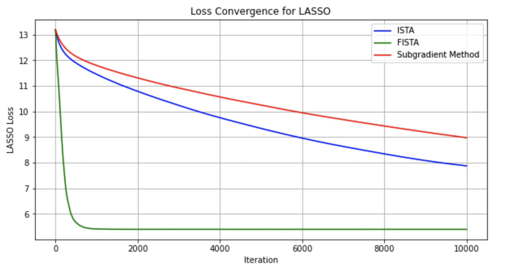

# 1. Introduction: Composite Minimization

* 많은 최적화 문제, 특히 통계적 학습(Statistical Learning) 모델은 목적 함수가 다음과 같이 두 부분의 합으로 구성됩니다.
$$\min_{x \in \mathbb{R}^d} f(x) = g(x) + h(x)$$ 
  * **$g(x)$**: 매끄러운 볼록 함수(Smooth Convex). 예를 들어 LASSO의 Least Squares 항인 $\frac{1}{n}\|y-X\beta\|_2^2$가 이에 해당합니다. 
  * **$h(x)$**: 매끄럽지 않지만 구조가 단순한 볼록 함수(Non-smooth Convex). LASSO의 $L_1$ 페널티 항인 $\lambda\|\beta\|_1$이 대표적입니다. 

* $h(x)$의 비미분성 때문에 표준 경사 하강법을 쓸 수 없고, Subgradient Method는 $O(1/\epsilon^2)$으로 매우 느립니다.  이를 해결하기 위해 $g$의 미분 정보와 $h$의 근접 연산자를 결합한 **Proximal Gradient Descent**가 등장합니다. 

# 2. Proximal Operator (근접 연산자)

## 2.1. 정의와 성질

* 함수 $h$에 대한 파라미터 $\eta > 0$의 근접 연산자는 다음과 같이 정의됩니다. 
$$\text{prox}_{\eta h}(x) = \arg\min_u \left\{ h(u) + \frac{1}{2\eta} \|u - x\|_2^2 \right\}$$

* 이 연산자는 다음의 중요한 성질을 만족합니다.

> **Lemma (Optimality Condition)** 
> 
> $u = \text{prox}_{\eta h}(x)$ 이기 위한 필요충분조건은 다음과 같습니다.
> 
> $$x - u \in \eta \partial h(u)$$ 

### **[증명]**
* $u$가 정의에 따른 최소화 해라면, 해당 목적 함수의 $u$에 대한 Sub-differential에 0이 포함되어야 합니다.
$$0 \in \partial h(u) + \frac{1}{\eta}(u - x) \implies \frac{1}{\eta}(x - u) \in \partial h(u) \implies x - u \in \eta \partial h(u)$$

# 3. Proximal Gradient Descent (Algorithm 1)

* 복합 목적 함수 $f(x) = g(x) + h(x)$를 최소화하기 위한 업데이트 규칙은 다음과 같습니다. 

$$x_{t+1} = \text{prox}_{\eta h}(x_t - \eta \nabla g(x_t))$$ 

* 이 과정은 $x_t$에서 $g$ 방향으로 경사 하강을 한 후, 그 결과를 $h$에 대해 근접 연산(Projection의 일반화)을 수행하는 것으로 해석할 수 있습니다. 

### Algorithm 1: Proximal Gradient Descent 
* 1.  **Initialize:** $x_1 \in \mathbb{R}^d$ 
* 2.  **For $t=1, \dots, T$ do:** 
    * $x_{t+1} = \text{prox}_{\eta h}(x_t - \eta \nabla g(x_t))$ 
* 3.  **Return** $x_{T+1}$ 

# 4. Gradient Mapping (경사 매핑)

* 분석을 용이하게 하기 위해, 일반적인 경사 하강법의 $\nabla f$ 역할을 하는 **Gradient Mapping** $G_\eta(x)$를 도입합니다. 

$$G_\eta(x) = \frac{1}{\eta} \left( x - \text{prox}_{\eta h}(x - \eta \nabla g(x)) \right)$$ 

* 이 정의를 사용하면 업데이트 식은 $-\eta G_\eta(x)$를 더하는 표준적인 형태가 됩니다. 
$$x_{t+1} = x_t - \eta G_\eta(x_t)$$ 

* **특수 사례:** $h(x) = I_C(x)$ (집합 $C$에 대한 지시 함수)인 경우, $G_\eta(x)$는 Projected Gradient가 되며, $h=0$인 경우 $G_\eta(x) = \nabla g(x)$가 됩니다. 

# 5. 수렴성 분석 (Convergence Analysis)

## 5.1. 핵심 보조정리: Incremental Improvement

> **Lemma (Descent Property)** 
> 
> $g$가 $\beta$-smooth하고 $\alpha$-strongly convex($\alpha \ge 0$)일 때, 학습률 $\eta \le 1/\beta$에 대하여 다음이 성립합니다. 
> 
> $$f(x - \eta G_\eta(x)) \le f(z) + G_\eta(x)^\top (x - z) - \frac{\eta}{2} \|G_\eta(x)\|_2^2 - \frac{\alpha}{2} \|x - z\|_2^2$$ 

### **[증명 개요]**
* $g$의 $\beta$-smoothness 성질($g(y) \le g(x) + \nabla g(x)^\top(y-x) + \frac{\beta}{2}\|y-x\|^2$)과 $h$의 볼록성, 그리고 근접 연산자의 최적성 조건을 결합하여 유도합니다. 

## 5.2. Smooth Case ($O(1/T)$ 수렴)

> **Theorem 1** 
> 
> $g$가 $\beta$-smooth convex이고 $h$가 convex일 때, $\eta = 1/\beta$로 설정하면 다음을 만족합니다. 
> 
> $$f(x_{T+1}) - f(x^*) \le \frac{\beta \|x_1 - x^*\|_2^2}{2T}$$ 

### **[증명]**
* 위 Lemma에서 $z=x_t$, $z=x^*$를 번갈아 대입하여 얻은 부등식들을 $t=1$부터 $T$까지 합산(Telescoping sum)하면 $O(1/T)$의 속도를 얻을 수 있습니다. 

## 5.3. Strongly Convex Case (Linear Convergence)

> **Theorem 2** 
> 
> $g$가 $\alpha$-strongly convex이고 $\beta$-smooth일 때 다음을 만족합니다. 
> 
> $$\|x_{T+1} - x^*\|_2^2 \le \left(1 - \frac{\alpha}{\beta}\right)^T \|x_1 - x^*\|_2^2$$ 

* 이것은 강한 볼록성이 있을 때 알고리즘이 기하급수적으로 빠르게 최적해에 수렴함을 의미합니다. 

# 6. Accelerated Proximal Gradient Descent (FISTA)

* 표준 Proximal Gradient Descent(ISTA)는 $O(1/T)$의 속도를 가지지만, Nesterov 가속 기법을 통해 이를 $O(1/T^2)$으로 개선할 수 있습니다. 

## 6.1. Momentum의 도입

* 현재 점 $x_t$에서 직접 업데이트하는 대신, 이전 스텝의 정보를 담은 **Momentum** 방향으로 이동한 $y_t$에서 경사를 계산합니다. 
$$y_t = x_t + \gamma_t (x_t - x_{t-1})$$ 

### Algorithm 2: Accelerated Proximal Gradient Descent 
* 1.  **Initialize:** $x_1 \in \mathbb{R}^d$, $x_0 = x_1$ 
* 2.  **For $t=1, \dots, T$ do:** 
    * $y_t = x_t + \gamma_t(x_t - x_{t-1})$ 
    * $x_{t+1} = \text{prox}_{h/\beta} \left( y_t - \frac{1}{\beta} \nabla g(y_t) \right)$ 
* 3.  **Return** $x_{T+1}$ 

## 6.2. 가속 수렴 정리

> **Theorem 3** 
> 
> 가속 파라미터를 다음과 같이 설정하면:
> 
> $$\eta = \frac{1}{\beta}, \quad \gamma_t = \frac{t-2}{t+1}$$ 
> 
> 수렴 속도는 다음과 같습니다.
> 
> $$f(x_{T+1}) - f(x^*) \le \frac{2\beta}{(T+1)^2} \|x_1 - x^*\|_2^2$$ 

* 이는 복합 볼록 최적화에서 얻을 수 있는 이론적 최적 속도입니다. 

# 7. 성능 비교 (LASSO Example)

 

* 위 그래프는 300개의 변수와 100개의 샘플로 구성된 LASSO 문제의 실험 결과입니다. 
  * **Subgradient Method**: 매우 느린 감소. 
  * **ISTA (Proximal Gradient)**: 매끄러운 수렴을 보이나 속도는 보통. 
  * **FISTA (Accelerated)**: 모멘텀의 영향으로 초기에 약간의 진동이 있을 수 있으나 최종적으로는 월등히 빠른 속도로 수렴. 