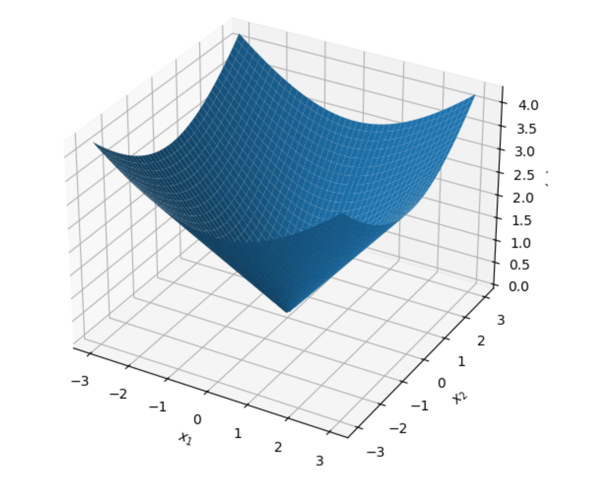
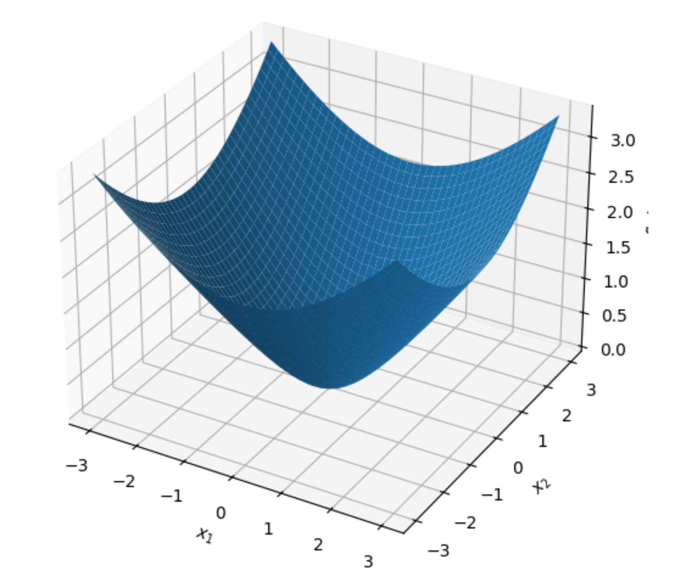

# 들어가며 (Introduction)

* 머신러닝과 통계학, 계량경제학의 수많은 문제(예: Lasso 회귀의 $L_1$ 정규화, SVM의 Hinge Loss 등)는 **비매끄러운(Nonsmooth) 목적 함수**를 포함하고 있습니다. 이러한 비매끄러운 볼록 최적화(Nonsmooth Convex Optimization) 문제는 전통적인 Subgradient Descent를 사용할 경우 수렴 속도가 $O(1/\sqrt{T})$로 매우 느리다는 치명적인 단점이 있습니다.

* 이러한 한계를 극복하기 위한 강력한 수학적 기법이 바로 **평활화 근사(Smooth Approximation)**입니다. 본 포스트에서는 미분 불가능한 함수를 미분 가능한 부드러운 함수로 근사하는 방법, 이를 통해 Nesterov의 가속 기울기 하강법(Accelerated Gradient Descent)을 적용하여 $O(1/T)$의 빠른 수렴 속도를 달성하는 과정, 그리고 최적화 이론의 근간이 되는 **Fenchel 켤레(Fenchel Conjugate)**와 **Moreau 분해(Moreau Decomposition)**의 개념과 증명 과정을 상세히 다룹니다.

---

# 1. 평활화 근사 (Smooth Approximation)

## 1.1. $(p, q)$-평활화 가능 함수 (Smoothable Function)의 정의

* 어떤 볼록 함수 $f$가 미분 불가능한 뾰족한 점(Kink)을 가지고 있더라도, 우리가 임의의 오차 범위 내에서 이를 부드러운 함수로 근사할 수 있다면 최적화가 훨씬 수월해집니다. 이를 수학적으로 다음과 같이 정의합니다.

* 볼록 함수 $f$가 다음 조건을 만족할 때, **$(p, q)$-smoothable** 하다고 정의합니다:
  * 임의의 $\mu > 0$에 대하여, 다음 두 가지 조건을 만족하는 볼록 함수 $f_\mu$가 존재해야 합니다.
  * 1. $f_\mu$는 $(p/\mu)$-smooth 함수입니다. (즉, $\nabla f_\mu$가 $p/\mu$-Lipschitz 연속임을 의미합니다.)
  * 2. 모든 $x$에 대하여 다음 부등식을 만족해야 합니다.
     $$f_\mu(x) \le f(x) \le f_\mu(x) + q\mu$$

* 위 정의의 직관적인 의미는 매개변수 $\mu$를 작게 만들수록 $f_\mu$는 원래 함수 $f$에 극도로 가까워지지만(오차 $q\mu$ 감소), 그 대가로 함수의 곡률 혹은 그래디언트의 변화율 제한(Smoothness constant $p/\mu$)은 커진다는 트레이드오프를 보여줍니다.

## 1.2. Example 1: $L_1$ 노름 (Norm)

* 가장 대표적인 비매끄러운 함수인 $L_1$ 노름 $f(x) = |x|$를 평활화해 보겠습니다. 이를 위해 머신러닝의 Robust Regression에서도 자주 쓰이는 **Huber 함수** $L_\mu(z)$를 도입합니다.

$$
L_\mu(z) = \begin{cases} 
\frac{z^2}{2\mu}, & \text{if } |z| \le \mu \\
|z| - \frac{\mu}{2}, & \text{otherwise}
\end{cases}
$$

### **[평활화 조건 증명]**
* 1. **오차 바운드(Approximation Bound):**
   - $|z| \le \mu$일 때: $L_\mu(z) = \frac{z^2}{2\mu}$. 여기서 $\frac{z^2}{2\mu} \le \frac{\mu|z|}{2\mu} = \frac{|z|}{2} \le |z|$ 이며, $|z| - L_\mu(z) = |z| - \frac{z^2}{2\mu} \le \frac{\mu}{2}$ (완전제곱식 유도에 의해 최대치 도달).
   - $|z| > \mu$일 때: $L_\mu(z) = |z| - \frac{\mu}{2}$. 따라서 $|z| - L_\mu(z) = \frac{\mu}{2}$.
   - 결론적으로 모든 $z$에 대해 $L_\mu(z) \le |z| \le L_\mu(z) + \frac{\mu}{2}$가 성립합니다.
* 2. **Smoothness:** - $L_\mu(z)$의 도함수는 구간 경계에서 연속이며 기울기의 최대 변화율은 원점 부근의 이차함수 영역에서 발생하며 그 값은 $1/\mu$입니다. 
   - 따라서 $L_\mu$는 $(1/\mu)$-smooth 합니다.

* 이로써 1차원 절댓값 함수 $|\cdot|$는 **$(1, 1/2)$-smoothable** 함을 알 수 있습니다.

### **[다차원 공간으로의 확장]**
* $x \in \mathbb{R}^d$일 때 $f(x) = \|x\|_1 = \sum_{i=1}^d |x_i|$ 입니다. 이에 대한 평활화 함수를 $f_\mu(x) = \sum_{i=1}^d L_\mu(x_i)$로 정의하면:
  - $f_\mu$는 여전히 각 축에 독립적이므로 $(1/\mu)$-smooth 합니다.
  - 각 차원마다 최대 $\frac{\mu}{2}$의 오차가 발생하므로, 전체 오차는 $\frac{d\mu}{2}$가 됩니다.
  - $\therefore$ 부등식 $f_\mu(x) \le \|x\|_1 \le f_\mu(x) + \frac{d\mu}{2}$가 성립하며, $\| \cdot \|_1$은 **$(1, d/2)$-smoothable** 합니다.

## 1.3. Example 2: $L_2$ 노름 (Norm)

* $g(x) = \|x\|_2$ 역시 원점 $x=0$에서 뾰족한 원추(Cone) 형태를 띠어 미분 불가능합니다. 이를 부드럽게 만들기 위해 다음과 같은 쌍곡선 형태의 함수를 도입합니다.

$$f_\mu(x) = \sqrt{\|x\|_2^2 + \mu^2} - \mu$$

### **[평활화 조건 증명]**
* 1. **오차 바운드 (Approximation Bound):**
   - 삼각부등식 혹은 단순 대수 비교를 통해 $\sqrt{\|x\|_2^2 + \mu^2} \le \|x\|_2 + \mu$ 임을 알 수 있습니다. (양변 제곱시 우변에 $2\mu\|x\|_2 \ge 0$ 항이 남음)
   - 또한 $\sqrt{\|x\|_2^2 + \mu^2} \ge \|x\|_2$ 임은 자명합니다.
   - 따라서 부등식 $f_\mu(x) \le \|x\|_2 \le f_\mu(x) + \mu$ 가 성립합니다.
* 2. **Smoothness (Hessian 바운드 도출):**
   - 1차 미분 (Gradient): $\nabla f_\mu(x) = \frac{x}{\sqrt{\|x\|_2^2 + \mu^2}}$
   - 2차 미분 (Hessian): 몫의 미분법을 적용합니다.
     $$\nabla^2 f_\mu(x) = \frac{1}{\sqrt{\|x\|_2^2 + \mu^2}}I - \frac{1}{(\|x\|_2^2 + \mu^2)^{3/2}} x x^\top$$
   - Hessian 행렬이 양의 정부호(Positive Definite)임과 동시에 상한을 구해보면, 뒤의 항이 $x x^\top$ 형태의 Rank-1 행렬이므로 언제나 빼주는 효과를 가집니다. 즉,
     $$\nabla^2 f_\mu(x) \preceq \frac{1}{\sqrt{\|x\|_2^2 + \mu^2}}I \preceq \frac{1}{\sqrt{\mu^2}}I = \frac{1}{\mu}I$$
   - Hessian의 최대 고윳값이 $1/\mu$ 이하이므로 $f_\mu$는 $(1/\mu)$-smooth 합니다.

* 결과적으로 $\|\cdot\|_2$는 **$(1, 1)$-smoothable** 합니다. ($L_1$ 노름과 달리 차원 $d$가 오차 상수에 곱해지지 않는다는 강력한 이점이 있습니다.)

## 1.4. Lipschitz 함수의 Moreau-Yosida 평활화

* 일반적인 $L$-Lipschitz 볼록 함수 $f$에 대해서도 계통적인 평활화 방법이 존재합니다. 임의의 $\eta > 0$에 대하여 **Moreau-Yosida 평활화(Moreau Envelope)** $f_\eta(x)$를 다음과 같이 정의합니다.

$$f_\eta(x) := \inf_u \left\{ f(u) + \frac{1}{2\eta}\|u - x\|_2^2 \right\}$$

* 이 함수는 본래 함수를 아래로 볼록한 이차 함수들을 이용해 '인프 컨볼루션(Inf-convolution)'한 결과물입니다.
- **Smoothness:** $f_\eta$는 도함수로 $\nabla f_\eta(x) = \frac{1}{\eta}(x - \text{prox}_{\eta f}(x))$를 가지며, Proximal 연산자의 비팽창성(Non-expansiveness)에 의해 $(1/\eta)$-smooth 속성을 갖습니다.
- **오차 바운드 (강의 자료 빈칸 보충):** - 상한: $u=x$를 대입하면 $f_\eta(x) \le f(x) + 0 = f(x)$가 되어 쉽게 도출됩니다.
  - 하한: $u^*$가 위 infimum의 해라고 할 때, $f$가 $L$-Lipschitz 이므로 $f(x) - f(u^*) \le L\|x - u^*\|$가 성립합니다.
    $$f_\eta(x) = f(u^*) + \frac{1}{2\eta}\|u^* - x\|_2^2 \ge f(x) - L\|u^* - x\|_2 + \frac{1}{2\eta}\|u^* - x\|_2^2$$
    * 우변의 식은 $\|u^* - x\|_2$에 대한 이차방정식으로 볼 수 있으며, 최솟값은 $\|u^* - x\|_2 = \eta L$일 때 발생하고, 그 최솟값은 $f(x) - \frac{\eta L^2}{2}$가 됩니다.
  - 따라서, $f(x) - \frac{\eta L^2}{2} \le f_\eta(x) \implies f_\eta(x) \le f(x) \le f_\eta(x) + \frac{L^2}{2}\eta$ 가 성립합니다.

* 결과적으로 임의의 $L$-Lipschitz 함수는 위 연산을 통해 **$(1, L^2/2)$-smoothable** 하다는 것을 증명할 수 있습니다.

---

# 2. 비매끄러운 함수의 평활화 기반 최적화 (Smooth Optimization)

## 2.1. 문제 정의 및 근사 알고리즘

* 우리가 풀고자 하는 목적 함수가 다음과 같다고 가정합시다.
$$\min_{x} \quad g(x) + h(x)$$
  * 여기서 $g$는 볼록하면서 **$(p, q)$-smoothable** 한 함수이고, $h$는 단순한(proximal 연산이 쉬운) 볼록 함수입니다.

* 직접 이 문제를 푸는 대신, 앞서 배운 $g_\mu(x)$로 치환한 근사(approximate) 문제를 정의합니다.
$$\min_{x} \quad F_\mu(x) := g_\mu(x) + h(x)$$
* 이때 $g_\mu$는 $(p/\mu)$-smooth 함수이므로, 우리는 기존의 Subgradient 메서드 대신 **Nesterov's Accelerated Gradient Descent (FISTA 등)**를 이 문제에 바로 적용할 수 있습니다.

## 2.2. 수렴 속도와 최적의 $\mu$ 설정 (강의 12페이지 빈칸 보충)

* Nesterov 가속 기울기 하강법을 $T-1$번 반복하여 얻은 출력값을 $x_T$라고 합시다. 정리(Theorem)에 따르면, 근사 문제에 대한 수렴 바운드는 다음과 같습니다. (여기서 $R = \|x_1 - x^*\|_2$로 둡니다.)

$$g(x_T) + h(x_T) - \min_x \{g(x) + h(x)\} \le q\mu + \frac{p}{\mu T^2} \|x_1 - x^*\|_2^2$$

* 이 식의 우변은 두 항의 합으로 이루어져 있습니다.
  * 1. $q\mu$: 평활화 근사로 인해 본질적으로 발생한 구조적 오차입니다.
  * 2. $\frac{p}{\mu T^2} R^2$: 최적화 알고리즘이 목표치에 수렴하지 못해 남은 최적화 오차입니다. $\mu$가 작을수록 함수가 더 뾰족해져(그래디언트 상수가 커져) 수렴이 느려집니다.

### **[최적의 평활화 파라미터 $\mu^*$ 도출 과정]**
* 오차 상한을 최소화하는 최적의 $\mu$를 찾기 위해 우변의 식을 $\mu$에 대해 미분하여 0으로 둡니다.
$$\frac{\partial}{\partial \mu} \left( q\mu + \frac{p R^2}{\mu T^2} \right) = q - \frac{p R^2}{\mu^2 T^2} = 0$$
$$\mu^2 = \frac{p R^2}{q T^2} \implies \mu^* = \frac{R \sqrt{p}}{T \sqrt{q}}$$

* 이 최적의 $\mu^*$를 다시 원래의 수렴 바운드 식에 대입해 봅시다.
$$\text{Error Bound} = q \left( \frac{R \sqrt{p}}{T \sqrt{q}} \right) + \frac{p R^2}{T^2} \left( \frac{T \sqrt{q}}{R \sqrt{p}} \right)$$
$$= \frac{R \sqrt{pq}}{T} + \frac{R \sqrt{pq}}{T} = \frac{2 R \sqrt{pq}}{T} = O\left(\frac{1}{T}\right)$$

* **이 결과는 매우 경이롭습니다.** 비매끄러운 함수에 대해 표준 Subgradient Method를 사용하면 오차율이 $O(1/\sqrt{T})$로 감소하지만, 위와 같이 함수 구조를 활용하여 Smooth Approximation을 거친 후 Nesterov 가속을 적용하면 속도가 **$O(1/T)$로 비약적으로 향상**됩니다.

---

# 3. Fenchel 켤레 (Fenchel Conjugate)

* 최적화의 쌍대성(Duality)을 다룰 때 가장 중요한 도구가 Fenchel 켤레 함수입니다. 기하학적으로 이는 주어진 기울기 $y$를 가지는 접선(hyperplane)과 원래 함수 $f(x)$ 사이의 최대 수직 거리(Maximum gap)를 의미합니다.

## 3.1. 정의와 Fenchel-Young 부등식

* 함수 $f: \mathbb{R}^d \rightarrow \mathbb{R}$ 의 Fenchel 켤레 $f^*$는 다음과 같이 정의됩니다.
$$f^*(y) = \sup_{x \in \text{dom}(f)} \{y^\top x - f(x)\}$$
* $y^\top x - f(x)$는 주어진 $x$에 대해 $y$의 선형(Linear) 함수이고, 선형 함수들의 상한(Supremum) 연산은 항상 볼록성(Convexity)을 보존합니다. 따라서 **원래 함수 $f$가 볼록 함수가 아니더라도, 켤레 함수 $f^*$는 항상 무조건 볼록 함수(Convex Function)**가 됩니다.

### **[Fenchel-Young Inequality]**
* 정의에 의해 $\sup$ 연산을 사용하므로, 임의의 $x \in \text{dom}(f)$와 $y \in \text{dom}(f^*)$에 대하여 다음 부등식이 자명하게 성립합니다.
$$f(x) + f^*(y) \ge y^\top x$$

## 3.2. 다양한 함수의 켤레 함수 유도 (Derivations)

* 강의 자료에 결과만 제시된 주요 예시들의 중간 유도 과정을 상세히 풀어보겠습니다.

### Example A: Affine Function (선형 함수)
* $f(x) = c^\top x + d$ 라면,
$$f^*(y) = \sup_{x} \{ y^\top x - c^\top x - d \} = \sup_{x} \{ (y - c)^\top x - d \}$$
* 만약 $y \neq c$ 라면 $x$를 그 방향으로 무한히 키워 상한을 $\infty$로 만들 수 있습니다. $y = c$ 일 때만 상한이 $-d$가 됩니다.
$$\therefore f^*(y) = \begin{cases} -d, & \text{if } y = c \\ +\infty, & \text{otherwise} \end{cases}$$

### Example B: Logistic Function
* $f(x) = \log(1+e^x)$ ($x \in \mathbb{R}$) 에 대하여, 상한을 구하기 위해 미분합니다.
$$\frac{d}{dx} (yx - \log(1+e^x)) = y - \frac{e^x}{1+e^x} = 0 \implies y(1+e^x) = e^x \implies e^x = \frac{y}{1-y}$$
* 로그의 성질 상 $e^x > 0$ 이므로 $0 < y < 1$ 구간에서만 정의됩니다. $x = \log\left(\frac{y}{1-y}\right)$를 목적식에 다시 대입합니다.
$$y \log\left(\frac{y}{1-y}\right) - \log\left(1 + \frac{y}{1-y}\right) = y \log y - y \log(1-y) - \log\left(\frac{1}{1-y}\right)$$
$$= y \log y - y \log(1-y) + \log(1-y) = y \log y + (1-y) \log(1-y)$$
* $y \in \{0, 1\}$일 때는 극한에 의해 $0$이 도출됩니다.

### Example C: Quadratic Function (이차 함수)
* $f(x) = \frac{1}{2}x^\top Q x + p^\top x$ (단, $Q \succ 0$)
* 상한을 구하기 위해 $x$에 대해 미분하여 0으로 둡니다.
$$\nabla_x (y^\top x - \frac{1}{2}x^\top Q x - p^\top x) = y - Qx - p = 0 \implies x = Q^{-1}(y - p)$$
* 이를 다시 식에 대입하면,
$$f^*(y) = y^\top Q^{-1}(y-p) - \frac{1}{2} (y-p)^\top Q^{-1} Q Q^{-1}(y-p) - p^\top Q^{-1}(y-p)$$
$$= (y-p)^\top Q^{-1}(y-p) - \frac{1}{2}(y-p)^\top Q^{-1}(y-p) = \frac{1}{2}(y-p)^\top Q^{-1}(y-p)$$
* 흥미로운 점은 여기서 $\nabla f^*(y) = Q^{-1}(y-p)$ 인데, $\nabla f(x) = Qx + p$ 이므로, **켤레 함수의 그래디언트는 원래 함수 그래디언트의 역함수** 즉, $\nabla f^*(y) = (\nabla f)^{-1}(y)$ 의 관계를 가짐을 알 수 있습니다.

### Example D: Negative Entropy
* $f(x) = \sum_{i=1}^d x_i \log x_i$ ($x \in \mathbb{R}_{++}^d$)
* 각 축 $i$에 대해 독립적으로 분리할 수 있습니다. 상한을 찾기 위해 미분하면:
$$\frac{\partial}{\partial x_i} (y_i x_i - x_i \log x_i) = y_i - (\log x_i + 1) = 0 \implies \log x_i = y_i - 1 \implies x_i = e^{y_i - 1}$$
* 최적의 $x_i$를 원래 식에 대입합니다.
$$\sum_{i=1}^d \left( y_i e^{y_i - 1} - e^{y_i - 1}(y_i - 1) \right) = \sum_{i=1}^d e^{y_i - 1}(y_i - y_i + 1) = \sum_{i=1}^d e^{y_i - 1}$$

### Example E: Log Determinant
* $f(X) = -\log \det X$ ($X \in \mathbb{S}_{++}^d$, 즉 양의 정부호 대칭 행렬)
* 행렬 내적 $X \cdot Y = \text{tr}(Y^\top X)$ 를 이용합니다.
$$f^*(Y) = \sup_{X \in \mathbb{S}_{++}^d} \{ \text{tr}(Y^\top X) + \log \det X \}$$
* $X$에 대해 미분하여 0이 되는 지점을 찾습니다. (행렬 미분 공식 $\nabla_X \log\det X = X^{-1}$ 활용)
$$Y + X^{-1} = 0 \implies X = -Y^{-1}$$
* 여기서 $X$가 양의 정부호여야 하므로 $Y$는 음의 정부호행렬($-\mathbb{S}_{++}^d$)이어야 합니다. $X = -Y^{-1}$을 대입합니다.
$$\text{tr}(Y^\top (-Y^{-1})) + \log \det (-Y^{-1}) = \text{tr}(-I) - \log \det (-Y) = -d - \log \det (-Y)$$

## 3.3. Fenchel 켤레의 주요 성질 (Properties)

- **Separability (분해성):** $f(x_1, x_2) = f_1(x_1) + f_2(x_2) \implies f^*(y_1, y_2) = f_1^*(y_1) + f_2^*(y_2)$
- **Affine Transformation:** $g(x) = f(x) + c^\top x + d \implies g^*(y) = f^*(y-c) - d$
- **Translation:** $g(x) = f(x-b) \implies g^*(y) = b^\top y + f^*(y)$
- **Inf-convolution:** $f(x) = \inf_{u+v=x} \{g(u) + h(v)\} \implies f^*(y) = g^*(y) + h^*(y)$

---

# 4. Subdifferential의 역관계와 Moreau 분해 (Moreau Decomposition)

## 4.1. Biconjugate와 Closedness
* 어떤 닫힌 함수(Closed function, 하위수준 집합이 닫혀있는 함수) $f$에 대하여 켤레 $f^*$ 역시 닫힌 볼록 함수입니다.
v만약 $f$의 켤레를 다시 한 번 더 켤레시킨 **Biconjugate $f^{**}$** 를 구한다면, 항상 $f^{**} \le f$ 가 성립합니다. 특히 **$f$가 닫힌 볼록 함수라면 $f^{**} = f$**가 성립합니다. 

## 4.2. Subdifferential의 역관계 (Inverse of subdifferential)

* 이차 함수 예제에서 $\nabla f^*(y) = (\nabla f)^{-1}(y)$ 였던 직관이 미분 불가능한 영역(Subdifferential, $\partial f$)으로 완벽히 확장됩니다.

* **[정리]** $f$가 닫힌 볼록 함수일 때, 다음 세 명제는 완벽하게 동치(Equivalent)입니다.
  * 1. $y \in \partial f(x)$
  * 2. $x \in \partial f^*(y)$
  * 3. $y^\top x = f(x) + f^*(y)$ (Fenchel-Young equality 성립)

## 4.3. Moreau 분해 (Moreau Decomposition)

* Proximal 연산자와 Fenchel 켤레는 아주 우아한 관계로 엮여있습니다. 어떤 닫힌 볼록 함수 $f$에 대하여 임의의 벡터 $x$는 언제나 다음과 같이 직교성질을 띠는 두 부분으로 완벽하게 분해될 수 있습니다.

$$x = \text{prox}_f(x) + \text{prox}_{f^*}(x)$$

* **[강의 26페이지 빈칸 보충: 선형 부분공간에서의 투영(Projection)]**
  * Moreau 분해의 직관을 극대화하기 위해 $V \subseteq \mathbb{R}^d$가 선형 부분공간(Linear subspace)이고, $f = I_V$ (V에 속하면 0, 아니면 $\infty$인 지시형 함수)인 경우를 살펴보겠습니다.

* 1. **켤레 함수 유도:**
   $f^*(y) = \sup_{x \in V} \{ y^\top x \}$
   * 만약 $y$가 $V$에 수직하지 않다면, 즉 $y \notin V^\perp$라면, $y^\top x \neq 0$인 $x \in V$가 존재하여 스칼라를 무한대로 곱해 상한을 $\infty$로 만들 수 있습니다. $y \in V^\perp$인 경우에만 내적이 항상 0이 됩니다.
   $\therefore f^*(y) = I_{V^\perp}(y)$ (직교 부분공간의 지시형 함수)

* 2. **Proximal 연산자 계산:**
   * 지시형 함수의 Proximal 연산은 해당 집합으로의 유클리디안 투영(Projection)과 정확히 동일합니다.
   $\text{prox}_f(x) = \text{argmin}_u \left\{ I_V(u) + \frac{1}{2}\|u-x\|_2^2 \right\} = \text{proj}_V(x)$
   * 마찬가지로 켤레 함수에 대해서는,
   $\text{prox}_{f^*}(x) = \text{argmin}_u \left\{ I_{V^\perp}(u) + \frac{1}{2}\|u-x\|_2^2 \right\} = \text{proj}_{V^\perp}(x)$

* 3. **결론:**
   * Moreau 분해 정리에 이 둘을 대입하면 다음 결과를 얻습니다.
   $$x = \text{proj}_V(x) + \text{proj}_{V^\perp}(x)$$
   * 이는 선형대수학에서 배우는 직교 투영 정리(Orthogonal Projection Theorem)가 Moreau 분해의 특수한 형태였음을 보여주는 아름다운 결과입니다.

---

# 5. 요약 (Summary)

* 비매끄러운 최적화 목적함수는 **Smooth Approximation** 기법($L_1$의 Huber, $L_2$의 쌍곡선, 일반 Lipschitz의 Moreau-Yosida envelope)을 통해 미분가능하고 그래디언트가 부드러운 형태로 변환할 수 있습니다.
* 이렇게 근사된 함수에 Nesterov의 Accelerated Gradient Descent를 적용하고 평활화 파라미터 $\mu$를 목표 스텝 $T$에 맞추어 최적화($\mu \propto 1/T$)하면, 이론적으로 **$O(1/T)$라는 놀라운 수렴 속도**를 얻게 됩니다.
* 최적화 쌍대성의 핵심인 **Fenchel Conjugate**는 원래 함수와 기울기 사이의 최대 갭을 반환하며, 원래 함수의 볼록 여부와 상관없이 항상 볼록함수라는 성질을 지닙니다.
* **Moreau Decomposition** 정리를 통해 임의의 벡터는 원 함수와 켤레 함수의 Proximal 연산자(또는 Projection) 합으로 완벽히 분해($x = \text{prox}_f(x) + \text{prox}_{f^*}(x)$) 됨을 확인했습니다.