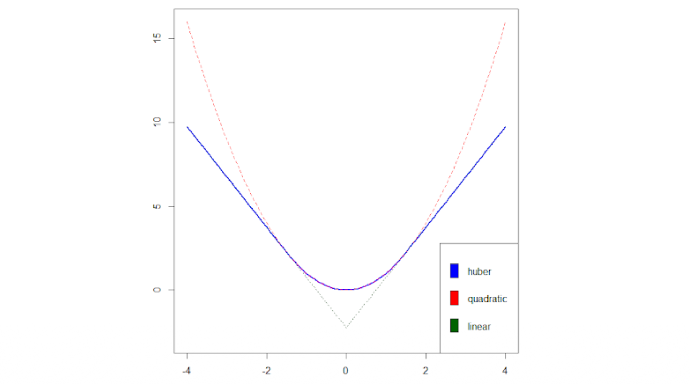

# 1. Introduction

* 최적화 문제에서 목적 함수가 매끄럽지 않은(Non-smooth) 경우, 일반적인 경사하강법(Gradient Descent)을 직접 적용하기 어렵습니다. 이러한 문제를 해결하기 위한 대표적인 수학적 기법이 바로 **Moreau-Yosida Smoothing (Moreau Envelope)**입니다. 이 기법은 미분 불가능한 함수를 미분 가능한 형태로 근사하면서도 원래 함수의 최적해를 보존하는 놀라운 특성을 가집니다. 

* 또한, 제약 조건이 있는 최적화 문제(Constrained Optimization)를 풀기 위해서는 문제를 다루기 쉬운 형태로 변환하는 도구가 필요합니다. 이를 위해 **라그랑주 쌍대성(Lagrangian Duality)**과 최적해의 필요충분조건인 **KKT 조건(Karush-Kuhn-Tucker Conditions)**을 도입합니다. 

* 이 포스트에서는 매끄럽지 않은 볼록 최적화 문제를 해결하기 위한 Moreau-Yosida 평활화의 수학적 원리와 증명 과정을 상세히 분석하고, 제약 조건이 있는 문제에서 쌍대성과 KKT 조건이 어떻게 유도되는지 논리적으로 재구성해보겠습니다.

---

# 2. Moreau-Yosida Smoothing

## 2.1. 평활화의 정의 (Definition)

* 주어진 함수 $f:\mathbb{R}^{d}\rightarrow\mathbb{R}$ 에 대하여, 매개변수 $\eta>0$ 에 대한 **Moreau-Yosida Smoothing (혹은 Moreau Envelope)**은 다음과 같이 정의됩니다:

$$f_{\eta}(x):=\inf_{u}\left\{f(u)+\frac{1}{2\eta}||u-x||_{2}^{2}\right\}$$

* 근접 연산자(Proximal Operator)를 이용하면 위 식은 다음과 같이 다시 쓸 수 있습니다:

$$f_{\eta}(x)=f(\text{prox}_{\eta f}(x))+\frac{1}{2\eta}||\text{prox}_{\eta f}(x)-x||_{2}^{2}$$

* **직관적 의미 (Motivation):**
  * 이 정의를 살펴보면, 원래의 함수 값 $f(u)$를 최소화하려 하면서 동시에 평가 포인트 $u$가 $x$에서 너무 멀어지지 않도록 $\frac{1}{2\eta}||u-x||_{2}^{2}$ 라는 이차 페널티(Quadratic penalty)를 부여하고 있습니다. $\eta$가 작을수록 원래 함수의 형태를 강하게 따르게 되며, 페널티 항 덕분에 뾰족한(Non-smooth) 형태를 가진 함수라도 부드러운(Smooth) 형태를 갖게 됩니다.

## 2.2. Moreau Envelope의 주요 수학적 성질

* 볼록 함수에 대해 Moreau Envelope은 다음과 같은 매우 훌륭한 성질들을 가집니다.

### 2.2.1. 볼록성 (Convexity)

> **Proposition 15.1:** 함수 $f:\mathbb{R}^{d}\rightarrow\mathbb{R}$ 가 볼록(Convex)하면, 그 평활화 함수인 $f_{\eta}$ 도 볼록 함수입니다.

#### **증명:**
* 새로운 함수 $g(x,u) = f(u) + \frac{1}{2\eta}||u-x||_{2}^{2}$ 를 정의해 봅시다. $f(u)$ 가 볼록하고, 이차항 $\frac{1}{2\eta}||u-x||_{2}^{2}$ 역시 $(x, u)$ 에 대해 볼록하므로 $g(x,u)$ 는 결합적으로 볼록(Jointly convex)합니다. 
* $f_{\eta}(x)$ 는 $g(x,u)$ 에서 변수 $u$ 에 대해 부분 최소화(Partial minimization)를 수행한 결과입니다. 볼록 함수의 부분 최소화 역시 볼록성을 유지하므로, $f_{\eta}$ 는 볼록합니다.

### 2.2.2. 펜첼 켤레 (Fenchel Conjugate)

> **Proposition 15.2:** $f_{\eta}$ 의 펜첼 켤레 함수 $f_{\eta}^{*}$ 는 다음과 같이 주어집니다:

$$f_{\eta}^{*}(y)=f^{*}(y)+\frac{\eta}{2}||y||_{2}^{2}$$

#### **증명:**
* $f_{\eta}$ 의 정의는 $u + v = x$ 로 두었을 때, $f(u)$ 와 $\frac{1}{2\eta}||v||_{2}^{2}$ 의 **하한 합성(Infimal Convolution)** 형태입니다:
$$f_{\eta}(x)=\inf_{u+v=x}\left\{f(u)+\frac{1}{2\eta}||v||_{2}^{2}\right\}$$
* 두 함수의 하한 합성의 켤레 함수는 각각의 켤레 함수를 더한 것과 같습니다. 즉,
$$f_{\eta}^{*}(y)=f^{*}(y)+\left(\frac{1}{2\eta}||\cdot||_{2}^{2}\right)^{*}(y)$$
* 여기서 이차 함수의 켤레를 계산해 보면, 최적화 조건에 의해 $\left(\frac{1}{2\eta}||\cdot||_{2}^{2}\right)^{*}(y) = \sup_{v}\left\{y^{\top}v-\frac{1}{2\eta}||v||_{2}^{2}\right\} = \frac{\eta}{2}||y||_{2}^{2}$ 가 도출됩니다. 이를 대입하면 증명이 완료됩니다.

### 2.2.3. 평활성 (Smoothness)

> **Proposition 15.3:** 함수 $f$ 가 볼록하면, 그 Moreau envelope $f_{\eta}$ 는 $l_{2}$ 노름 하에서 $(1/\eta)$-smooth (미분 가능하며 그래디언트가 립시츠 연속) 합니다.

#### **증명:**
* $f$가 볼록하므로 $f_{\eta}$도 닫힌 볼록 함수(Closed convex function)입니다. 명제 15.2에 의해 켤레 함수 $f_{\eta}^{*}$ 는 $\eta$-강볼록(Strongly convex)합니다 (이차항 $\frac{\eta}{2}||y||_{2}^{2}$ 때문). 
* 켤레 함수가 강볼록하면 원래 함수(여기서는 이중 켤레 $f_{\eta}^{**} = f_{\eta}$)는 $(1/\eta)$-smooth 하다는 쌍대성 성질에 의해 증명됩니다.

### 2.2.4. 그래디언트와 근접 연산자 (Gradient)

> **Proposition 15.4:** 볼록 함수 $f$ 에 대하여, Moreau envelope의 그래디언트는 다음과 같습니다:

$$\nabla f_{\eta}(x)=\text{prox}_{f^{*}/\eta}\left(\frac{x}{\eta}\right)=\frac{1}{\eta}(x-\text{prox}_{\eta f}(x))$$

#### **증명:**
* $y = \nabla f_{\eta}(x)$ 는 $x \in \partial f_{\eta}^{*}(y)$ 와 동치입니다. 앞선 명제에서 $\partial f_{\eta}^{*}(y) = \partial f^{*}(y) + \eta y$ 이므로,
* $x \in \partial f^{*}(y) + \eta y \iff x - \eta y \in \partial f^{*}(y) \iff \frac{1}{\eta}x - y \in \frac{1}{\eta}\partial f^{*}(y)$
* 이는 $y = \text{prox}_{f^{*}/\eta}\left(\frac{x}{\eta}\right)$ 를 의미합니다.
* 여기에 **Moreau Decomposition Theorem** ($x = \text{prox}_{\eta f}(x) + \eta \text{prox}_{f^{*}/\eta}(x/\eta)$) 을 적용하여 $y$ 에 대해 정리하면 $\frac{1}{\eta}(x-\text{prox}_{\eta f}(x))$ 가 도출됩니다.

## 2.3. 예시: $L_1$ 노름과 Huber Loss

* Lasso 회귀 등에서 자주 쓰이는 절대값 함수(L1 노름)에 평활화를 적용해보겠습니다.
* 함수 $f(x)=||x||_{1}$ 에 대한 Moreau envelope은 각 차원별로 분리되어 다음과 같이 주어집니다.

$$f_{\eta}(x)=\sum_{i=1}^{d}\frac{1}{\eta}L_{\eta}(x_{i})$$

* 이때 $L_{\eta}$ 는 로버스트 통계학에서 널리 쓰이는 **Huber Loss** 함수입니다:

$$L_{\eta}(c)=\begin{cases}\eta|c|-\eta^{2}/2, & \text{if } |c|\ge\eta \\ |c|^{2}/2, & \text{if } |c|\le\eta\end{cases}$$

## 2.4. 평활화된 목적 함수의 최적화와 Proximal Point Algorithm

> **Proposition 15.5:** 닫힌 함수 $f$ 에 대해, Moreau-Yosida smoothing $f_{\eta}$ 의 최소화해(Minimizer)는 원래 함수 $f$ 의 최소화해와 동일합니다.

### **증명:**
* 최적화 1차 필요조건에 의해 $\nabla f_{\eta}(x^{*}) = 0$ 이어야 합니다. 명제 15.4를 대입하면 $\frac{1}{\eta}(x^{*} - \text{prox}_{\eta f}(x^{*})) = 0$, 즉 $x^{*} = \text{prox}_{\eta f}(x^{*})$ 입니다.
* 근접 연산자의 정의에 의해 이는 $0 \in \partial f(x^{*})$ 와 동치이며, 따라서 $x^{*}$ 는 $f$ 의 최소화해입니다.

### **중요한 통찰:**
* 원래 문제 $\text{minimize } f(x)$ 를 푸는 것은 $\text{minimize } f_{\eta}(x)$ 를 푸는 것과 동치입니다. $f_{\eta}$ 는 볼록하고 $(1/\eta)$-smooth 하므로 스텝 사이즈 $\eta$ 로 **경사하강법(Gradient Descent)**을 적용할 수 있습니다.

$$x_{t+1}=x_{t}-\eta\nabla f_{\eta}(x_{t}) = x_{t}-\eta\left(\frac{1}{\eta}(x_{t}-\text{prox}_{\eta f}(x_{t}))\right) = \text{prox}_{\eta f}(x_{t})$$

* 놀랍게도 위 식은 **Proximal Point Algorithm**의 업데이트 규칙과 정확히 일치합니다. 즉, Proximal 방법론은 본질적으로 원래 함수를 평활화한 뒤 경사하강법을 수행하는 것과 동일한 과정입니다.