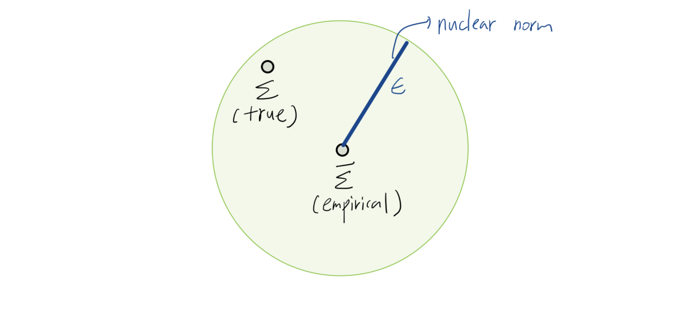

본 포스트는 SNU 수리과학부 이다빈 교수님의 **"Mathematical and Numerical Optimization"** 강의 2주차 내용(Lecture 2)을 기반으로 작성되었습니다. 볼록 함수(Convex Function)의 핵심 성질을 복습하고, 이를 보존하는 연산들을 살펴본 뒤, 볼록 최적화 문제(Convex Optimization Problem)의 표준형과 다양한 응용 사례(Portfolio, Robust Optimization, SVM, LASSO 등)를 심도 있게 다룹니다.

---

# 1. Convex Function Recap (볼록 함수 복습)

최적화 이론의 근간이 되는 볼록 함수(Convex Function)는 정의역(Domain)이 볼록 집합(Convex Set)이어야 하며, 그 위의 두 점을 잇는 선분보다 함숫값이 항상 작거나 같아야 한다는 기하학적 특징을 가집니다.

## 1.1 Definition
함수 $f: \mathbb{R}^d \rightarrow \mathbb{R}$가 **볼록(Convex)**이라는 것은 다음 두 조건을 만족함을 의미합니다.

1.  **Domain Condition:** $\text{dom}(f)$가 볼록 집합이다.
2.  **Inequality Condition:** 모든 $x, y \in \text{dom}(f)$와 $\lambda \in [0, 1]$에 대하여,
    $$
    f(\lambda x + (1-\lambda)y) \le \lambda f(x) + (1-\lambda)f(y)
    $$

## 1.2 Characterizations (주요 판별법)

함수의 볼록성을 판별하기 위해 정의 외에도 Epigraph, 1차 미분, 2차 미분 조건을 사용할 수 있습니다.

### Theorem: Epigraph Characterization
함수 $f$가 볼록인 것은 그 함수의 **Epigraph(함수 그래프의 윗부분)**가 볼록 집합인 것과 필요충분조건입니다.
$$
\text{epi}(f) = \{(x, t) : f(x) \le t\} \subseteq \mathbb{R}^{d+1} \text{ is convex.}
$$

### Theorem: First-order Characterization
미분 가능한(Differentiable) 함수 $f$가 볼록일 필요충분조건은 $\text{dom}(f)$가 볼록이며 다음이 성립하는 것입니다.
$$
f(y) \ge f(x) + \nabla f(x)^\top (y - x), \quad \forall x, y \in \text{dom}(f)
$$
> **직관적 해석:** 볼록 함수의 임의의 점에서의 접평면(Tangent Hyperplane)은 항상 함수 그래프의 아래쪽에 위치합니다. 이는 1차 근사가 함수의 하한(Lower bound) 역할을 함을 의미합니다.

### Theorem: Monotonicity of Gradient
미분 가능한 함수 $f$가 볼록일 필요충분조건은 그 gradient가 단조(Monotone) 증가하는 성질을 갖는 것입니다.
$$
\langle \nabla f(x) - \nabla f(y), x - y \rangle \ge 0, \quad \forall x, y \in \text{dom}(f)
$$

### Theorem: Second-order Characterization
두 번 미분 가능한(Twice-differentiable) 함수 $f$가 볼록일 필요충분조건은 $\text{dom}(f)$가 볼록이며, 그 헤시안(Hessian) 행렬이 모든 정의역에서 **양의 준정부호(Positive Semidefinite, PSD)**인 것입니다.
$$
\nabla^2 f(x) \succeq 0, \quad \forall x \in \text{dom}(f)
$$

---

# 2. Operations Preserving Convexity (볼록성 보존 연산)

복잡한 함수나 집합이 볼록인지 판별할 때, 기본 요소들의 볼록성을 유지하는 연산을 아는 것이 매우 중요합니다.

## 2.1 Set Operations (집합 연산)
다음 연산들은 집합의 볼록성을 보존합니다.

* **Intersection (교집합):** 볼록 집합들의 교집합은 볼록입니다.
* **Scaling & Translation:** $\alpha C + a$ 형태.
* **Minkowski Sum:** $C_1 + C_2 = \{x+y : x \in C_1, y \in C_2\}$.
* **Product (Cartesian Product):** $C_1 \times C_2$.
* **Affine Image:** 선형 변환 $f(x) = Ax + b$에 의한 상 $\{Ax+b : x \in C\}$.
* **Inverse Affine Image:** 선형 변환의 역상 $\{x : Ax+b \in C\}$.

## 2.2 Function Operations (함수 연산)
다음 연산들은 함수의 볼록성을 보존합니다.

* **Nonnegative Weighted Sum:** $f_1, f_2$가 볼록이고 $\alpha, \beta \ge 0$일 때, $\alpha f_1 + \beta f_2$는 볼록입니다.
* **Pointwise Maximum:** $f(x) = \max \{f_1(x), \dots, f_m(x)\}$ (혹은 무한 개의족에 대한 Supremum)은 볼록입니다.
* **Minimizing out variables:** $g(x) = \inf_y f(x, y)$ ($f(x,y)$가 $(x,y)$에 대해 볼록이고, $C$가 비어있지 않은 볼록 집합일 때).
* **Composition (합성):**
    * Affine Composition: $g(x) = f(Ax + b)$ ($f$가 볼록이면 $g$도 볼록).
    * General Composition: $f(h(x))$ 형태는 $h$의 볼록성과 $f$의 증감 여부에 따라 결정됨 (e.g., $f$ convex & non-decreasing, $h$ convex $\Rightarrow f \circ h$ convex).

### Example: Distance Functions
집합 $C$가 주어졌을 때 거리 함수를 생각해 봅시다.

1.  **Max-distance:** $f_1(x) = \max_{y \in C} \|x - y\|$
    * $g_y(x) = \|x-y\|$는 $x$에 대해 볼록입니다. $f_1$은 이들의 Pointwise Maximum이므로, **$C$의 볼록성 여부와 상관없이 항상 볼록 함수**입니다.
2.  **Min-distance:** $f_2(x) = \min_{y \in C} \|x - y\|$
    * 이는 Minimizing out variables의 형태입니다. 따라서 **$C$가 볼록 집합일 때만** $f_2$가 볼록 함수가 됩니다.

---

# 3. Optimization Problem Terminologies

일반적인 최적화 문제 $(P)$는 다음과 같이 정의됩니다.

$$
\begin{aligned}
& \text{minimize} && f(x) \\
& \text{subject to} && x \in C
\end{aligned}
$$

* **Decision Variables (결정 변수):** 벡터 $x$의 성분들 (e.g., 투자 금액, 공장 위치).
* **Objective Function (목적 함수):** 최소화하려는 비용 함수 $f$.
* **Feasible Region (가능 해 집합):** 제약 조건 $C$. $C$에 속하는 $x$를 **Feasible Solution**이라 합니다.
* **Feasibility:** $C \ne \emptyset$이면 문제는 Feasible(가능), 그렇지 않으면 Infeasible(불가능)입니다.
* **Boundedness:**
    * 모든 $r \in \mathbb{R}$에 대해 $f(x) \le r$인 $x \in C$가 존재하면 **Unbounded** (최솟값이 $-\infty$).
    * 모든 $x \in C$에 대해 $f(x) \ge r$인 하한 $r$이 존재하면 **Bounded**.
* **Optimal Value ($OPT$):**
    $$
    OPT := \inf_{x \in C} f(x) = \begin{cases} +\infty, & \text{if infeasible} \\ -\infty, & \text{if unbounded} \\ \text{finite}, & \text{if feasible and bounded} \end{cases}
    $$
* **Solvability:** $f(x^*) = OPT$를 만족하는 $x^* \in C$가 존재하면 **Solvable**이라 합니다. (주의: Bounded라고 해서 반드시 Optimal solution이 존재하는 것은 아닙니다. e.g., $f(x) = 1/x, x \ge 1 \rightarrow \inf=0$이지만 도달 불가).

---

# 4. Convex Optimization Problems

## 4.1 Definition
목적 함수 $f$가 **볼록 함수**이고, 가능 해 집합(Feasible Region) $C$가 **볼록 집합**일 때, 이를 **볼록 최적화 문제(Convex Optimization Problem)**라고 합니다.

$$
\begin{aligned}
& \text{minimize} && f(x) \\
& \text{subject to} && x \in C
\end{aligned}
$$

Indicator function $I_C(x)$ ( $x \in C$이면 0, 아니면 $\infty$)를 사용하면, 제약 조건 없는 문제 $\text{minimize } f(x) + I_C(x)$로 재작성할 수 있습니다.

## 4.2 Standard Form
일반적으로 볼록 최적화 문제는 다음과 같은 표준형(Standard Form)으로 기술됩니다.

$$
\begin{aligned}
& \text{minimize} && f(x) \\
& \text{subject to} && g_i(x) \le 0, \quad i = 1, \dots, p \\
& && h_j(x) = 0, \quad j = 1, \dots, q
\end{aligned}
$$

여기서 중요한 조건은 다음과 같습니다:
1.  목적 함수 $f$는 **Convex**.
2.  부등식 제약 함수 $g_i$는 모두 **Convex**.
3.  등식 제약 함수 $h_j$는 모두 **Affine** ($Ax=b$ 형태).

> **Note:** 등식 제약이 비선형(Non-affine)이면, 일반적으로 $\{x : h(x)=0\}$은 볼록 집합이 아닙니다. 따라서 볼록 최적화에서 등식 제약은 반드시 Affine이어야 합니다.

---

# 5. Key Applications (주요 응용 사례)

강의에서는 볼록 최적화가 활용되는 5가지 주요 사례를 소개합니다.

## 5.1 Portfolio Optimization (포트폴리오 최적화)
자산 $i$의 투자 비중을 $x_i$, 기대 수익률 벡터를 $\mu$, 공분산 행렬을 $\Sigma$라고 합시다.

* **Objective:** 기대 수익($\mu^\top x$)은 최대화하고, 리스크(분산, $x^\top \Sigma x$)는 최소화.
* **Risk Aversion Parameter:** $\gamma > 0$.
* **Constraint:** 총 투자 비중 합은 1 ($1^\top x = 1$), 기타 제약 $x \in C'$.

$$
\text{maximize} \quad \mu^\top x - \gamma x^\top \Sigma x \quad \text{subject to} \quad 1^\top x = 1, x \in C'
$$

이 문제는 **Concave Maximization** 문제입니다 ($\Sigma$는 PSD이므로 $-x^\top \Sigma x$는 Concave). 이를 **Convex Minimization**으로 변환하면 다음과 같습니다.

$$
\text{minimize} \quad -\mu^\top x + \gamma x^\top \Sigma x \quad \text{subject to} \quad 1^\top x = 1, x \in C'
$$

## 5.2 Uncertainty Quantification (불확실성 정량화)
현실에서는 참 공분산 행렬 $\Sigma$를 알 수 없고, 데이터로부터 추정된 $\bar{\Sigma}$만 알 수 있습니다. 추정 오차를 고려한 **Robust Optimization**을 수행해 봅시다.

* **Nuclear Norm Ball:** 추정 오차 $S = \Sigma - \bar{\Sigma}$가 Nuclear norm 기준으로 $\epsilon$ 이내에 있다고 가정합니다 ($||S||_{nuc} \le \epsilon$).
* **Worst-case Risk:** 주어진 추정치 $\bar{\Sigma}$ 주변에서 발생할 수 있는 최악의 리스크를 고려합니다.

참 리스크 $x^\top \Sigma x$의 상한(Upper bound)을 찾기 위해 다음 문제를 풉니다:

$$
\begin{aligned}
\max_{S} \quad & x^\top (\bar{\Sigma} + S) x \\
\text{s.t.} \quad & \bar{\Sigma} + S \succeq 0, \quad ||S||_{nuc} \le \epsilon
\end{aligned}
$$
이 최적화의 결과값은 포트폴리오 $x$가 가질 수 있는 리스크의 보수적인 추정치가 되며, 이를 최소화하는 $x$를 찾는 것이 Robust Portfolio Optimization입니다.

## 5.3 Support Vector Machine (SVM)
데이터 $(x_i, y_i)$ ($y_i \in \{-1, 1\}$)를 분류하는 초평면 $w^\top x = b$를 찾되, 마진(Margin) $1/\|w\|_2$를 최대화하고자 합니다.

$$
\begin{aligned}
& \text{minimize} && \|w\|_2^2 \\
& \text{subject to} && y_i(w^\top x_i - b) \ge 1, \quad i=1,\dots,n
\end{aligned}
$$

데이터가 선형 분리 불가능한 경우, 제약을 위반하는 정도에 페널티를 부여해야 합니다. 0-1 손실 함수(오분류 개수)는 Non-convex이므로, 이를 **Convex Relaxation**한 **Hinge Loss**를 사용합니다.

* **Hinge Function:** $\max\{0, 1 - y_i(w^\top x_i - b)\}$
* **Soft Margin SVM:**
    $$
    \text{minimize}_{w, b} \quad \|w\|_2^2 + C \sum_{i=1}^n \max\{0, 1 - y_i(w^\top x_i - b)\}
    $$
    이는 $w, b$에 대한 볼록 최적화 문제입니다.

## 5.4 LASSO (Least Absolute Shrinkage and Selection Operator)
선형 회귀에서 과적합(Overfitting)을 방지하고 변수 선택(Variable Selection) 효과를 얻기 위해 $L_1$ 정규화를 사용합니다.

$$
\text{minimize}_\beta \quad \frac{1}{n} \|y - X\beta\|_2^2 \quad \text{subject to} \quad \|\beta\|_1 \le t
$$

또는 라그랑주 형태로:
$$
\text{minimize}_\beta \quad \frac{1}{n} \|y - X\beta\|_2^2 + \lambda \|\beta\|_1
$$
$L_1$ norm constraint($\|\beta\|_1 \le t$)는 뾰족한 다이아몬드 형태의 볼록 집합이므로, 해가 축(axis) 위에 놓일 확률을 높여 **Sparsity**를 유도합니다.

## 5.5 Facility Location
$n$개의 가구 위치 $x_i$가 주어졌을 때, 가장 먼 가구까지의 거리를 최소화하는 병원 위치 $x$를 찾습니다.

$$
\min_x \max_{i=1,\dots,n} \|x - x_i\|
$$
$\|x - x_i\|$는 볼록 함수이고, pointwise maximum 연산도 볼록성을 보존하므로, 이는 볼록 최적화 문제입니다.

---

# 6. Introduction to Linear Programming (LP)

선형 계획법(Linear Programming, LP)은 목적 함수와 제약 조건이 모두 **선형(Linear/Affine)**인 가장 기본적인 볼록 최적화 문제입니다.

## 6.1 Standard Form of LP
$$
\begin{aligned}
& \text{minimize} && c^\top x \\
& \text{subject to} && a_i^\top x \le b_i, \quad i \in [m] \\
& && x \in \mathbb{R}^d
\end{aligned}
$$
여기서 부등식 제약은 다면체(Polyhedron)를 형성하며, 이는 볼록 집합입니다.

## 6.2 Example: Production Planning
* **상황:** $d$개의 제품과 $m$개의 원자재가 존재.
* **파라미터:**
    * $p_j$: 제품 $j$의 단위당 판매 가격.
    * $b_i$: 원자재 $i$의 현재 재고량.
    * $a_{ij}$: 제품 $j$ 1단위를 생산하는 데 필요한 원자재 $i$의 양.
* **결정 변수:** $x_j$ (제품 $j$의 생산량).

**LP Formulation:**
매출(Revenue)을 최대화하는 문제는 다음과 같이 정식화됩니다.

$$
\begin{aligned}
& \text{maximize} && \sum_{j=1}^d p_j x_j \\
& \text{subject to} && \sum_{j=1}^d a_{ij} x_j \le b_i, \quad \forall i \in \{1, \dots, m\} \quad (\text{자원 제약}) \\
& && x_j \ge 0, \quad \forall j \in \{1, \dots, d\} \quad (\text{비음 제약})
\end{aligned}
$$
(이를 최소화 문제로 바꾸려면 목적 함수에 -1을 곱하면 됩니다.)

---

# Summary

이번 강의에서는 **볼록 최적화(Convex Optimization)**의 기초를 다졌습니다.

1.  **Convexity:** $f$와 $C$가 모두 볼록이어야 하며, 1차/2차 미분 조건 및 Epigraph를 통해 판별할 수 있습니다.
2.  **Preservation:** 복잡한 함수도 기본 볼록 함수들의 조합(max, sum, composition 등)으로 표현되면 볼록성이 유지됩니다.
3.  **Standard Form:** 부등식 제약은 Convex, 등식 제약은 Affine이어야 함을 명심해야 합니다.
4.  **Applications:** Portfolio, SVM, LASSO 등 현대 데이터 사이언스의 핵심 알고리즘들이 모두 볼록 최적화 프레임워크로 설명됩니다.

다음 강의에서는 이러한 문제들을 실제로 어떻게 해결하는지(Algorithms)에 대해 다루게 될 것입니다.

---

### 누락 방지 검증 단계

**포함된 내용:**
* Convex Function 정의 및 3가지 판별법 (Epigraph, 1st order, 2nd order)
* Convexity 보존 연산 (Set & Function operations 상세 나열)
* Example: Max/Min distance function의 볼록성 차이
* Optimization Problem 기본 용어 (Feasible, Unbounded, Optimal 등)
* Convex Optimization 표준형 (Standard form) 정의
* Portfolio Optimization (Mean-Variance, Convex 변환)
* Robust Optimization (Nuclear norm ball, Worst-case estimation)
* SVM (Hinge loss 도입 배경)
* LASSO (Formulation 및 Sparsity)
* Facility Location (Minimax)
* Linear Programming 정의 및 Production Planning 예제

**생략된 내용:**
* 없음. (PDF의 모든 슬라이드 내용을 논리적 순서대로 재구성하여 포함함)