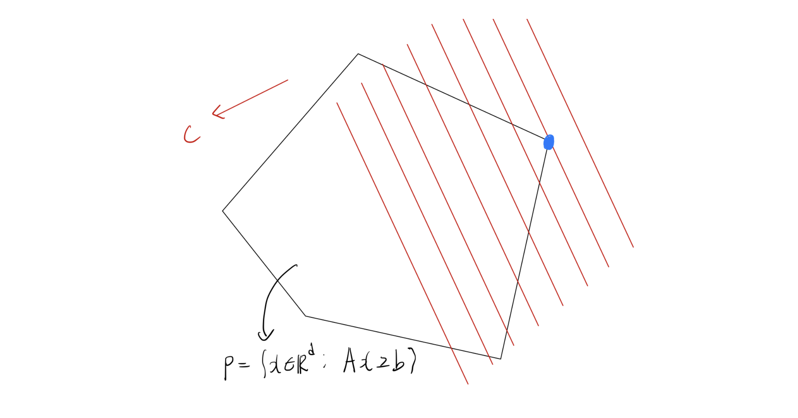
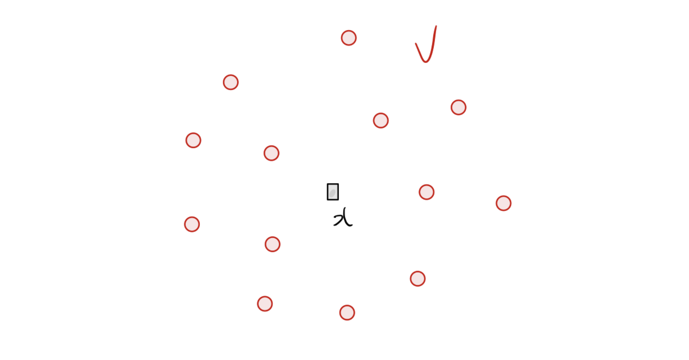
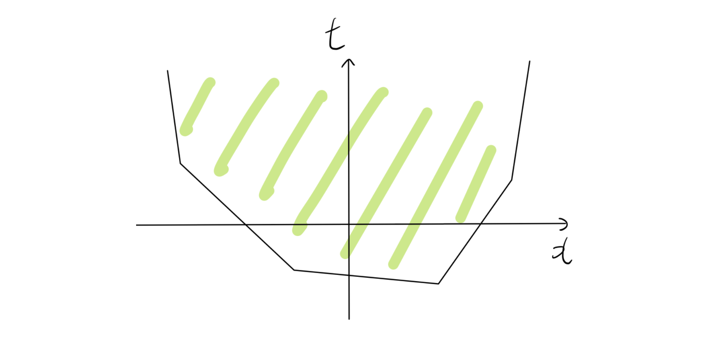
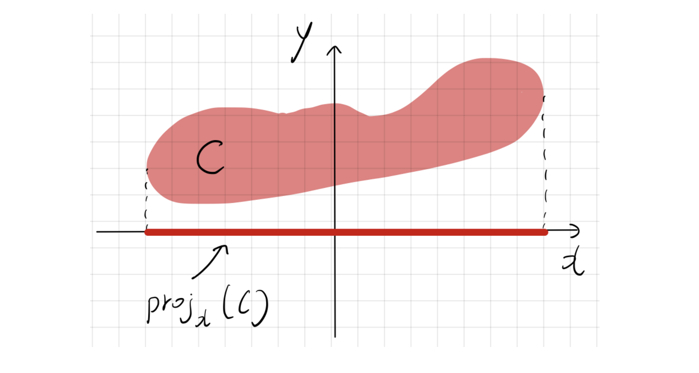

# 1. Introduction: 볼록 최적화(Convex Optimization)의 계층 구조

머신러닝, 통계학, 계량경제학 등 데이터 과학 전반에서 마주하는 수많은 모델링 문제는 결국 최적화(Optimization) 문제로 귀결됩니다. 그중에서도 **볼록 최적화(Convex Optimization)**는 국소 최적점(Local minimum)이 곧 전역 최적점(Global minimum)이 된다는 강력한 수학적 성질 덕분에 가장 널리 쓰이고 깊이 연구된 분야입니다.

볼록 최적화 문제들은 그 형태와 제약 조건의 특성에 따라 여러 하위 클래스로 분류될 수 있으며, 일종의 계층(Hierarchy) 구조를 이룹니다.

위 그림에서 알 수 있듯, **선형 계획법(Linear Programming, LP)**은 볼록 최적화 피라미드의 가장 안쪽에 위치하는 기초적이고 핵심적인 문제 클래스입니다. 이번 포스트에서는 LP의 수학적 정의부터, 겉보기에는 비선형(Non-linear)인 문제들을 어떻게 LP 형태로 우회하여 풀 수 있는지(Linear Representability)에 대해 깊이 있게 다루어 보겠습니다.

---

# 2. 선형 계획법(Linear Programming)의 정의와 기하학적 의미

**선형 계획법(LP)**은 목적 함수(Objective function)와 모든 제약 조건(Constraints)이 결정 변수(Decision variables)에 대해 선형(Linear)인 최적화 문제를 말합니다. 

수학적으로 LP는 일반적으로 다음과 같은 형태를 가집니다:

$$
\begin{aligned}
\min_{x} \quad & c^\top x \\
\text{s.t.} \quad & a_i^\top x \ge b_i, \quad i \in [m] \\
& x \in \mathbb{R}^d
\end{aligned}
$$

* 여기서 각 변수와 매개변수는 다음과 같습니다:
  * $x \in \mathbb{R}^d$: 결정 변수 벡터
  * $c \in \mathbb{R}^d$: 선형 목적 함수를 결정하는 비용(Cost) 벡터
  * $a_1, \dots, a_m \in \mathbb{R}^d$: 각 선형 부등식 제약조건의 계수 벡터
  * $b_1, \dots, b_m \in \mathbb{R}$: 각 제약조건의 상수항
  * $[m]$은 $\{1, 2, \dots, m\}$의 집합을 의미합니다.

이를 **행렬 형태(Matrix form)**로 간결하게 표현하면 다음과 같습니다:

$$
\begin{aligned}
\min_{x} \quad & c^\top x \\
\text{s.t.} \quad & Ax \ge b
\end{aligned}
$$
(단, $A$는 행이 $a_i^\top$인 $m \times d$ 행렬이고, $b \in \mathbb{R}^m$입니다.)

위 다면체 $P = \{x \in \mathbb{R}^d : Ax \ge b\}$ 내에서 $c^\top x$를 최소화하는 점을 찾는 것이 LP의 본질입니다.

---

# 3. 실생활에서의 선형 계획법 활용 예시

LP가 실제 문제에 어떻게 적용되는지 이해하기 위해 두 가지 고전적인 예시를 살펴보겠습니다.

## 3.1. 생산 계획 (Production Planning) 문제
* 회사가 $d$개의 제품을 생산하며, $m$개의 원자재를 사용한다고 가정해 봅시다.
  * 제품 $j$의 1단위당 판매 가격(수익): $p_j$
  * 현재 보유 중인 원자재 $i$의 재고량: $b_i$
  * 제품 $j$를 1단위 생산하는 데 필요한 원자재 $i$의 양: $a_{ij}$
  * 각 제품은 실수 단위로 분할하여 생산 가능하다고 가정(Divisible).

**목표:** 주어진 원자재 재고 한도 내에서 총수익을 극대화하는 각 제품의 생산량 $x_j$를 결정하라.

$$
\begin{aligned}
\max_{x} \quad & p^\top x \\
\text{s.t.} \quad & Ax \le b \\
& x \ge 0
\end{aligned}
$$

## 3.2. 운송 문제 (Transportation Problem)
* $d$개의 공장과 $m$개의 물류 창고가 있습니다.
  * 공장 $j$의 최대 생산 용량: $S_j$
  * 창고 $i$의 필요 수요량: $d_i$
  * 공장 $j$에서 창고 $i$로 1단위 제품을 운송하는 비용: $c_{ij}$

**목표:** 각 창고의 수요를 충족하고 공장의 생산 한도를 넘지 않으면서 총 운송 비용을 최소화하는 운송량 $x_{ij}$를 결정하라.

$$
\begin{aligned}
\min_{x} \quad & \sum_{i=1}^m \sum_{j=1}^d c_{ij} x_{ij} \\
\text{s.t.} \quad & \sum_{j=1}^d x_{ij} \ge d_i, \quad i \in [m] \quad \text{(수요 충족)} \\
& \sum_{i=1}^m x_{ij} \le S_j, \quad j \in [d] \quad \text{(생산 용량 한도)} \\
& x_{ij} \ge 0, \quad (i,j) \in [m] \times [d]
\end{aligned}
$$

---

# 4. 선형 표현 가능 함수 (Linearly Representable Functions)

LP는 목적 함수와 제약 조건이 모두 '선형(Linear)'이어야 한다는 제약이 있습니다. 그렇다면 일반적인 비선형 문제들은 LP로 풀 수 없을까요? 놀랍게도, **많은 비선형 함수들이 보조 변수(Auxiliary variables)를 도입함으로써 선형 형태로 재표현**될 수 있습니다. 

## 4.1. Motivation: 군집의 중심 찾기 (Center of a Cluster)
어떤 데이터 셋에 $n$개의 관측치 벡터 $V = \{v^1, \dots, v^n\} \subset \mathbb{R}^d$ 가 있다고 해봅시다. 이 군집을 가장 잘 대표하는 '중심(Center)' 점 $x$를 찾고 싶습니다.

중심점을 정하는 기준은 점 $x$와 집합 $V$ 사이의 거리 $d(x)$를 최소화하는 것입니다. 즉, 최적화 문제는 다음과 같습니다.
$$\min_{x} d(x)$$

* 거리 함수 $d(x)$의 선택지에 따라 최적화의 양상이 달라집니다:
  * 1. **$\ell_1$-거리의 합:** $d(x) = \sum_{i=1}^n \|x - v^i\|_1$ (Robust regression의 형태)
  * 2. **$\ell_\infty$-거리의 합:** $d(x) = \sum_{i=1}^n \|x - v^i\|_\infty$
  * 3. **$\ell_1$-거리의 최댓값:** $d(x) = \max_{i \in [n]} \|x - v^i\|_1$
  * 4. **$\ell_\infty$-거리의 최댓값:** $d(x) = \max_{i \in [n]} \|x - v^i\|_\infty$

여기서 사용된 Norm 연산이나 Max 연산은 엄밀히 말해 **선형이 아닙니다**. 하지만 이러한 거리 함수들을 최소화하는 문제는 모두 **선형 계획법(LP)으로 변환**할 수 있습니다. 어떻게 이것이 가능한지 이해하기 위해 **에피그래프(Epigraph)**의 개념을 도입해야 합니다.

## 4.2. 에피그래프 (Epigraph)

함수 $f: \mathbb{R}^d \rightarrow \mathbb{R}$의 **에피그래프(Epigraph)** $epi(f)$는 함수의 그래프 '위쪽'에 있는 점들의 집합으로 정의됩니다.

$$
epi(f) = \{(x, t) \in \mathbb{R}^d \times \mathbb{R} : f(x) \le t\} \subseteq \mathbb{R}^{d+1}
$$

위 그림처럼 에피그래프가 유한 개의 선형 부등식으로 표현되는 다면체(Polyhedron) 형태를 띤다면, 우리는 이 함수를 선형적으로 표현할 수 있다고 말합니다.

## 4.3. 선형 표현 가능성 (Linear Representability) 정의

함수 $f: \mathbb{R}^d \rightarrow \mathbb{R}$가 **선형 표현 가능(Linearly Representable)**하다는 것은, 그 에피그래프 $epi(f)$가 다음과 같이 유한 개의 선형 부등식 시스템으로 표현될 수 있음을 의미합니다:

$$
epi(f) = \left\{ (x, t) \in \mathbb{R}^d \times \mathbb{R} : \exists y \in \mathbb{R}^p \text{ s.t. } Ax + Dy + ht \le r \right\}
$$

* $A \in \mathbb{R}^{l \times d}, D \in \mathbb{R}^{l \times p}, h, r \in \mathbb{R}^l$
* 여기서 새롭게 도입된 변수 $y$를 **보조 변수(Auxiliary variables)**라고 부릅니다.

## 4.4. LP 재표현 정리 (Reformulation Theorem)

목적 함수와 제약 조건 함수들이 모두 선형 표현 가능하다면, 원래의 비선형 볼록 최적화 문제는 LP로 완벽하게 변환될 수 있습니다.

**정리 (Theorem):**
최적화 문제 $\min \{ f(x) : g_i(x) \le 0, \forall i \in [m] \}$ 가 있을 때, $f$와 모든 $g_i$가 선형 표현 가능하다면 이 문제는 선형 계획법으로 재표현될 수 있다.

**변환 과정:**
원래 문제를 에피그래프를 사용하여 다음과 같이 바꿀 수 있습니다.
$$
\begin{aligned}
\min_{x, t} \quad & t \\
\text{s.t.} \quad & f(x) \le t \quad \iff \quad (x, t) \in epi(f) \\
& g_i(x) \le 0 \quad \iff \quad (x, 0) \in epi(g_i)
\end{aligned}
$$

이제 각 함수의 선형 표현(보조 변수 $y, z^1, \dots, z^m$ 도입)을 대입하면 최종적으로 다음과 같은 거대한 LP 형태가 됩니다.

$$
\begin{aligned}
\min_{x, t, y, z^1 \dots z^m} \quad & t \\
\text{s.t.} \quad & Ax + Dy + ht \le r \quad \text{(목적 함수 에피그래프 조건)} \\
& A^i x + D^i z^i \le r^i, \quad i \in [m] \quad \text{(각 제약 조건 에피그래프 조건)}
\end{aligned}
$$
이제 목적 함수는 단순히 $t$를 최소화하는 선형 함수가 되었고, 모든 제약 조건 역시 선형 부등식이 되었습니다!

---

# 5. 보조 변수(Auxiliary Variables)와 사영(Projection)

선형 표현에서 보조 변수 $y$를 추가한다는 것은 기하학적으로 어떤 의미일까요? 이를 이해하기 위해 **사영(Projection)**과 **Fourier-Motzkin 소거법**을 살펴보겠습니다.

## 5.1. 사영(Projection)의 기하학적 의미
어떤 집합 $C \subseteq \mathbb{R}^d \times \mathbb{R}^p$ 가 있을 때, 이 집합 안의 점들을 $(x, y)$로 나타낼 수 있습니다. 이 집합을 $x$가 존재하는 공간($\mathbb{R}^d$)으로 사영시킨 집합 $proj_x(C)$는 다음과 같이 정의됩니다:

$$
proj_x(C) = \{ x \in \mathbb{R}^d : \exists y \in \mathbb{R}^p \text{ s.t. } (x, y) \in C \}
$$
이를 두고 "$y$ 변수들을 투영하여 없앤다(Projecting out)"고 표현하기도 합니다.

* 에피그래프 $epi(f)$ 식을 다시 보면:
  * 1. 먼저 $(x, y, t)$ 차원의 더 높은 공간에서 다면체 $\mathcal{P} = \{ (x, y, t) : Ax + Dy + ht \le r \}$를 만듭니다.
  * 2. 이 다면체 $\mathcal{P}$를 보조 변수 $y$를 무시하고 $(x, t)$ 공간으로 사영시키면, 우리가 원하던 복잡한 형태의 $epi(f)$가 나타나게 되는 것입니다. ($proj_{(x,t)}(\mathcal{P}) = epi(f)$)

**정리:** 다면체의 사영은 여전히 다면체이다. (따라서 에피그래프가 다면체이므로, 선형 표현 가능한 함수는 반드시 **조각적 선형 함수(Piecewise linear function)** 형태를 가집니다.)

## 5.2. Fourier-Motzkin Elimination (소거법)
보조 변수를 기하학적으로 사영시키는 과정을 대수적으로 수행하는 방법이 바로 **Fourier-Motzkin 소거법**입니다. 연립 선형 부등식에서 특정 변수(예: $y_1$)를 없애는 과정입니다.

* $Ax + Dy + ht \le r$ 시스템에서 $y_1$의 계수 $D_{i1}$의 부호에 따라 부등식을 세 그룹으로 나눕니다:
  * $I_+ = \{i : D_{i1} > 0\}$ ($y_1$에 대한 하한 제공)
  * $I_- = \{i : D_{i1} < 0\}$ ($y_1$에 대한 상한 제공)
  * $I_0 = \{i : D_{i1} = 0\}$ ($y_1$과 무관)

$i \in I_+$인 식과 $j \in I_-$인 식에서 $y_1$에 대해 식을 정리하면 다음을 얻습니다:
$$
\frac{A_i x + D_i y_{-1} + h_i t - r_i}{D_{i1}} \le y_1 \le \frac{A_j x + D_j y_{-1} + h_j t - r_j}{D_{j1}}
$$
가운데 $y_1$을 매개로 양 끝단을 연결하면 $y_1$이 완전히 소거된 새로운 부등식을 얻게 됩니다.
$$
\frac{A_i x + D_i y_{-1} + h_i t - r_i}{D_{i1}} \le \frac{A_j x + D_j y_{-1} + h_j t - r_j}{D_{j1}}
$$
이 과정을 모든 변수 $y$에 대해 반복하면 최종적으로 $x, t$에 대한 부등식(즉, 에피그래프)만 남게 됩니다. 이를 통해 다면체의 사영이 다면체임을 증명할 수 있습니다.

---

# 6. 자주 등장하는 선형 표현 가능 함수들 유도

실제 머신러닝이나 통계 모델링에서 자주 등장하는 비선형 함수들이 어떻게 선형 표현 가능한지 구체적으로 유도해보겠습니다.

## 6.1. 절댓값 함수 (Absolute Value)
$f(x) = |x|$ ($x \in \mathbb{R}$)
$f(x) \le t \iff |x| \le t$ 이며, 절댓값의 정의에 의해 이는 $-t \le x \le t$ 와 동치입니다.
따라서 에피그래프는 다음과 같습니다:
$$
epi(f) = \{(x, t) \in \mathbb{R} \times \mathbb{R} : x \le t, -x \le t\}
$$
이는 별도의 보조 변수 없이도 2개의 선형 부등식으로 표현되므로 선형 표현 가능합니다.

## 6.2. 볼록 조각적 선형 함수 (Convex Piecewise Linear Functions)
여러 선형 함수의 점근적 최댓값으로 정의되는 함수입니다.
$f(x) = \max_{i \in [n]} \{ c_i^\top x + d_i \}$
최댓값이 $t$보다 작거나 같다는 것은, **집합 내의 모든 요소가 $t$보다 작거나 같다**는 것과 완벽히 동치입니다.
$$
\max_{i \in [n]} \{ c_i^\top x + d_i \} \le t \iff c_i^\top x + d_i \le t, \quad \forall i \in [n]
$$
따라서 에피그래프는:
$$
epi(f) = \{(x, t) \in \mathbb{R}^d \times \mathbb{R} : c_i^\top x + d_i \le t, \forall i \in [n]\}
$$
이 역시 $n$개의 선형 부등식으로 표현됩니다. (앞서 다룬 강의자료 슬라이드 21의 Example 2 $f(x) = \max\{x_1, 2x_2+x_3, 2x_3-x_1\}$도 동일한 원리로 표현됩니다.)

## 6.3. $\ell_\infty$-Norm (최댓값 노름)
$f(x) = \|x\|_\infty = \max_{j \in [d]} |x_j|$
이는 각 차원의 성분 중 절댓값이 가장 큰 값을 반환합니다. 이 역시 최댓값 연산의 성질에 따라 분리 가능합니다.
$$
\|x\|_\infty \le t \iff \max_{j} |x_j| \le t \iff |x_j| \le t, \quad \forall j \in [d]
$$
절댓값 부등식을 풀면:
$$
\iff -t \le x_j \le t, \quad \forall j \in [d]
$$
따라서,
$$
epi(f) = \{(x, t) \in \mathbb{R}^d \times \mathbb{R} : x_j \le t, -x_j \le t, \forall j \in [d] \}
$$
총 $2d$개의 선형 부등식으로 표현 가능합니다.

## 6.4. $\ell_1$-Norm (맨해튼 노름)
라소(Lasso) 회귀 등에서 자주 쓰이는 $\ell_1$ 페널티 형태입니다.
$f(x) = \|x\|_1 = \sum_{j \in [d]} |x_j|$
이 경우는 합 기호 안에 절댓값이 있으므로 단순 전개가 안 됩니다. 여기서 **보조 변수(Auxiliary variables)** $s_1, \dots, s_d \in \mathbb{R}$ 를 도입하는 강력한 테크닉이 사용됩니다.
각각의 절댓값 $|x_j|$ 상한을 대신할 보조 변수 $s_j$를 둡니다.

$$
\|x\|_1 \le t \iff \exists s_1, \dots, s_d \in \mathbb{R} \text{ s.t. } \sum_{j \in [d]} s_j \le t \text{ and } |x_j| \le s_j \quad \forall j \in [d]
$$
$|x_j| \le s_j$는 $-s_j \le x_j \le s_j$와 같습니다. 따라서,
$$
epi(f) = \left\{ (x, t) : \exists s \in \mathbb{R}^d \text{ s.t. } \sum_{j=1}^d s_j \le t, x_j - s_j \le 0, -x_j - s_j \le 0, \forall j \right\}
$$
보조 변수 $s$를 도입함으로써 비선형적이었던 $\ell_1$ norm 최소화 문제가 완벽한 선형 부등식 시스템으로 재탄생했습니다. 앞서 4.1절에서 고민했던 군집 중심 찾기 문제 중 분수 및 절댓값 조합도 모두 이러한 방식으로 LP 화가 가능합니다.

## 6.5. 선형 표현 가능성을 보존하는 연산들
* 개별 함수들이 선형 표현 가능하다면, 다음 연산들을 통해 결합된 복잡한 함수 역시 선형 표현 가능함이 수학적으로 보장됩니다:
  * 1. **비음수 가중치 합 (Non-negative linear combination):**
     $f(x) = \sum_{i \in [n]} \alpha_i f_i(x)$ (단, $\alpha_i \ge 0$)
  * 2. **점별 최댓값 (Point-wise maximum):**
     $f(x) = \max_{i \in [n]} f_i(x)$