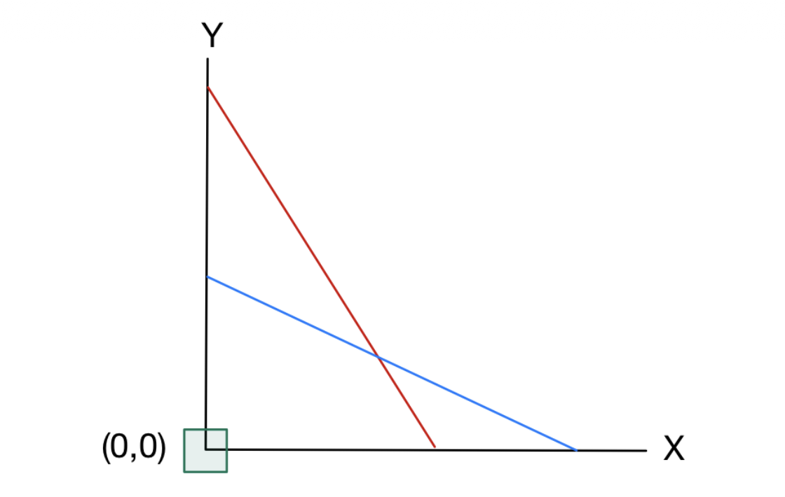
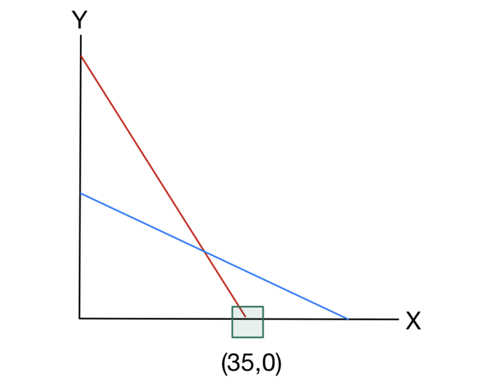
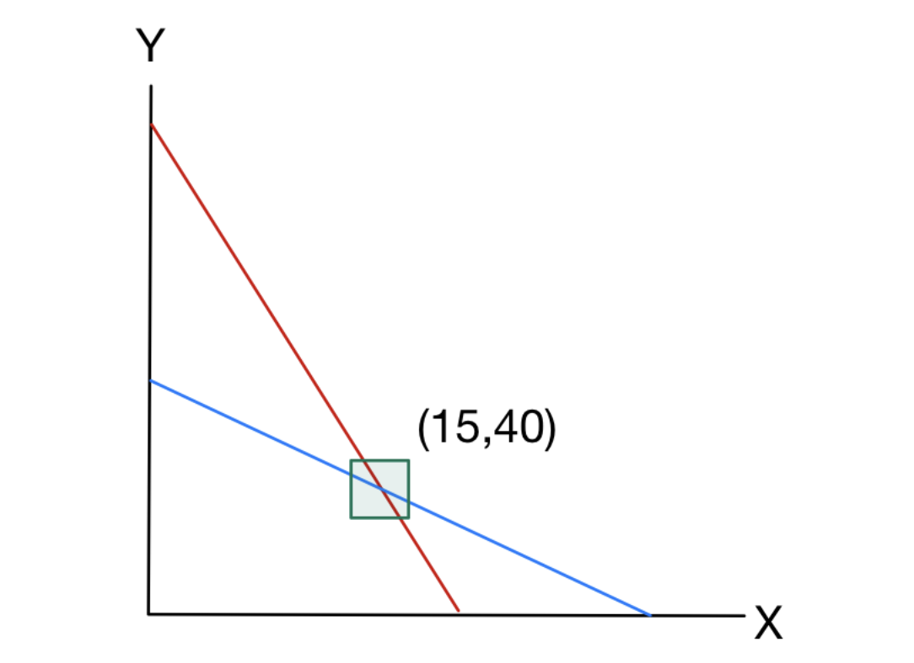

# 1. Introduction: 심플렉스 방법론(The Simplex Method)

조지 단치히(George B. Dantzig)가 고안한 심플렉스 방법(Simplex method)은 선형계획법(Linear programming)을 풀기 위한 가장 실용적이고 강력한 알고리즘 중 하나입니다. 오늘날 선형 및 정수 계획법(integer programming)을 다루는 현대의 모든 최적화 소프트웨어 도구들은 내부적으로 심플렉스 알고리즘을 구현하여 활용하고 있습니다. 

이번 포스트에서는 이전 시간에 다룬 표준형(Standard Form) 변환을 바탕으로, 2변수 선형계획 문제를 통해 심플렉스 알고리즘의 단계별 작동 원리와 그 기하학적 의미를 상세히 살펴보겠습니다.

알고리즘을 수행하기 위해, 목적 함수(objective function)의 값을 나타내는 추가 변수 $z$를 도입하여 다음과 같은 2변수 선형계획 문제를 설정합시다.

$$
\begin{aligned}
\max \quad & z = 5x + 4y \\
\text{s.t.} \quad & 2x + 3y \le 150, \\
& 2x + y \le 70, \\
& x, y \ge 0.
\end{aligned}
$$ 

---

# 2. Simplex Algorithm: Step-by-Step

### Step 1: 표준형(Standard Form)으로의 표현
심플렉스 알고리즘의 첫 번째 단계는 주어진 선형계획 문제를 표준형으로 작성하는 것입니다. 두 개의 부등식 제약조건 $2x + 3y \le 150$과 $2x + y \le 70$을 등식으로 변환하기 위해, 각각에 대응하는 잉여 변수(slack variables) $s_{1}$과 $s_{2}$를 도입합니다. 

$$
\begin{aligned}
\max \quad & z = 5x + 4y \\
\text{s.t.} \quad & 2x + 3y + s_{1} = 150, \\
& 2x + y + s_{2} = 70, \\
& x, y, s_{1}, s_{2} \ge 0.
\end{aligned}
$$ 

### Step 2: 초기 사전(Initial Dictionary) 구성
다음으로 식을 재배열하여 초기 사전(dictionary)을 구성합니다. 잉여 변수들은 좌변(left-hand side)에 남겨두고, 나머지 변수들은 모두 우변(right-hand side)으로 이항합니다.

$$
\begin{aligned}
z &= 0 + 5x + 4y \\
s_{1} &= 150 - 2x - 3y \\
s_{2} &= 70 - 2x - y
\end{aligned}
$$ 

일반적인 표준형 선형계획법에서 우리는 $m$개의 선형 등식 제약조건의 수만큼 서로 다른 $m$개의 변수를 선택합니다. 이 $m$개의 변수들을 좌변에 위치시키며 이를 **기본 변수(basic variables)**라고 부르고, 우변에 위치한 나머지 변수들을 **비기본 변수(non-basic variables)**라고 부릅니다. 이들을 분리하기 위해 적절한 행렬 변환 작업이 필요할 수 있습니다.

초기 해(initial solution)는 우변에 있는 비기본 변수들을 모두 0으로 설정함으로써 얻어집니다. 이 경우 좌변의 변수들은 제약조건을 만족하도록 자동으로 그 값이 결정됩니다. 따라서 초기 해와 그에 따른 목적 함숫값은 다음과 같습니다.
* $(x, y) = (0, 0)$ 
* $(s_{1}, s_{2}) = (150, 70)$ 
* $z = 5(0) + 4(0) = 0$ 

### Step 3: 더 나은 사전 선택하기 (First Pivot)
현재 목적 함수는 $z = 5x + 4y$이며, 비기본 변수인 $x, y$는 모두 0입니다. 여기서 $x$와 $y$의 계수는 모두 양수(strictly positive)이므로, $x$나 $y$의 값을 증가시키면 목적 함숫값 $z$도 증가하게 됩니다. 특히 $x$의 계수(5)가 $y$의 계수(4)보다 크기 때문에, $x$를 증가시키는 것이 $z$를 더 빠르게 증가시킬 것으로 보입니다. 

이 과정이 바로 비기본 변수 중 새로운 기본 변수가 될 **진입 변수(entering variable)**를 결정하는 단계입니다. 다른 비기본 변수인 $y$는 0으로 고정한 채 $x$를 증가시켜 봅시다.
$$
\begin{aligned}
s_{1} &= 150 - 2x \\
s_{2} &= 70 - 2x
\end{aligned}
$$ 

우리는 현재의 기본 변수인 $s_{1}, s_{2}$가 음수가 되지 않도록(nonnegative) 유지해야 합니다. 두 변수를 모두 0 이상으로 유지하면서 $x$를 증가시킬 수 있는 최대 한도는 다음과 같습니다.
$$\min\left\{\frac{150}{2}, \frac{70}{2}\right\} = \min\{75, 35\} = 35$$ 

최솟값이 35이므로 $x$를 35까지 증가시킬 수 있으며, 이 때 $s_{1}$은 80이 되고 $s_{2}$는 0이 됩니다. $s_{2}$의 값이 0이 되었으므로, 이제 $x$와 $s_{2}$의 역할을 바꾸어 $s_{2}$를 우변으로 이동시킵니다. 이것이 바로 기본 변수 중 비기본 변수가 될 **이탈 변수(leaving variable)**를 결정하는 단계입니다.

$x$를 좌변으로 옮기기 전에, $s_{2}$가 없는 행에서 $x$를 소거하기 위한 행 연산(row operations)을 수행합니다. 
식 $s_{2} = 70 - 2x - y$ 를 $x$에 대해 풀면, 
$$2x = 70 - s_{2} - y \implies x = 35 - 0.5s_{2} - 0.5y$$ 가 됩니다.

이를 $z$와 $s_{1}$ 식에 대입합니다.
* $z = 5(35 - 0.5s_{2} - 0.5y) + 4y = 175 - 2.5s_{2} + 1.5y$ 
* $s_{1} = 150 - 2(35 - 0.5s_{2} - 0.5y) - 3y = 80 + s_{2} - 2y$ 

이제 $s_{1}$과 $x$가 새로운 기본 변수가 되고, $s_{2}$와 $y$가 비기본 변수가 되었습니다. 새로운 해는 다음과 같습니다.
* $(x, y) = (35, 0)$ 
* $(s_{1}, s_{2}) = (80, 0)$ 
* $z = 175$ 

### Step 4: Step 3의 반복 (Second Pivot)
현재 목적 함수는 $z = 175 - 2.5s_{2} + 1.5y$ 이며, $y$가 0으로 설정되어 있습니다. $y$의 계수가 양수(1.5)이므로 $y$를 증가시킴으로써 목적 함수를 더 개선할 여지가 있습니다.

$s_{2}$를 0으로 유지한 상태에서 $y$를 증가시켜 봅니다. 얼마나 증가시킬 수 있는지 확인하기 위해 다음 식을 고려합니다.
$$
\begin{aligned}
s_{1} &= 80 - 2y \\
x &= 35 - 0.5y
\end{aligned}
$$ 

$s_{1}$과 $x$를 모두 비음수로 유지하면서 증가시킬 수 있는 $y$의 최댓값은 $\min\{80/2, 35/0.5\} = 40$ 입니다. $y=40$일 때 $s_{1}$은 0이 되고, $x$는 15가 됩니다. 따라서 $s_{1}$이 이탈 변수가 되고, 행 연산을 적용합니다.

식 $s_{1} = 80 + s_{2} - 2y$ 를 $y$에 대해 풀면,
$$2y = 80 + s_{2} - s_{1} \implies y = 40 + 0.5s_{2} - 0.5s_{1}$$ 가 됩니다.

이를 나머지 식에 대입하여 다음을 얻습니다.
* $z = 235 - 1.75s_{2} - 0.75s_{1}$ 
* $x = 15 - 0.75s_{2} + 0.25s_{1}$ 

새로운 해는 다음과 같습니다.
* $(x, y) = (15, 40)$ 
* $(s_{1}, s_{2}) = (0, 0)$ 
* $z = 235$ 

### Step 5: 최적해(Optimal Solution) 도출
현재 목적 함수는 다음과 같이 표현됩니다.
$$z = 235 - 1.75s_{2} - 0.75s_{1}$$ 

현재 비기본 변수인 $s_{1}$과 $s_{2}$의 계수가 모두 음수(-1.75, -0.75)입니다. 이는 $s_{1}$이나 $s_{2}$의 값을 조금이라도 증가시키면 오히려 목적 함수 값이 악화됨을 의미합니다. 
결과적으로, 더 이상 목적 함수를 증가시킬 수 없으므로 우리는 현재 최적해(optimal solution)에 도달했음을 알 수 있습니다! 

---

# 3. Geometry of the Simplex Algorithm

우리는 2변수 선형계획 문제를 풀기까지 총 3개의 해(solution)를 거쳤습니다.
1. $(x,y)=(0,0)$ 및 $(s_{1},s_{2})=(150,70)$ 
2. $(x,y)=(35,0)$ 및 $(s_{1},s_{2})=(80,0)$ 
3. $(x,y)=(15,40)$ 및 $(s_{1},s_{2})=(0,0)$ 

이 과정이 기하학적으로 어떤 의미를 가지는지 살펴보겠습니다.

#### 첫 번째 해: $(x,y)=(0,0)$
$x=y=0$으로 설정하고 잉여 변수 $s_{1}$과 $s_{2}$에 양의 값을 할당한다는 것은 기하학적으로 어떤 의미일까요? 
$s_{1}$이 양수라는 것은 $2x+3y < 150$ 임을 의미하며, 이는 현재 점 $(x, y)$가 선 $2x+3y=150$ 위에 있지 않음을 뜻합니다. 마찬가지로 양수인 $s_{2}$는 점 $(x, y)$가 선 $2x+y=70$ 위에 있지 않음을 의미합니다.
실제로 $(x,y)=(0,0)$은 제약조건 $x \ge 0$과 $y \ge 0$을 등식(=)으로서 만족시키고 있으며, 이 점은 선 $x=0$과 선 $y=0$이 교차하는 지점(원점)에 위치해 있습니다.

 

#### 두 번째 해: $(x,y)=(35,0)$
이 점은 선 $y=0$ (X축) 위에 존재합니다. 또한 $s_{1}$은 여전히 양수(80)이며 $2x+3y=70 < 150$이 성립하므로, 첫 번째 제약조건 $2x+3y \le 150$은 아직 타이트(tight)하지 않음을 의미합니다. 
반면, 두 번째 잉여 변수는 $s_{2}=0$이 되었습니다. 이는 $2x+y=70$이 되어 두 번째 제약조건이 등식으로서 정확히 만족(tight)되었음을 의미합니다. 즉, 첫 번째 꼭짓점에서 모서리를 따라 다른 꼭짓점으로 이동한 상태입니다.

 

#### 세 번째 해 (최적해): $(x,y)=(15,40)$
이 해에서는 $x$와 $y$ 모두 양수인 반면, 잉여 변수들은 모두 0이 되었습니다. 이는 $(x,y)=(15,40)$이 두 제약조건 $2x+3y \le 150$과 $2x+y \le 70$을 모두 등식으로서 만족시키고 있음을 확인할 수 있습니다.
기하학적으로, 이 점은 두 초평면(hyperplanes, 여기서는 2차원이므로 직선) $2x+3y=150$과 $2x+y=70$이 교차하는 지점(intersection)에 위치해 있습니다.

 

이처럼 심플렉스 알고리즘은 실행 가능 영역(Feasible Region)의 한 꼭짓점(vertex)에서 시작하여, 목적 함수 값이 더 커지는 방향의 인접한 꼭짓점으로 이동하는 과정을 최적해에 도달할 때까지 반복하는 기하학적 구조를 가지고 있습니다.