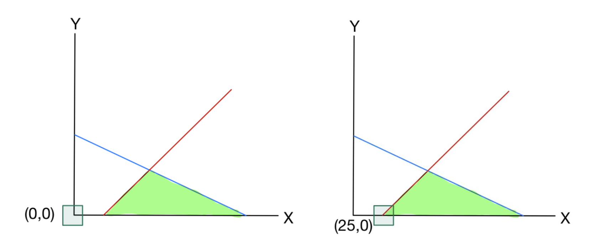
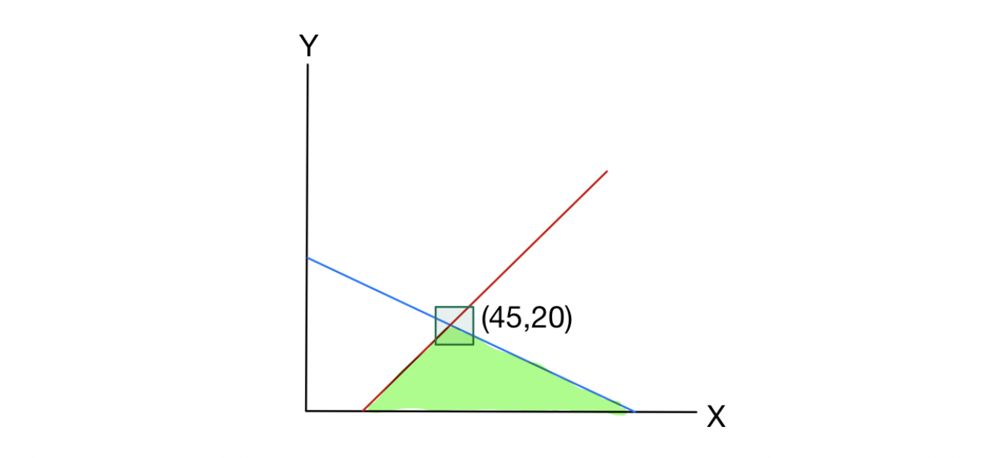
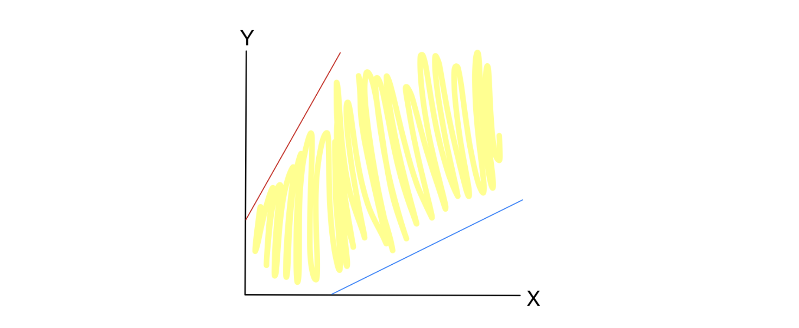

# 1. 도입: 초기 사전(Initial Dictionary)과 실행 가능성

선형 계획법(Linear Programming, LP) 문제를 풀기 위해 단체법(Simplex Method)을 사용할 때, 가장 먼저 직면하는 문제는 **실행 가능한 초기 해(Initial Feasible Solution)**를 찾는 것입니다. 

지난 강의에서 다루었던 기본적인 예시를 다시 떠올려 보겠습니다.
$$\max z = 5x + 4y$$
$$\text{s.t.} \quad 2x + 3y \le 150$$
$$\quad \quad \ \ 2x + y \le 70$$
$$\quad \quad \ \ x, y \ge 0$$

이 문제를 표준형(Standard form)으로 변환하기 위해 여유 변수(Slack variables) $s_1, s_2$를 도입하면 다음과 같은 초기 사전(Initial Dictionary)을 얻을 수 있습니다 .

$$z = 5x + 4y$$
$$s_1 = 150 - 2x - 3y$$
$$s_2 = 70 - 2x - y$$

초기 상태에서 비기저 변수(Non-basic variables)인 $x, y$를 $0$으로 설정하면, 기저 변수(Basic variables)는 $(s_1, s_2) = (150, 70)$이 됩니다. 우변의 상수항이 모두 음이 아닌 정수이므로, 이 초기 해는 모든 비음성(Non-negativity) 제약조건 $s_1, s_2 \ge 0$을 만족합니다. 이를 **실행 가능한 사전(Feasible Dictionary)**이라고 부릅니다.

## 1.1. 실행 불가능한 사전(Infeasible Dictionary)의 등장

하지만, 우변의 상수가 항상 0 이상이라는 보장은 없습니다. 다음과 같은 새로운 LP 문제를 고려해 봅시다 .

$$\max z = x + 2y$$
$$\text{s.t.} \quad 2x + 3y \le 150$$
$$\quad \quad -x + y \le -25$$
$$\quad \quad \ \ x, y \ge 0$$

여유 변수를 추가하여 초기 사전을 구성하면 다음과 같습니다 .

$$z = x + 2y$$
$$s_1 = 150 - 2x - 3y$$
$$s_2 = -25 + x - y$$

여기서 $x = y = 0$으로 두면, $(s_1, s_2) = (150, -25)$가 되어 $s_2 \ge 0$ 제약조건을 위반하게 됩니다. 우리는 이를 **실행 불가능한 사전(Infeasible Dictionary)**이라 부르며, 이 상태에서는 표준 단체법 알고리즘을 시작조차 할 수 없습니다.

---

# 2. 2단계 단체법 (Two-Phase Simplex Algorithm)

초기 사전이 실행 불가능할 때 문제를 해결하기 위해 도입된 개념이 바로 **2단계 단체법(Two-Phase Simplex Method)**입니다 . 이 알고리즘은 논리적으로 두 개의 단계로 나뉩니다.

1. **Phase I (실행 가능한 사전 찾기):** 주어진 LP의 실행 가능성을 테스트하고, 가능하다면 실행 가능한 사전을 도출합니다. 만약 불가능하다면, 해당 LP는 해가 없음(Infeasible)으로 결론 내립니다.
2. **Phase II (최적해 도출):** Phase I에서 찾은 실행 가능한 사전을 초기 사전으로 삼아 일반적인 단체법을 수행합니다.

## 2.1. Phase I: 보조 LP 문제 (Auxiliary LP) 구성

원래 문제의 실행 가능성을 검증하기 위해 새로운 변수 $t \ge 0$를 도입한 보조 LP(Phase I LP)를 구성합니다 . 앞에서 본 예시의 경우 다음과 같이 변형됩니다 .

$$\min t$$
$$\text{s.t.} \quad 2x + 3y - t \le 150$$
$$\quad \quad -x + y - t \le -25$$
$$\quad \quad \ \ x, y, t \ge 0$$

**[핵심 정리(Theorem)]** 새롭게 구성된 보조 선형 계획법이 실행 가능하고 그 최적값이 0과 같다면, 본래의 선형 계획법 역시 실행 가능합니다 (필요충분조건) . 목적 함수를 $t$의 최소화로 둔 이유는 최적해에서 $t=0$을 유도하여 원래 제약 조건을 복원하기 위함입니다.

이 보조 LP의 표준형 사전은 다음과 같습니다 (참고: $\min t$는 $\max -t$와 같습니다) .

$$z = -t$$
$$s_1 = 150 - 2x - 3y + t$$
$$s_2 = -25 + x - y + t$$

여전히 이 사전은 실행 불가능합니다. 이를 해결하기 위해 가장 음의 값을 가지는 기저 변수($s_2$)를 비기저 변수로 내리고, 새로운 변수 $t$를 기저 변수로 올리는 첫 번째 피벗(Pivot) 연산을 수행합니다 . 

$$t = 25 - x + y + s_2$$
이 식을 목적 함수 $z$와 $s_1$ 행에 대입하여 정리하면 다음과 같은 **보조 LP의 첫 번째 실행 가능한 사전**을 얻게 됩니다.

$$z = -25 + x - y - s_2$$
$$s_1 = 175 - 3x - 2y + s_2$$
$$t = 25 - x + y + s_2$$

이 상태에서 비기저 변수 $(x, y, s_2)$를 모두 $0$으로 두면, 기저 변수는 $(s_1, t) = (175, 25)$가 됩니다. 우변이 모두 양수이므로 보조 LP 자체는 실행 가능한 상태가 되었습니다.

**[t를 0으로 만들기 위한 두 번째 피벗]**
하지만 우리의 최종 목표는 $t$를 최소화하여 $0$으로 만드는 것입니다. 현재 목적 함수 $z = -25 + x - y - s_2$를 보면, 변수 $x$의 계수가 $+1$로 양수입니다. 즉, $x$의 값을 증가시키면 목적 함수를 개선($t$를 감소)시킬 수 있습니다.

* 제약 조건을 위반하지 않는 선에서 $x$를 얼마나 증가시킬 수 있는지 알아보기 위해 비율 검사(Ratio Test)를 수행합니다 .
  * $s_1$ 제약: $175 - 3x \ge 0 \implies x \le \frac{175}{3} \approx 58.3$
  * $t$ 제약: $25 - x \ge 0 \implies x \le 25$

이 중 더 작은 값인 $\min\{\frac{175}{3}, 25\} = 25$까지만 $x$를 증가시킬 수 있습니다. $x$가 $25$까지 증가하는 순간, $t$는 $0$이 되어 비기저 변수로 내려가고, $x$가 새로운 기저 변수로 올라갑니다 . 

$t$ 행의 식을 $x$에 대해 정리하면 다음과 같습니다.
$$x = 25 + y + s_2 - t$$

이제 최적값인 $t=0$을 달성했으므로 $t$를 식에서 제거하고 , 위 식을 $s_1$ 행에 대입합니다 .
$$s_1 = 175 - 3(25 + y + s_2) - 2y + s_2 = 100 - 5y - 2s_2$$

$$s_1 = 100 - 5y - 2s_2$$
$$x = 25 + y + s_2$$

여기서 비기저 변수인 $(y, s_2)$를 $0$으로 설정하면, 기저 변수는 $(x, s_1) = (25, 100)$이 됩니다 . 이 과정을 통해 마침내 원래 문제의 **첫 번째 실행 가능한 해인 $(x, y) = (25, 0)$**가 명확히 유도된 것입니다.

## 2.2. Phase II: 본래의 목적 함수 복원

Phase I을 통해 찾아낸 실행 가능한 사전에서 인위적으로 추가했던 변수 $t$를 $0$으로 설정하여 제거합니다 . 하지만 현재 사전에는 보조 LP의 목적 함수($z = -t$)가 남아있으므로, 이를 **원래 문제의 목적 함수**로 교체해야 합니다.

원래 목적 함수: $z = x + 2y$
Phase I에서 얻은 사전에 따르면 $x = 25 + s_2 + y$ 이므로, 이를 대입합니다.

$$z = (25 + s_2 + y) + 2y = 25 + s_2 + 3y$$

이제 Phase II를 위한 완벽한 실행 가능한 초기 사전이 완성되었습니다 .

$$z = 25 + 3y + s_2$$
$$s_1 = 100 - 5y - 2s_2$$
$$x = 25 + y + s_2$$

이 사전을 바탕으로 최적화 조건이 달성될 때까지 단체법을 계속 수행하면 최종 최적해에 도달합니다 .

---

# 3. 특수 케이스: Infeasibility와 Unboundedness의 인식

단체법 알고리즘 수행 중, 우리는 문제에 해가 아예 존재하지 않거나, 해가 무한히 커질 수 있다는 사실을 수학적으로 인지할 수 있습니다.

## 3.1. 실행 불가능성 (Infeasibility) 인식

앞서 언급했듯, 보조 LP(Phase I)의 목적은 변수 $t$를 $0$으로 만드는 것입니다. 만약 Phase I의 단체법이 더 이상 개선될 수 없는 최적 상태에 도달했음에도 불구하고, **$t$의 값이 엄격하게 양수($t > 0$)라면**, 이는 원래의 선형 계획법이 어떠한 방법으로도 제약 조건을 만족시킬 수 없는 상태, 즉 **실행 불가능(Infeasible)**함을 의미합니다. 

## 3.2. 무한해 (Unboundedness) 인식

다음과 같은 LP를 살펴보겠습니다 .
$$\max z = x + y$$
$$\text{s.t.} \quad -2x + y \le 100$$
$$\quad \quad \ \ x - 2y \le 100$$
$$\quad \quad \ \ x, y \ge 0$$

표준형으로 변환 후 피벗을 한 번 수행하면 다음과 같은 사전을 얻게 됩니다 .
$$z = 100 + 3y - s_2$$
$$s_1 = 300 + 3y - 2s_2$$
$$x = 100 + 2y - s_2$$

이 사전을 분석해보면, 목적 함수 행에서 $y$의 계수가 $+3$으로 양수입니다. 즉, $y$를 증가시키면 목적 함수 $z$의 값도 증가합니다. 일반적인 경우, $y$를 증가시키면 제약조건 때문에 어느 순간 기저 변수($s_1, x$)가 음수가 되어버려 증가를 멈춰야 합니다. 

하지만 위 수식을 보면, $y$의 계수가 모든 기저 변수의 등식에서 **양수($+3, +2$)**입니다. 이는 $y$를 아무리 무한대로 증가시켜도 $s_1$과 $x$가 항상 양수로 유지된다는 것을 뜻합니다. 제약 조건의 위반 없이 목적 함수를 무한히 증가시킬 수 있으므로, 이 문제는 **무한해(Unbounded)**를 가집니다.

---

# 4. Phase I 일반화: 부등식 제약과 등식 제약

Phase I LP를 구성하는 방식을 제약 조건의 형태에 따라 수학적 벡터 및 행렬 꼴로 일반화해 보겠습니다. 

## 4.1. 부등식 제약 조건 ($Ax \le b$)의 경우

원래 문제의 제약 조건이 $Ax \le b$, $x \ge 0$ 형태로 주어졌다고 가정해 봅시다. 여기에 여유 변수(Slack variables) 벡터 $s$를 추가하면 다음과 같은 동치인 시스템을 얻습니다 .

$$Ax + s = \begin{bmatrix} a_1^\top x + s_1 \\ \vdots \\ a_m^\top x + s_m \end{bmatrix} = b$$
$$x \ge 0, \quad s \ge 0$$
(단, $a_i^\top$는 행렬 $A$의 $i$번째 행 벡터입니다.)

이 시스템은 자연스럽게 다음과 같은 초기 사전을 형성합니다 .

$$\begin{bmatrix} s_1 \\ \vdots \\ s_m \end{bmatrix} = \begin{bmatrix} b_1 \\ \vdots \\ b_m \end{bmatrix} + \begin{bmatrix} -a_1^\top x \\ \vdots \\ -a_m^\top x \end{bmatrix}$$

만약 $b$의 모든 원소가 $0$ 이상이라면 이 초기 사전은 실행 가능합니다. 하지만 우변 벡터 $b$에 음수 원소가 존재하여 $b_{\min} = \min_{i \in [m]} b_i < 0$ 인 상황이라면 이야기가 다릅니다. 이 경우, 모든 요소가 1인 벡터 $\mathbf{1}$과 새로운 변수 $t \ge 0$를 도입하여 다음 시스템을 고려합니다 .

$$Ax - t\mathbf{1} \le b, \quad x \ge 0, \quad t \ge 0$$

이 새로운 시스템은 원래 시스템과 달리 항상 실행 가능합니다. 구체적으로 $(x, t) = (0, -b_{\min})$을 대입하면 제약 조건을 만족시킵니다 . 이를 바탕으로 구성한 **Phase I LP**는 다음과 같습니다 .

$$\min t$$
$$\text{s.t.} \quad Ax - t\mathbf{1} \le b$$
$$\quad \quad \ \ x \ge 0, \ t \ge 0$$

원래의 $Ax \le b, x \ge 0$ 시스템이 실행 가능할 필요충분조건은 이 Phase I LP의 최적값이 $0$이 되는 것입니다. 왜냐하면 최적값이 $0$이라는 것은 $(x, t) = (\bar{x}, 0)$ 인 해가 존재하여 $A\bar{x} - 0\mathbf{1} = A\bar{x} \le b$ 및 $\bar{x} \ge 0$을 만족한다는 뜻이기 때문입니다.

이 Phase I LP를 풀기 위해 표준형으로 변환하면 다음과 같습니다 .
$$Ax - t\mathbf{1} + s = \begin{bmatrix} a_1^\top x - t + s_1 \\ \vdots \\ a_m^\top x - t + s_m \end{bmatrix} = \begin{bmatrix} b_1 \\ \vdots \\ b_m \end{bmatrix}$$
$$x \ge 0, \ t \ge 0, \ s \ge 0$$

이제 **초기 사전**을 유도해 보겠습니다. 설명을 단순화하기 위해 $b_1$이 $b$의 원소 중 가장 작다고 가정하겠습니다 ($b_1 = b_{\min} < 0$) . 
첫 번째 행의 식을 변환의 기준으로 삼아 다른 모든 행에서 첫 번째 행을 빼줍니다.
$$\begin{bmatrix} a_1^\top x - t + s_1 \\ (a_2 - a_1)^\top x + s_2 - s_1 \\ \vdots \\ (a_m - a_1)^\top x + s_m - s_1 \end{bmatrix} = \begin{bmatrix} b_1 \\ b_2 - b_1 \\ \vdots \\ b_m - b_1 \end{bmatrix}$$ 

위 식에서 첫 번째 행을 $t$에 대해 정리하고, 나머지 행을 $s_i$에 대해 정리하여 변수들을 적절히 이항하면 다음과 같은 보조 LP의 첫 번째 실행 가능한 사전을 얻게 됩니다 .

$$\begin{bmatrix} t \\ s_2 \\ \vdots \\ s_m \end{bmatrix} = \begin{bmatrix} -b_1 \\ b_2 - b_1 \\ \vdots \\ b_m - b_1 \end{bmatrix} + \begin{bmatrix} a_1^\top x + s_1 \\ -(a_2 - a_1)^\top x + s_1 \\ \vdots \\ -(a_m - a_1)^\top x + s_1 \end{bmatrix}$$

이 사전은 완벽하게 실행 가능합니다. 왜냐하면 $i \in [m]$에 대하여 우변의 상수항 $b_i - b_1 = b_i - \min\{b_j : j \in [m]\} \ge 0$ 이고, $-b_1$ 역시 양수이기 때문입니다 . 이제 단체법 알고리즘을 진행할 준비가 끝났습니다.

## 4.2. 등식 제약 조건 ($Ax = b$)의 경우

만약 제약 조건이 $Ax = b$, $x \ge 0$ 형태로 주어졌다고 해봅시다 . 이 경우의 Phase I LP는 인위적 변수 $s$(벡터)와 $t$(스칼라)를 도입하여 다음과 같이 구성됩니다 .

$$\min t + \sum_{i=1}^m s_i$$
$$\text{s.t.} \quad Ax - t\mathbf{1} + s = b$$
$$\quad \quad \ \ x \ge 0, \ s \ge 0, \ t \ge 0$$

여기서 만약 $b$의 모든 원소가 $0$ 이상이라면, $(x, t, s) = (0, 0, b)$가 실행 가능한 해가 됩니다 . 이때의 실행 가능한 사전은 다음과 같습니다 .
$$\begin{bmatrix} s_1 \\ \vdots \\ s_m \end{bmatrix} = \begin{bmatrix} b_1 \\ \vdots \\ b_m \end{bmatrix} + \begin{bmatrix} -a_1^\top x + t \\ \vdots \\ -a_m^\top x + t \end{bmatrix}$$

하지만 $b$에 음수인 원소가 존재할 때가 문제입니다. 부등식 때와 마찬가지로 편의상 $b_1$이 가장 작은 음수 값이라고 가정해 보겠습니다. 이 경우 $s_1$ 대신 $t$를 기저 변수로 사용하여 $Ax - t\mathbf{1} + s = b$ 연립방정식을 정리합니다 . 

놀랍게도 등식 제약조건에 대해서도 부등식 제약조건의 보조 LP 초기 사전과 정확히 동일한 형태의 **실행 가능한 사전**이 도출됩니다 .

$$\begin{bmatrix} t \\ s_2 \\ \vdots \\ s_m \end{bmatrix} = \begin{bmatrix} -b_1 \\ b_2 - b_1 \\ \vdots \\ b_m - b_1 \end{bmatrix} + \begin{bmatrix} a_1^\top x + s_1 \\ -(a_2 - a_1)^\top x + s_1 \\ \vdots \\ -(a_m - a_1)^\top x + s_1 \end{bmatrix}$$

이처럼, 행렬과 벡터의 형태를 빌려 부등식/등식의 모든 경우를 포괄하는 일관적인 보조 LP(Phase I LP) 초기화 템플릿을 완성할 수 있습니다 .

---

# 5. 행렬을 이용한 Phase II 기술적 세부사항 (Technical Details)

지금까지 연립방정식 형태로 다루었던 단체법의 사전을 선형대수학의 행렬 형태로 정립해 보겠습니다 . 이 부분은 추후 최적화 이론을 깊이 이해하는 데 핵심적인 뼈대가 됩니다. Phase I을 거쳐 실행 가능한 사전을 확보했다고 가정하고 시작하겠습니다.

주어진 LP 표준형은 다음과 같습니다 .
$$\max z = c^\top x$$
$$\text{s.t.} \quad Ax = b$$
$$\quad \quad \ \ x \ge 0$$

먼저 변수 벡터 $x$를 기저 변수(Basic variables) $x_B$와 비기저 변수(Non-basic variables) $x_N$으로 분할(Partition)하여 다음과 같이 표현합니다 . 
$$x = \begin{bmatrix} x_B \\ x_N \end{bmatrix}$$

이에 대응되도록 목적 함수의 비용 벡터 $c$와 제약 조건 행렬 $A$ 역시 기저 및 비기저 부분으로 분할합니다 .
$$c = \begin{bmatrix} c_B \\ c_N \end{bmatrix}, \quad A = \begin{bmatrix} B & N \end{bmatrix}$$

**[가정 (Assumption)]** 기저 변수 $x_B$를 설정하기 위해서는, 이에 대응하는 제약 행렬의 열들로 구성된 정방행렬 $B$가 정칙 행렬(Nonsingular)이어야 합니다. 즉, 역행렬 $B^{-1}$이 존재해야 합니다 .

## 5.1. 제약 조건의 행렬 연산과 사전(Dictionary) 유도

표준형의 제약 조건 $Ax = b$를 분할된 행렬을 사용해 전개하면 다음과 같습니다.
$$Bx_B + Nx_N = b$$

기저 변수 $x_B$에 대한 실행 가능한 사전을 얻기 위해서는 적절한 행 연산(Row operations)을 적용해야 합니다. 행렬식에서 이 과정은 양변의 왼쪽에 $B^{-1}$을 곱하는 것과 정확히 동치입니다.
$$x_B = B^{-1}b - B^{-1}Nx_N$$ 

**[가정 (Assumption)]** $x_B$가 단체법을 위한 정상적인 실행 가능한 사전을 구성하려면, 상수항 벡터인 $B^{-1}b$의 모든 원소가 음이 아니어야(nonnegative) 합니다 .

## 5.2. 목적 함수 유도와 축소 비용 (Reduced Costs)

다음으로 목적 함수 $z$ 행에서 기저 변수 $x_B$를 제거해야 합니다. 비용 벡터와 변수 벡터의 내적을 분리하면 다음과 같습니다.
$$z = c_B^\top x_B + c_N^\top x_N$$

앞서 구한 $x_B$의 수식을 활용하여 $c_B^\top x_B$를 비기저 변수 $x_N$에 대한 식으로 변환합니다.
$$c_B^\top x_B = c_B^\top (B^{-1}b - B^{-1}Nx_N)$$

이를 다시 원래의 목적 함수 $z$ 식에 대입하여 $x_B$를 완전히 소거합니다 .
$$z = c_B^\top B^{-1}b - c_B^\top B^{-1}Nx_N + c_N^\top x_N$$

이를 $x_N$에 대해 묶어 전치(Transpose) 성질을 활용해 정리하면, 다음과 같은 최종 사전을 얻을 수 있습니다 .
$$z = c_B^\top B^{-1}b + \left(c_N - N^\top (B^{-1})^\top c_B\right)^\top x_N$$
$$x_B = B^{-1}b - B^{-1}Nx_N$$ 

## 5.3. 최적성 검증 (Optimality Check)

위에서 도출한 최종 행렬 기반 사전을 통해 다음의 중요한 결론들을 도출할 수 있습니다.

* **현재 솔루션:** 비기저 변수 $x_N = 0$이므로, 현재 해는 $(x_B, x_N) = (B^{-1}b, 0)$ 입니다 .
* **현재 목적함수 값:** $z = c_B^\top B^{-1}b$ 가 됩니다 .
* 여기서 행렬 $B$ (또는 $x_B$에 대응하는 열들)를 기저(Basis)라고 부릅니다.
* 목적 함수 식에서 비기저 변수 $x_N$의 계수인 $c_N - N^\top (B^{-1})^\top c_B$ 를 **축소 비용(Reduced Costs)**이라고 부릅니다.

**[최적성 조건 (Optimality Condition)]**
현재 다루고 있는 최대화(Maximization) 문제에서, 계산된 축소 비용의 모든 원소가 0 이하(non-positive)라면, 현재의 사전은 최적(Optimal)이라고 판단합니다 . 더 이상 비기저 변수를 기저로 진입시켜 목적 함수를 증가시킬 수 없기 때문입니다.