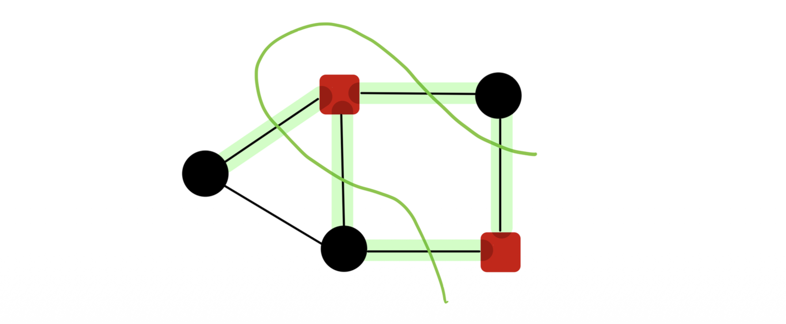
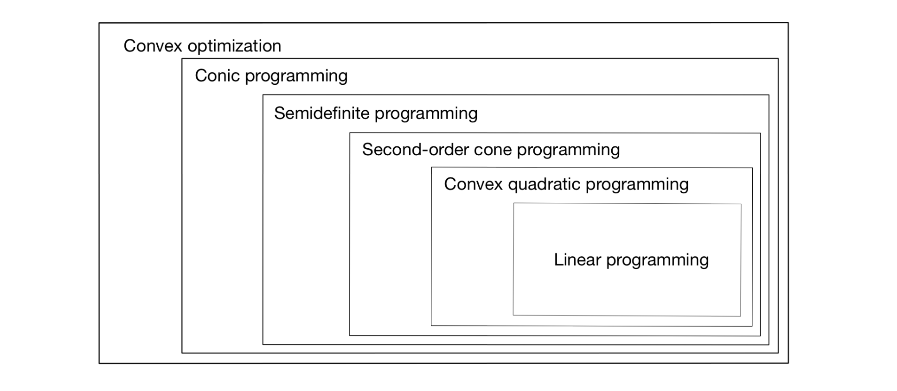

# Introduction: 볼록 최적화의 확장

* 이번 포스트에서는 선형 계획법(Linear Programming, LP)을 넘어선 다양한 **볼록 최적화(Convex Optimization)** 기법들을 다룹니다.
* 구체적으로 다음의 주제들을 수학적 수식과 함께 단계별로 살펴봅니다.
  * **이차 계획법 (Quadratic Programming, QP)**
  * **반정부호 계획법 (Semidefinite Programming, SDP)**
  * **원뿔 계획법 (Conic Programming, CP)**
  * **이차 원뿔 계획법 (Second-Order Cone Programming, SOCP)**

---

# 1. 이차 계획법 (Quadratic Programming, QP)

## 1.1. 개념 및 정의
이차 계획법(QP)은 목적 함수가 이차항을 포함하고, 제약 조건은 선형인 최적화 문제의 형태를 띱니다. 일반적인 수식은 다음과 같습니다.

$$
\begin{aligned}
\text{minimize} \quad & \frac{1}{2}x^{\top}Qx + \rho^{\top}x \\
\text{subject to} \quad & Ax \ge b
\end{aligned}
$$

이차 계획법이 볼록(Convex) 문제이기 위해서는 행렬 $Q$가 반드시 **양의 준정부호(Positive Semidefinite, $Q \succeq 0$)**여야 합니다. 

## 1.2. 머신러닝 및 금융에서의 QP 응용

### 예제 1: 포트폴리오 최적화 (Portfolio Optimization)
* 포트폴리오 최적화 모델은 다음과 같이 정형화될 수 있습니다.
  * 목적 함수: $\text{maximize} \quad \mu^{\top}x - \gamma x^{\top}\Sigma x$ 
  * 제약 조건: $1^{\top}x = 1$, $x \in \mathbb{R}_{+}^{n}$ 

여기서 $\gamma > 0$이며, 공분산 행렬(Covariance matrix)인 $\Sigma$는 양의 준정부호입니다. 최적화의 편의를 위해 목적 함수에 음수를 취해 최소화 문제로 변환하면 동치인 다음과 같은 볼록 이차 계획법 형태가 됩니다.

$$
\begin{aligned}
\text{minimize} \quad & \gamma x^{\top}\Sigma x - \mu^{\top}x \\
\text{subject to} \quad & 1^{\top}x = 1 \\
& x \ge 0
\end{aligned}
$$

### 예제 2: 서포트 벡터 머신 (Support Vector Machine, SVM)
서포트 벡터 머신의 목적 함수는 다음과 같습니다.

$$
\min_{w,b} \lambda||w||_{2}^{2} + \frac{1}{n}\sum_{i=1}^{n}\max\{0, 1 - y_{i}(w^{\top}x_{i} - b)\}
$$

이 형태는 비선형적인 $\max$ 함수를 포함하고 있지만, 보조 변수(Slack variable) $\xi_i \ge 0$를 도입하면 동치인 볼록 이차 계획법으로 재구성할 수 있습니다. (강의 자료에서는 빈칸으로 제시되었으나, 통상적으로 다음과 같이 변환됩니다.)

$$
\begin{aligned}
\text{minimize} \quad & \lambda||w||_{2}^{2} + \frac{1}{n}\sum_{i=1}^{n}\xi_i \\
\text{subject to} \quad & y_{i}(w^{\top}x_{i} - b) \ge 1 - \xi_i, \quad \forall i \\
& \xi_i \ge 0, \quad \forall i
\end{aligned}
$$

### 예제 3: LASSO 회귀 (LASSO Regression)
LASSO는 다음과 같이 L1 정규화를 포함합니다.

$$
\min_{\beta} \frac{1}{n}||y - X\beta||_{2}^{2} + \lambda||\beta||_{1}
$$

절댓값 기호 때문에 미분 불가능해 보이지만, 변수를 $\beta = \beta^+ - \beta^-$ (단, $\beta^+, \beta^- \ge 0$)로 분리하면 역시 이차 계획법으로 변환 가능합니다.

---

# 2. 반정부호 계획법 (Semidefinite Programming, SDP)

## 2.1. 동기: 최대 절단(Max-Cut) 문제
반정부호 계획법(SDP)은 NP-hard 이산 최적화 문제를 푸는 훌륭한 도구입니다. 대표적으로 Goemans와 Williamson(1995)에 의해 연결성이 밝혀진 Maximum Cut(Max-Cut) 문제가 있습니다.

그래프 $G=(V,E)$에서 정점 집합 $V$를 두 그룹 $(V_1, V_2)$로 분할할 때 ($V_1 \cup V_2 = V$, $V_1 \cap V_2 = \emptyset$), 파티션을 가로지르는 간선의 수($\{uv \in E : u \in V_1, v \in V_2\}$)를 최대화하는 문제입니다.

이를 수식화하면, 각 정점 $v \in V$에 대해 변수 $x_v \in \{-1, 1\}$를 할당하여 다음과 같은 목적 함수를 얻습니다.

$$
\text{maximize} \quad \sum_{uv\in E}\frac{1 - x_{u}x_{v}}{2}
$$

제약 조건 $x_v \in \{-1, 1\}$은 이산적이어서 다루기 매우 어렵습니다.

## 2.2. Max-Cut의 SDP 이완 (Relaxation)
제약 조건을 완화하기 위해 $d \times d$ 행렬 $X$를 정의하고 그 원소를 $X_{ij} = X_i X_j$로 둡니다. 이렇게 정의된 행렬 $X$는 양의 준정부호(Positive Semidefinite, $X \succeq 0$)가 됩니다. 따라서 원래 문제는 다음과 같이 동치로 표현됩니다.

$$
\begin{aligned}
\text{maximize} \quad & \sum_{uv\in E}\frac{1 - X_{uv}}{2} \\
\text{subject to} \quad & X_{ii} = 1, \quad \forall i \in V \\
& X \succeq 0
\end{aligned}
$$

이러한 형태로 최적화하는 것을 SDP 완화(Relaxation)라고 합니다.

## 2.3. SDP의 일반 형태 및 쌍대성
일반적인 반정부호 계획법(SDP)은 행렬의 대각합(Trace) 기반 내적, $tr(C^{\top}X)$ 및 $tr(A_l^{\top}X)$을 활용합니다. 

* **원문제 (Primal SDP)**:
    $$
    \begin{aligned}
    \text{minimize} \quad & tr(C^{\top}X) \\
    \text{subject to} \quad & tr(A_{l}^{\top}X) = b_{l} \quad \text{for } l=1,...,n \\
    & X \ge 0 \quad (\text{즉, } X \succeq 0)
    \end{aligned}
    $$

* **쌍대문제 (Dual SDP)**:
    $$
    \begin{aligned}
    \text{maximize} \quad & \sum_{l=1}^{m}b_{l}y_{l} \\
    \text{subject to} \quad & \sum_{l=1}^{m}y_{l}A_{l} \le C
    \end{aligned}
    $$
    여기서 $\sum_{l=1}^{m}y_{l}A_{l} \le C$는 $C - \sum_{l=1}^{m}y_{l}A_{l}$ 행렬이 양의 준정부호임을 의미합니다.

## 2.4. QP의 SDP 변환 (Schur Complement)
볼록 이차 계획법(QP)은 다음의 형태로 다시 쓸 수 있습니다.

$$
\begin{aligned}
\text{minimize} \quad & t \\
\text{subject to} \quad & t \ge \frac{1}{2}x^{\top}Qx + p^{\top}x
\end{aligned}
$$
(강의자료 슬라이드 25장과 동일 )

어떤 양의 준정부호 행렬 $Q$라도 $Q = P^{\top}P$를 만족하는 $P$가 존재합니다. 그리고 다음 보조정리(Lemma)를 이용하면 이 제약식을 선형 행렬 부등식으로 나타낼 수 있습니다.

> **Lemma**: 벡터 $y \in \mathbb{R}^{d}$에 대해, $y^{\top}y \le s$ 라는 부등식은 블록 행렬이 양의 준정부호임 $(\begin{matrix} s & y^{\top} \\ y & I \end{matrix}) \ge 0$ 과 동치입니다 (여기서 $I$는 $d \times d$ 단위행렬입니다).

이를 활용해 임의의 볼록 이차 계획법을 완벽히 반정부호 계획법(SDP)으로 전환할 수 있습니다.

---

# 3. 원뿔 계획법 (Conic Programming)

## 3.1. 선형 계획법(LP) 복습 및 원뿔(Cone)의 개념
선형 계획법(LP)은 선형 목적 함수와 선형 부등식 제약 조건을 가집니다.
$$
\text{minimize } c^{\top}x \quad \text{subject to } Ax \ge b \quad (a_{1}^{\top}x \ge b_{1}, ..., a_{n}^{\top}x \ge b_{n})
$$

제약식 $Ax \ge b$는 $Ax - b \ge 0$과 같으며, 이는 $Ax - b$의 각 성분이 모두 음수가 아님을 뜻합니다. 다시 말해, 이는 벡터가 **음이 아닌 오탄트(Nonnegative orthant, $\mathbb{R}_{+}^{n}$)**에 포함된다는 의미입니다 ($Ax - b \in \mathbb{R}_{+}^{n}$). 즉 LP는 다음과 같이 쓸 수 있습니다.

$$
\begin{aligned}
\text{minimize} \quad & c^{\top}x \\
\text{subject to} \quad & Ax - b \in \mathbb{R}_{+}^{n}
\end{aligned}
$$

* 음이 아닌 오탄트 $\mathbb{R}_{+}^{n}$는 다음 세 가지 특징을 갖춘 볼록 원뿔(Convex cone)입니다:
  * 1.  **Pointed (뾰족함)** 
  * 2.  **Closed (닫혀있음)** 
  * 3.  **Nonempty Interior (내부가 비어있지 않음)**: 내부는 $\mathbb{R}_{++}^{n}$ (양의 오탄트)입니다.

이 세 조건을 모두 충족하는 원뿔을 **정규 원뿔(Regular cones)**이라고 부릅니다.

## 3.2. 정규 원뿔의 종류 및 일반 CP 형태
* 대표적인 정규 원뿔은 다음과 같습니다.
  * **로렌츠 원뿔 (Lorentz cone)**: 또는 이차 원뿔(Second-order cone), $l_2$-norm cone. 
      $$\mathbb{L}_{n} = \{(x_{1},...,x_{n-1},x_{n})^{\top} \in \mathbb{R}^{n} : ||(x_{1},...,x_{n-1})^{\top}||_{2} \le x_{n}\}$$ 
      내부는 부등호가 $<$인 집합입니다.
  * **양의 준정부호 원뿔 (Positive semidefinite cone, $\mathbb{S}_{+}^{d}$)**: 
      $$\mathbb{S}_{+}^{d} = \{S \in \mathbb{S}^{d} : x^{\top}Sx \ge 0 \text{ for all } x \in \mathbb{R}^{d}\}$$ 
      내부는 양의 정부호 행렬의 집합입니다.

원뿔 계획법(CP)은 $Ax - b \ge 0$ 제약을 임의의 정규 원뿔 $K$에 대한 소속 제약으로 치환한 최적화 문제입니다.

$$
\begin{aligned}
\text{minimize} \quad & c^{\top}x \\
\text{subject to} \quad & Ax - b \in K \quad (\text{또는 } Ax \ge_{K} b, Ax - b \ge_{K} 0)
\end{aligned}
$$

$K = \mathbb{R}_{+}^{n}$이면 선형 계획법이 되고 , $K$가 로렌츠 원뿔이면 이차 원뿔 계획법(SOCP) , $K$가 양의 준정부호 원뿔이면 반정부호 계획법(SDP)이 됩니다.

---

# 4. 이차 원뿔 계획법 (Second-Order Cone Programming, SOCP)

## 4.1. 개념과 정의
SOCP는 원뿔 계획법의 한 종류로, 일반 형태는 다음과 같습니다.

$$
\begin{aligned}
\text{minimize} \quad & f^{\top}x \\
\text{subject to} \quad & ||A_{i}x + b_{i}||_{2} \le c_{i}^{\top}x + d_{i} \quad \text{for } i=1,...,m \\
& Ex = g
\end{aligned}
$$

## 4.2. 응용: 확률 제약 선형 계획법 (Chance-Constrained LP)
불확실성이 있는 상황을 다루기 위한 방법으로 다음의 확률 제약 계획법(CCP)을 고려해 볼 수 있습니다.

$$
\begin{aligned}
\text{minimize} \quad & c^{\top}x \\
\text{subject to} \quad & \mathbb{P}(a^{\top}x \le b) \ge 1 - \epsilon
\end{aligned}
$$

여기서 제약 조건 내 벡터 $a$는 확률 변수입니다. 이 문제는 제약 조건 $a^{\top}x \le b$가 만족될 확률이 최소 $1-\epsilon$ 이상 보장되도록 하는 변수 $x$를 찾는 것입니다. 
금융 포트폴리오의 경우, $p$를 금융 자산의 단가, $r$을 확률적 수익률, $\alpha$를 목표 수익률이라고 하면 다음과 같이 표현됩니다.

$$\text{minimize } p^{\top}x \quad \text{subject to } \mathbb{P}(r^{\top}x \ge 1+\alpha) \ge 1-\epsilon, \quad 1^{\top}x = 1$$

### 정규 분포 가정에서의 변환 및 유도 (Gaussian Case)
랜덤 벡터 $a$가 평균이 $\overline{a}$이고 공분산 행렬이 $\Sigma$인 다변량 정규 분포를 따른다고 가정합시다.
이때 $a^{\top}x$는 선형 결합이므로 평균이 $\overline{a}^{\top}x$, 분산이 $\sigma^{2} = x^{\top}\Sigma x$인 1차원 정규 변수가 됩니다.
확률 제약식을 표준화(Standardization)하면 다음과 같습니다.

$$
\mathbb{P}(a^{\top}x \le b) = \mathbb{P}\left(\frac{a^{\top}x - \overline{a}^{\top}x}{\sigma} \le \frac{b - \overline{a}^{\top}x}{\sigma}\right)
$$

여기서 $\frac{a^{\top}x - \overline{a}^{\top}x}{\sigma}$는 표준 정규 분포(Standard Normal)를 따릅니다. 표준 정규 분포의 누적 분포 함수를 $\Phi(z) = \frac{1}{\sqrt{2\pi}}\int_{-\infty}^{z}e^{-t^{2}/2}dt$ 라 할 때 , 위 확률이 $1-\epsilon$ 이상이 되기 위한 조건은 다음과 동치입니다.

$$
\frac{b - \overline{a}^{\top}x}{\sigma} \ge \Phi^{-1}(1-\epsilon)
$$

표준 편차는 $\sigma = \sqrt{x^{\top}\Sigma x} = ||\Sigma^{1/2}x||_{2}$ 이므로 , 이를 식에 대입하여 정리하면 최종적으로 다음 수식을 얻게 됩니다.

$$
\overline{a}^{\top}x + \Phi^{-1}(1-\epsilon)||\Sigma^{1/2}x||_{2} \le b
$$

결론적으로, 다변량 정규 분포를 따르는 CCP는 다음과 같은 명확한 이차 원뿔 계획법(SOCP)으로 변환됩니다.

$$
\begin{aligned}
\text{minimize} \quad & c^{\top}x \\
\text{subject to} \quad & \overline{a}^{\top}x + \Phi^{-1}(1-\epsilon)||\Sigma^{1/2}x||_{2} \le b
\end{aligned}
$$

### SOCP를 SDP로 환원
놀랍게도 SOCP 또한 반정부호 계획법의 한 사례(Instance)에 불과합니다. 벡터 $y \in \mathbb{R}^{d}$에 대해 제약식 $||y||_{2} \le s$는 다음 형태의 행렬 부등식으로 표현됩니다.

$$
\left(\begin{matrix} s & y^{\top} \\ y & s-1 \end{matrix}\right) \ge 0
$$
*(주: 원문 강의자료 슬라이드 26장에 기재된 위 수식은, 통상적인 Schur Complement 적용 시 $sI$ (Identity Matrix)로 표기되기도 합니다)*.

---

# 5. 볼록 최적화 클래스 간의 위계 (Hierarchy)

이러한 볼록 최적화 문제들은 엄격한 부분집합 관계의 위계 구조를 형성합니다. 가장 간단한 선형 계획법(LP)에서부터 시작하여 일반화가 진행됩니다.

위 그림에서 확인할 수 있듯, 포함 관계는 다음과 같이 성립합니다.

$$\text{LP} \subset \text{Convex QP} \subset \text{SOCP} \subset \text{SDP} \subset \text{Conic Programming} \subset \text{Convex Optimization}$$