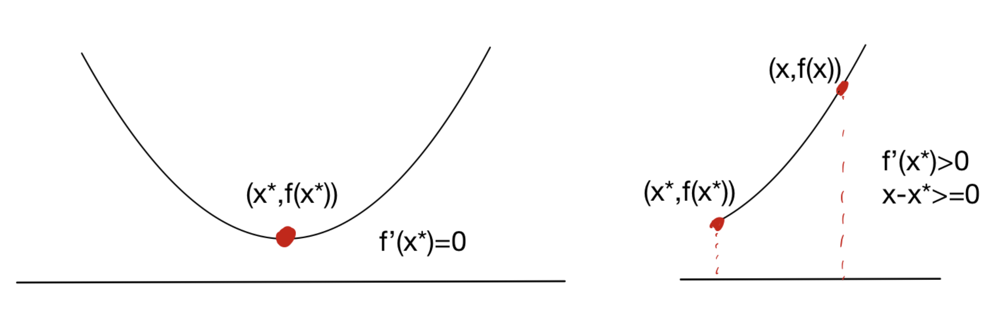
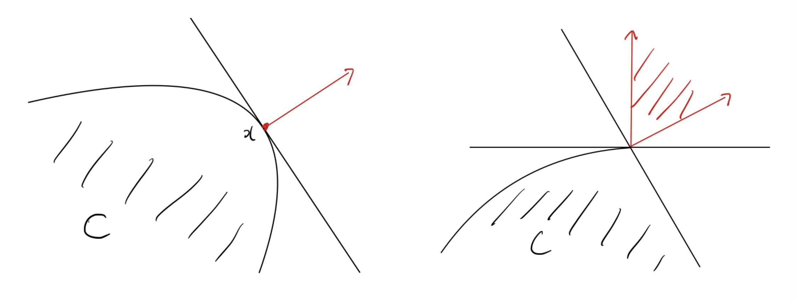

# 1. Introduction

* 최적화 문제, 특히 머신러닝과 계량경제학의 추정 문제를 풀다 보면 제약이 있는 볼록 최적화(Convex Optimization) 문제와 마주하게 됩니다. 이번 포스트에서는 서울대학교 수리과학부 이다빈 교수님의 수리 및 수치 최적화 강의(Lecture 7)를 바탕으로, 최적화 이론의 기둥이 되는 **원뿔 쌍대성(Conic Duality)**을 이해하고, 볼록 최소화 문제의 **최적성 조건(Optimality Conditions)**을 유도해 보겠습니다. 나아가 머신러닝의 가장 기본이 되는 알고리즘인 **경사하강법(Gradient Descent)**의 원리를 테일러 전개(Taylor Approximation) 관점에서 직관적으로 해석해 봅니다.

---

# 2. Conic Programming & Duality (원뿔 계획법과 쌍대성)

## 2.1 Conic Programming (원뿔 계획법)

* **원뿔 계획법(Conic Program, CP)**은 내부가 비어있지 않고(nonempty interior), 뾰족하며(pointed), 닫힌(closed) 볼록 원뿔(convex cone) $K$를 이용해 정의되는 최적화 문제입니다.

* 기본적인 원뿔 계획법의 형태는 다음과 같습니다:
$$\text{minimize} \quad c^\top x$$
$$\text{subject to} \quad Ax - b \in K$$

* 일반적으로 벡터가 원뿔 $K$에 속한다는 것은 "$\ge_K$"라는 기호를 사용해 나타낼 수 있습니다. 즉, $Ax - b \in K$는 $Ax - b \ge_K 0$ 혹은 $Ax \ge_K b$와 동치이며, 이를 통해 문제를 제약식의 관점에서 유연하게 바라볼 수 있습니다. 원뿔 $K$의 형태에 따라 문제의 종류가 다음과 같이 분류됩니다:
  * $K = \mathbb{R}_+^n$ 인 경우: 가장 친숙한 선형 계획법(Linear Program, LP)으로 축소됩니다.
  * $K$가 이차 원뿔(Second-order cone)인 경우: 이차 원뿔 계획법(SOCP)이 됩니다.
  * $K$가 양의 준정부호 원뿔(Positive semidefinite cone)인 경우: 반정부호 계획법(SDP)이 됩니다.

## 2.2 Dual Cone (쌍대 원뿔)

* 원뿔 계획법의 쌍대 문제를 정의하기 위해서는 먼저 **쌍대 원뿔(Dual cone)**의 개념이 필요합니다. $K \subseteq \mathbb{R}^n$의 쌍대 원뿔 $K^*$는 다음과 같이 정의됩니다:
$$K^* = \{y \in \mathbb{R}^n : y^\top x \ge 0 \quad \forall x \in K\}$$
* 즉, $K$ 내의 모든 원소와 내적했을 때 음수가 되지 않는 벡터들의 집합입니다. 

* **자기 쌍대성(Self-dual)**: 일부 원뿔은 자기 자신과 쌍대 원뿔이 일치하는 성질을 가집니다. 대표적으로 음이 아닌 직교 좌표계(nonnegative orthant) $\mathbb{R}_+^d$의 쌍대 원뿔은 $\mathbb{R}_+^d$ 자신입니다. 
* 양의 준정부호 원뿔 $\mathbb{S}_+^d$ 역시 자기 쌍대(self-dual)이며, 두 행렬의 내적 $\text{tr}(X^\top S) \ge 0$ 조건을 만족합니다.
* 이차 원뿔 또한 자기 쌍대 원뿔입니다.
* **정리**: 원뿔 $K$가 내부가 비어있지 않고 뾰족한 닫힌 볼록 원뿔이라면, 쌍대 원뿔 $K^*$ 역시 동일한 성질을 가지며, 나아가 $(K^*)^* = K$를 만족합니다.

## 2.3 Derivation of Dual Conic Program (쌍대 문제 유도)

* 주어진 원뿔 계획법(CP)의 하한(lower bound)을 구하는 과정에서 쌍대 문제(Dual-CP)가 자연스럽게 도출됩니다.
* 1. $Ax - b \in K$를 만족하는 $x$와 $y \in K^*$를 생각해보면, 쌍대 원뿔의 정의에 의해 $y^\top(Ax - b) \ge 0$가 성립합니다.
* 2. 이를 전개하면 $y^\top Ax \ge y^\top b$가 되며, 만약 제약조건 $A^\top y = c$를 추가로 만족한다면, $c^\top x = y^\top Ax \ge y^\top b$가 성립합니다.
* 3. 따라서 원문제의 목적함수 $c^\top x$의 값을 하한에서 근사하기 위해 다음과 같은 쌍대 문제를 구성할 수 있습니다:
   $$\text{maximize} \quad b^\top y$$
   $$\text{subject to} \quad A^\top y = c, \quad y \in K^*$$

## 2.4 Conic Duality Theorem (원뿔 쌍대성 정리)

* **약한 쌍대성(Weak Duality)**: 항상 쌍대 문제(Dual-CP)의 최적값은 원문제(CP) 최적값의 하한(lower bound)이 됩니다.
* **강한 쌍대성(Strong Duality)을 위한 강한 타당성(Strict Feasibility)**: 원문제와 쌍대 문제의 최적값이 완전히 일치(Strong duality)하기 위해서는 특수한 조건이 필요합니다. 해 $x$가 $Ax - b$가 $K$의 **내부(interior)**에 포함될 때 이를 강하게 타당한(strictly feasible) 해라고 부릅니다 ($Ax - b >_K 0$). (선형 계획법에서는 $Ax > b$인 경우입니다.)
* **쌍대성 정리**:
  * (CP)가 강하게 타당하고 유계(bounded)라면, (dual-CP)는 풀이 가능하며 두 최적값은 같습니다.
  * (dual-CP)가 강하게 타당하고 유계라면, (CP)는 풀이 가능하며 두 최적값은 같습니다.
  * 이는 라그랑주 쌍대성(Lagrangian duality)에서 배울 슬레이터 조건(Slater's condition)과 본질적으로 유사한 개념입니다.
* **LP 쌍대성의 특수성**: 선형 계획법(LP)의 경우 Slater 조건(강한 타당성)이 필요하지 않으며, 타당하고 유계이기만 하다면 강한 쌍대성이 성립합니다.

---

# 3. Optimality Conditions for Convex Minimization

## 3.1 Local vs Global Optimality

* 볼록 최적화 문제의 가장 아름다운 특성 중 하나는 **"어떠한 국소 최적해(locally optimal solution)도 전역 최적해(globally optimal solution)가 된다"**는 정리입니다.
볼록하지 않은(nonconvex) 문제에서는 국소 최적해가 전체의 최적이 아닐 수 있습니다.

## 3.2 First-order Optimality Condition (제1계 최적성 조건)

* 미분 가능한 목적 함수 $f(x)$를 가진 제약 볼록 최적화 문제 $\min_{x \in C} f(x)$를 생각해보겠습니다. 

* 단일 변수(Univariate) 함수의 경우 최적성 조건은 다음과 같이 나뉩니다.

* 보다 일반화하여 다차원 공간에서 점 $x^* \in C$가 최적해일 필요충분조건은 다음과 같습니다:
$$\nabla f(x^*)^\top (x - x^*) \ge 0 \quad \forall x \in C$$

* 만약 제약이 없는(unconstrained) 최적화, 즉 $C = \mathbb{R}^d$라면, 이는 단순히 $\nabla f(x^*) = 0$이 됨을 의미합니다.

* 핵심 직관은 $x^*$가 최적이라면, 집합 $C$ 내에서 $x^*$로부터 $f$가 감소하는 방향으로 더 이상 나아갈 수 없어야 한다는 것입니다. 

## 3.3 Normal Cones (법선 원뿔)

* 최적성 조건을 다른 기하학적 각도에서 해석하기 위해 **법선 원뿔(Normal cone)**의 개념을 도입합니다. 점 $x \in C$에서의 법선 원뿔 $N_C(x)$는 다음과 같이 정의됩니다:
$$N_C(x) = \{g \in \mathbb{R}^d : g^\top (y - x) \le 0 \quad \forall y \in C\}$$

* 이러한 법선 원뿔을 이용하면 앞서 유도한 제1계 최적성 조건 $\nabla f(x^*)^\top (x - x^*) \ge 0$는 다음과 같이 매우 간결하고 아름답게 표현됩니다:
$$-\nabla f(x^*) \in N_C(x^*)$$
* 즉, 음의 기울기(가장 가파른 하강 방향) 방향이 집합 $C$의 법선 원뿔 내에 포함되어야 함을 뜻합니다.

---

# 4. Projections (사영)

* 볼록 최적화 알고리즘(예: Projected Gradient Descent)에서 자주 등장하는 개념이 바로 어떤 점 $p$를 볼록 집합 $C$로 사영(Projection)하는 것입니다. 사영 $\text{Proj}_C(p)$은 $p$로부터 거리를 최소화하는 집합 $C$ 내의 점 $x$를 찾는 문제입니다:
$$\text{minimize}_{x \in C} \quad \|x - p\|_2^2$$

* 제1계 최적성 조건을 이 사영 문제에 적용하면 재미있는 성질(Non-expansiveness)을 증명할 수 있습니다. 두 점 $u, v$와 각각의 사영 $\text{Proj}_C(u), \text{Proj}_C(v)$에 대해 다음 부등식들이 성립합니다:
  * 1. $(u - \text{Proj}_C(u))^\top (\text{Proj}_C(v) - \text{Proj}_C(u)) \le 0$
  * 2. $(v - \text{Proj}_C(v))^\top (\text{Proj}_C(u) - \text{Proj}_C(v)) \le 0$

* 두 식을 더하고 코시-슈바르츠 부등식(Cauchy-Schwarz inequality)을 적용하면, 최종적으로 사영 함수가 거리를 팽창시키지 않는다는 **Non-expansive** 성질을 얻게 됩니다:
$$\|\text{Proj}_C(u) - \text{Proj}_C(v)\|_2 \le \|u - v\|_2$$

---

# 5. Introduction to Gradient Descent (경사하강법 입문)

* 이제 머신러닝 최적화의 기본 알고리즘인 경사하강법에 대해 알아보겠습니다.

## 5.1 Descent Directions (하강 방향)

* 함수 $f:\mathbb{R}^d \rightarrow \mathbb{R}$가 주어졌을 때, 영벡터가 아닌 $d \in \mathbb{R}^d \setminus \{0\}$가 점 $x$에서의 **하강 방향(descent direction)**이 되려면 다음을 만족해야 합니다:
$$f(x + \eta d) < f(x) \quad \text{for some strictly positive } \eta$$

* $f$가 미분 가능하다면 방향 도함수의 정의에 의해 다음이 성립합니다:
$$\lim_{\eta \rightarrow 0+} \frac{f(x + \eta d) - f(x)}{\eta} = \nabla f(x)^\top d$$

* 즉, $\nabla f(x)^\top d$는 점 $x$에서 방향 $d$로 이동할 때의 함수 $f$의 변화율을 의미합니다. 따라서 영이 아닌 벡터 $d$가 하강 방향이기 위한 필요충분조건은 다음과 같습니다:
$$\nabla f(x)^\top d < 0$$

## 5.2 Algorithm & Step Size (알고리즘 및 스텝 사이즈)

* 일반적인 하강 방법론은 다음과 같이 반복(iteration)합니다:
  * 1. $x_1 \in \text{dom}(f)$ 초기화
  * 2. $t = 1, \dots, T$에 대해:
     - 하강 방향 $d_t$를 구한다.
     - $x_{t+1} = x_t + \eta_t d_t$ (이때 $\eta_t > 0$는 스텝 사이즈)

* 이때 적절한 스텝 사이즈 $\eta_t$를 선택하는 것이 알고리즘의 안정성에 결정적인 영향을 미칩니다.

* 스텝 사이즈 결정 전략은 대표적으로 다음과 같습니다:
  * **Constant step size**: 모든 $t$에 대해 $\eta_t = \eta$로 고정.
  * **Exact line search**: 매 스텝마다 완벽한 크기를 계산: $\eta_t = \arg\min_{\eta \ge 0} f(x_t + \eta d_t)$.
  * **Backtracking line search**: 조건 $f(x + \eta d_t) < f(x) + \alpha \eta \nabla f(x)^\top d_t$가 만족될 때까지 초기 스텝 사이즈를 점진적으로 줄여나가는 방식입니다 ($0 < \alpha, \beta < 1$).

## 5.3 Gradient Descent Algorithm (경사하강법)

* 가파른 하강 방향(steepest descent direction)은 바로 음의 기울기 방향인 $d = -\nabla f(x)$입니다. 이를 대입한 **경사하강법(Gradient Descent)**의 업데이트 규칙은 아래와 같습니다:
$$x_{t+1} = x_t - \eta_t \nabla f(x_t)$$

### 예제: $f(x) = 2x^2 + 3x$
* 해당 이차 함수의 도함수는 $\nabla f(x) = 4x + 3$이므로, 분석적인 최적해는 $x^* = -3/4$입니다. 경사하강법을 적용하면, 일정한 스텝 사이즈 $\eta$에 대해 점화식은 다음과 같이 정의됩니다:
$$x_{t+1} = x_t - \eta (4x_t + 3)$$
* 적절한 $\eta$가 선택되었다면 $x_t$는 점차 $-3/4$로 수렴하게 됩니다.

## 5.4 Taylor Approximation Interpretation (테일러 전개 관점의 해석)

* 경사하강법의 업데이트 규칙이 단순한 경험적 직관이 아닌 강력한 수학적 근거를 가지고 있음을 **테일러 전개(Taylor approximation)**를 통해 확인할 수 있습니다.

* 점 $x_t$ 근방에서 함수 $f(x)$를 1차 테일러 전개로 근사하면 다음과 같습니다:
$$f(x) \approx f(x_t) + \nabla f(x_t)^\top (x - x_t)$$

* 하지만 단순한 1차 근사는 $x$가 $x_t$에서 멀어질수록 오차가 커집니다. 따라서, 다음 이동 지점 $x$가 현재 위치 $x_t$에서 너무 멀어지지 않도록 패널티(proximity term)를 부여하여 근사 모델을 개선할 수 있습니다:
$$f(x) \approx f(x_t) + \nabla f(x_t)^\top (x - x_t) + \frac{1}{2\eta_t} \|x - x_t\|_2^2$$

* 놀랍게도 위 2차 근사식을 $x$에 대하여 최소화(미분하여 0이 되는 지점을 탐색)하면 정확히 경사하강법의 업데이트 식인 $x_{t+1} = x_t - \eta_t \nabla f(x_t)$를 얻게 됩니다. 즉, 경사하강법은 **"현재 점에서의 1차 함수 근사를 믿되, 너무 멀리 이동하지 않도록 보폭을 제한하여 최소점을 찾아나가는 과정"**으로 우아하게 해석할 수 있습니다.