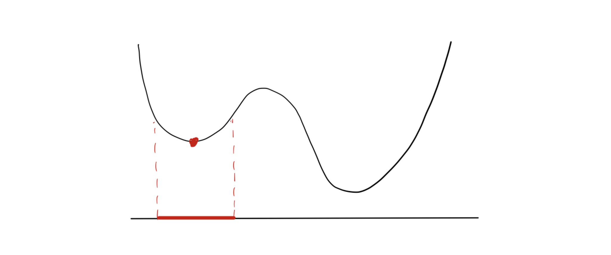
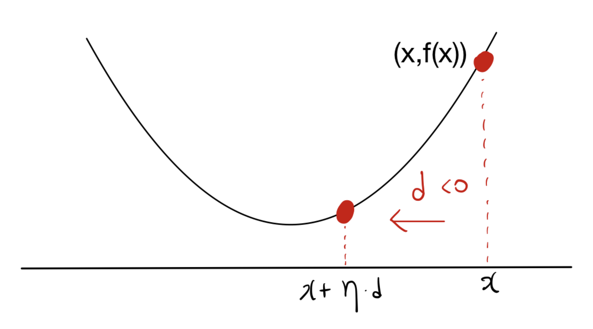
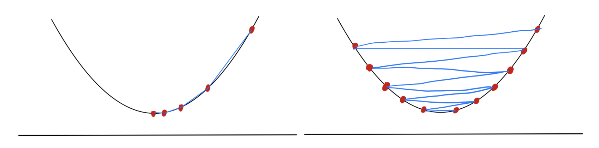

# 1. Introduction

* 본 포스트에서는 최적화 이론의 중요한 두 축인 **원뿔 쌍대성(Conic Duality)**과 **경사하강법(Gradient Descent)**의 기초 개념을 다룹니다. 원뿔 계획법(Conic Programming)은 선형 계획법(LP)을 일반화한 강력한 프레임워크로, 제약 조건이 볼록 원뿔(convex cone)의 형태로 주어지는 최적화 문제입니다. 

* 전반부에서는 원뿔 계획법의 원문제(Primal)와 쌍대문제(Dual)를 정의하고, 두 문제 간의 관계를 규명하는 쌍대성 정리(Duality Theorem)를 엄밀하게 살펴봅니다. 후반부에서는 볼록 최적화(Convex Optimization) 문제의 1차 최적성 조건(First-order optimality condition)을 다루고, 이를 바탕으로 목적 함수를 최소화하기 위한 가장 기초적이고 널리 쓰이는 수치적 방법론인 경사하강법(Gradient Descent)의 직관과 수학적 기초를 확립합니다.

---

# 2. Core Concepts: Conic Programming and Dual Cones

## 2.1 Conic Programming (CP)

* 원뿔 계획법(Conic Program)은 내부가 비어있지 않은(nonempty interior) 뾰족하고(pointed) 닫힌 볼록 원뿔(closed convex cone) $K$를 사용하여 다음과 같이 정의됩니다:

$$
\begin{aligned}
\text{minimize} \quad & c^\top x \\
\text{subject to} \quad & Ax - b \in K
\end{aligned}
$$ 

* 여기서 기호 $\ge_K$를 사용하여 어떤 벡터가 원뿔 $K$에 속함을 나타낼 수 있습니다. 즉, $Ax - b \in K$는 $Ax - b \ge_K 0$ 또는 $Ax \ge_K b$와 완벽하게 동치입니다. 이를 바탕으로 위의 원문제(CP)는 다음과 같은 동치 형태로도 쓸 수 있습니다.

$$
\begin{aligned}
\text{minimize} \quad & c^\top x \\
\text{subject to} \quad & Ax \ge_K b
\end{aligned}
$$ 

* $K$의 형태에 따라 원뿔 계획법은 여러 친숙한 문제군으로 환원됩니다:
  * $K = \mathbb{R}^n_+$ 일 경우: 선형 계획법(Linear Program).
  * $K$가 2차 원뿔(Second-order cone)일 경우: 2차 원뿔 계획법(Second-order cone program, SOCP).
  * $K$가 양의 준정부호 원뿔(Positive semidefinite cone)일 경우: 반정부호 계획법(Semidefinite program, SDP).

## 2.2 Dual Cone (쌍대 원뿔)

* 원뿔 $K \subseteq \mathbb{R}^n$에 대한 쌍대 원뿔(Dual cone) $K^*$은 다음과 같이 정의됩니다.

$$K^* = \{ y \in \mathbb{R}^n : y^\top x \ge 0 \quad \forall x \in K \}$$ 

* 직관적으로, $K^*$는 원래의 원뿔 $K$ 내의 모든 벡터와 예각(또는 직각)을 이루는 벡터들의 집합입니다. 

### **자기 쌍대성(Self-duality):**
* 흥미롭게도 어떤 원뿔들은 자기 자신과 쌍대 원뿔이 동일한 형태를 가집니다.
  * 음이 아닌 직교 공간(nonnegative orthant) $\mathbb{R}^d_+$의 쌍대 원뿔은 $\mathbb{R}^d_+$ 자체입니다.
  * 양의 준정부호 원뿔(Positive semidefinite cone) $\mathbb{S}^d_+$ 역시 자기 쌍대(self-dual)입니다.
  * 2차 원뿔(Second-order cone) 또한 자기 쌍대성을 가집니다.

### **정리 (Theorem):**
* 만약 $K$가 내부가 비어있지 않은 뾰족하고 닫힌 볼록 원뿔이라면, 그 쌍대 원뿔 $K^*$ 역시 내부가 비어있지 않은 뾰족하고 닫힌 볼록 원뿔입니다. 또한 쌍대 원뿔의 쌍대 원뿔은 원래의 원뿔과 같습니다 ($(K^*)^* = K$).

---

# 3. Mathematical Formulation: Conic Duality

## 3.1 Deriving the Dual Conic Program

* 원문제(CP)의 목적 함수 값을 하한(lower bound)하는 쌍대 문제를 도출해 봅시다. 
  * 1. 원문제의 제약을 만족하는 $x$ (즉, $Ax - b \in K$)와 쌍대 원뿔의 원소 $y \in K^*$를 생각합니다.
  * 2. 쌍대 원뿔의 정의에 의해, $y^\top (Ax - b) \ge 0$이 성립합니다.
  * 3. 만약 $y \in K^*$가 추가로 $A^\top y = c$를 만족한다면, 목적 함수는 다음과 같이 전개됩니다:
     $$c^\top x = (A^\top y)^\top x = y^\top A x \ge y^\top b$$
* 따라서, $b^\top y$는 $c^\top x$의 하한이 됩니다. 이를 최대화하는 문제가 바로 쌍대 원뿔 계획법(Dual CP)입니다.

$$
\begin{aligned}
\text{maximize} \quad & b^\top y \\
\text{subject to} \quad & A^\top y = c \\
& y \in K^*
\end{aligned}
$$  

## 3.2 Conic Duality Theorem

### **약한 쌍대성 (Theorem: Weak Duality):**
* dual-CP의 최적값은 항상 (CP)의 최적값의 하한(lower bound)이 됩니다.

### **강한 쌍대성 (Theorem: Strong Duality) 및 엄격한 실행 가능성 (Strict Feasibility):**
* 특정 조건 하에서는 원문제와 쌍대문제의 최적값이 완전히 일치합니다. 이를 논하기 위해 '엄격한 실행 가능성'을 정의해야 합니다. $Ax - b$가 $K$의 '내부(interior)'에 속할 때, 해 $x$가 (CP)에 대해 엄격하게 실행 가능(strictly feasible)하다고 하며 $Ax - b >_K 0$ 으로 표기합니다.

* 만약 (CP)가 엄격하게 실행 가능하고 유계(bounded)라면, (dual-CP)는 해를 가지며 두 문제의 최적값은 동일합니다.
* 반대로 (dual-CP)가 엄격하게 실행 가능하고 유계라면, (CP)는 해를 가지며 두 최적값은 같습니다.
* 이 조건은 라그랑주 쌍대성(Lagrangian duality)에서 배우게 될 슬레이터 조건(Slater condition)과 유사한 개념입니다.

* *예외:* 선형 계획법(LP)의 경우 슬레이터 조건과 같은 엄격한 조건 없이도, 문제가 실행 가능하고 유계이기만 하면 원문제와 쌍대문제의 최적값이 같습니다.

---

# 4. Optimality Conditions for Convex Minimization

## 4.1 Local vs. Global Optimality

* 최적화 문제 $\min \{ f(x) : x \in C \}$ 에서, 볼록 최적화(Convex optimization)가 갖는 가장 강력한 성질은 **모든 국소 최적해(locally optimal solution)가 전역 최적해(globally optimal solution)와 동일하다**는 점입니다. 비볼록(nonconvex) 문제에서는 국소 최적해가 전역 최적해가 아닐 수 있습니다.

 

## 4.2 First-Order Optimality Condition

* 미분 가능한 함수 $f$를 가진 볼록 최적화 문제에서, $x^* \in C$가 최적해일 필요충분조건은 다음과 같습니다:

$$\nabla f(x^*)^\top (x - x^*) \ge 0 \quad \forall x \in C$$ 

* 직관적으로 이 조건은, 최적해 $x^*$에서 집합 $C$ 내의 임의의 점 $x$로 향하는 방향($x - x^*$)으로 이동할 때, 목적 함수 $f$의 값이 감소하는 방향(즉, $-\nabla f(x^*)$ 방향)과 예각을 이루지 않아야 함을 의미합니다. 즉, $f$를 감소시키는 방향으로는 $C$ 내에서 더 이상 나아갈 수 없다는 뜻입니다. 제약이 없는 무제약 최적화(unconstrained optimization)의 경우, 이 조건은 단순히 $\nabla f(x^*) = 0$이 됩니다.

## 4.3 Normal Cones and Projections

* 점 $x \in C$에서 집합 $C$의 법선 원뿔(Normal cone)은 다음과 같이 정의되며, 이는 1차 최적성 조건과 기하학적으로 깊이 맞닿아 있습니다. 최적성 조건은 곧 $-\nabla f(x^*) \in \mathcal{N}_C(x^*)$ 임을 의미합니다.

### **투영(Projection):**
* 점 $p$를 볼록 집합 $C$로 투영하는 문제는 $p$와의 거리를 최소화하는 $x \in C$를 찾는 문제입니다. 투영점을 $Proj_C(p)$라 할 때, 두 점 $u, v$의 투영에 대해 다음이 성립합니다:
* 투영의 성질과 코시-슈바르츠 부등식(Cauchy-Schwarz inequality)을 이용하면 투영 연산이 비확장성(non-expansive)을 가짐을 유도할 수 있습니다.

$$||Proj_C(u) - Proj_C(v)||_2 \le ||u - v||_2$$ 

---

# 5. Introduction to Gradient Descent

## 5.1 Descent Directions

* 점 $x \in \mathbb{R}^d$에서 함수 $f$의 값을 감소시키는 영(nonzero)이 아닌 벡터 $d \in \mathbb{R}^d \setminus \{0\}$를 하강 방향(Descent direction)이라고 합니다. $f$가 미분 가능하다면 방향 도함수(directional derivative)를 통해 하강 방향을 특정할 수 있습니다.

$$\lim_{\eta \to 0+} \frac{f(x + \eta d) - f(x)}{\eta} = \nabla f(x)^\top d$$ 

* 위 식은 점 $x$에서 방향 $d$로의 함수 $f$의 변화율을 측정합니다. 따라서 $d$가 하강 방향일 필요충분조건은 다음과 같습니다:

$$\nabla f(x)^\top d < 0$$ 

 

## 5.2 Gradient Descent Algorithm

* 가장 가파른 하강 방향(steepest direction)은 기울기의 반대 방향인 $-\nabla f(x)$로 정의됩니다. 이를 바탕으로 하는 경사하강법(Gradient descent) 알고리즘은 다음과 같습니다:

### **Algorithm: Gradient Descent** 
* 1. 초기점 $x_1 \in \text{dom}(f)$ 설정 
* 2. 각 스텝 $t = 1, \dots, T$ 에 대하여: 
* 3. $x_{t+1} = x_t - \eta_t \nabla f(x_t)$ 업데이트 ($\eta_t > 0$는 스텝 사이즈) 

### **스텝 사이즈(Step Size, $\eta_t$) 결정 방법:**
* **고정 스텝 사이즈(Constant step size):** 모든 $t$에 대해 $\eta_t = \eta$ 유지.
* **정확한 선 탐색(Exact line search):** 방향 $d_t$를 따라 함수를 최소화하는 최적의 $\eta_t$를 수식 $\eta_t = \arg\min_{\eta \ge 0} f(x_t + \eta d_t)$을 통해 찾음.
* **역추적 선 탐색(Backtracking line search):** 초기 스텝 사이즈를 점진적으로 줄여가며($\eta \leftarrow \beta\eta$), 함수 값이 충분히 감소할 때까지(Armijo condition 만족 여부: $f(x + \eta d_t) < f(x) + \alpha \eta \nabla f(x)^\top d_t$) 반복.

 

## 5.3 Taylor Approximation Interpretation

* 경사하강법은 1차 테일러 근사(First-order Taylor approximation) 관점에서도 해석할 수 있습니다. 현재 위치 $x_t$에서 $f(x)$는 다음과 같이 근사됩니다:

$$f(x) \approx f(x_t) + \nabla f(x_t)^\top (x - x_t)$$ 

* 단순히 이 근사식만 최소화하려 하면 방향만 나오고 해가 발산할 수 있으므로, 현재 점 $x_t$에서 너무 멀어지지 않도록 페널티(proximity term)를 부여합니다:

$$x_{t+1} \approx \arg\min_x \left( f(x_t) + \nabla f(x_t)^\top (x - x_t) + \frac{1}{2\eta_t} ||x - x_t||_2^2 \right)$$ 

* 위 식을 미분하여 0이 되는 점을 찾으면 정확히 $x_{t+1} = x_t - \eta_t \nabla f(x_t)$ 가 도출됩니다. 즉, 경사하강법은 **국소적 선형 근사를 신뢰할 수 있는 구역 내에서 함수를 최소화하는 과정**입니다.